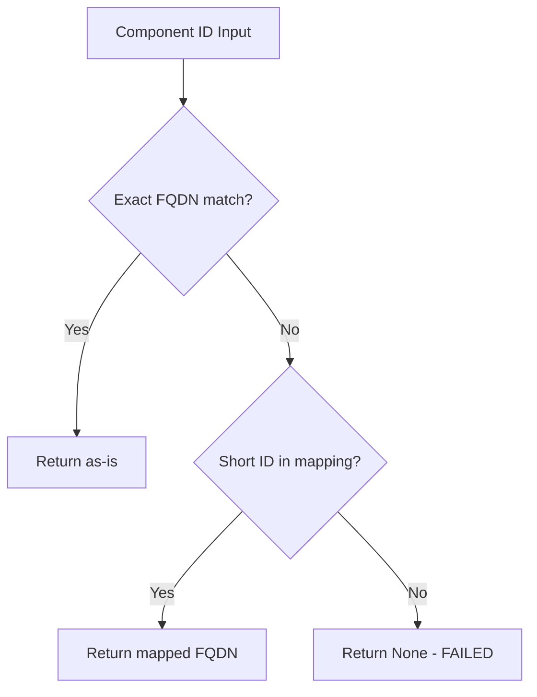

<!-- source-hash: ce1c3446afbd36610d29a024527d1ef0 -->
Standalone test script that validates the short ID to Fully Qualified Domain Name (FQDN) normalization logic used to resolve component references in the CodeWiki graph, without requiring full application imports.

## Key Components

### `build_short_id_to_fqdn_map(components)`
Builds a dictionary mapping short component identifiers to their FQDNs. Handles:
- Explicit `short_id` values from node data
- Derived short IDs from `::` or `.` delimited FQDNs as fallbacks
- Collision detection and reporting when multiple components share the same short ID

### `test_normalization()`
Runs a suite of normalization scenarios against a mock component dictionary covering:
- Short ID lookup (explicit and derived)
- Exact FQDN pass-through
- Expected failures for unknown identifiers

Returns `0` on full pass, `1` on any failure.

## Usage Example

```python
# Run directly from the command line
python test_normalization_simple.py

# Or call the test function programmatically
from test_normalization_simple import test_normalization, build_short_id_to_fqdn_map

exit_code = test_normalization()  # 0 = all passed

# Use the mapping function with your own components
components = {
    "my-repo.com.example.service.MyService": {
        "short_id": "MyService",
        "namespace": "my-repo",
    }
}
mapping = build_short_id_to_fqdn_map(components)
# mapping → {"MyService": "my-repo.com.example.service.MyService"}
```

## Resolution Priority



**Source:** [`test_normalization_simple.py`](https://github.com/flamingo-stack/CodeWiki/blob/main/test_normalization_simple.py)