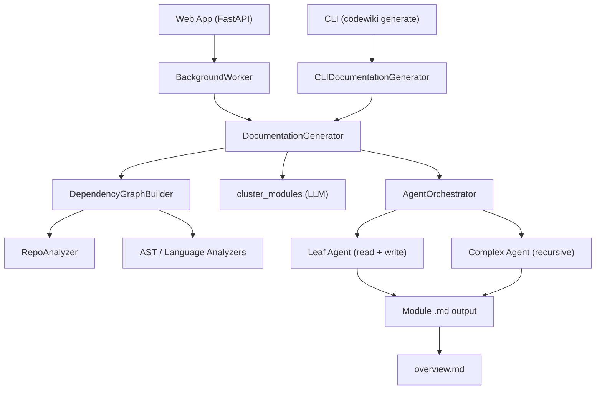

<div align="center">
  <picture>
    <source media="(prefers-color-scheme: dark)" srcset="https://shdrojejslhgnojzkzak.supabase.co/storage/v1/object/public/public/doc-orchestrator/logos/1771371901777-lc3cse-logo-openframe-full-dark-bg.png">
    <source media="(prefers-color-scheme: light)" srcset="https://shdrojejslhgnojzkzak.supabase.co/storage/v1/object/public/public/doc-orchestrator/logos/1771372526604-k3y1w-logo-openframe-full-light-bg.png">
    
  </picture>
</div>

<p align="center">
  <a href="LICENSE.md"></a>
</p>

# CodeWiki

**CodeWiki** is an AI-powered documentation generator that transforms codebases into comprehensive, structured documentation. By combining static dependency analysis with multi-agent LLM orchestration, CodeWiki understands the architecture of your code and produces rich, hierarchical Markdown documentation — automatically.

> **Part of the Flamingo / OpenFrame ecosystem.** CodeWiki powers the documentation pipeline behind [OpenFrame](https://openframe.ai) — the AI-driven MSP platform by [Flamingo](https://flamingo.run).

[](https://www.youtube.com/watch?v=dQw4w9WgXcQ)

---

## Features

- **Multi-language analysis** — Supports Python, TypeScript, JavaScript, Java, C#, C, C++, and PHP
- **AI agent orchestration** — Uses `pydantic-ai` agents with tool calling to read, analyze, and write docs
- **Hierarchical documentation** — Output mirrors your module tree; parent overviews are built after children
- **LLM-agnostic** — Works with any OpenAI-compatible provider (OpenAI, Anthropic, local models)
- **Three-role LLM model config** — Separate `main`, `fallback`, and `cluster` model configurations
- **Idempotent generation** — Skips already-documented modules; safe to re-run at any time
- **Git-native workflow** — Automatically creates documentation branches and commits
- **Web application mode** — FastAPI-based web app for submitting GitHub repos via browser
- **Docker support** — Ready-to-run Docker Compose configuration
- **GitHub Pages output** — Optionally generates `index.html` for static hosting

---

## Architecture

The CodeWiki pipeline runs in three stages: **Analysis**, **Orchestration**, and **Output**.



CodeWiki can operate in two modes:

- **CLI Mode** — Run `codewiki generate` locally against any git repository
- **Web App Mode** — Submit any public GitHub URL via browser; the background worker clones, runs, and serves the docs

---

## Technology Stack

### Backend (Python)

| Layer | Technology |
|---|---|
| CLI framework | [Click](https://click.palletsprojects.com/) |
| AI agent framework | [pydantic-ai](https://ai.pydantic.dev/) |
| Web application | [FastAPI](https://fastapi.tiangolo.com/) + [Uvicorn](https://www.uvicorn.org/) |
| LLM providers | OpenAI-compatible APIs (Anthropic, OpenAI, local models) |
| Git operations | [GitPython](https://gitpython.readthedocs.io/) |
| Secrets storage | [keyring](https://pypi.org/project/keyring/) |
| AST analysis | Python `ast`, language-specific parsers |
| Schema validation | [Pydantic](https://docs.pydantic.dev/) |

### Tooling (Node.js)

| Package | Purpose |
|---|---|
| `@voltagent/core` | Agent orchestration framework |
| `@ai-sdk/anthropic` | Anthropic AI SDK adapter |
| `zod` | Schema validation |

---

## Quick Start

### Prerequisites

- Python 3.9+
- pip 22.0+
- Git 2.30+
- API key for an OpenAI-compatible LLM provider (Anthropic, OpenAI, etc.)

### Install

```bash
# Clone the repository
git clone https://github.com/flamingo-stack/CodeWiki.git
cd CodeWiki

# Install in editable mode
pip install -e .

# Verify the CLI is available
codewiki --version
```

### Configure LLM Providers

CodeWiki uses three model roles: `cluster` (module grouping), `main` (doc writing), and `fallback` (backup). Keys are stored securely in the system keychain.

```bash
codewiki config set \
  --cluster-api-key YOUR_API_KEY \
  --main-api-key YOUR_API_KEY \
  --fallback-api-key YOUR_API_KEY \
  --cluster-base-url https://api.anthropic.com/v1 \
  --main-base-url https://api.anthropic.com/v1 \
  --fallback-base-url https://api.anthropic.com/v1 \
  --cluster-model claude-3-haiku-20240307 \
  --main-model claude-sonnet-4-5 \
  --fallback-model claude-3-haiku-20240307
```

### Generate Documentation

Run `codewiki generate` inside any git repository:

```bash
# Navigate to a project you want to document
cd /path/to/your/project

# Generate docs (default output: ./docs)
codewiki generate

# Or specify doc type and output directory
codewiki generate --doc-type architecture --output ./wiki
```

### Expected Output Structure

```text
docs/
├── metadata.json
├── module_tree.json
├── overview.md
└── ModuleName/
    └── ModuleName.md
```

### Web App Mode

```bash
# Start the web app (default: http://127.0.0.1:8000)
python codewiki/run_web_app.py
```

Open `http://127.0.0.1:8000`, paste a GitHub repository URL, and click **Generate**.

### Docker Compose

```bash
cp .env.example .env
# Edit .env with your API keys

cd docker
docker compose up -d
```

---

## Useful CLI Flags

| Flag | Description |
|---|---|
| `--output / -o` | Output directory (default: `./docs`) |
| `--doc-type` | Style: `api`, `architecture`, `user-guide`, `developer` |
| `--include` | Comma-separated glob patterns to include (e.g., `*.py`) |
| `--exclude` | Comma-separated glob patterns to exclude |
| `--focus` | Comma-separated module paths to prioritize |
| `--max-depth` | Maximum module nesting depth (default: `2`) |
| `--instructions` | Custom freeform prompt instructions for the LLM |
| `--create-branch` | Auto-create a git branch before writing docs |
| `--github-pages` | Generate `index.html` for GitHub Pages hosting |
| `--no-cache` | Force full regeneration, bypassing cache |

---

## Documentation

📚 See the [Documentation](./docs/README.md) for comprehensive guides, including:

- [Introduction](./docs/getting-started/introduction.md) — What CodeWiki is and how it works
- [Prerequisites](./docs/getting-started/prerequisites.md) — Environment requirements
- [Quick Start](./docs/getting-started/quick-start.md) — Step-by-step installation
- [First Steps](./docs/getting-started/first-steps.md) — Key features and workflows

---

## Community & Support

All questions, feedback, and collaboration happen on the **OpenMSP Slack Community** — we don't use GitHub Issues or Discussions.

- 💬 **Slack**: [Join OpenMSP](https://join.slack.com/t/openmsp/shared_invite/zt-36bl7mx0h-3~U2nFH6nqHqoTPXMaHEHA)
- 🌐 **Community Hub**: [https://www.openmsp.ai/](https://www.openmsp.ai/)
- 🦩 **Flamingo**: [https://flamingo.run](https://flamingo.run)
- 🖥️ **OpenFrame**: [https://openframe.ai](https://openframe.ai)

---

<div align="center">
  Built with 💛 by the <a href="https://www.flamingo.run/about"><b>Flamingo</b></a> team
</div>
