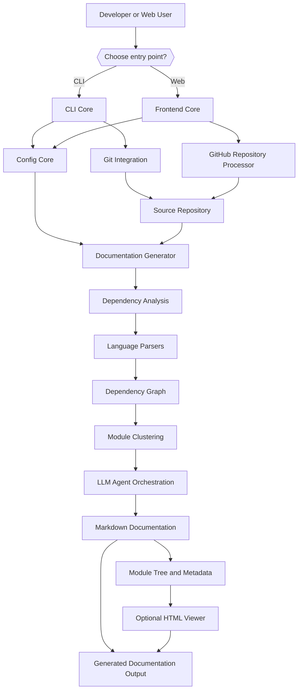

<div align="center">
  <picture>
    <source media="(prefers-color-scheme: dark)" srcset="https://shdrojejslhgnojzkzak.supabase.co/storage/v1/object/public/public/doc-orchestrator/logos/1771371901777-lc3cse-logo-openframe-full-dark-bg.png">
    <source media="(prefers-color-scheme: light)" srcset="https://shdrojejslhgnojzkzak.supabase.co/storage/v1/object/public/public/doc-orchestrator/logos/1771372526604-k3y1w-logo-openframe-full-light-bg.png">
    
  </picture>
</div>

<p align="center">
  <a href="LICENSE.md"></a>
</p>

# CodeWiki

**CodeWiki** is an AI-powered documentation generator for source code repositories. Point it at a codebase — locally via a command-line interface, or remotely via a web application — and it analyzes the repository's file structure and cross-file call relationships, builds a dependency graph of functions, classes, and modules, clusters related components into meaningful hierarchical modules using LLM-backed agents, and writes structured Markdown documentation, including an optional static HTML viewer suitable for GitHub Pages.

CodeWiki is built as a Python package (`codewiki`, requires Python `>=3.12`) and supports analysis of **Python, Java, JavaScript, TypeScript, C, C++, C#, and PHP** source files through dedicated tree-sitter based language analyzers.

## Features

- **Two entry points, one engine** — a `codewiki` CLI for local repositories and a FastAPI web application for submitting GitHub repository URLs. Both drive the same backend documentation pipeline.
- **Multi-language dependency analysis** — tree-sitter powered analyzers extract call graphs and structural relationships across eight languages.
- **LLM-driven module clustering** — components are grouped into meaningful modules (e.g., "Auth Module", "API Module") by an LLM, then documented leaf-first before parent overviews are generated.
- **Per-provider LLM configuration** — separate model, API key, base URL, token limit, and temperature settings for the *cluster*, *main*, and *fallback* LLM roles, so you can mix providers.
- **Secure credential storage** — API keys are stored in the OS keyring (macOS Keychain, Windows Credential Manager, Linux Secret Service), never in plaintext configuration files.
- **Git-aware workflow** — the CLI can validate a clean working tree, create a timestamped documentation branch, and prepare it for a pull request.
- **Static HTML output** — an optional, self-contained `index.html` viewer can be generated for GitHub Pages deployment.
- **Caching for the web app** — the FastAPI frontend caches generated documentation by repository URL (with configurable expiry) to avoid redundant regeneration.
- **Multi-path analysis** — repositories whose source is split across multiple root directories (e.g., a monorepo with `main/`, `deps/`, `vendor/`) can be analyzed as a single unified documentation set via `additional_source_paths`.

## Quick Start

This gets you from zero to a generated documentation set in about five minutes, using the `codewiki` CLI against a local repository.

### 1. Install CodeWiki

```bash
git clone https://github.com/flamingo-stack/CodeWiki.git
cd CodeWiki
pip install -e .
```

Verify the install:

```bash
codewiki --version
codewiki version
```

### 2. Configure Your LLM Credentials

CodeWiki needs API credentials for at least a **main model** and a **cluster model** (a fallback model is optional but recommended). Credentials are stored securely in your OS keyring; non-secret settings go to `~/.codewiki/config.json`.

```bash
codewiki config set \
  --cluster-api-key "sk-your-cluster-provider-key" \
  --main-api-key "sk-your-main-provider-key" \
  --cluster-model "your-cluster-model-name" \
  --main-model "your-main-model-name" \
  --cluster-base-url "https://api.your-provider.com/v1" \
  --main-base-url "https://api.your-provider.com/v1"
```

> CodeWiki does not ship with default credentials — you must supply your own for a real LLM provider.

Confirm the configuration:

```bash
codewiki config validate
```

### 3. Generate Documentation for a Repository

```bash
cd /path/to/your/project
codewiki generate
```

By default, output is written to `./docs`, containing Markdown files for each analyzed module, a `module_tree.json`, and a `metadata.json`.

### Optional: GitHub Pages Site

```bash
codewiki generate --github-pages --create-branch
```

### Optional: Run the Web Application

```bash
python codewiki/run_web_app.py
```

Or via Docker Compose:

```bash
cd docker
docker compose up --build
```

The web app listens on port `8000` by default (configurable via the `APP_PORT` environment variable).

## Technology Stack

- **Language/Runtime**: Python `>=3.12`
- **Web framework**: FastAPI, served via Jinja2-rendered templates
- **Code analysis**: Native `ast` module (Python) and tree-sitter based analyzers (JavaScript, TypeScript, Java, C, C++, C#, PHP)
- **LLM integration**: OpenAI-compatible SDK layer supporting OpenAI, Anthropic, Azure, LiteLLM proxies, and other OpenAI-compatible endpoints
- **Credential storage**: OS-native keyring (macOS Keychain, Windows Credential Manager, Linux Secret Service)
- **Diagram validation**: `mermaid-py` (requires Node.js `>=14.0.0`)
- **Containerization**: Docker & Docker Compose for the web application

## Architecture



CodeWiki is organized around four core modules:

| Module | Purpose |
|---|---|
| **CLI Core** | Command-line orchestration: local config, Git integration, terminal progress, static HTML generation. |
| **Backend Core** | Repository analysis, dependency-graph construction, module clustering, LLM agent orchestration, documentation generation. |
| **Frontend Core** | FastAPI web application: repository submission, background job processing, caching, doc serving. |
| **Config Core** | Shared runtime `Config` model for source paths, output locations, provider settings, token limits, and agent instructions. |

## Documentation

📚 See the [Documentation](./docs/README.md) for comprehensive guides, including getting-started tutorials, development workflows, and full reference architecture.

## Community

Join the OpenMSP Slack community for questions, feedback, and discussion: [https://www.openmsp.ai/](https://www.openmsp.ai/) ([join link](https://join.slack.com/t/openmsp/shared_invite/zt-36bl7mx0h-3~U2nFH6nqHqoTPXMaHEHA)).

---
<div align="center">
  Built with 💛 by the <a href="https://www.flamingo.run/about"><b>Flamingo</b></a> team
</div>
