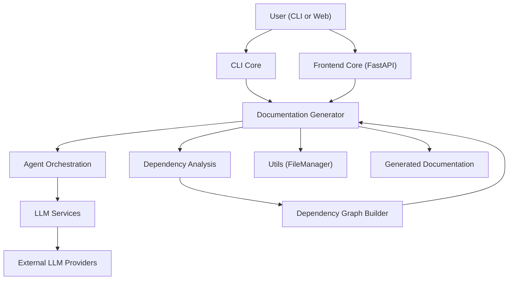
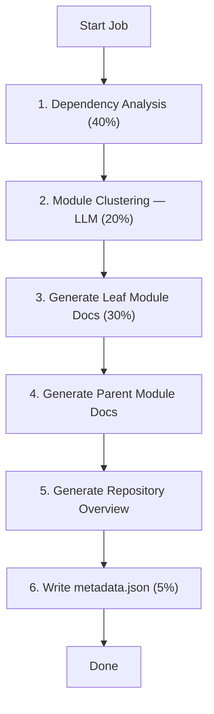

<div align="center">
  <picture>
    <source media="(prefers-color-scheme: dark)" srcset="https://shdrojejslhgnojzkzak.supabase.co/storage/v1/object/public/public/doc-orchestrator/logos/1771371901777-lc3cse-logo-openframe-full-dark-bg.png">
    <source media="(prefers-color-scheme: light)" srcset="https://shdrojejslhgnojzkzak.supabase.co/storage/v1/object/public/public/doc-orchestrator/logos/1771372526604-k3y1w-logo-openframe-full-light-bg.png">
    
  </picture>
</div>

<p align="center">
  <a href="LICENSE.md"></a>
</p>

# CodeWiki

**CodeWiki** is an open-source, AI-powered documentation engine that transforms source code repositories into structured, hierarchical, and navigable technical documentation — automatically.

Built by [Flamingo](https://flamingo.run) as part of the [OpenFrame](https://openframe.ai) platform, CodeWiki eliminates the documentation bottleneck in software engineering. It turns undocumented codebases into architecture-aware, LLM-generated documentation with zero manual effort.

---

## Features

- **Multi-language support** — Python, JavaScript, TypeScript, Java, C, C++, C#, PHP
- **AI-powered generation** — LLM-generated documentation using Claude, GPT, or any OpenAI-compatible endpoint
- **AST-based dependency analysis** — Accurate call graphs extracted from actual source code
- **Hierarchical, bottom-up generation** — Leaf-first documentation that respects module structure
- **CLI interface** — One-command generation via `codewiki generate`
- **Web interface** — FastAPI-based web app for team-wide usage without requiring CLI setup
- **Git-native workflows** — Auto-creates timestamped documentation branches and commits
- **GitHub Pages ready** — Generates a static `index.html` viewer deployable to GitHub Pages
- **LLM-agnostic** — Works with OpenAI, Anthropic, Azure OpenAI, and any OpenAI-compatible proxy
- **Context overflow protection** — Staged pipeline and synthetic module fallback prevent runaway LLM calls
- **Secure configuration** — API keys stored in the OS keychain, never written to disk in plaintext

---

## Architecture

CodeWiki runs as a multi-stage pipeline with clearly separated layers:



### Generation Pipeline



---

## Technology Stack

| Layer | Technology |
|-------|-----------|
| **Language** | Python 3.9+ |
| **CLI Framework** | Click |
| **Web Framework** | FastAPI + Uvicorn |
| **AI Agent Framework** | Pydantic AI |
| **AST Parsing** | Tree-sitter (8 language grammars) |
| **LLM Providers** | OpenAI SDK, Anthropic SDK (provider-agnostic) |
| **Secure Config** | keyring (macOS Keychain / Windows Credential Manager / Linux Secret Service) |
| **Git Integration** | GitPython |
| **Templating** | Jinja2 |

---

## Quick Start

### 1. Clone and install

```bash
git clone https://github.com/flamingo-stack/CodeWiki.git
cd CodeWiki
pip install -e .
```

### 2. Configure your LLM provider

```bash
codewiki config set \
  --main-model claude-sonnet-4 \
  --main-api-key YOUR_API_KEY \
  --main-base-url https://api.anthropic.com/v1 \
  --cluster-model claude-sonnet-4 \
  --cluster-api-key YOUR_API_KEY \
  --cluster-base-url https://api.anthropic.com/v1 \
  --fallback-model claude-sonnet-4 \
  --fallback-api-key YOUR_API_KEY \
  --fallback-base-url https://api.anthropic.com/v1
```

> API keys are stored securely in your OS keychain — never written to disk in plaintext.

### 3. Generate documentation

```bash
cd /path/to/your-project
codewiki generate
```

Documentation is written to `./docs/` by default.

### 4. View the results

```bash
ls ./docs/
```

```text
docs/
├── README.md              ← Repository overview
├── module_tree.json       ← Module structure metadata
├── metadata.json          ← Generation audit metadata
└── <module-name>/
    └── <module-name>.md   ← Per-module documentation
```

---

## Using OpenAI

```bash
codewiki config set \
  --main-model gpt-4o \
  --main-api-key sk-... \
  --main-base-url https://api.openai.com/v1 \
  --cluster-model gpt-4o-mini \
  --cluster-api-key sk-... \
  --cluster-base-url https://api.openai.com/v1 \
  --fallback-model gpt-4o-mini \
  --fallback-api-key sk-... \
  --fallback-base-url https://api.openai.com/v1
```

## Web Interface

Start the web UI to generate documentation for any public GitHub repository via a browser:

```bash
python -m codewiki.run_web_app
```

Then open `http://localhost:8000`, paste a GitHub repository URL, and CodeWiki will handle the rest.

---

## Common Options

| Flag | Description | Default |
|------|-------------|---------|
| `--output / -o` | Output directory | `./docs` |
| `--create-branch` | Auto-create a Git branch | Off |
| `--github-pages` | Generate GitHub Pages `index.html` | Off |
| `--include` | Glob patterns to include | All files |
| `--exclude` | Glob patterns to exclude | None |
| `--doc-type` | Style: `api`, `architecture`, `user-guide`, `developer` | Default |
| `--max-depth` | Maximum module nesting depth | 2 |

### Example: CI/CD pipeline

```bash
codewiki generate \
  --create-branch \
  --github-pages \
  --output ./docs
```

### Example: Focus on specific modules

```bash
codewiki generate \
  --include "src/core,src/api" \
  --exclude "tests/" \
  --doc-type architecture
```

---

## Requirements

| Software | Minimum Version |
|---------|-----------------|
| Python | 3.9+ |
| Git | 2.x |
| pip | 22+ |

An API key for at least one LLM provider (Anthropic, OpenAI, Azure OpenAI, or any OpenAI-compatible endpoint) is required.

---

## Documentation

📚 See the [Documentation](./docs/README.md) for comprehensive guides including getting started tutorials, development setup, and full architecture reference.

---

## Community

CodeWiki is part of the OpenMSP open-source community.

- **Community Slack:** [OpenMSP Slack](https://join.slack.com/t/openmsp/shared_invite/zt-36bl7mx0h-3~U2nFH6nqHqoTPXMaHEHA)
- **Community portal:** [openmsp.ai](https://www.openmsp.ai/)
- **Flamingo Platform:** [flamingo.run](https://flamingo.run)
- **OpenFrame:** [openframe.ai](https://openframe.ai)

---

<div align="center">
  Built with 💛 by the <a href="https://www.flamingo.run/about"><b>Flamingo</b></a> team
</div>
