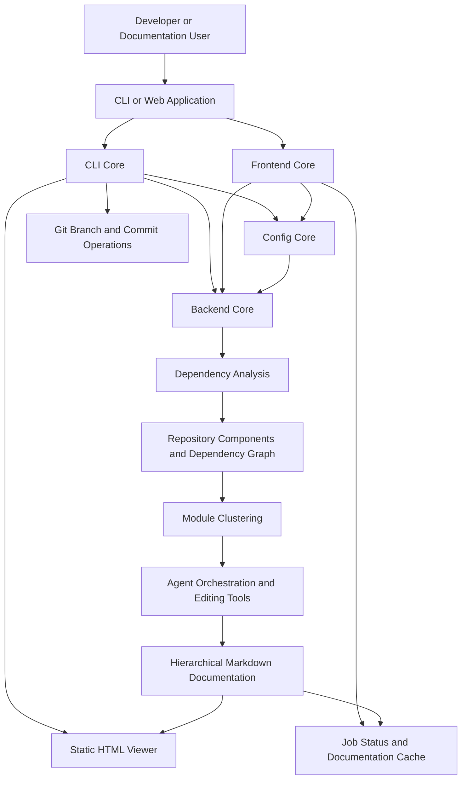

<div align="center">
  <picture>
    <source media="(prefers-color-scheme: dark)" srcset="https://shdrojejslhgnojzkzak.supabase.co/storage/v1/object/public/public/doc-orchestrator/logos/1771371901777-lc3cse-logo-openframe-full-dark-bg.png">
    <source media="(prefers-color-scheme: light)" srcset="https://shdrojejslhgnojzkzak.supabase.co/storage/v1/object/public/public/doc-orchestrator/logos/1771372526604-k3y1w-logo-openframe-full-light-bg.png">
    
  </picture>
</div>

<p align="center">
  <a href="LICENSE.md"></a>
</p>

# CodeWiki

CodeWiki is an **AI-assisted documentation generator** for software repositories. It analyzes source code across multiple programming languages, builds a dependency graph of code components, clusters those components into logical modules, and uses LLM-backed agents to produce hierarchical, Markdown-based documentation automatically — no hand-written architecture docs that go stale.

CodeWiki is part of the [Flamingo](https://flamingo.run) open-source ecosystem, the same organization behind [OpenFrame](https://openframe.ai), the unified AI-driven MSP platform.

## Features

- **Multi-language dependency analysis** — Language analyzers cover Python, JavaScript, TypeScript, Java, C, C++, C#, and PHP source files, extracting components (classes, functions, modules) and their relationships.
- **Automatic module clustering** — An LLM-driven clustering step groups low-level code components (leaf nodes) into logical, named modules instead of documenting every file in isolation.
- **Hierarchical Markdown generation** — Documentation is produced bottom-up: leaf modules first, then parent overviews that summarize their children, ending in a top-level repository overview.
- **Two ways to run it** — A terminal-based CLI (`codewiki`) for local, git-integrated workflows, and a FastAPI web application for submitting a GitHub URL through a browser and tracking generation jobs.
- **Static HTML viewer** — The CLI can render a self-contained `index.html` suitable for publishing on GitHub Pages.
- **Git-native publishing** — The CLI can create a dedicated documentation branch, commit the generated docs, and construct a GitHub pull-request URL.
- **Caching** — The web application caches completed documentation runs by repository URL so repeat visits are served instantly.
- **Configurable LLM providers** — Separate model/API-key/base-URL configuration for three pipeline stages: clustering, main generation, and fallback.

## Technology Stack

- **Language / Runtime**: Python 3.12
- **Web application**: FastAPI, Jinja2 templating
- **CLI framework**: Click
- **Source parsing**: Python AST + Tree-sitter (JavaScript, TypeScript, Java, C, C++, C#, PHP)
- **LLM integration**: Configurable per-stage providers (cluster / main / fallback) against OpenAI-compatible, Anthropic, or self-hosted LiteLLM proxy endpoints
- **Secrets storage**: OS-native keyring (macOS Keychain, Windows Credential Manager, Linux Secret Service)
- **Containerization**: Docker & Docker Compose

## Architecture



| Module | Location | Responsibility |
|---|---|---|
| CLI Core | `codewiki/cli` | Terminal workflow: persistent configuration, generation pipeline, HTML output, Git operations |
| Backend Core | `codewiki/src/be` | Repository analysis, dependency graph construction, module clustering, LLM-driven Markdown generation |
| Frontend Core | `codewiki/src/fe` | FastAPI web app: repository submission, background job processing, caching, documentation serving |
| Config Core | `codewiki/src/config.py` | Shared `Config` dataclass consumed by every entry point |

## Quick Start

### Option A — Run the CLI locally

```bash
# 1. Clone the repository
git clone https://github.com/flamingo-stack/CodeWiki.git
cd CodeWiki

# 2. Install Python dependencies
pip install -r requirements.txt

# 3. Configure your LLM provider (cluster/main/fallback)
python -m codewiki config set \
  --cluster-api-key "YOUR_API_KEY" \
  --main-api-key "YOUR_API_KEY" \
  --fallback-api-key "YOUR_API_KEY" \
  --cluster-model "claude-sonnet-4" \
  --main-model "claude-sonnet-4" \
  --fallback-model "claude-sonnet-4" \
  --cluster-base-url "https://api.anthropic.com/v1" \
  --main-base-url "https://api.anthropic.com/v1" \
  --fallback-base-url "https://api.anthropic.com/v1"

# 4. Run it against any local repository
cd /path/to/some/repo
python -m codewiki generate
```

### Option B — Run the web application with Docker Compose

```bash
# 1. Clone the repository
git clone https://github.com/flamingo-stack/CodeWiki.git
cd CodeWiki

# 2. Provide environment variables (LLM keys, models, etc.) in a .env file
#    at the repository root
cat > .env << 'EOF'
MAIN_MODEL=claude-sonnet-4
CLUSTER_MODEL=claude-sonnet-4
FALLBACK_MODEL=claude-sonnet-4
MAIN_API_KEY=YOUR_API_KEY
CLUSTER_API_KEY=YOUR_API_KEY
FALLBACK_API_KEY=YOUR_API_KEY
EOF

# 3. Create the external network required by the compose file
docker network create codewiki-network

# 4. Start the web application
docker compose -f docker/docker-compose.yml up -d --build
```

The web application listens on `http://localhost:8000` (configurable via `APP_PORT`).

> No default credentials, usernames, or passwords are built into CodeWiki — LLM API keys must come from your own provider account, and you supply them explicitly as shown above.

By default, generated docs are written under a `docs/` output directory relative to your target repository:

```text
docs/
├── README.md              # Top-level repository overview
├── metadata.json           # Generation statistics and job info
└── <module-name>/
    └── <module-name>.md    # Per-module documentation
```

## Documentation

📚 See the [Documentation](./docs/README.md) for comprehensive guides, architecture references, and tutorials.

## Community

CodeWiki development and support is coordinated through the OpenMSP Slack community:
- [OpenMSP](https://www.openmsp.ai/)
- [Join the Slack workspace](https://join.slack.com/t/openmsp/shared_invite/zt-36bl7mx0h-3~U2nFH6nqHqoTPXMaHEHA)

---
<div align="center">
  Built with 💛 by the <a href="https://www.flamingo.run/about"><b>Flamingo</b></a> team
</div>
