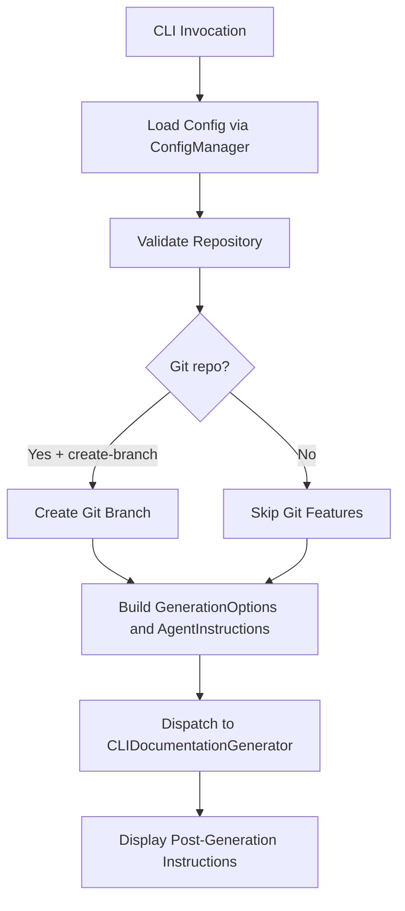

<!-- source-hash: 0e53c35071d297d85de5a4bfca23bcb4 -->
Orchestrates the `codewiki generate` CLI command, handling pre-generation validation, configuration loading, repository checks, and dispatching to the documentation generator with all user-specified options.

## Key Components

### `parse_patterns(patterns_str)`
Splits a comma-separated string of file patterns into a cleaned list of strings. Returns an empty list if the input is falsy.

### `generate_command` (Click command)
The main CLI entry point decorated with `@click.command(name="generate")`. Accepts the following notable options:

| Option | Description |
|---|---|
| `--output / -o` | Output directory (default: `./docs`) |
| `--diagrams-output / -d` | Separate directory for extracted `.mmd` diagram files |
| `--create-branch` | Creates a new git branch before writing docs |
| `--github-pages` | Generates an `index.html` for GitHub Pages |
| `--no-cache` | Forces full regeneration, bypassing cache |
| `--include / --exclude` | Comma-separated glob patterns to filter files |
| `--focus` | Comma-separated module paths to prioritize |
| `--doc-type` | Documentation style: `api`, `architecture`, `user-guide`, `developer` |
| `--instructions` | Freeform prompt instructions passed to the LLM agent |
| `--max-tokens` / `--max-depth` | Token and depth limit overrides |
| `--additional-paths` | Extra dependency paths for analysis |

**Execution flow:**



## Usage Example

```bash
# Basic generation into ./docs
codewiki generate

# C# project: only .cs files, exclude tests, architecture docs
codewiki generate --include "*.cs" --exclude "*Tests*,*Specs*" --doc-type architecture

# Focus on specific modules with custom LLM instructions
codewiki generate --focus "src/core,src/api" \
  --instructions "Focus on public APIs and include usage examples"

# CI/CD: force overwrite, create branch, export diagrams separately
codewiki generate --force --create-branch --diagrams-output ./diagrams

# Override token limits for large repos
codewiki generate --max-tokens 32768 \
  --max-token-per-module 40000 \
  --max-token-per-leaf-module 20000 \
  --max-depth 3
```

> **Source:** [`codewiki/cli/commands/generate.py`](https://github.com/flamingo-stack/CodeWiki/blob/main/codewiki/cli/commands/generate.py)