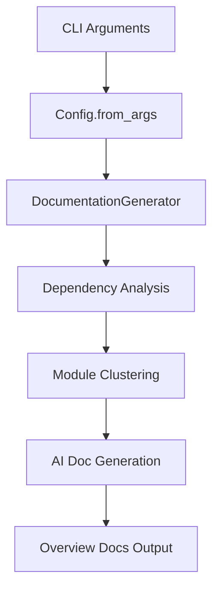

<!-- source-hash: 538151ad4dddd5d28fda610878925245 -->
The main entry point for the CodeWiki documentation generation tool, orchestrating the full pipeline from dependency analysis to AI-generated documentation output.

## Key Components

| Component | Description |
|---|---|
| `parse_arguments()` | Parses CLI arguments, requiring `--repo-path` to specify the target repository |
| `main()` | Async entry point that initializes `Config`, instantiates `DocumentationGenerator`, and runs the pipeline |
| `setup_logging()` | Configures colored logging at `INFO` level while suppressing verbose third-party logs (`httpx`, `openai`, `anthropic`) |

## Usage Example

```bash
# Run CodeWiki against a local repository
python main.py --repo-path /path/to/your/project
```

```python
# Programmatic usage (async context)
import asyncio
from codewiki.src.config import Config
from codewiki.src.be.documentation_generator import DocumentationGenerator

config = Config.from_args(args)
doc_generator = DocumentationGenerator(config)
await doc_generator.run()
```

## Pipeline Overview



## Notes

- Requires `--repo-path` as a mandatory argument
- Gracefully handles `KeyboardInterrupt` for clean exits
- Unexpected exceptions are logged with full tracebacks before re-raising
- Logging for `openai`, `anthropic`, and `httpx` is suppressed to `WARNING` to reduce noise

## Related Modules

- [`DocumentationGenerator`](https://github.com/flamingo-stack/CodeWiki/blob/main/codewiki/src/be/documentation_generator.py) — core pipeline runner
- [`Config`](https://github.com/flamingo-stack/CodeWiki/blob/main/codewiki/src/config.py) — configuration management