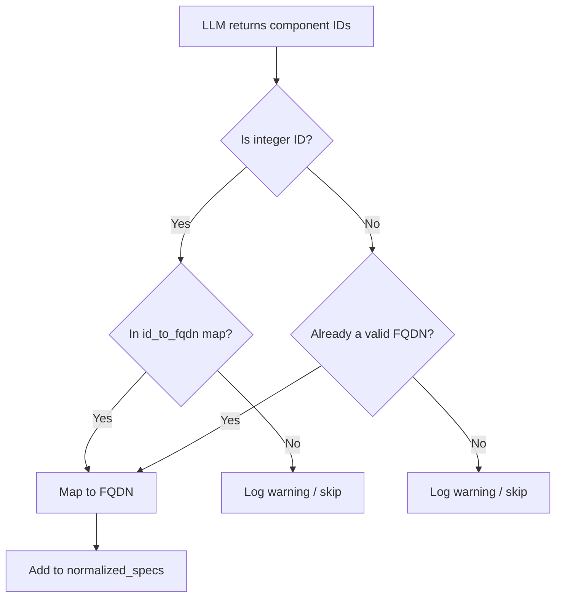

<!-- source-hash: 3d1e948961e3ee4f80c958a2d6825e6f -->
Orchestrates recursive sub-module documentation generation by dispatching AI sub-agents to document grouped code components, handling ID normalization and module tree management.

## Key Components

- **`generate_sub_module_documentation`** — Async agent tool that accepts a map of sub-module names to component IDs, normalizes integer IDs to FQDNs, builds sub-agents (complex or leaf), and recursively generates markdown documentation.
- **`generate_sub_module_documentation_tool`** — Exported `Tool` wrapper exposing the function to the parent orchestration agent with strict format instructions for component identifier usage.

## Usage Example

```python
# Called internally by the parent agent via tool dispatch
# Expected input format:
sub_module_specs = {
    "Authentication": [
        "main-repo.src/services/auth.py::AuthService",
        "main-repo.src/services/auth.py::LoginController"
    ],
    "Configuration": [
        "main-repo.src/config/api.py::ApiApplicationConfig"
    ]
}

# The tool is registered on the parent agent:
parent_agent = Agent(
    model=fallback_models,
    deps_type=CodeWikiDeps,
    tools=[
        read_code_components_tool,
        str_replace_editor_tool,
        generate_sub_module_documentation_tool,  # enables recursive decomposition
    ],
)
```

## ID Normalization Flow



## Agent Selection Logic

| Condition | Agent Type | Tools Available |
|---|---|---|
| Complex module + depth < max + tokens ≥ threshold | Recursive sub-agent | Includes `generate_sub_module_documentation_tool` |
| Simple module or max depth reached | Leaf sub-agent | `read_code_components` + `str_replace_editor` only |

> **Source:** [`generate_sub_module_documentations.py`](https://github.com/flamingo-stack/CodeWiki/blob/main/codewiki/src/be/generate_sub_module_documentations.py)