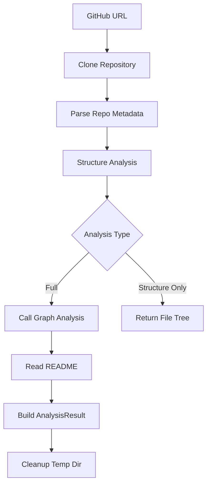

<!-- source-hash: a7976251cf6b98b593aff2718ec59631 -->
Centralized orchestration service for repository analysis, managing the full workflow from cloning to multi-language AST parsing and call graph generation.

## Key Components

| Component | Description |
|-----------|-------------|
| `AnalysisService` | Main service class coordinating the analysis pipeline |
| `analyze_local_repository()` | Analyzes a pre-cloned local repository path |
| `analyze_repository_full()` | Full remote analysis: clone → structure → call graph → cleanup |
| `analyze_repository_structure_only()` | Lightweight structure-only analysis without AST/call graph |
| `_clone_repository()` | Clones a GitHub repo to a temporary directory |
| `_analyze_structure()` | Delegates to `RepoAnalyzer` with include/exclude pattern filtering |
| `_analyze_call_graph()` | Multi-language call graph generation via `CallGraphAnalyzer` |
| `_read_readme_file()` | Safely reads README from repo root using path traversal guards |

## Usage Example

```python
from codewiki.src.be.dependency_analyzer.services.analysis_service import AnalysisService

service = AnalysisService()

# Full remote repository analysis
result = service.analyze_repository_full(
    github_url="https://github.com/flamingo-stack/CodeWiki",
    include_patterns=["*.py"],
    exclude_patterns=["*test*"]
)
print(result.summary)

# Lightweight structure scan only
structure = service.analyze_repository_structure_only(
    github_url="https://github.com/flamingo-stack/CodeWiki"
)
print(structure["file_summary"])

# Local path analysis
local_result = service.analyze_local_repository(
    repo_path="/path/to/repo",
    max_files=50,
    languages=["python", "javascript"]
)
print(local_result["summary"])
```

## Analysis Pipeline



> **Security note:** README files are read using `safe_open_text` and `assert_safe_path` to prevent path traversal attacks on cloned repositories.