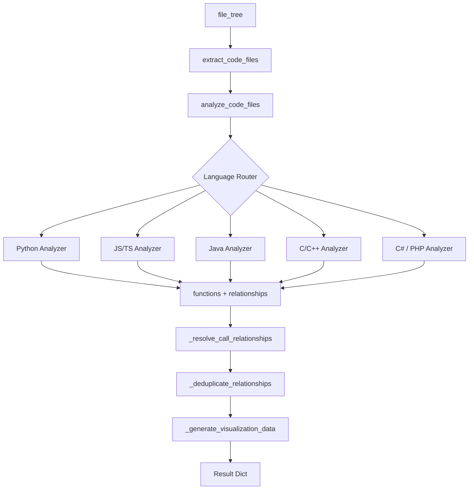

<!-- source-hash: ffcb54c3592c208de42bc95e0aaefb8d -->
Central orchestrator for multi-language call graph analysis, coordinating language-specific AST analyzers to build comprehensive function call graphs across a repository.

## Key Components

### `CallGraphAnalyzer`

The main class managing the full call graph lifecycle.

| Method | Description |
|---|---|
| `analyze_code_files(code_files, base_dir)` | Entry point: analyzes all files, resolves relationships, and returns a complete call graph dict |
| `extract_code_files(file_tree)` | Filters a nested file tree to return only supported code files with language metadata |
| `_analyze_code_file(repo_dir, file_info)` | Routes a single file to the correct language-specific analyzer |
| `_analyze_python_file(...)` | Delegates to the Python AST analyzer |
| `_analyze_javascript_file(...)` | Delegates to the tree-sitter JavaScript analyzer |
| `_analyze_typescript_file(...)` | Delegates to the tree-sitter TypeScript analyzer |
| `_analyze_java_file(...)` | Delegates to the tree-sitter Java analyzer |
| `_analyze_csharp_file(...)` | Delegates to the tree-sitter C# analyzer |
| `_analyze_c_file(...)` | Delegates to the tree-sitter C analyzer |
| `_analyze_cpp_file(...)` | Delegates to the tree-sitter C++ analyzer |
| `_analyze_php_file(...)` | Delegates to the tree-sitter PHP analyzer |

**Supported languages:** Python, JavaScript, TypeScript, Java, C#, C, C++, PHP

## Usage Example

```python
from codewiki.src.be.dependency_analyzer.call_graph_analyzer import CallGraphAnalyzer

analyzer = CallGraphAnalyzer()

# Build code file list from a file tree
code_files = analyzer.extract_code_files(file_tree)

# Run full analysis against the repository directory
result = analyzer.analyze_code_files(code_files, base_dir="/path/to/repo")

print(result["call_graph"]["total_functions"])   # e.g. 142
print(result["call_graph"]["languages_found"])   # e.g. ['python', 'typescript']

# Iterate all discovered functions
for func in result["functions"]:
    print(func["name"], func["id"])

# Iterate call relationships
for rel in result["relationships"]:
    print(rel["caller"], "->", rel["callee"])
```

## Data Flow

