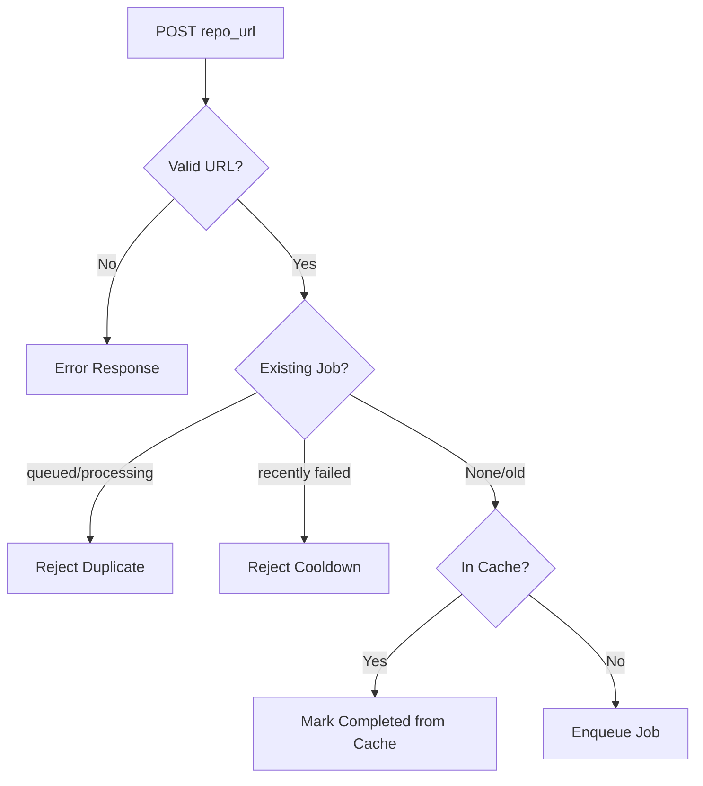

<!-- source-hash: a82d67648258d919c12d5a73ce0737b8 -->
Route handlers for the CodeWiki FastAPI web application, managing repository submission, job tracking, cache lookups, and documentation serving.

## Key Components

### `WebRoutes` Class

Central controller initialized with `BackgroundWorker` and `CacheManager` dependencies.

| Method | Type | Description |
|---|---|---|
| `index_get` | `GET /` | Renders the main form with recent job history |
| `index_post` | `POST /` | Validates and enqueues a GitHub repo for processing |
| `get_job_status` | `GET /api/jobs/{job_id}` | Returns `JobStatusResponse` for a given job |
| `view_docs` | `GET /docs/{job_id}` | Redirects to the static documentation viewer |
| `serve_generated_docs` | `GET /static-docs/{job_id}/{filename}` | Serves rendered markdown documentation as HTML |
| `_normalize_github_url` | Internal | Canonicalizes GitHub URLs via `GitHubRepoProcessor` |
| `_repo_full_name_to_job_id` | Internal | Converts `owner/repo` → `owner--repo` for URL-safe job IDs |
| `_job_id_to_repo_full_name` | Internal | Reverses the job ID → `owner/repo` mapping for cache lookups |

### Job Lifecycle



## Usage Example

```python
from codewiki.webapp.background_worker import BackgroundWorker
from codewiki.webapp.cache_manager import CacheManager
from codewiki.webapp.routes import WebRoutes
from fastapi import FastAPI

app = FastAPI()
worker = BackgroundWorker()
cache = CacheManager()

routes = WebRoutes(background_worker=worker, cache_manager=cache)

app.add_api_route("/", routes.index_get, methods=["GET"])
app.add_api_route("/", routes.index_post, methods=["POST"])
app.add_api_route("/api/jobs/{job_id}", routes.get_job_status)
app.add_api_route("/static-docs/{job_id}/{filename}", routes.serve_generated_docs)
```

> **Note:** `RETRY_COOLDOWN_MINUTES` in `WebAppConfig` controls how long a failed job blocks resubmission of the same repository.

**Source:** [`codewiki/webapp/routes.py`](https://github.com/flamingo-stack/CodeWiki/blob/main/codewiki/webapp/routes.py)