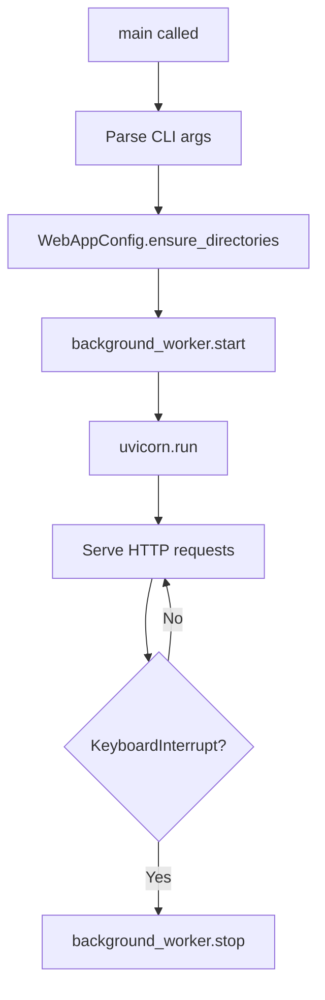

<!-- source-hash: 2af0a44130bcefff68637ed955b548d7 -->
The main entry point for the CodeWiki web application, built on FastAPI. It wires together the cache manager, background worker, and route handlers, then exposes HTTP endpoints for repository submission, job status tracking, and documentation serving.

## Key Components

| Component | Description |
|---|---|
| `app` | FastAPI application instance with title and description metadata |
| `CacheManager` | Handles caching of generated docs with configurable expiry |
| `BackgroundWorker` | Processes documentation generation jobs asynchronously |
| `WebRoutes` | Encapsulates all route handler logic |
| `WebAppConfig` | Centralized configuration (host, port, dirs, expiry) |

## Endpoints

| Method | Path | Description |
|---|---|---|
| `GET` | `/` | Renders the repo submission form |
| `POST` | `/` | Accepts `repo_url` and optional `commit_id` form fields |
| `GET` | `/api/job/{job_id}` | Returns JSON job status |
| `GET` | `/docs/{job_id}` | Renders documentation viewer |
| `GET` | `/static-docs/{job_id}/{filename}` | Serves individual doc files (defaults to `overview.md`) |

## Usage Example

**Start via CLI:**

```bash
# Development with auto-reload
python -m fe.web_app --host 0.0.0.0 --port 8080 --reload --debug

# Production
python -m fe.web_app --host 0.0.0.0 --port 8080
```

**Or import and run programmatically:**

```python
import uvicorn
from fe.web_app import app, background_worker
from fe.config import WebAppConfig

WebAppConfig.ensure_directories()
background_worker.start()

uvicorn.run(app, host="0.0.0.0", port=8080)
```

## Startup Sequence



> **Source:** [`fe/web_app.py`](https://github.com/flamingo-stack/CodeWiki/blob/main/fe/web_app.py)