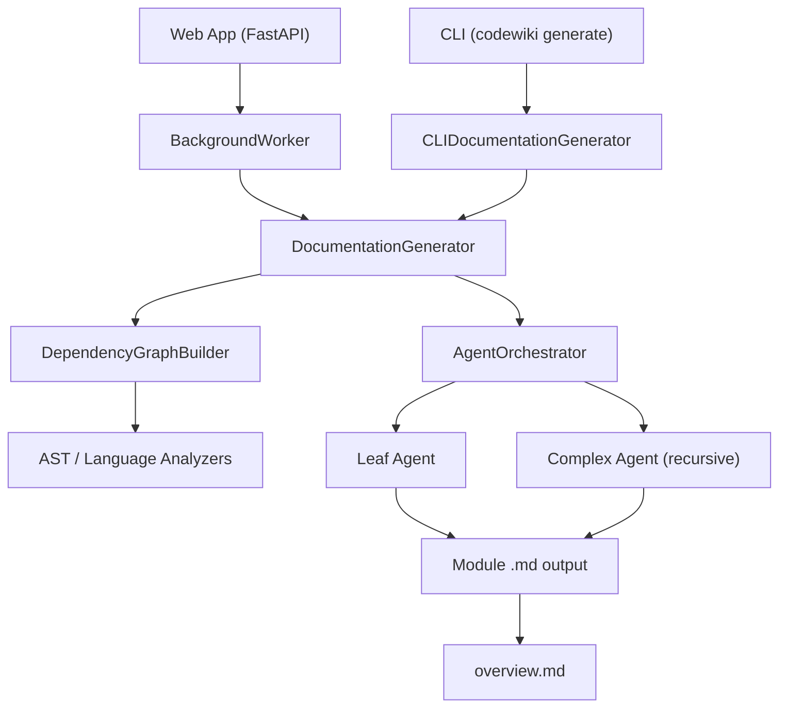

# CodeWiki Documentation

Welcome to the **CodeWiki** documentation hub. CodeWiki is an AI-powered documentation generator that transforms codebases into comprehensive, structured Markdown documentation using multi-agent LLM orchestration.

> **Part of the [Flamingo](https://flamingo.run) / [OpenFrame](https://openframe.ai) ecosystem.**
> Questions and community discussion: [OpenMSP Slack](https://join.slack.com/t/openmsp/shared_invite/zt-36bl7mx0h-3~U2nFH6nqHqoTPXMaHEHA)

---

## 📚 Table of Contents

- [Getting Started](#-getting-started)
- [Development](#-development)
- [Reference](#-reference)
- [Quick Links](#-quick-links)

---

## 🚀 Getting Started

New to CodeWiki? Start here.

| Guide | Description |
|---|---|
| [Introduction](./getting-started/introduction.md) | What CodeWiki is, how it works, and who it's for |
| [Prerequisites](./getting-started/prerequisites.md) | System requirements, LLM API access, and environment variables |
| [Quick Start](./getting-started/quick-start.md) | Install CodeWiki and generate your first docs in under 5 minutes |
| [First Steps](./getting-started/first-steps.md) | Doc styles, file filtering, git integration, and the web app |

### Recommended Reading Order

1. Read [Introduction](./getting-started/introduction.md) to understand the architecture and capabilities
2. Check [Prerequisites](./getting-started/prerequisites.md) to verify your environment
3. Follow [Quick Start](./getting-started/quick-start.md) to install and run your first generation
4. Explore [First Steps](./getting-started/first-steps.md) to unlock the full feature set

---

## 🛠️ Development

Guides for contributors and developers extending CodeWiki.

| Guide | Description |
|---|---|
| [Development Overview](./development/README.md) | Technology stack, repo layout, and development philosophy |
| [Local Development](./development/setup/local-development.md) | Clone, install, run locally, hot reload, debug configuration |
| [Environment Setup](./development/setup/environment.md) | IDE recommendations, linting, formatting, and env variables |

### Key Development Concepts

- **Editable installs** — `pip install -e .` means source changes are reflected immediately without reinstalling
- **Hot reload** — Use `--reload` flag when running the web app during development
- **Idempotent generation** — Re-running is always safe; existing `.md` files are skipped automatically
- **Three LLM roles** — `cluster` (module grouping), `main` (doc writing), `fallback` (backup)

---

## 📖 Reference

Reference documentation is being generated from the CodeWiki codebase analysis. Check back soon for detailed component documentation, API references, and architecture deep-dives.

---

## ⚡ Quick Links

| Resource | Link |
|---|---|
| Project README | [../README.md](../README.md) |
| Contributing Guide | [../CONTRIBUTING.md](../CONTRIBUTING.md) |
| Source Code | [https://github.com/flamingo-stack/CodeWiki](https://github.com/flamingo-stack/CodeWiki) |
| OpenMSP Slack | [Join the community](https://join.slack.com/t/openmsp/shared_invite/zt-36bl7mx0h-3~U2nFH6nqHqoTPXMaHEHA) |
| Community Hub | [https://www.openmsp.ai/](https://www.openmsp.ai/) |
| Flamingo | [https://flamingo.run](https://flamingo.run) |
| OpenFrame | [https://openframe.ai](https://openframe.ai) |

---

## 🗺️ Architecture at a Glance

The pipeline runs in three stages:

1. **Analysis** — Dependency graph construction and module clustering via LLM
2. **Orchestration** — AI agents dispatched per module, leaf-first (children before parents)
3. **Output** — Markdown files written to a directory structure mirroring your module hierarchy

---

*Documentation generated by [OpenFrame Doc Orchestrator](https://github.com/flamingo-stack/openframe-oss-tenant)*
