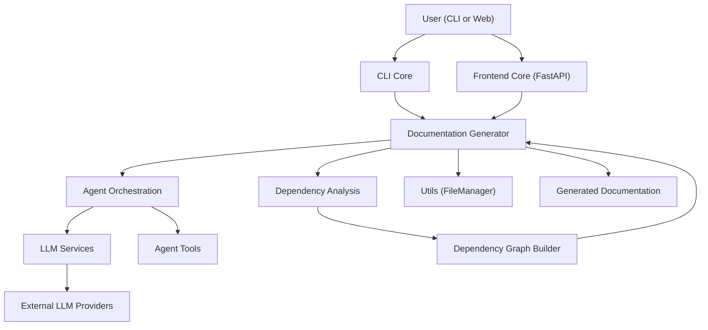
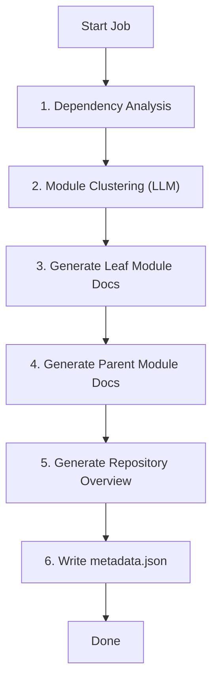
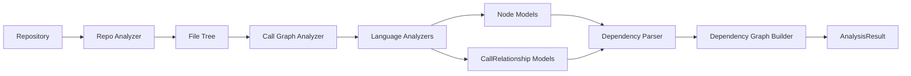
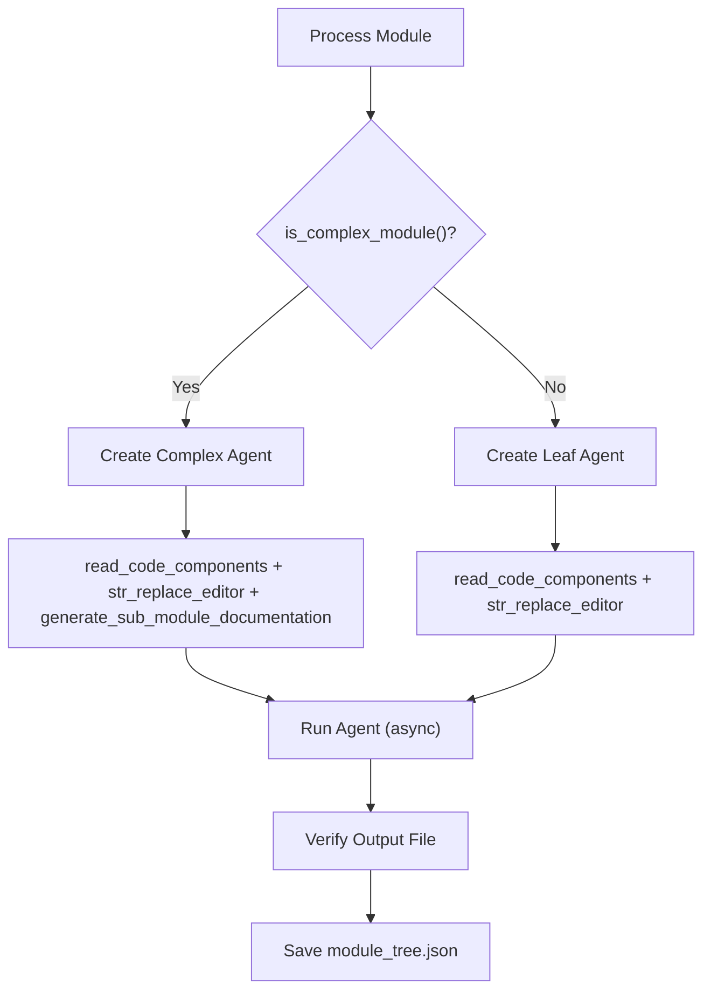
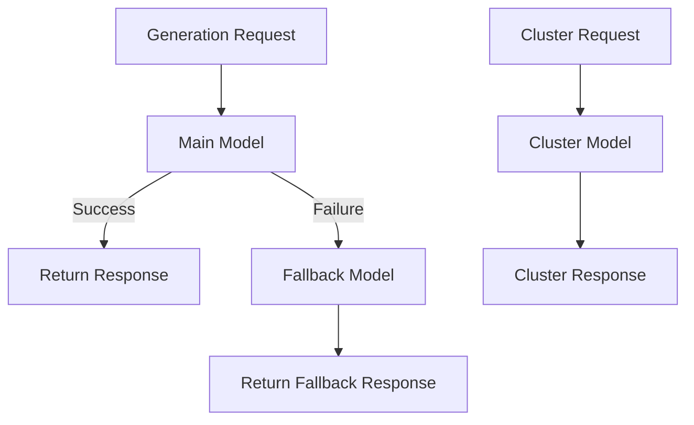
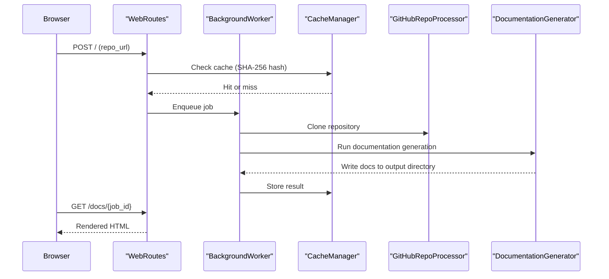

# Architecture Overview

CodeWiki is a layered, AI-driven documentation engine. This document describes the high-level architecture, core components, data flow, and key design decisions.

For detailed module-level documentation, see the [Reference Architecture](../../reference/architecture/README.md).

---

## High-Level Architecture

CodeWiki is organized into six core layers, each with clearly defined responsibilities:



---

## Core Components

| Component | Location | Responsibility |
|-----------|----------|---------------|
| **CLI Core** | `codewiki/cli/` | Command-line interface, config management, Git integration, HTML generation |
| **Frontend Core** | `codewiki/src/fe/` | FastAPI web app, job queue, caching, Markdown rendering |
| **Documentation Generator** | `codewiki/src/be/documentation_generator.py` | Orchestrates the full generation pipeline |
| **Agent Orchestration** | `codewiki/src/be/agent_orchestrator.py` | AI agent lifecycle: creation, tooling, execution, persistence |
| **LLM Services** | `codewiki/src/be/llm_services.py` | LLM provider factory, fallback chaining, request counting |
| **Dependency Analysis** | `codewiki/src/be/dependency_analyzer/` | AST parsing, call graph resolution, dependency graph building |
| **Utils** | `codewiki/src/utils.py` | Stateless `FileManager` for all file and JSON I/O |

---

## Generation Pipeline (Data Flow)

The complete documentation generation pipeline runs in a deterministic sequence of stages:



### Stage Descriptions

| Stage | Weight | Description |
|-------|--------|-------------|
| **Dependency Analysis** | 40% | Parse all source files, extract components and relationships, build dependency graph |
| **Module Clustering** | 20% | Use LLM to group related components into logical modules |
| **Documentation Generation** | 30% | Generate Markdown documentation, leaf-first |
| **HTML Generation** | 5% | Build static `index.html` for GitHub Pages (optional) |
| **Finalization** | 5% | Write `metadata.json`, commit to Git branch (optional) |

---

## Dependency Analysis Pipeline

The Dependency Analysis layer transforms raw source code into a structured dependency graph:



**Supported languages:**

| Language | Analyzer |
|---------|---------|
| Python | `PythonASTAnalyzer` (native `ast` module) |
| JavaScript | `TreeSitterJSAnalyzer` |
| TypeScript | `TreeSitterTSAnalyzer` |
| Java | `TreeSitterJavaAnalyzer` |
| C# | `TreeSitterCSharpAnalyzer` |
| C | `TreeSitterCAnalyzer` |
| C++ | `TreeSitterCppAnalyzer` |
| PHP | `TreeSitterPHPAnalyzer` |

---

## Agent Orchestration

The Agent Orchestration layer manages the AI agent lifecycle for each module:



**Idempotency:** Documentation generation is skipped if a module's output file already exists. This allows safe re-runs and incremental updates.

---

## LLM Services Architecture

The LLM Services layer abstracts provider differences and manages three model roles:



| Role | Default | Purpose |
|------|---------|---------|
| **Main model** | `claude-sonnet-4` | Primary documentation generation |
| **Cluster model** | Same as main | Module grouping and structural reasoning |
| **Fallback model** | Same as main | Backup if main model fails |

---

## Frontend Core Architecture



---

## Output Directory Structure

All generated documentation follows a deterministic hierarchical structure:

```text
docs/
├── README.md                    ← Repository overview
├── module_tree.json             ← Module hierarchy
├── metadata.json                ← Generation audit log
└── <ModuleName>/
    ├── <ModuleName>.md          ← Module documentation
    └── <SubModule>/
        └── <SubModule>.md       ← Sub-module documentation
```

This structure mirrors the logical module hierarchy discovered from the codebase — not the raw file system layout.

---

## Key Design Decisions

### 1. Leaf-First (Bottom-Up) Generation

Parent modules are documented *after* their children. This ensures:

- LLM context stays bounded — each call only receives one module's context
- Parent overviews accurately summarize child documentation
- Generation is parallelizable at the leaf level

### 2. Synthetic Module Fallback

If the clustering LLM fails to produce any modules, CodeWiki automatically creates synthetic modules grouped by top-level directory. This prevents the system from attempting to document an entire large repository in a single LLM call.

### 3. OS Keychain for API Keys

API keys are never written to disk in plaintext. The CLI uses the system keychain (`keyring` library), which maps to macOS Keychain, Windows Credential Manager, or Linux Secret Service depending on the platform.

### 4. Provider-Agnostic LLM Layer

The LLM Services layer uses the OpenAI SDK for all providers, with configurable base URLs. This allows CodeWiki to work with Anthropic, Azure, LiteLLM proxies, and any OpenAI-compatible endpoint without code changes.

### 5. Idempotent Generation

The `process_module()` method skips generation if the output file already exists. This makes re-runs safe and supports incremental documentation updates.

### 6. Deterministic Namespacing

All component identifiers follow the pattern:

```text
<namespace>.<module>.<class>.<method>
```

This allows cross-language and cross-repository dependency resolution without ambiguity.

---

## Reference Documentation

For deep-dive module documentation, see:

- [Reference Architecture Overview](../../reference/architecture/README.md)
- [CLI Core](../../reference/architecture/cli-core/cli-core.md)
- [Agent Orchestration](../../reference/architecture/agent-orchestration/agent-orchestration.md)
- [LLM Services](../../reference/architecture/llm-services/llm-services.md)
- [Dependency Analysis](../../reference/architecture/dependency-analysis/dependency-analysis.md)
- [Documentation Generation](../../reference/architecture/documentation-generation/documentation-generation.md)
- [Frontend Core](../../reference/architecture/frontend-core/frontend-core.md)
- [Utils](../../reference/architecture/utils/utils.md)
