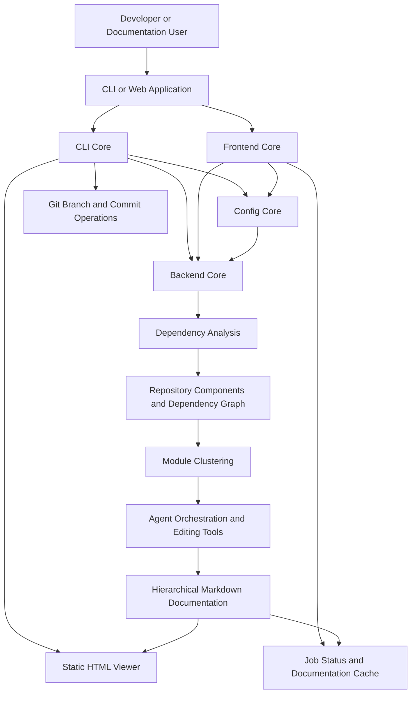
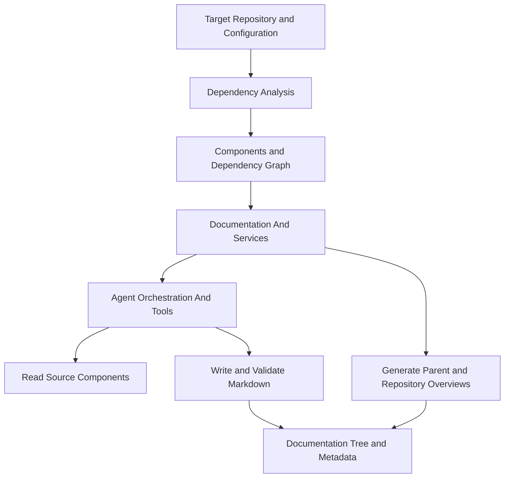
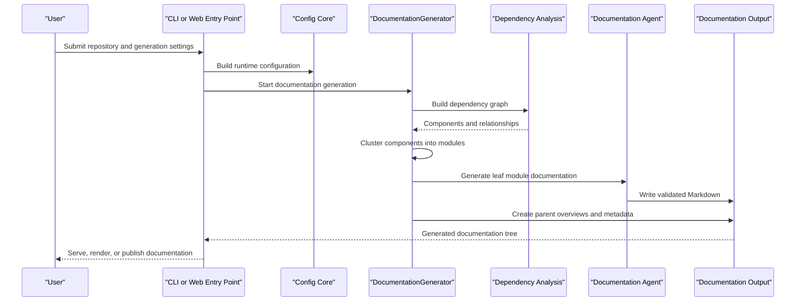

# Architecture Overview

CodeWiki's architecture separates entry points (CLI, web app) from a shared configuration object and a backend documentation-generation engine. This page summarizes the high-level structure; see the linked reference docs for full detail on each module.

## High-Level Architecture

## Core Modules

| Module | Location | Responsibility |
|---|---|---|
| CLI Core | `codewiki/cli` | Terminal-facing workflow: persistent configuration (`ConfigManager`), generation pipeline adapter (`CLIDocumentationGenerator`), progress/logging utilities, static HTML rendering (`HTMLGenerator`), and Git operations (`GitManager`). |
| Backend Core | `codewiki/src/be` | The documentation-generation engine: dependency analysis, module clustering, agent orchestration, and Markdown generation/validation. |
| Frontend Core | `codewiki/src/fe` | FastAPI web application: route handlers (`WebRoutes`), asynchronous job processing (`BackgroundWorker`), caching (`CacheManager`), and GitHub repository handling (`GitHubRepoProcessor`). |
| Config Core | `codewiki/src/config.py` | The shared `Config` dataclass — paths, per-provider LLM settings (cluster/main/fallback), token limits, and agent instructions — constructed by every entry point. |

## Backend Core Internal Structure

Backend Core has three cooperating areas:

- **Dependency Analysis** discovers code components (`Node`, `CallRelationship`) and their relationships using language-specific analyzers (Python AST, Tree-sitter for JavaScript/TypeScript/Java/C/C++/C#/PHP).
- **Agent Orchestration And Tools** (`AgentOrchestrator`, `CodeWikiDeps`, `EditTool`) gives LLM agents controlled, sandboxed access to read source files and write/edit Markdown output only within the documentation tree.
- **Documentation And Services** (`DocumentationGenerator`) coordinates dependency analysis, module clustering, leaf-module generation, parent summaries, LLM clients (`CountingFallbackModel`), and output metadata.

## Data Flow: End-to-End Generation

## Key Design Decisions

- **Separation of persistent vs. runtime configuration**: The CLI's `Configuration` model represents saved user preferences (`~/.codewiki/config.json` + keyring); the backend's `Config` dataclass represents a fully-resolved runtime configuration for a single generation run. Multiple constructors (`from_args`, `from_web_job`, `from_cli`, `from_config_manager`) normalize construction across entry points.
- **Secrets are runtime-only**: `Config.to_dict()` excludes API key fields (`cluster_api_key`, `main_api_key`, `fallback_api_key`) by default so they are never accidentally persisted, cached, or logged. Callers must explicitly pass `include_secrets=True` when a full round-trip is required.
- **Bottom-up documentation generation**: `DocumentationGenerator` processes leaf modules first (delegating to LLM agents), then generates parent/overview documentation by summarizing already-generated child docs — this keeps generation resumable and hierarchical.
- **Sandboxed agent tools**: Documentation agents can read arbitrary source files for context but can only write within the documentation output tree, and generated Markdown is checked for Mermaid diagram validity before a module is considered complete.
- **Per-provider LLM configuration**: Cluster, main, and fallback stages each have independent model/API-key/base-URL/temperature/token-limit settings, allowing cheaper or faster models for clustering while using a stronger model for final documentation generation.
- **Pluggable entry points, shared engine**: Both the CLI (`CLIDocumentationGenerator`) and the web app (`BackgroundWorker`) are thin adapters around the same `DocumentationGenerator` backend engine, ensuring consistent output regardless of how a run was triggered.

For deeper detail on each module, see the module-level reference documentation generated from source: [CLI Core](../../reference/architecture/cli-core/cli-core.md), [Backend Core](../../reference/architecture/backend-core/backend-core.md), [Frontend Core](../../reference/architecture/frontend-core/frontend-core.md), and [Config Core](../../reference/architecture/config-core/config-core.md).
