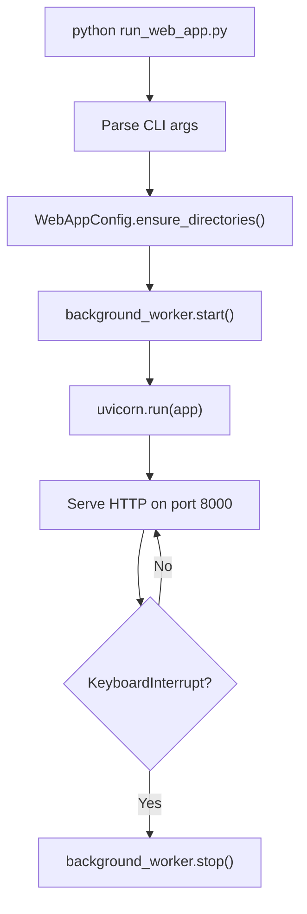

# Local Development Guide

This guide walks you through cloning CodeWiki, installing dependencies, running the CLI and web app locally, enabling debug mode, and configuring hot reload.

---

## Clone and Setup

### 1. Clone the Repository

```bash
git clone https://github.com/flamingo-stack/CodeWiki.git
cd CodeWiki
```

### 2. Create a Virtual Environment

```bash
python -m venv .venv

# Activate (Linux / macOS)
source .venv/bin/activate

# Activate (Windows PowerShell)
.venv\Scripts\Activate.ps1
```

### 3. Install in Editable Mode

```bash
pip install -e .
```

This installs CodeWiki as an editable package, meaning changes to source files take effect immediately without reinstalling.

```bash
# Verify CLI is available
codewiki --version
# Expected: CodeWiki CLI v1.0.1

codewiki --help
```

### 4. Install Node.js Dependencies (Optional)

Required only if working on the VoltAgent orchestration layer:

```bash
npm install
```

---

## Running the CLI Locally

### Configure API Keys

```bash
codewiki config set \
  --cluster-api-key sk-your-key \
  --main-api-key sk-your-key \
  --fallback-api-key sk-your-key \
  --cluster-base-url https://api.anthropic.com/v1 \
  --main-base-url https://api.anthropic.com/v1 \
  --fallback-base-url https://api.anthropic.com/v1 \
  --cluster-model claude-3-haiku-20240307 \
  --main-model claude-sonnet-4-5 \
  --fallback-model claude-3-haiku-20240307
```

### Generate Docs for CodeWiki Itself

```bash
# From the CodeWiki repo root
codewiki generate --output ./docs --doc-type architecture
```

### Verbose Mode

```bash
# See detailed logs including LLM requests
codewiki generate --verbose
```

---

## Running the Web Application Locally

### Direct Python Startup

```bash
# Default: http://127.0.0.1:8000
python codewiki/run_web_app.py
```

### With Custom Options

```bash
python -m codewiki.src.fe.web_app \
  --host 0.0.0.0 \
  --port 8080 \
  --reload \
  --debug
```

> The `--reload` flag enables **hot reload** — the server restarts automatically when source files change (powered by Uvicorn's built-in reloader).

### Web App Startup Sequence



---

## Web App Endpoints for Local Testing

Once running, the following endpoints are available:

| Method | URL | Description |
|---|---|---|
| `GET` | `http://localhost:8000/` | Repository submission form |
| `POST` | `http://localhost:8000/` | Submit `repo_url` form field |
| `GET` | `http://localhost:8000/api/job/{job_id}` | JSON job status |
| `GET` | `http://localhost:8000/docs/{job_id}` | Documentation viewer |

### Submit a Test Job via curl

```bash
curl -X POST http://localhost:8000/ \
  -F "repo_url=https://github.com/flamingo-stack/CodeWiki"
```

### Poll Job Status

```bash
curl http://localhost:8000/api/job/flamingo-stack--CodeWiki | python -m json.tool
```

---

## Running the Backend Directly

You can bypass the CLI and invoke the Python backend directly for development/debugging:

```bash
export PYTHONPATH=$(pwd)
export MAIN_API_KEY=sk-your-key
export FALLBACK_API_KEY=sk-your-key
export CLUSTER_API_KEY=sk-your-key

python -m codewiki.src.be.main --repo-path /path/to/target/repo
```

---

## Hot Reload — CLI Changes

Because CodeWiki is installed with `pip install -e .`, all Python source changes are reflected immediately. Just save your file and re-run the command — no reinstall needed.

For the web app, use `--reload`:

```bash
python codewiki/run_web_app.py --reload
```

---

## Debug Configuration (VS Code)

Add a launch configuration to `.vscode/launch.json`:

```json
{
  "version": "0.2.0",
  "configurations": [
    {
      "name": "CodeWiki CLI Generate",
      "type": "debugpy",
      "request": "launch",
      "module": "codewiki.cli.main",
      "args": ["generate", "--output", "./docs", "--doc-type", "architecture"],
      "cwd": "${workspaceFolder}",
      "env": {
        "PYTHONPATH": "${workspaceFolder}"
      },
      "justMyCode": false
    },
    {
      "name": "CodeWiki Web App",
      "type": "debugpy",
      "request": "launch",
      "module": "codewiki.src.fe.web_app",
      "args": ["--host", "127.0.0.1", "--port", "8000", "--debug"],
      "cwd": "${workspaceFolder}",
      "envFile": "${workspaceFolder}/.env"
    }
  ]
}
```

---

## Running Docker Compose Locally

```bash
# Copy the example env file
cp .env.example .env
# Edit .env with your actual API keys

# Build and start
cd docker
docker compose up --build

# View logs
docker compose logs -f

# Stop
docker compose down
```

The Docker app binds to `http://localhost:8000` (or `APP_PORT` from `.env`).

---

## Output Directory Structure

After a successful local run, the output directory looks like:

```text
docs/
├── metadata.json            # Generation stats: timestamps, file list
├── module_tree.json         # Full module hierarchy
├── first_module_tree.json   # Initial cluster tree
├── overview.md              # Top-level documentation overview
└── ModuleName/
    ├── ModuleName.md        # Module documentation
    └── SubModule/
        └── SubModule.md
```

---

## Troubleshooting Common Issues

| Issue | Likely Cause | Fix |
|---|---|---|
| `codewiki: command not found` | Package not installed | Run `pip install -e .` |
| `ConfigurationError: API key not found` | Keys not set | Run `codewiki config set --main-api-key ...` |
| `RepositoryError: Not a git repository` | Running outside a git repo | Run `git init` or navigate to a git repo |
| `KeyboardInterrupt` exits with code 130 | Normal user cancellation | Re-run the command |
| Port 8000 already in use | Another process using the port | Use `--port 8080` or stop the conflicting process |
