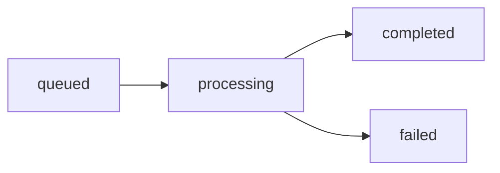

# First Steps

After installing CodeWiki and running your first generation, here are the five most important things to explore next.

---

## 1. Understand Your Configuration

CodeWiki stores your configuration in two places:

| Data | Location |
|---|---|
| API keys | System keychain (`codewiki` service) |
| Model names, URLs, token limits | `~/.codewiki/config.json` |

View your current configuration at any time:

```bash
codewiki config set --help
```

Update specific settings without resetting everything else:

```bash
# Switch the main model without touching other settings
codewiki config set --main-model claude-sonnet-4-5 --main-max-tokens 128000
```

---

## 2. Choose the Right Documentation Style

CodeWiki supports four documentation styles via the `--doc-type` flag:

| Style | Best For |
|---|---|
| `architecture` | System design, component relationships, high-level overviews |
| `api` | Public APIs, endpoints, function signatures, usage examples |
| `developer` | Internal implementation details, contributor guides |
| `user-guide` | End-user facing documentation, how-to guides |

```bash
# Architecture docs — ideal for understanding a new codebase
codewiki generate --doc-type architecture

# API docs — ideal for library or service documentation
codewiki generate --doc-type api --include "*.py" --exclude "*test*"
```

---

## 3. Filter Files to Focus the Analysis

Use `--include` and `--exclude` flags to control which files are analyzed:

```bash
# Document only TypeScript files, excluding tests
codewiki generate \
  --include "*.ts,*.tsx" \
  --exclude "*test*,*spec*,*node_modules*"

# Focus on a specific module subdirectory
codewiki generate --focus "src/core,src/api"
```

You can also add custom LLM instructions to shape the output:

```bash
codewiki generate \
  --instructions "Focus on public APIs and include a usage example for every exported function."
```

---

## 4. Integrate With Git Workflows

CodeWiki has built-in git integration. After docs are generated, you can automatically branch and commit:

```bash
# Create a timestamped documentation branch (e.g., docs/codewiki-20250101-143022)
codewiki generate --create-branch

# The branch is created, docs are written, and you get a PR URL:
# → https://github.com/your-org/your-repo/compare/docs/codewiki-20250101-143022
```

> **Requirement:** Your working directory must be clean (no uncommitted changes) before using `--create-branch`. Run `git status` first.

---

## 5. Serve Docs via the Web Application

The CodeWiki web app lets you submit any public GitHub repository URL and receive generated documentation in your browser.

### Start the Web App

```bash
python codewiki/run_web_app.py
```

Or with custom settings:

```bash
python -m fe.web_app --host 0.0.0.0 --port 8080 --reload --debug
```

### Available Endpoints

| Method | Path | Description |
|---|---|---|
| `GET` | `/` | Repository submission form |
| `POST` | `/` | Submit `repo_url` + optional `commit_id` |
| `GET` | `/api/job/{job_id}` | Job status (JSON) |
| `GET` | `/docs/{job_id}` | Documentation viewer |
| `GET` | `/static-docs/{job_id}/{filename}` | Serve individual doc files |

### Job Lifecycle



Poll the job status endpoint until `status` is `completed` or `failed`:

```bash
curl http://localhost:8000/api/job/flamingo-stack--CodeWiki
```

---

## Helpful Tips for Your First Week

### Re-running is Safe

CodeWiki is **idempotent** — existing `.md` files are detected and skipped automatically. Re-run freely as your code changes:

```bash
# Only undocumented modules will be processed
codewiki generate
```

To force full regeneration:

```bash
codewiki generate --no-cache
```

### Token Budget Tuning

For large codebases, you may need to increase token limits:

```bash
codewiki generate \
  --max-tokens 32768 \
  --max-depth 3
```

### Multi-path Repositories

If your project spans multiple directories (e.g., a monorepo), use `--additional-paths`:

```bash
codewiki generate \
  --additional-paths ../shared-lib,../common-utils
```

---

## Where to Get Help

- **OpenMSP Slack Community**: [https://join.slack.com/t/openmsp/shared_invite/zt-36bl7mx0h-3~U2nFH6nqHqoTPXMaHEHA](https://join.slack.com/t/openmsp/shared_invite/zt-36bl7mx0h-3~U2nFH6nqHqoTPXMaHEHA)
- **Community Hub**: [https://www.openmsp.ai/](https://www.openmsp.ai/)
- **Source Code**: [https://github.com/flamingo-stack/CodeWiki](https://github.com/flamingo-stack/CodeWiki)
