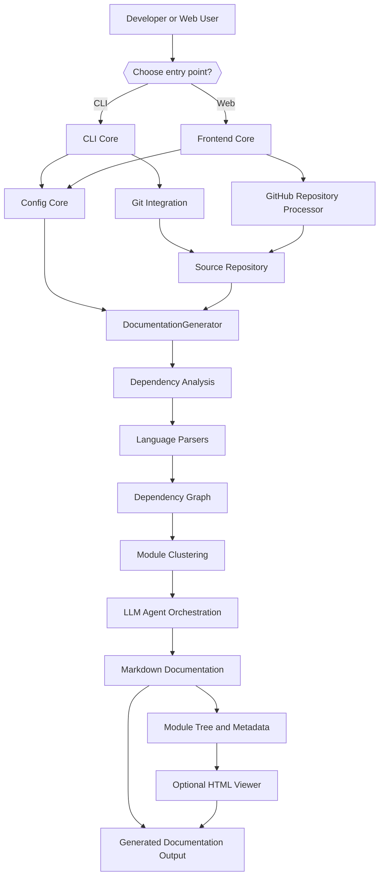

# Introduction to CodeWiki

## What is CodeWiki?

**CodeWiki** is an AI-powered documentation generator for source code repositories. Point it at a codebase — locally via a command-line interface, or remotely via a web application — and it will:

1. Analyze the repository's file structure and cross-file call relationships
2. Build a dependency graph of functions, classes, and modules
3. Cluster related components into meaningful, hierarchical modules
4. Use LLM-backed agents to write structured Markdown documentation for each module
5. Produce navigable output, including an optional static HTML viewer suitable for GitHub Pages

CodeWiki is built as a Python package (`codewiki`, requires Python `>=3.12`) and supports analysis of **Python, Java, JavaScript, TypeScript, C, C++, C#, and PHP** source files through dedicated tree-sitter based language analyzers.

## Key Features

- **Two entry points, one engine** — a `codewiki` CLI for local repositories and a FastAPI web application for submitting GitHub repository URLs. Both drive the same backend documentation pipeline.
- **Multi-language dependency analysis** — tree-sitter powered analyzers extract call graphs and structural relationships across eight languages.
- **LLM-driven module clustering** — instead of a flat file listing, components are grouped into meaningful modules (e.g., "Auth Module", "API Module") by an LLM, then documented leaf-first before parent overviews are generated.
- **Per-provider LLM configuration** — separate model, API key, base URL, token limit, and temperature settings for the *cluster*, *main*, and *fallback* LLM roles, so you can mix providers (e.g., a cheaper model for clustering, a stronger model for generation).
- **Secure credential storage** — API keys are stored in the OS keyring (macOS Keychain, Windows Credential Manager, Linux Secret Service), never in plaintext configuration files.
- **Git-aware workflow** — the CLI can validate a clean working tree, create a timestamped documentation branch, and prepare it for a pull request.
- **Static HTML output** — an optional, self-contained `index.html` viewer can be generated for GitHub Pages deployment.
- **Caching for the web app** — the FastAPI frontend caches generated documentation by repository URL (with configurable expiry) to avoid redundant regeneration.
- **Multi-path analysis** — repositories whose source is split across multiple root directories (e.g., a monorepo with `main/`, `deps/`, `vendor/`) can be analyzed as a single unified documentation set via `additional_source_paths`.

## Target Audience

CodeWiki is for:

- **Individual developers** who want up-to-date architecture documentation for a repository without manually writing it.
- **Teams and maintainers** who want a repeatable, CI-friendly way to regenerate documentation as code evolves (`--force` flag for non-interactive use).
- **Open-source project maintainers** who want a GitHub Pages-ready documentation site generated directly from their codebase.
- **Platform operators** who want to offer documentation-as-a-service through a hosted web application backed by GitHub repository submissions.

## High-Level Architecture

## Core Modules at a Glance

| Module | Purpose |
|---|---|
| **CLI Core** | Command-line orchestration: local config, Git integration, terminal progress, static HTML generation. |
| **Backend Core** | Repository analysis, dependency-graph construction, module clustering, LLM agent orchestration, documentation generation. |
| **Frontend Core** | FastAPI web application: repository submission, background job processing, caching, doc serving. |
| **Config Core** | Shared runtime `Config` model for source paths, output locations, provider settings, token limits, and agent instructions. |

> **Note:** CodeWiki itself is a documentation-generation *tool* — the "modules" above describe CodeWiki's own internal architecture, not application features you configure for an end-user product. When you run CodeWiki against your own repository, it analyzes *your* code and produces documentation about *your* project.

## Where to Go Next

- [Prerequisites](prerequisites.md) — required software, versions, and environment setup before installing CodeWiki.
- [Quick Start](quick-start.md) — a five-minute walkthrough of installing CodeWiki and generating your first documentation set.
- [First Steps](first-steps.md) — what to explore after your first successful run.
