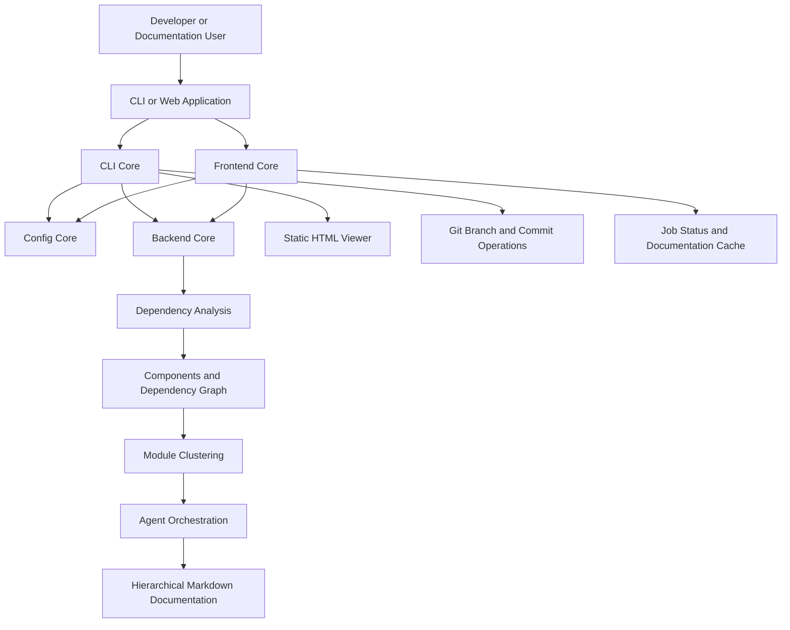

# Introduction to CodeWiki

## What is CodeWiki?

CodeWiki is an **AI-assisted documentation generator** for software repositories. It analyzes source code across multiple programming languages, builds a dependency graph of code components, clusters those components into logical modules, and uses LLM-backed agents to produce hierarchical, Markdown-based documentation automatically.

Instead of engineers hand-writing and maintaining architecture docs that quickly go stale, CodeWiki reads the actual codebase — file structure, function/class relationships, call graphs — and generates a navigable documentation tree that mirrors how the code is really organized.

> CodeWiki is part of the Flamingo (https://flamingo.run) open-source ecosystem, the same organization behind OpenFrame (https://openframe.ai), the unified AI-driven MSP platform.

## Key Features

- **Multi-language dependency analysis** — Language analyzers cover Python, JavaScript, TypeScript, Java, C, C++, C#, and PHP source files, extracting components (classes, functions, modules) and their relationships.
- **Automatic module clustering** — An LLM-driven clustering step groups low-level code components (leaf nodes) into logical, named modules instead of documenting every file in isolation.
- **Hierarchical Markdown generation** — Documentation is produced bottom-up: leaf modules first, then parent overviews that summarize their children, ending in a top-level repository overview.
- **Two ways to run it** — A terminal-based CLI (`codewiki`) for local, git-integrated workflows, and a FastAPI web application for submitting a GitHub URL through a browser and tracking generation jobs.
- **Static HTML viewer** — The CLI can render a self-contained `index.html` suitable for publishing on GitHub Pages.
- **Git-native publishing** — The CLI can create a dedicated documentation branch, commit the generated docs, and construct a GitHub pull-request URL.
- **Caching** — The web application caches completed documentation runs by repository URL so repeat visits are served instantly.
- **Configurable LLM providers** — Separate model/API-key/base-URL configuration for three pipeline stages: clustering, main generation, and fallback.

## Target Audience

CodeWiki is built for:

- **Engineering teams** who want up-to-date architecture documentation without manually maintaining it.
- **Open-source maintainers** who want to publish a browsable documentation site (GitHub Pages) generated directly from their code.
- **Documentation/DevRel engineers** integrating automated doc generation into a CI or web-based workflow.

## How It Works — High-Level Overview

## Core Modules at a Glance

| Module | Location | Responsibility |
|---|---|---|
| CLI Core | `codewiki/cli` | Terminal workflow: persistent configuration, generation pipeline, HTML output, Git operations |
| Backend Core | `codewiki/src/be` | Repository analysis, dependency graph construction, module clustering, LLM-driven Markdown generation |
| Frontend Core | `codewiki/src/fe` | FastAPI web app: repository submission, background job processing, caching, documentation serving |
| Config Core | `codewiki/src/config.py` | Shared `Config` dataclass consumed by every entry point |

## Where to Go Next

- [Prerequisites](prerequisites.md) — what you need installed before running CodeWiki
- [Quick Start](quick-start.md) — generate your first set of documentation in minutes
- [First Steps](first-steps.md) — what to explore right after your first successful run
