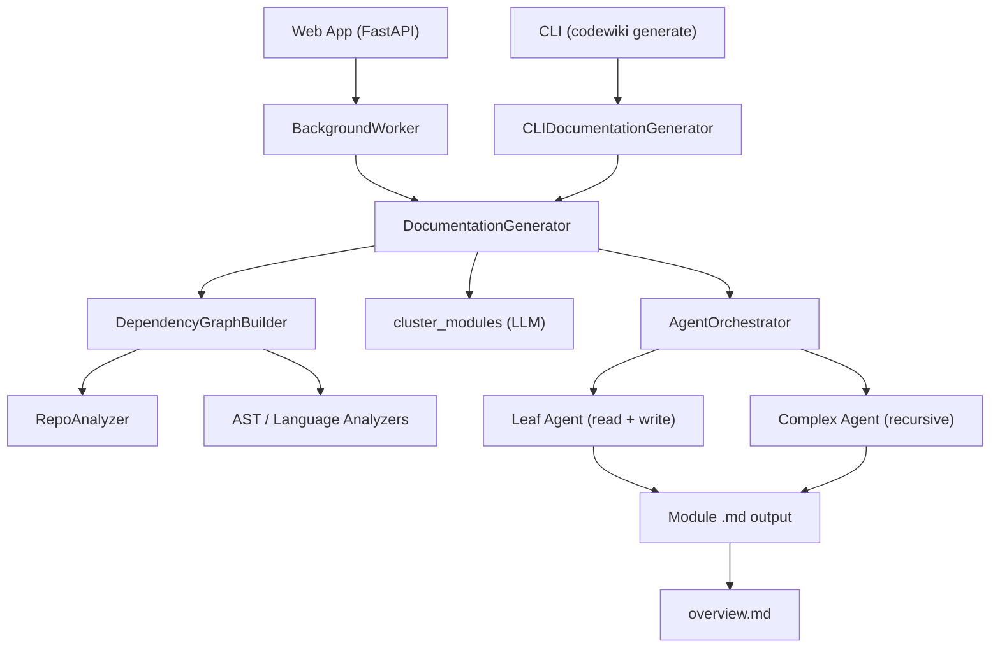

# Introduction to CodeWiki

CodeWiki is an **AI-powered documentation generator** that transforms codebases into comprehensive, structured documentation. By combining static dependency analysis with multi-agent LLM orchestration, CodeWiki understands the architecture of your code and produces rich, hierarchical documentation — automatically.

> **Part of the Flamingo / OpenFrame ecosystem.** CodeWiki powers the documentation pipeline behind [OpenFrame](https://openframe.ai) — the AI-driven MSP platform by [Flamingo](https://flamingo.run).

---

## What Is CodeWiki?

CodeWiki takes a local or remote code repository, analyzes every file's classes, functions, and dependencies, then dispatches a coordinated swarm of AI agents to write documentation — module by module, bottom-up — until the entire codebase is covered.

The output is a directory of Markdown files that mirror the module hierarchy of your project, ready to be committed to your repo, hosted on GitHub Pages, or served through the built-in web app.

---

## Key Features

| Feature | Description |
|---|---|
| **Multi-language analysis** | Supports Python, TypeScript, JavaScript, Java, C#, C, C++, and PHP |
| **AI agent orchestration** | Uses `pydantic-ai` agents with tool calling to read, analyze, and write docs |
| **Hierarchical documentation** | Output mirrors your module tree — parent overviews are built after children |
| **LLM-agnostic** | Works with any OpenAI-compatible provider (OpenAI, Anthropic, local models) |
| **Three-role LLM model config** | Separate `main`, `fallback`, and `cluster` model configurations |
| **Idempotent generation** | Skips already-documented modules; safe to re-run |
| **Git-native workflow** | Automatically creates documentation branches and commits |
| **Web application mode** | FastAPI-based web app for submitting GitHub repos via browser |
| **Docker support** | Ready-to-run Docker Compose configuration |
| **GitHub Pages output** | Optionally generates `index.html` for static hosting |

---

## Target Audience

CodeWiki is built for:

- **Engineering teams** who need up-to-date documentation for growing codebases
- **Open-source maintainers** who want to lower the barrier to contribution
- **Architects and tech leads** looking to automatically capture system design in docs
- **MSP operators** using [Flamingo / OpenFrame](https://flamingo.run) who need documentation as part of their automation pipeline

---

## Architecture Overview

The pipeline has three stages:

1. **Analysis** — Dependency graph construction and module clustering
2. **Orchestration** — AI agents are dispatched per module, leaf-first
3. **Output** — Markdown files written to a hierarchical directory structure

---

## Two Modes of Operation

### CLI Mode (local repositories)
Use the `codewiki` command-line tool to generate documentation for a repository on your machine.

### Web App Mode (remote GitHub repositories)
Run the FastAPI web server and submit any GitHub URL through the browser. The background worker clones the repo, runs the pipeline, and serves the resulting docs.

---

## Community and Support

CodeWiki is developed by the Flamingo team and maintained as part of the OpenFrame open-source ecosystem.

- **Slack Community**: Join [OpenMSP Slack](https://join.slack.com/t/openmsp/shared_invite/zt-36bl7mx0h-3~U2nFH6nqHqoTPXMaHEHA) for questions, feedback, and collaboration
- **Community Hub**: [https://www.openmsp.ai/](https://www.openmsp.ai/)
- **Source Code**: [https://github.com/flamingo-stack/CodeWiki](https://github.com/flamingo-stack/CodeWiki)

---

## What's Next?

- Check the [Prerequisites](prerequisites.md) to make sure your environment is ready
- Follow the [Quick Start](quick-start.md) to generate your first docs in under 5 minutes
- Read [First Steps](first-steps.md) to explore the full feature set after installation
