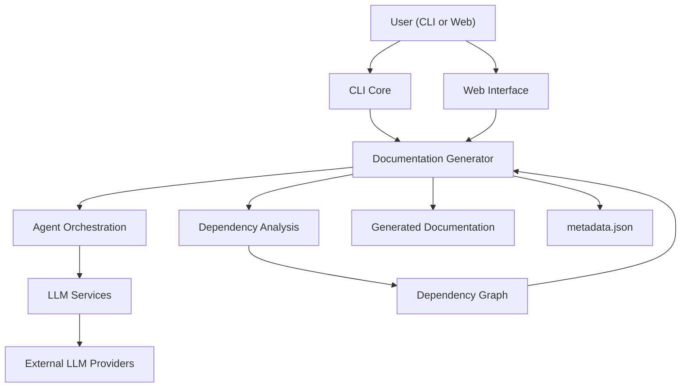
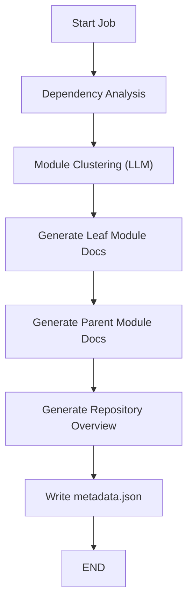

# Introduction to CodeWiki

**CodeWiki** is an open-source, AI-powered documentation engine that transforms source code repositories into structured, hierarchical, and navigable technical documentation — automatically.

Built by [Flamingo](https://flamingo.run) as part of the [OpenFrame](https://openframe.ai) platform, CodeWiki is designed to eliminate the documentation bottleneck in software engineering. It turns messy, undocumented codebases into architecture-aware, LLM-generated documentation with zero manual effort.

---

## What Is CodeWiki?

CodeWiki combines multi-language static analysis with large language model reasoning to produce documentation that reflects your code's actual structure — not just its surface-level contents.

It answers the question: *"How do I understand this codebase?"* — for every repository, every language, every team.



---

## Key Features

| Feature | Description |
|---------|-------------|
| **Multi-language support** | Python, JavaScript, TypeScript, Java, C, C++, C#, PHP |
| **AI-powered generation** | LLM-generated documentation using Claude, GPT, or any OpenAI-compatible endpoint |
| **Dependency graph analysis** | AST-based static analysis builds accurate call graphs |
| **Hierarchical documentation** | Leaf-first, bottom-up documentation respecting module structure |
| **CLI interface** | One-command generation via `codewiki generate` |
| **Web interface** | FastAPI-based web app for team-wide usage |
| **Git-native** | Auto-creates documentation branches and commits |
| **GitHub Pages ready** | Generates a static `index.html` viewer |
| **LLM-agnostic** | Works with OpenAI, Anthropic, Azure, and OpenAI-compatible proxies |
| **Context overflow protection** | Synthetic module fallback prevents runaway LLM calls |

---

## Who Is CodeWiki For?

CodeWiki is built for:

- **Software engineers** who need to onboard quickly to unfamiliar codebases
- **Technical leads** who want living documentation that stays current with the code
- **MSP operators** using the OpenFrame platform who need automated documentation across client environments
- **Open-source maintainers** who want architecture docs without writing them manually
- **DevOps and platform engineers** integrating documentation into CI/CD pipelines

---

## How It Works

CodeWiki runs in a structured, multi-stage pipeline:



1. **Dependency Analysis** — AST-based parsing extracts classes, functions, and relationships across all files
2. **Module Clustering** — An LLM groups related components into logical modules
3. **Leaf-first generation** — Documentation is generated bottom-up: leaves first, then parents, then root
4. **Output** — Structured Markdown files, a navigable `README.md`, and optionally a GitHub Pages site

This staged approach ensures the LLM never receives the full repository context in a single call — keeping generation fast, affordable, and accurate.

---

## Interfaces

CodeWiki provides two ways to generate documentation:

### CLI (Command Line Interface)

Ideal for local development, CI/CD pipelines, and scripting:

```bash
codewiki generate
```

### Web Application

A FastAPI-based web UI for submitting any public GitHub repository and browsing generated documentation:

```bash
python -m codewiki.run_web_app
```

---

## Community and Support

CodeWiki is part of the OpenMSP open-source community.

- **Community:** [OpenMSP Slack](https://join.slack.com/t/openmsp/shared_invite/zt-36bl7mx0h-3~U2nFH6nqHqoTPXMaHEHA)
- **Platform:** [OpenMSP Community](https://www.openmsp.ai/)
- **Source code:** [github.com/flamingo-stack/CodeWiki](https://github.com/flamingo-stack/CodeWiki)
- **Flamingo:** [flamingo.run](https://flamingo.run)
- **OpenFrame:** [openframe.ai](https://openframe.ai)

---

## Next Steps

After reading this introduction:

- Review the [Prerequisites](prerequisites.md) to prepare your environment
- Follow the [Quick Start](quick-start.md) to run CodeWiki in under 5 minutes
- Explore [First Steps](first-steps.md) to learn key features after setup
