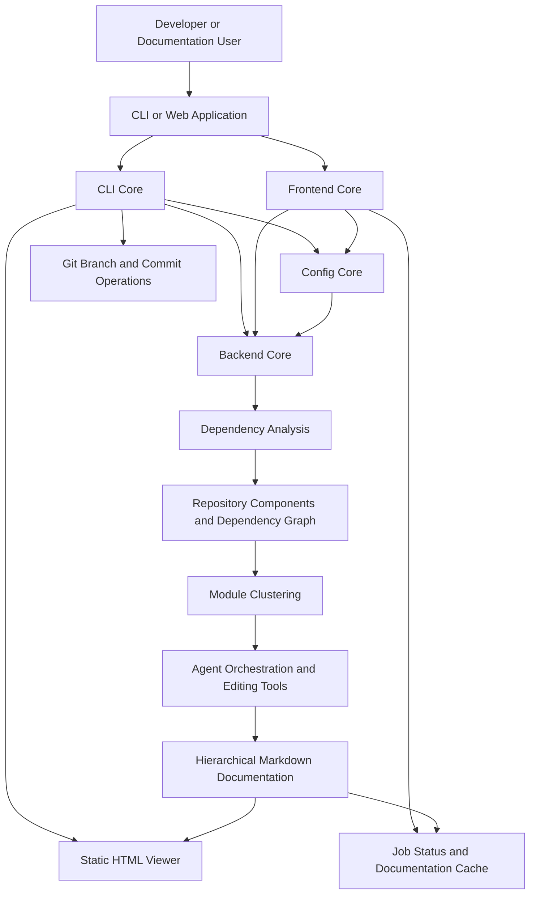
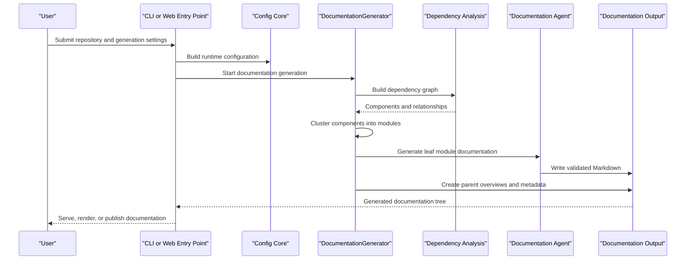
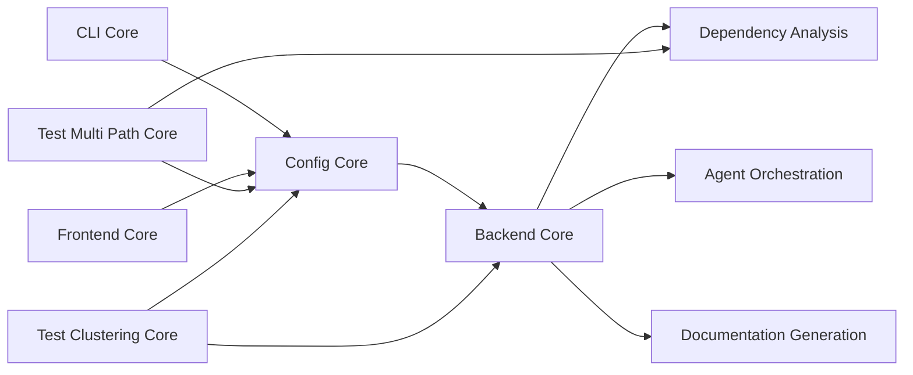

# CodeWiki

CodeWiki is an AI-assisted documentation generator for software repositories. It analyzes source code across supported languages, builds dependency relationships, clusters components into logical modules, and uses LLM-backed agents to produce hierarchical Markdown documentation. It provides both a terminal workflow and a web application workflow for generating, viewing, caching, and optionally publishing documentation.

Repository: [flamingo-stack/CodeWiki](https://github.com/flamingo-stack/CodeWiki)

## End-to-End Architecture



## Generation Lifecycle



## Repository Structure

```text
CodeWiki/
├── codewiki/
│   ├── cli/                 CLI configuration, generation, HTML, and Git workflows
│   └── src/
│       ├── be/              Backend analysis, orchestration, and documentation engine
│       ├── fe/              FastAPI web application and background job processing
│       └── config.py        Shared runtime configuration
├── test-multi-path/         Multi-source-path dependency analysis fixtures and tests
└── test_clustering/         Module clustering diagnostic and validation tests
```

## Core Modules

| Module | Location | Responsibility | Documentation |
|---|---|---|---|
| CLI Core | `codewiki/cli` | Provides the terminal-facing workflow, persistent configuration, generation-job tracking, progress reporting, HTML generation, and Git operations. | [CLI Core](cli-core.md) |
| Backend Core | `codewiki/src/be` | Implements repository analysis, dependency graph construction, module clustering, agent orchestration, and Markdown generation. | [Backend Core](backend-core.md) |
| Frontend Core | `codewiki/src/fe` | Provides the web-facing application for repository submission, asynchronous processing, status tracking, caching, and documentation delivery. | [Frontend Core](frontend-core.md) |
| Config Core | `codewiki/src/config.py` | Defines the shared `Config` runtime object for paths, LLM providers, generation limits, source roots, and agent instructions. | [Config Core](config-core.md) |
| Test Multi Path Core | `test-multi-path` | Validates analysis across a primary repository and additional source directories. | [Test Multi Path Core](test-multi-path-core.md) |
| Test Clustering Core | `test_clustering` | Validates live and offline module-clustering behavior, ID normalization, and response validation. | [Test Clustering Core](test-clustering-core.md) |

## Module Relationships



## Documentation References

### CLI Core

- [Configuration Management](configuration_management.md)
- [Job and Generation Models](job_and_generation_models.md)
- [Generation Pipeline](generation_pipeline.md)
- [CLI Utilities](cli_utilities.md)

### Backend Core

- [Agent Orchestration and Tools](agent-orchestration-and-tools/agent-orchestration-and-tools.md)
- [Dependency Analysis](dependency-analysis/dependency-analysis.md)
  - [Repository and Call Graph Analysis](dependency-analysis/repository_and_call_graph_analysis.md)
  - [Language Analyzers](dependency-analysis/language_analyzers.md)
  - [Dependency Graph Construction](dependency-analysis/dependency_graph_construction.md)
  - [Data Models and Utilities](dependency-analysis/data_models_and_utilities.md)
- [Documentation and Services](documentation-and-services/documentation-and-services.md)

### Frontend Core

- [Request Handling](frontend-core/request_handling/request_handling.md)
- [Job Processing](frontend-core/job_processing/job_processing.md)
- [GitHub Integration](frontend-core/github_integration/github_integration.md)
- [Configuration and Data Models](frontend-core/configuration_and_data_models/configuration_and_data_models.md)

### Test Modules

- [Test Fixtures](test_fixtures.md)
- [Test Runners](test_runners.md)
- [Live Clustering Tests](test-clustering-core/live_clustering_tests/live_clustering_tests.md)
- [Validation and Logic Tests](test-clustering-core/validation_and_logic_tests/validation_and_logic_tests.md)