# CodeWiki – Repository Overview

**Repository:** https://github.com/flamingo-stack/CodeWiki  
**Purpose:** AI-powered, multi-language repository documentation generator

---

## 1. Purpose of CodeWiki

CodeWiki is an AI-driven documentation engine that transforms source code repositories into structured, hierarchical, and navigable technical documentation.

It combines:

- ✅ Multi-language static analysis (AST-based parsing)
- ✅ Dependency graph construction
- ✅ LLM-powered module clustering
- ✅ Leaf-first hierarchical documentation generation
- ✅ CLI and Web interfaces
- ✅ Git-native and GitHub Pages integration

CodeWiki is designed to:

- Automatically document complex repositories
- Generate architecture-aware module documentation
- Maintain deterministic output structure
- Avoid LLM context overflow through staged generation
- Support multiple LLM providers (OpenAI-compatible, Anthropic-compatible, etc.)

It is structured as a layered system with clearly separated responsibilities.

---

# 2. End-to-End Architecture

Below is the complete architectural flow of CodeWiki.

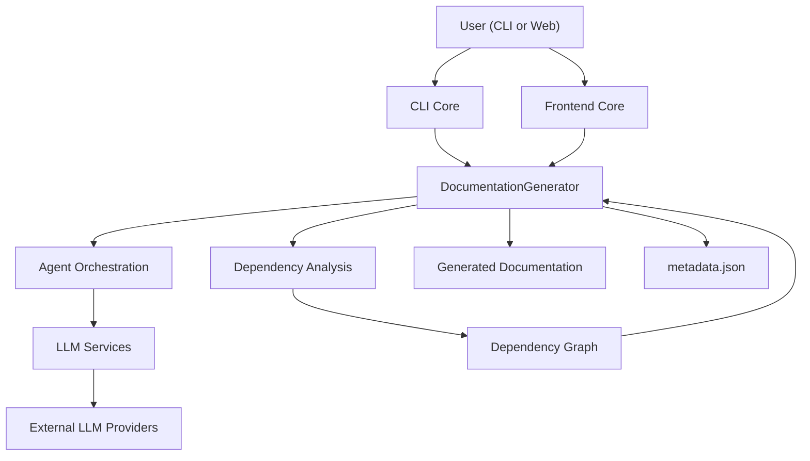

---

## Execution Stages (High-Level Pipeline)

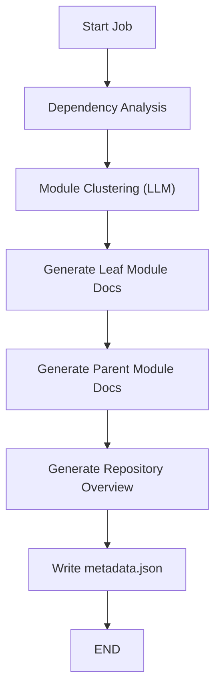

---

# 3. Repository Structure

```
CodeWiki/
│
├── codewiki/cli/                    → CLI Core
├── codewiki/src/be/                 → Backend Core
│   ├── dependency_analyzer/         → Dependency Analysis
│   ├── documentation_generator/     → Documentation Generation
│   ├── agent_orchestrator/          → Agent Orchestration
│   └── llm_services/                → LLM Services
│
├── codewiki/src/fe/                 → Frontend Core (FastAPI Web App)
└── codewiki/src/utils/              → Shared Utilities
```

Each major module is described below.

---

# 4. Core Modules

---

## 4.1 CLI Core

**Path:** `codewiki/cli`

The CLI Core is the command-line execution engine of CodeWiki. It orchestrates the full documentation lifecycle.

### Responsibilities

- Configuration management (secure keyring storage)
- Git integration (branch creation + commit)
- Job lifecycle tracking
- Multi-stage progress tracking
- HTML viewer generation (GitHub Pages)
- Delegation to backend modules

### Core Components

- `CLIDocumentationGenerator`
- `ConfigManager`
- `GitManager`
- `HTMLGenerator`
- `DocumentationJob`
- `ProgressTracker`
- `CLILogger`

### CLI-Orchestrated Flow

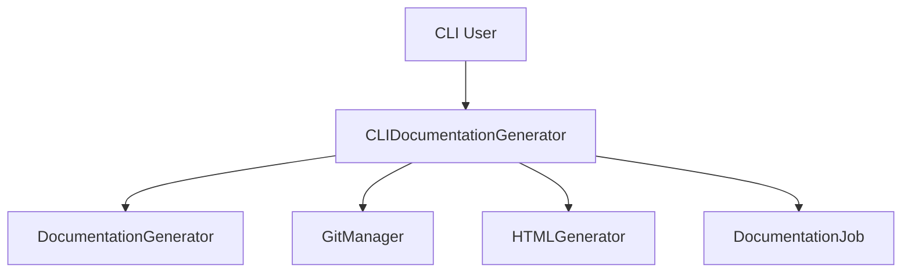

📖 See detailed module documentation:  
- `cli-core.md`

---

## 4.2 Dependency Analysis

**Path:** `codewiki/src/be/dependency_analyzer`

The structural intelligence layer of CodeWiki.

It converts raw source code into a normalized dependency graph.

### Responsibilities

- Multi-language AST parsing
- Component extraction (classes, functions, methods)
- Call graph resolution
- Cross-file and cross-repository dependency normalization
- Deterministic graph construction

### Supported Languages

- Python
- JavaScript
- TypeScript
- Java
- C#
- C
- C++
- PHP

### Architecture

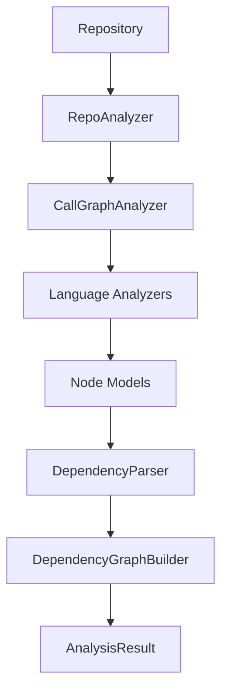

### Submodules

- Analysis Core
- Language Analyzers
- AST & Dependency Parsing
- Graph Building
- Analysis Models
- Core Domain Models

📖 See detailed documentation:
- `dependency-analysis.md`
- `analysis-core.md`
- `language-analyzers.md`
- `dependency-graph-building.md`

---

## 4.3 Documentation Generation

**Path:** `codewiki/src/be/documentation_generator`

The orchestration backbone of documentation creation.

### Responsibilities

- Build dependency graph
- Cluster modules using LLM
- Compute leaf-first processing order
- Generate module documentation
- Generate parent overviews
- Create metadata.json
- Apply synthetic module fallback

### Bottom-Up Processing Model

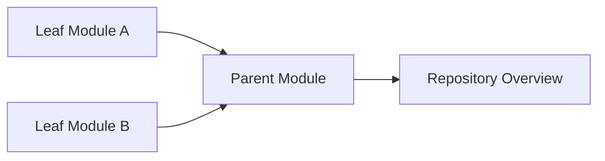

### Synthetic Module Safety

If clustering fails:

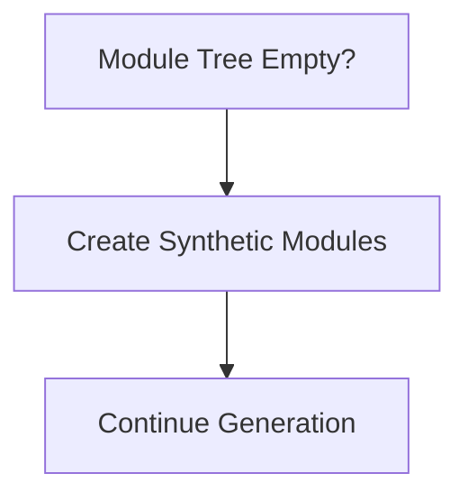

📖 See:
- `documentation-generation.md`

---

## 4.4 Agent Orchestration

**Path:** `codewiki/src/be/agent_orchestrator`

Runtime controller for AI-based documentation.

### Responsibilities

- Create complex or leaf agents
- Inject prompts
- Attach tools
- Enforce request limits
- Verify output files
- Persist module tree

### Agent Creation Strategy

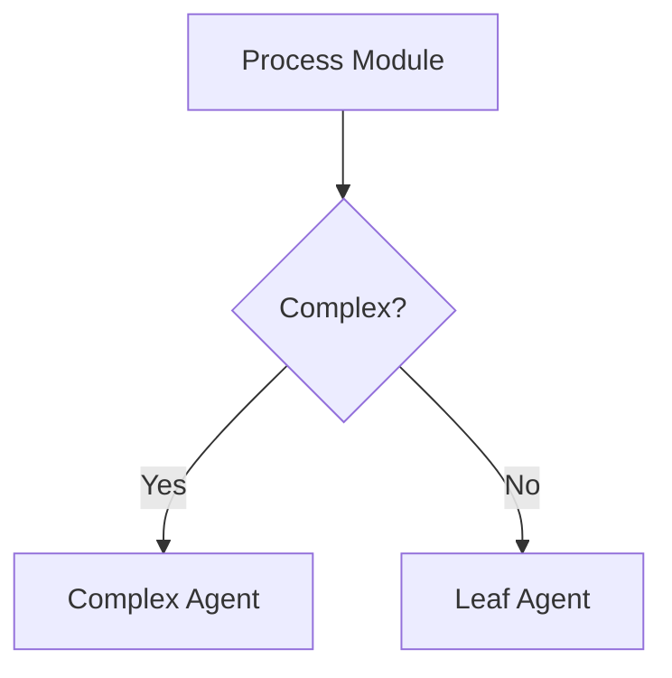

### Tooling

- `read_code_components_tool`
- `str_replace_editor_tool`
- `generate_sub_module_documentation_tool`

📖 See:
- `agent-orchestration.md`

---

## 4.5 LLM Services

**Path:** `codewiki/src/be/llm_services`

Abstraction layer for all LLM providers.

### Responsibilities

- Main / Cluster / Fallback model creation
- Dynamic token parameter handling
- Direct OpenAI SDK invocation
- Fallback chaining
- Request counting
- Multi-provider configuration

### Model Invocation Flow

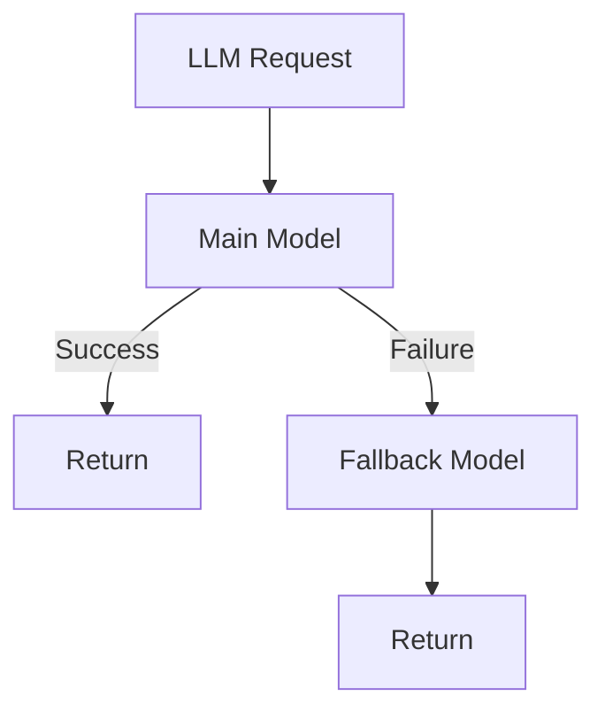

Supports:

- OpenAI
- Azure OpenAI
- Anthropic-compatible APIs
- Self-hosted OpenAI-compatible gateways

📖 See:
- `llm-services.md`

---

## 4.6 Frontend Core

**Path:** `codewiki/src/fe`

FastAPI-based web interface.

### Responsibilities

- Accept GitHub repository submissions
- Manage background jobs
- Cache generated documentation
- Serve rendered Markdown as HTML
- Track job state

### Web Flow

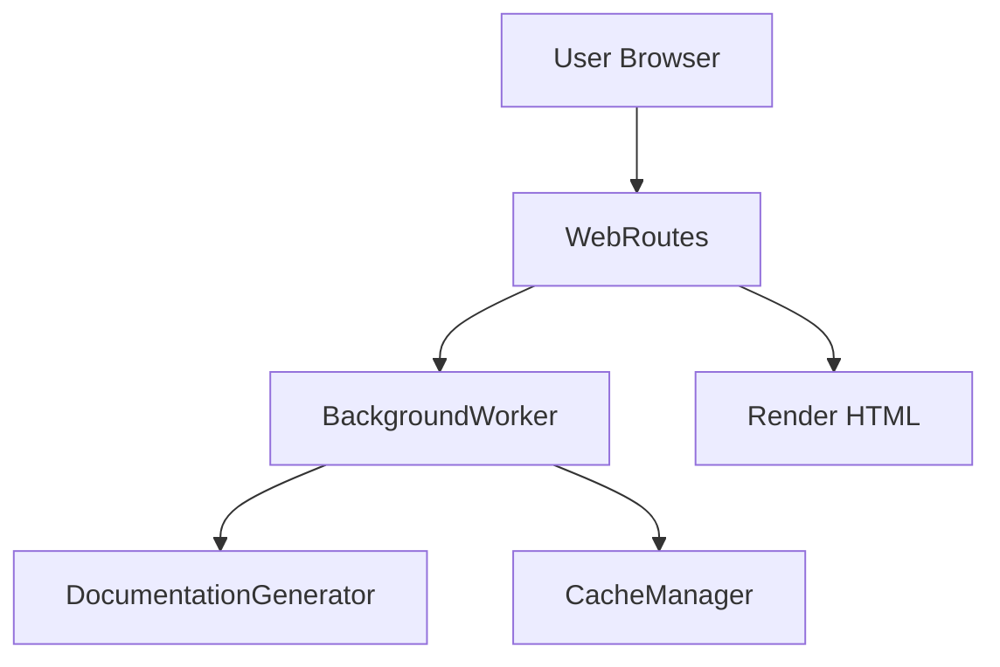

### Job Lifecycle

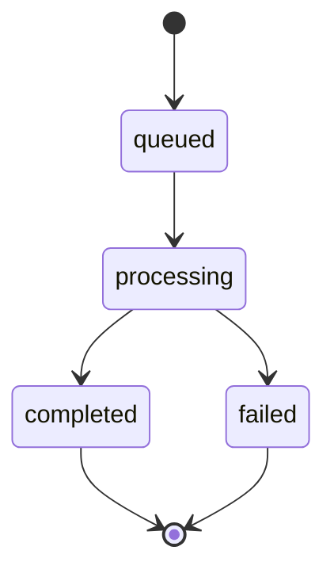

📖 See:
- `frontend-core.md`

---

## 4.7 Utils

**Path:** `codewiki/src/utils`

Foundational file management layer.

### Core Component

- `FileManager`

### Responsibilities

- Ensure directory creation
- Save/load JSON
- Save/load text
- Provide stable file I/O abstraction

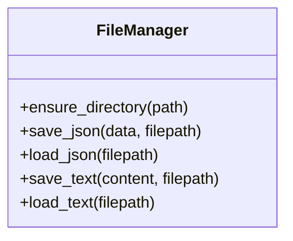

📖 See:
- `utils.md`

---

# 5. Cross-Module Interaction Model

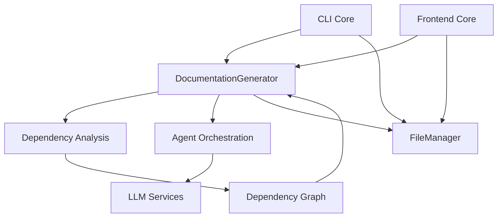

---

# 6. Design Principles

CodeWiki follows strict architectural principles:

- ✅ Separation of concerns
- ✅ Provider-agnostic LLM abstraction
- ✅ Deterministic output structure
- ✅ Bottom-up hierarchical summarization
- ✅ Synthetic fallback for safety
- ✅ Idempotent generation
- ✅ Explicit job lifecycle modeling
- ✅ Multi-language static analysis

---

# 7. Summary

CodeWiki is a full-stack AI documentation system that:

- Parses multi-language repositories
- Builds deterministic dependency graphs
- Uses LLMs to cluster and summarize modules
- Generates structured Markdown documentation
- Provides CLI and Web interfaces
- Supports Git-native workflows
- Remains provider-agnostic and scalable

Its layered architecture ensures:

- Clean separation between analysis, orchestration, generation, and presentation
- Scalable LLM usage without context overflow
- Deterministic, reproducible documentation artifacts
- Extensibility across languages and LLM providers

---

For source code, installation, and usage:

https://github.com/flamingo-stack/CodeWiki