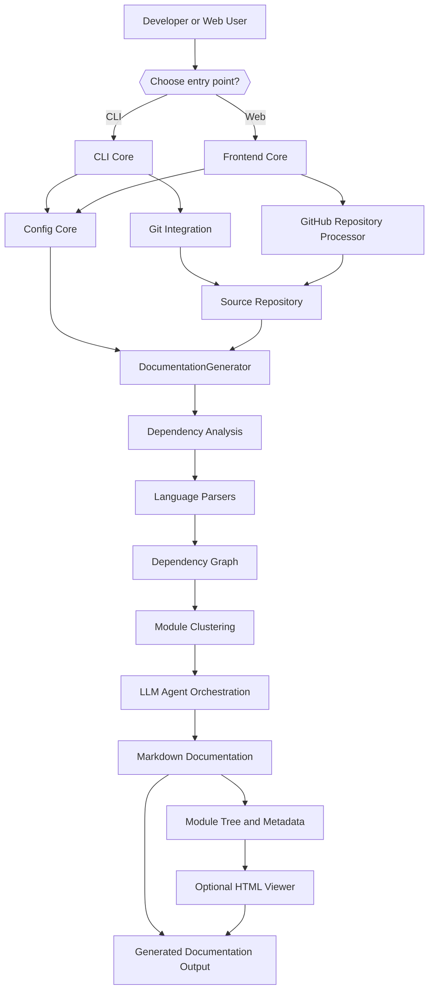
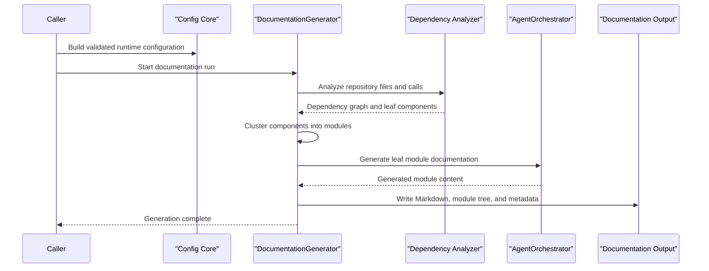
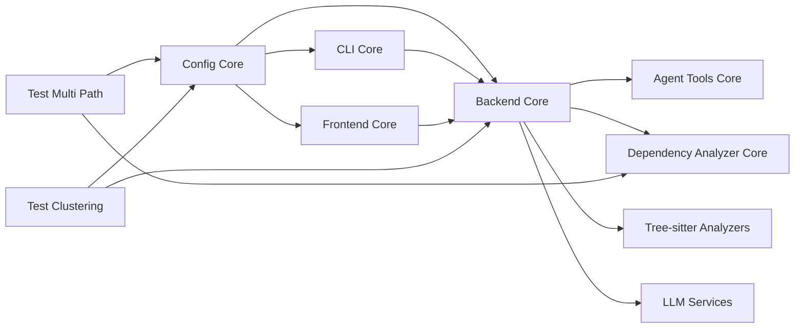

# CodeWiki Overview

CodeWiki is an AI-powered documentation generator for source repositories. It analyzes a codebase, builds dependency relationships, groups components into meaningful modules, and uses LLM-backed agents to produce structured Markdown documentation with navigation metadata and optional static HTML output.

The repository supports two primary entry points:

- **CLI workflow** for local repository documentation, configuration management, Git workflows, progress reporting, and static-site generation.
- **Web workflow** for submitting GitHub repositories, queueing asynchronous generation jobs, caching results, and serving generated documentation.

## End-to-End Architecture

## Documentation Generation Flow

## Core Modules

| Module | Purpose | Source |
|---|---|---|
| [CLI Core](cli-core.md) | Command-line orchestration, local configuration, Git integration, terminal progress, and static HTML generation. | [`codewiki/cli`](https://github.com/flamingo-stack/CodeWiki/tree/main/codewiki/cli) |
| [Backend Core](backend-core.md) | Repository analysis, dependency-graph construction, module clustering, LLM agent orchestration, and documentation generation. | [`codewiki/src/be`](https://github.com/flamingo-stack/CodeWiki/tree/main/codewiki/src/be) |
| [Frontend Core](frontend-core.md) | FastAPI web application, repository submission, background job processing, caching, and documentation serving. | [`codewiki/src/fe`](https://github.com/flamingo-stack/CodeWiki/tree/main/codewiki/src/fe) |
| [Config Core](config-core.md) | Shared runtime `Config` model for source paths, output locations, provider settings, token limits, and agent instructions. | [`codewiki/src`](https://github.com/flamingo-stack/CodeWiki/tree/main/codewiki/src) |
| [Test Multi Path](test-multi-path.md) | Fixtures and executable checks for analysis across multiple source roots. | [`test-multi-path`](https://github.com/flamingo-stack/CodeWiki/tree/main/test-multi-path) |
| [Test Clustering](test-clustering.md) | Diagnostic and validation scripts for LLM-based module clustering and component-ID normalization. | [`test_clustering`](https://github.com/flamingo-stack/CodeWiki/tree/main/test_clustering) |

## Module Relationships

## Backend Documentation References

The Backend Core module is decomposed into focused subsystems:

- [Agent Tools Core](backend-core/agent-tools-core/agent-tools-core.md) — controlled repository inspection and documentation editing tools.
- [Dependency Analyzer Core](backend-core/dependency-analyzer-core/dependency-analyzer-core.md) — file discovery, AST parsing, call analysis, and graph construction.
- [Tree Sitter Analyzers](backend-core/tree-sitter-analyzers/tree-sitter-analyzers.md) — language support for C, C++, C#, Java, JavaScript, TypeScript, PHP, and Python.
- [Dependency Analyzer Models](backend-core/dependency-analyzer-models/dependency-analyzer-models.md) — repository, node, relationship, and analysis-result contracts.
- [Documentation Generator](backend-core/documentation-generator/documentation-generator.md) — top-level pipeline coordination and documentation output.
- [LLM Services](backend-core/llm-services/llm-services.md) — LLM model selection, request counting, and fallback handling.
- [Logging Config](backend-core/logging-config/logging-config.md) — shared colorized logging support.

## CLI Documentation References

- [Generation](cli-core/generation/generation.md) — CLI adapter for staged documentation generation.
- [Configuration](cli-core/configuration/configuration.md) — persisted settings, keyring-backed credentials, and agent instructions.
- [Job Models](cli-core/job_models/job_models.md) — generation job status, statistics, and LLM configuration models.
- [Git Integration](cli-core/git_integration/git_integration.md) — clean-tree checks, branch creation, commits, and remote URL handling.
- [HTML Generation](cli-core/html_generation/html_generation.md) — static documentation viewer generation.
- [Utils](cli-core/utils/utils.md) — terminal logging and progress tracking.

## Summary

CodeWiki separates user-facing workflows from its reusable generation engine. CLI and web layers construct a shared runtime configuration and delegate to Backend Core, which transforms source code into dependency-aware, module-oriented documentation. Test modules provide targeted coverage for multi-root analysis and the LLM-driven clustering stage.