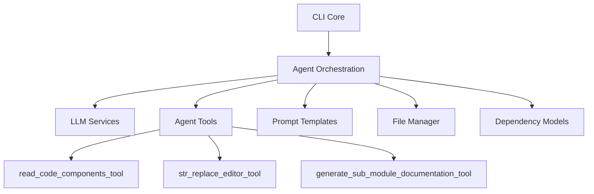
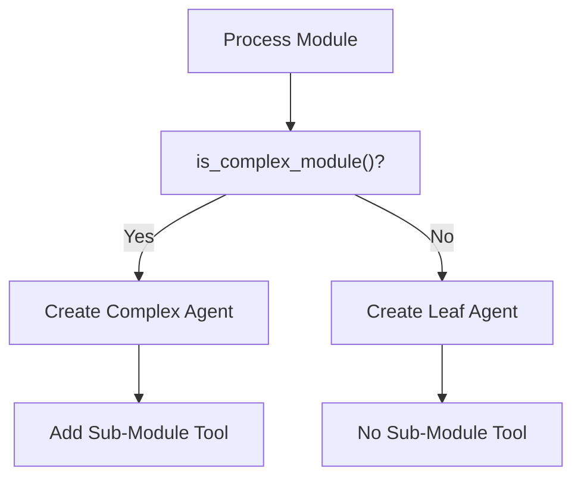
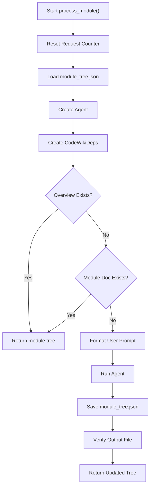
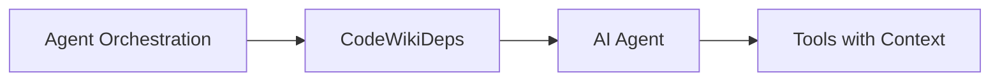
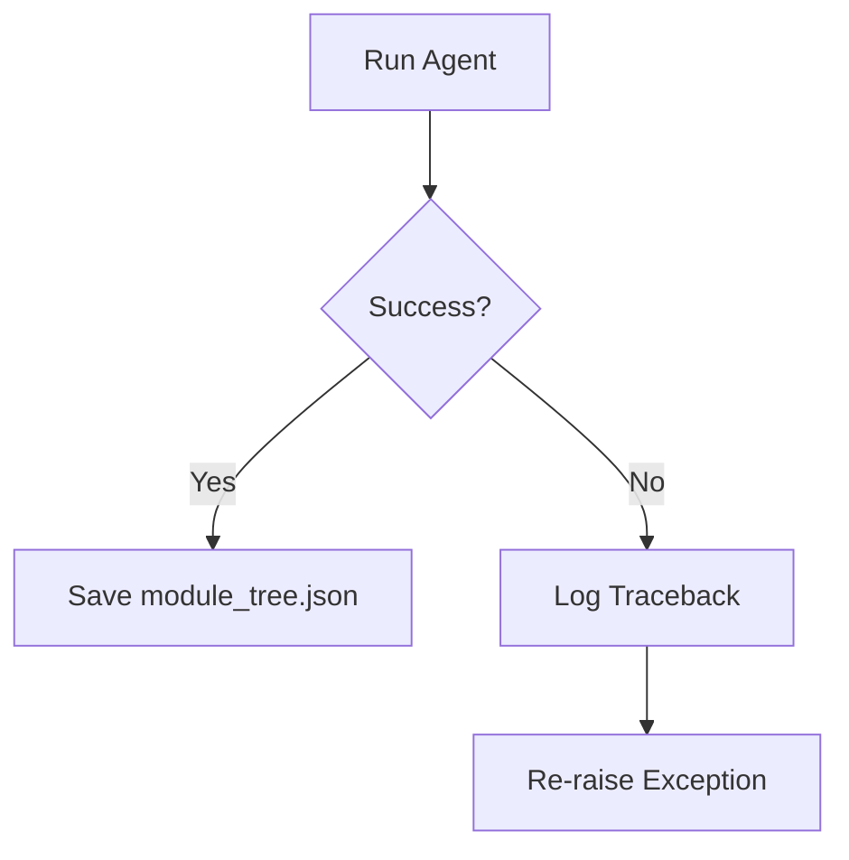
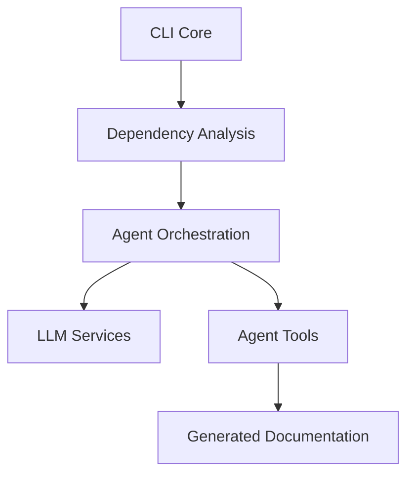

# Agent Orchestration

The **Agent Orchestration** module is responsible for coordinating AI-driven documentation generation across the CodeWiki platform. It acts as the central runtime controller that instantiates agents, configures tools, manages execution limits, injects prompts, and ensures documentation artifacts are written correctly to the documentation workspace.

At its core, the module encapsulates the lifecycle of an AI agent per module being documented, delegating analysis, generation, and persistence responsibilities to specialized modules while maintaining execution safety and structure.

---

## 1. Purpose and Responsibilities

The Agent Orchestration module provides:

- ✅ Dynamic AI agent creation (complex vs leaf modules)
- ✅ Tool wiring (code reading, file writing, sub-module generation)
- ✅ Prompt formatting and injection
- ✅ Usage limit enforcement and retry configuration
- ✅ Module tree loading and persistence
- ✅ Execution logging and diagnostics
- ✅ Safeguards against duplicate documentation generation

It does **not** perform dependency analysis or documentation generation itself. Instead, it coordinates:

- [Dependency Analysis](dependency-analysis/dependency-analysis.md)
- [Documentation Generation](documentation-generation/documentation-generation.md)
- [LLM Services](llm-services/llm-services.md)

---

## 2. Core Component

### AgentOrchestrator

**Class:** `CodeWiki.codewiki.src.be.agent_orchestrator.AgentOrchestrator`

This class is the central runtime controller for AI documentation generation.

### Key Responsibilities

| Responsibility | Description |
|---------------|-------------|
| Agent Creation | Creates agents based on module complexity |
| Tool Configuration | Registers tools such as code reading and file editing |
| Prompt Injection | Applies system and user prompts with custom instructions |
| Usage Control | Applies request limits and retry logic |
| Execution Control | Runs the agent asynchronously |
| State Persistence | Saves updated module tree after execution |

---

## 3. High-Level Architecture

### Explanation

- **CLI Core** triggers documentation jobs.
- **Agent Orchestration** configures and runs the AI agent.
- **LLM Services** provide fallback models and usage tracking.
- **Agent Tools** allow the agent to interact with code and the file system.
- **Prompt Templates** generate structured prompts.
- **File Manager** persists `module_tree.json` updates.

---

## 4. Agent Creation Strategy

Agent behavior depends on module complexity.

### Complexity Decision

The function `is_complex_module()` determines whether:

- The module contains nested sub-modules
- The module requires recursive documentation generation

### Decision Flow

### Complex Agent

Includes tools:
- `read_code_components_tool`
- `str_replace_editor_tool`
- `generate_sub_module_documentation_tool`

Uses: `format_system_prompt()`

### Leaf Agent

Includes tools:
- `read_code_components_tool`
- `str_replace_editor_tool`

Uses: `format_leaf_system_prompt()`

Both use:

- Fallback LLM models
- `retries=3`
- Usage limits (`request_limit=1000`)

---

## 5. Execution Lifecycle

The `process_module()` method defines the complete lifecycle.

### Important Safeguards

1. ✅ Skips generation if overview already exists
2. ✅ Skips generation if module file already exists
3. ✅ Applies usage limits (1000 requests max)
4. ✅ Verifies documentation file was created
5. ✅ Logs execution diagnostics

---

## 6. Dependency Injection via CodeWikiDeps

The orchestrator creates a `CodeWikiDeps` object which provides runtime context to the agent.

### Contains

- Absolute documentation path
- Repository path
- Module tree structure
- Registry for generated modules
- Current depth and max depth
- Configuration
- Custom instructions

### Dependency Flow

This ensures the agent operates within strict boundaries and cannot access arbitrary resources.

---

## 7. Prompt Construction

Prompt generation is separated from orchestration logic.

### Prompt Types

| Type | Used For |
|------|----------|
| `format_system_prompt()` | Complex modules |
| `format_leaf_system_prompt()` | Leaf modules |
| `format_user_prompt()` | Per-module execution |

Custom instructions (if configured) are appended automatically.

This keeps orchestration logic clean while ensuring consistent prompt structure.

---

## 8. Interaction with Other Modules

### With Dependency Analysis

Agent Orchestration receives analyzed components and nodes from:

- [Dependency Analysis](dependency-analysis/dependency-analysis.md)

It does not compute call graphs or parse ASTs itself.

---

### With Documentation Generation

The AI agent produces documentation content which is written via the file editing tool.

- [Documentation Generation](documentation-generation/documentation-generation.md)

---

### With LLM Services

The orchestrator relies on:

- Fallback model creation
- Request counter resets
- Usage limit enforcement

See: [LLM Services](llm-services/llm-services.md)

---

## 9. Error Handling Strategy

Error handling is defensive and explicit:

- All agent execution wrapped in `try/except`
- Full traceback logged
- File existence verified after generation
- Directory contents logged if output missing

### Failure Flow

This prevents silent failures and improves debugging reliability.

---

## 10. Design Principles

### 1. Separation of Concerns
- Orchestration ≠ Analysis
- Orchestration ≠ Generation
- Orchestration = Coordination

### 2. Deterministic File Structure
Documentation paths are hierarchical and verified before writing.

### 3. Safe LLM Execution
- Retry limits
- Request caps
- Controlled tool access

### 4. Idempotency
If documentation already exists, generation is skipped.

---

## 11. End-to-End Flow Across the System

### Step-by-Step

1. CLI triggers documentation job
2. Dependency Analysis extracts components
3. Agent Orchestration creates AI agent
4. Agent invokes tools to read/write files
5. Documentation saved to docs directory
6. Module tree updated

---

## 12. Summary

The **Agent Orchestration** module is the runtime control layer of CodeWiki’s AI documentation engine.

It ensures:

- Correct agent configuration
- Controlled execution
- Proper prompt formatting
- Safe tool usage
- Deterministic output persistence
- Robust logging and diagnostics

Without this module, the system would lack structure, safety boundaries, and execution coordination between analysis, generation, and persistence layers.

It is the operational backbone that transforms analyzed code components into structured, reproducible documentation artifacts.