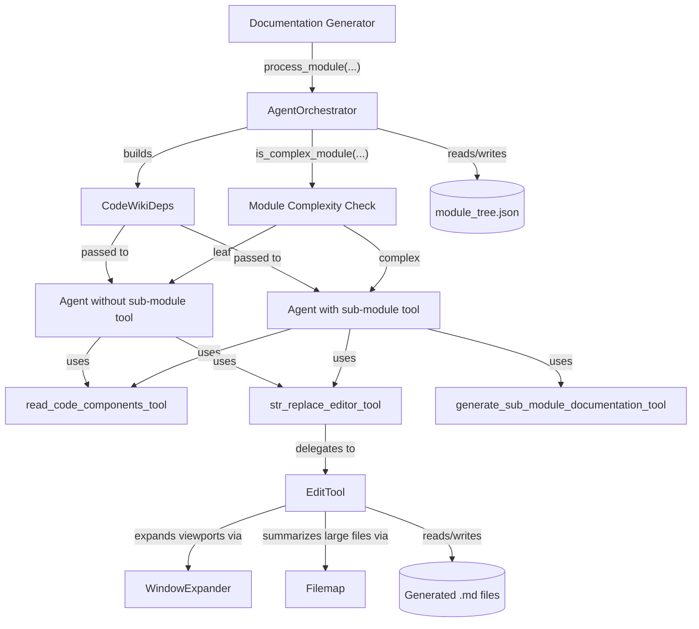
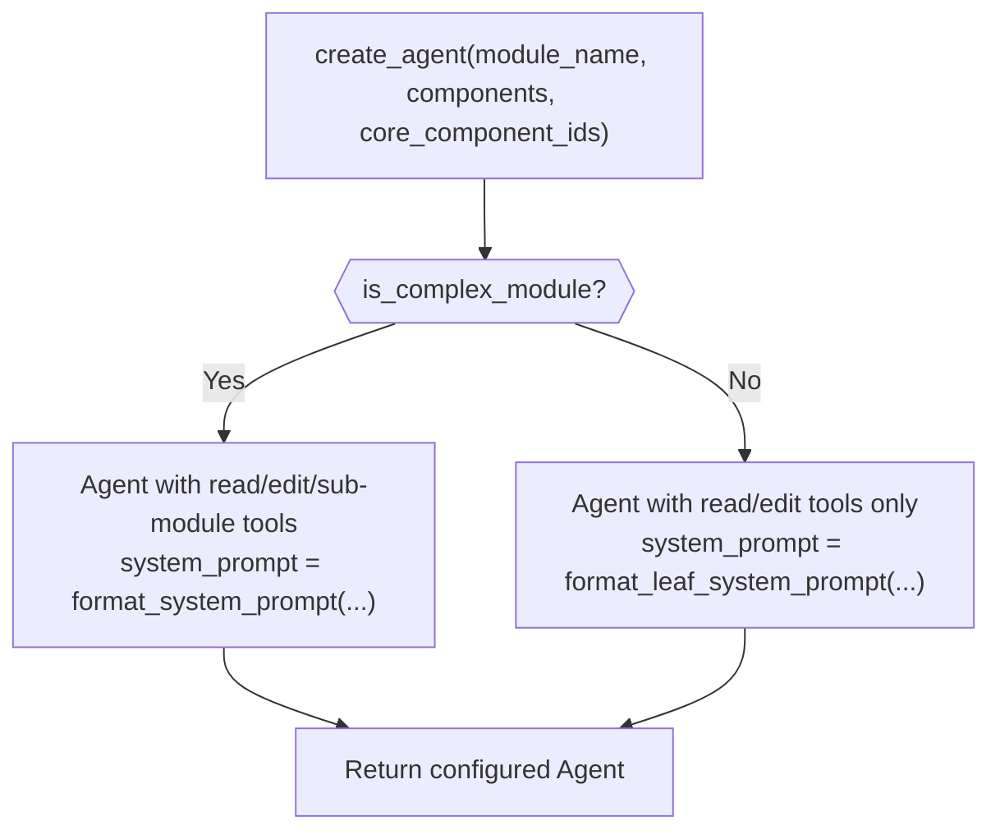
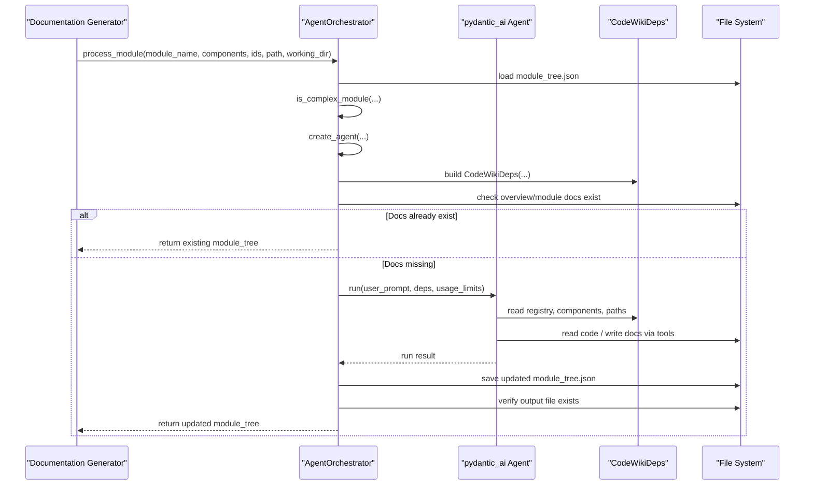
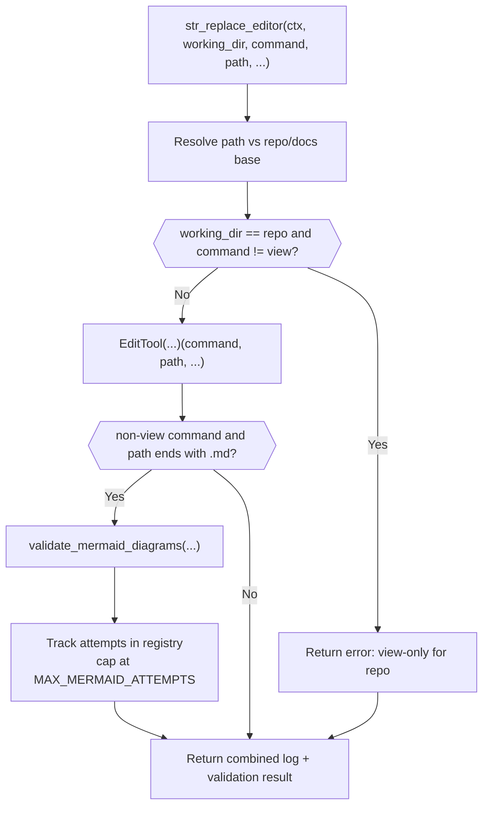

# Agent Orchestration And Tools

## Introduction

The Agent Orchestration And Tools module is the execution engine that drives CodeWiki's AI-powered documentation generation. It is responsible for:

- Selecting and configuring the correct `pydantic_ai` `Agent` for each module discovered in a repository, based on module complexity.
- Wiring the agent to the tools it needs to explore source code and read/write documentation files.
- Carrying shared, per-module state (paths, component registry, module tree position, LLM configuration) through a single dependency object that every tool call receives.
- Running the agent against a formatted prompt, persisting the resulting documentation file(s), and updating the shared module tree so downstream modules and sub-modules can be processed consistently.

This module sits directly beneath the backend's top-level orchestration surface. The dependency-analysis pipeline (see [Dependency Analysis](dependency-analysis/dependency-analysis.md)) discovers modules, components, and their relationships in a target repository; the [Documentation And Services](documentation-and-services/documentation-and-services.md) module coordinates the overall generation run and wraps the LLM clients. Agent Orchestration And Tools is the layer that actually invokes the LLM agent for a single module and gives it the tools to read code and write docs.

## Architecture Overview

## AgentOrchestrator

`AgentOrchestrator` (`codewiki/src/be/agent_orchestrator.py`) is the entry point of this module. It is constructed once per documentation run with a `Config` object and:

- Builds a fallback LLM chain via `create_fallback_models(config)` (see [Documentation And Services](documentation-and-services/documentation-and-services.md) for `CountingFallbackModel`, which wraps each model call with request counting).
- Extracts any custom prompt instructions configured for the run (`config.get_prompt_addition()`).

### Agent creation

`create_agent(module_name, components, core_component_ids)` decides which agent configuration to build based on `is_complex_module(components, core_component_ids)`:

- **Complex modules** (modules that will be recursively broken down into sub-modules) get an agent with three tools: `read_code_components_tool`, `str_replace_editor_tool`, and `generate_sub_module_documentation_tool`. Its system prompt is produced by `format_system_prompt`.
- **Leaf modules** (modules documented directly, without further decomposition) get an agent with just `read_code_components_tool` and `str_replace_editor_tool`. Its system prompt is produced by `format_leaf_system_prompt`.

Both agent types use the same fallback model chain, `deps_type=CodeWikiDeps`, and `retries=3` (a fork-specific patch to avoid premature "Tool exceeded max retries" failures).

### Module processing pipeline

`process_module(module_name, components, core_component_ids, module_path, working_dir)` drives the end-to-end generation of documentation for a single module:

1. Resets the per-module LLM request counter (`reset_request_counter`).
2. Loads the shared `module_tree.json` from the base docs directory (always resolved from `self.config.docs_dir`, independent of any nested `working_dir`).
3. Determines module complexity and builds the appropriate agent via `create_agent`.
4. Constructs a `CodeWikiDeps` instance carrying all state the tools need (absolute paths, component registry, current position in the module tree, depth limits, configuration, and custom instructions).
5. Skips generation if either an overview doc (`OVERVIEW_FILENAME`) or the module's own `{module_name}.md` file already exists at `working_dir` — this makes the pipeline resumable/idempotent.
6. Formats the user prompt via `format_user_prompt` (module name, core component ids, components, and current module tree) and runs the agent with `UsageLimits(request_limit=1000)` to bound total tool/LLM calls.
7. On success, persists the (possibly agent-updated) module tree back to `module_tree.json`, verifies the expected output file exists on disk, and logs diagnostics if it does not.
8. On failure, logs the exception and traceback and re-raises so the caller (the documentation generation pipeline) can handle it.

## CodeWikiDeps

`CodeWikiDeps` (`codewiki/src/be/agent_tools/deps.py`) is a plain dataclass that acts as the dependency-injection container passed to every agent tool call (`RunContext[CodeWikiDeps]`). It bundles all the context a tool needs without requiring global state:

| Field | Purpose |
|---|---|
| `absolute_docs_path` | Absolute path to the (possibly nested) working directory for the module's generated docs. |
| `absolute_repo_path` | Absolute path to the source repository being documented. |
| `registry` | A shared, mutable dict used for cross-call state (e.g. file edit history, mermaid-validation retry counters). |
| `components` | Mapping of component id to `Node` (see [Dependency Analysis](dependency-analysis/dependency-analysis.md) for `Node`) for the current module. |
| `path_to_current_module` | The module's location within the overall module tree hierarchy. |
| `current_module_name` | Name of the module currently being documented. |
| `module_tree` | The full module tree structure loaded from `module_tree.json`. |
| `max_depth` / `current_depth` | Bounds used to prevent unbounded recursive sub-module decomposition. |
| `config` | The `Config` object holding LLM and run configuration. |
| `custom_instructions` | Optional extra prompt instructions appended to system prompts. |

This object is created fresh per `process_module` call and flows into every tool invocation (`str_replace_editor`, `read_code_components`, `generate_sub_module_documentation`) via `ctx.deps`.

## Agent Tools: str_replace_editor

`codewiki/src/be/agent_tools/str_replace_editor.py` implements the file-editing tool exposed to agents, adapted from the SWE-agent open-source editing tool. It has two working directories, controlled by the `working_dir` parameter passed to the tool:

- `repo`: read-only access to the source repository (`ctx.deps.absolute_repo_path`); only the `view` command is permitted here.
- `docs`: read/write access to the generated documentation tree (`ctx.deps.absolute_docs_path`); all commands are permitted here.

### Core classes

- **`EditTool`** — the stateful implementation backing the tool. It supports:
  - `view`: displays a file (optionally a line range) or lists a directory up to two levels deep.
  - `create`: creates a new file (auto-creating parent directories as needed for hierarchical doc output), refusing to overwrite existing files.
  - `str_replace`: replaces a unique occurrence of `old_str` with `new_str`, refusing ambiguous or missing matches.
  - `insert`: inserts text at a given line number.
  - `undo_edit`: reverts the most recent edit for a file, using a per-file edit history persisted in `CodeWikiDeps.registry`.

  It also optionally integrates `flake8` linting (currently disabled via `USE_LINTER`) to warn the agent about syntax issues introduced by an edit, filtering out pre-existing errors so only new issues are reported.

- **`WindowExpander`** — given a requested line range, expands the viewport outward (up to a configurable maximum) to align with natural code boundaries (blank lines, function/class definitions, decorators for Python) so the agent sees complete logical units rather than arbitrary line cuts.

- **`Filemap`** — for large Python files, uses `tree-sitter` to produce an abbreviated view that elides long function bodies, helping keep tool output within response-size limits (`MAX_RESPONSE_LEN`). This path is currently gated behind `USE_FILEMAP` (disabled by default).

### The `str_replace_editor` tool function

The async `str_replace_editor(ctx, working_dir, command, path, ...)` function is the actual pydantic_ai tool entry point (exposed as `str_replace_editor_tool`). It:

1. Accepts either `path` or `file` (some models prefer the latter) as the target file.
2. Normalizes leading-slash paths to avoid `pathlib`'s absolute-path override behavior discarding the base directory.
3. Resolves the absolute path relative to either `absolute_repo_path` or `absolute_docs_path` depending on `working_dir`.
4. Rejects any non-`view` command when `working_dir` is `repo`, enforcing read-only access to source code.
5. Delegates to an `EditTool` instance (constructed with the shared `registry` so edit history persists across calls) and returns its accumulated log messages.
6. For non-`view` commands on `.md` files, additionally runs Mermaid diagram validation on the written file, tracking failed-attempt counts per path in `ctx.deps.registry` and capping retries at `MAX_MERMAID_ATTEMPTS` (3) to avoid infinite fix-diagram loops.

## Other Agent Tools (Referenced, Not Defined In This Module)

`AgentOrchestrator` also wires in two additional tools whose implementations live outside this module's core components but are essential to the agent's capabilities:

- `read_code_components_tool` — allows the agent to fetch the source code of specific components by id, used to gather context before writing documentation.
- `generate_sub_module_documentation_tool` — available only to agents on complex modules; lets the agent recursively trigger documentation generation for sub-modules it identifies, feeding back into the same `AgentOrchestrator`-driven pipeline and the shared `module_tree.json`.

Together with `str_replace_editor_tool`, these three tools form the complete toolset an agent can use while documenting a module: read source code, (for complex modules) delegate to sub-module generation, and write/edit the resulting Markdown files.

## How This Module Fits Into The System

- **Upstream**: The dependency-analysis pipeline (see [Dependency Analysis](dependency-analysis/dependency-analysis.md)) produces the `Node`/`Repository`/`AnalysisResult` structures and module groupings that are fed into `AgentOrchestrator.process_module` as `components` and `core_component_ids`.
- **Peer**: The [Documentation And Services](documentation-and-services/documentation-and-services.md) module's `DocumentationGenerator` coordinates the overall multi-module run and supplies the fallback LLM chain (`CountingFallbackModel`) that `AgentOrchestrator` uses to build agents.
- **Downstream**: The tools in this module (`str_replace_editor`, `read_code_components`, `generate_sub_module_documentation`) are the only way agents interact with the file system and the module tree, ensuring all writes are auditable (via `EditTool`'s history) and diagrams are validated before being considered final.

## Summary

The Agent Orchestration And Tools module is a small but critical layer: it turns repository analysis output into concrete, validated documentation files by configuring the right agent for each module, giving it a consistent dependency context (`CodeWikiDeps`), and exposing a safe, auditable file-editing tool (`EditTool`/`str_replace_editor`) that respects the read-only/read-write boundary between source repository and generated docs.
