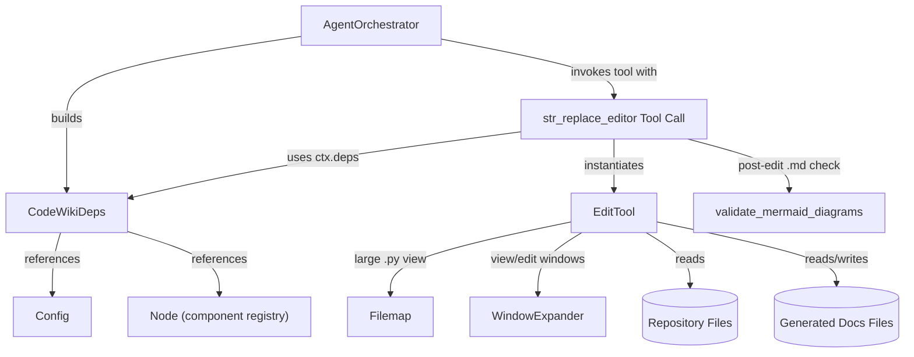
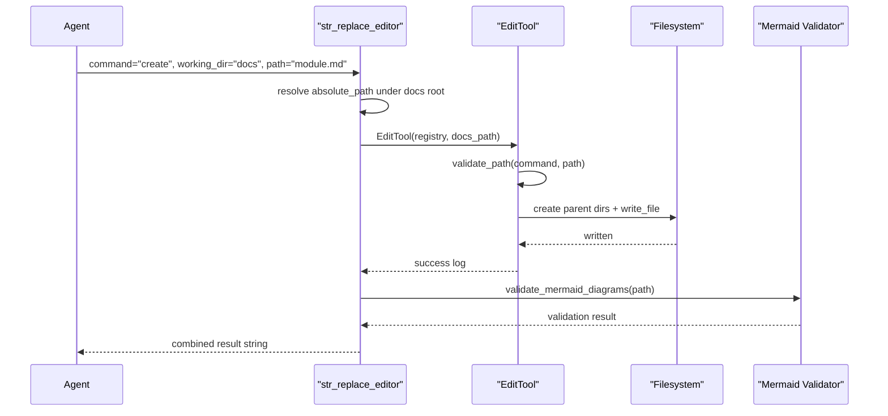
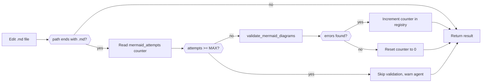

# Agent Tools Core

## Purpose

The Agent Tools Core module provides the foundational toolset used by the CodeWiki documentation-generation agent to interact with the filesystem during automated documentation authoring. It defines:

- **`CodeWikiDeps`** — the shared dependency container passed to every agent tool invocation, carrying paths, the component registry, module-tree position, and LLM configuration.
- **`EditTool`** (and its helpers `Filemap`, `WindowExpander`) — a filesystem editor that lets the documentation agent view source/repository files and view, create, and edit documentation files, mirroring the SWE-agent `str_replace_editor` tool contract used by Anthropic-compatible agent frameworks.

This module is a direct child of [Backend Core](../backend-core.md) and is consumed by the [Agent Orchestrator](../backend-core.md) during the documentation generation pipeline orchestrated for each module in the [Dependency Analyzer Core](../dependency-analyzer-core/dependency-analyzer-core.md) output tree.

## Architecture Overview

The module bridges the AI agent's tool-calling layer (built on `pydantic_ai`) and the local filesystem, enforcing safety constraints (absolute paths only, read-only access to the source repository, write access limited to the docs output directory) so that the agent can safely author markdown documentation while inspecting source code.

## Core Components

### `CodeWikiDeps` — Agent Dependency Container

`CodeWikiDeps` (in `codewiki/src/be/agent_tools/deps.py`) is a `dataclass` that bundles everything a tool call needs to operate correctly within the current documentation generation run:

| Field | Purpose |
|---|---|
| `absolute_docs_path` | Root directory where generated documentation is written |
| `absolute_repo_path` | Root directory of the analyzed source repository (read-only) |
| `registry` | Shared mutable dict used for cross-call state (e.g., file edit history, mermaid validation retry counters) |
| `components` | Mapping of component identifiers to `Node` objects from the dependency graph |
| `path_to_current_module` / `current_module_name` | Position of the module currently being documented within the module tree |
| `module_tree` | The full hierarchical module tree being documented |
| `max_depth` / `current_depth` | Recursion bounds for nested sub-module documentation generation |
| `config` | LLM configuration (`Config`) used to drive model behavior |
| `custom_instructions` | Optional user-supplied instructions injected into the agent's prompt |

This container is instantiated once per documentation job/module by the orchestrator and passed as `ctx.deps` into every `pydantic_ai.RunContext` during a tool call, giving each tool a consistent view of the run's state without global variables.

### `EditTool`, `Filemap`, and `WindowExpander` — Filesystem Editor

The `str_replace_editor` tool (in `codewiki/src/be/agent_tools/str_replace_editor.py`) is adapted from the SWE-agent reference implementation and exposes five commands to the agent:

- **`view`** — Displays a file (with `cat -n`-style line numbers) or lists a directory up to two levels deep.
- **`create`** — Creates a new file, auto-creating any missing parent directories (used for hierarchical docs output).
- **`str_replace`** — Replaces a unique occurrence of `old_str` with `new_str` in a file; rejects ambiguous or missing matches.
- **`insert`** — Inserts text at a specific line number.
- **`undo_edit`** — Reverts the most recent edit, using a per-file history stack persisted in `CodeWikiDeps.registry`.

**Safety model:** The tool enforces `working_dir` semantics — when `working_dir="repo"`, only `view` is permitted (the source repository is never mutated); when `working_dir="docs"`, all commands are available against the documentation output tree. All paths must resolve to absolute paths under the appropriate root, and a leading-slash stripping fix prevents `Path` composition bugs where an absolute-looking relative path could escape the intended docs root.

#### Supporting Helper Classes

- **`Filemap`**: Uses `tree-sitter` to parse Python source and elide long function bodies (`>= 5` lines) when a `.py` file exceeds the response length limit, producing a condensed "filemap" view so the agent can navigate large files without exhausting context. This is currently gated behind the `USE_FILEMAP` flag.
- **`WindowExpander`**: Expands a requested `view_range` or edit snippet window outward to natural code boundaries (blank lines, `def`/`class`/decorator lines for Python) so that partial views don't cut a function or class definition in half. Expansion size is controlled by `MAX_WINDOW_EXPANSION_VIEW` / `MAX_WINDOW_EXPANSION_EDIT_CONFIRM` (both set to `0` by default, effectively disabling automatic expansion in the current configuration).

### Mermaid Validation Hook

After any non-`view` command that touches a `.md` file under `working_dir="docs"`, the tool asynchronously calls `validate_mermaid_diagrams` to catch malformed Mermaid diagrams as soon as the agent writes them. A per-file retry counter is stored in `ctx.deps.registry` (`mermaid_attempts:{path}`) to cap validation retries at `MAX_MERMAID_ATTEMPTS = 3`, preventing infinite fix-and-retry loops when the agent cannot resolve a diagram syntax error.

### Optional Linting Integration

The module includes `flake8`-based linting utilities (`Flake8Error`, `format_flake8_output`, `flake8`) that can compare pre- and post-edit lint output for Python files and surface newly-introduced errors to the agent after a `str_replace` edit. This is gated by the `USE_LINTER` flag and is primarily relevant when the agent edits Python source rather than markdown documentation.

## Integration with the Wider System

- **[Backend Core](../backend-core.md)**: The parent module's `AgentOrchestrator` constructs `CodeWikiDeps` for each documentation job and registers the `str_replace_editor_tool` (a `pydantic_ai.Tool`) with the agent, along with the component registry produced by the [Dependency Analyzer Core](../dependency-analyzer-core/dependency-analyzer-core.md) and its supporting [Dependency Analyzer Models](../dependency-analyzer-models/dependency-analyzer-models.md) (`Node`, `Repository`, etc.).
- **Configuration**: `CodeWikiDeps.config` is populated from the top-level `Config` object (see [Config Core](../../config-core.md)), which supplies LLM provider settings used throughout the generation pipeline.
- **Documentation Output**: Every markdown file produced by the [Documentation Generator](../documentation-generator/documentation-generator.md) subsystem is ultimately written to disk via `EditTool.create_file` / `EditTool.str_replace`, making this module the final write path for all agent-authored documentation.

## Key Design Considerations

1. **Read-only source, writable docs**: The `working_dir` parameter is the sole gate that separates safe read-only inspection of the analyzed repository from the mutable documentation workspace, preventing the agent from accidentally modifying source code.
2. **Absolute path enforcement**: All paths passed to `EditTool` must be absolute, with an explicit fix to prevent `pathlib.Path`'s "absolute path discards base" behavior from silently escaping the intended root directory.
3. **Bounded retries for generated content**: Both the mermaid-validation retry counter and the lint-comparison logic are designed to give the agent actionable feedback without entering unbounded correction loops.
4. **Stateful history via registry**: Rather than relying on in-process instance state (which would not survive across tool calls within the same agent run), file edit history and validation counters are persisted in the shared `CodeWikiDeps.registry` dict, keyed by file path.
