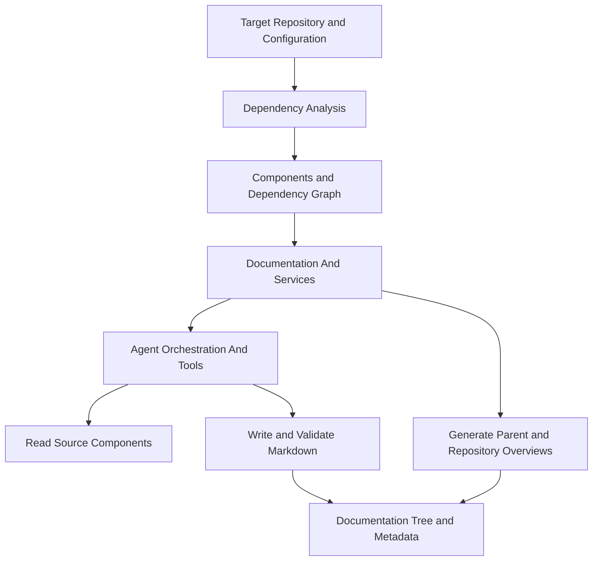
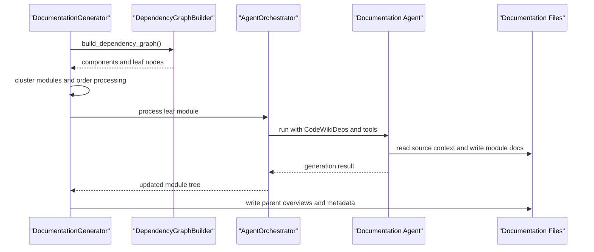

# Backend Core

## Purpose

Backend Core (`codewiki/src/be`) contains CodeWiki’s documentation-generation engine. It analyzes source repositories, builds dependency graphs, groups components into modules, and uses LLM-backed agents to generate and validate hierarchical Markdown documentation.

The module has three cooperating areas:

- **Dependency Analysis** discovers code components and their relationships across supported languages.
- **Agent Orchestration And Tools** gives documentation agents controlled access to source code and generated documentation files.
- **Documentation And Services** coordinates the end-to-end generation run, LLM fallback behavior, module processing order, and output metadata.

## Architecture

### Generation Flow

## Core Components

| Area | Key components | Responsibility |
|---|---|---|
| Agent orchestration | `AgentOrchestrator`, `CodeWikiDeps` | Selects an agent configuration, supplies per-module execution context, and runs module documentation tasks. |
| Agent editing tools | `EditTool`, `Filemap`, `WindowExpander` | Provides controlled source viewing and documentation editing, edit history, bounded file views, and Mermaid validation. |
| Repository analysis | `AnalysisService`, `RepoAnalyzer`, `CallGraphAnalyzer` | Inspects repository structure, extracts code components, and resolves call relationships. |
| Language analysis | `PythonASTAnalyzer`, Tree-sitter analyzers, `NamespaceResolver` | Parses supported language files and emits structural nodes and dependency relationships. |
| Graph construction | `DependencyParser`, `DependencyGraphBuilder` | Converts analysis results into namespaced dependency graphs and identifies documentable leaf nodes. |
| Shared graph models | `Node`, `CallRelationship`, `Repository`, `AnalysisResult`, `NodeSelection` | Defines the data contracts exchanged through the analysis and generation pipeline. |
| Documentation generation | `DocumentationGenerator` | Processes modules bottom-up, delegates leaf generation to agents, and summarizes parent and repository documentation. |
| LLM services | `CountingFallbackModel` | Wraps fallback LLM models while tracking request volume for generation runs. |

## Sub-modules

| Sub-module | Description |
|---|---|
| [Agent Orchestration And Tools](agent-orchestration-and-tools/agent-orchestration-and-tools.md) | Configures LLM agents for modules and exposes safe tools for reading code, generating sub-module documentation, and editing Markdown output. |
| [Dependency Analysis](dependency-analysis/dependency-analysis.md) | Analyzes repository structure and source code, producing a multi-language dependency graph for downstream documentation generation. |
| [Documentation And Services](documentation-and-services/documentation-and-services.md) | Coordinates dependency analysis, module clustering, leaf-module generation, parent summaries, LLM clients, and output metadata. |

## Dependency Analysis Structure

The Dependency Analysis sub-module is organized into focused components:

- [Repository And Call Graph Analysis](dependency-analysis/repository_and_call_graph_analysis.md) covers repository scanning, file selection, and call-graph extraction.
- [Language Analyzers](dependency-analysis/language_analyzers.md) provides language-specific AST and Tree-sitter parsers.
- [Dependency Graph Construction](dependency-analysis/dependency_graph_construction.md) creates FQDN-keyed component graphs and selects leaf nodes.
- [Data Models And Utilities](dependency-analysis/data_models_and_utilities.md) defines shared analysis models and logging utilities.

## Operational Boundaries

Backend Core separates analysis from generation:

1. Dependency Analysis reads repository code and produces structured graph data.
2. Documentation And Services determines module hierarchy and processing order.
3. Agent Orchestration And Tools executes per-module documentation tasks.
4. Agents can view source files but only write within the documentation output tree.
5. Generated Markdown is checked for Mermaid validity before completion.

This separation lets CodeWiki support resumable, hierarchical documentation generation while keeping source analysis, LLM execution, and output editing responsibilities distinct.