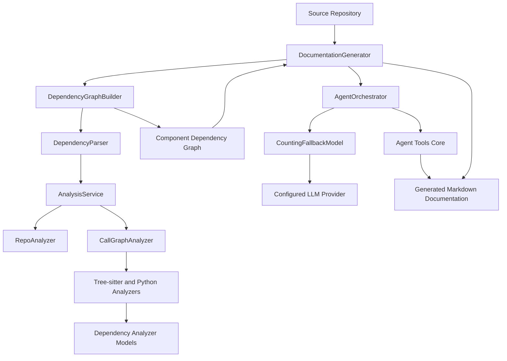
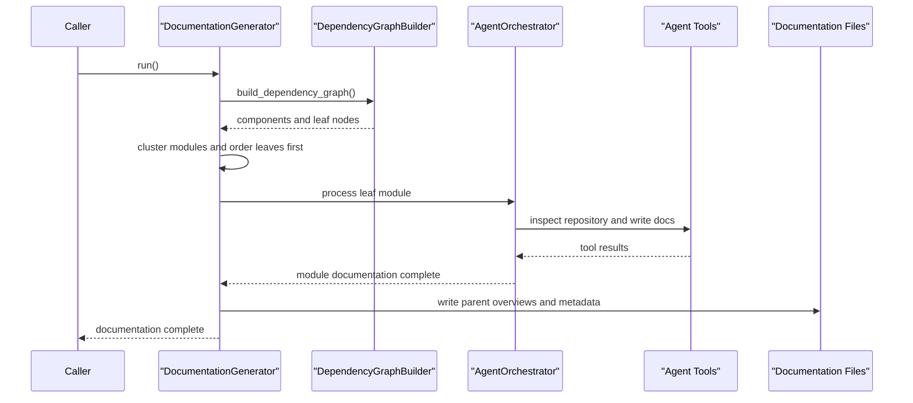
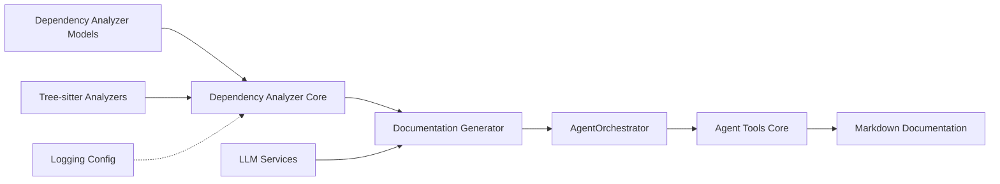

# Backend Core

Backend Core is CodeWiki’s server-side documentation pipeline. Located in `codewiki/src/be`, it analyzes source repositories, constructs dependency graphs, organizes components into modules, invokes LLM-backed agents to write documentation, and provides the filesystem tools and logging needed to run those workflows safely.

Its primary entry point is `DocumentationGenerator`, which coordinates repository analysis and hierarchical documentation output. `AgentOrchestrator` manages agent-driven generation for individual modules, while `CountingFallbackModel` provides resilient LLM execution.

## Architecture

## Documentation Generation Flow

## Core Components

| Component | Responsibility |
|---|---|
| `AgentOrchestrator` | Creates and runs documentation-writing agents for module-level generation. |
| `DocumentationGenerator` | Coordinates graph building, module clustering, leaf-first generation, parent overviews, and metadata output. |
| `AnalysisService` | Orchestrates repository structure analysis and call-graph extraction. |
| `RepoAnalyzer` | Discovers repository files and builds filtered file-tree representations. |
| `CallGraphAnalyzer` | Routes source files to language analyzers and aggregates call relationships. |
| `DependencyParser` | Converts analysis results into namespaced dependency-graph components. |
| `DependencyGraphBuilder` | Builds, validates, filters, and persists the repository dependency graph. |
| `CountingFallbackModel` | Wraps LLM models with request counting and automatic fallback behavior. |
| `CodeWikiDeps` | Carries shared run context and configuration into agent tools. |
| `EditTool` | Provides controlled repository viewing and documentation-file editing for agents. |
| `ColoredFormatter` | Produces readable, colorized backend console logs. |

## Backend Subsystems

- [Agent Tools Core](agent-tools-core/agent-tools-core.md) — Safe filesystem interaction through `CodeWikiDeps`, `EditTool`, `Filemap`, and `WindowExpander`.
- [Dependency Analyzer Core](dependency-analyzer-core/dependency-analyzer-core.md) — End-to-end repository analysis and dependency-graph construction.
- [Tree Sitter Analyzers](tree-sitter-analyzers/tree-sitter-analyzers.md) — Language-specific parsing for C, C++, C#, Java, JavaScript, TypeScript, PHP, and Python.
- [Dependency Analyzer Models](dependency-analyzer-models/dependency-analyzer-models.md) — Shared `Node`, `CallRelationship`, `Repository`, and analysis-result contracts.
- [Documentation Generator](documentation-generator/documentation-generator.md) — The top-level documentation generation workflow.
- [LLM Services](llm-services/llm-services.md) — Model factories, fallback handling, token configuration, and direct LLM calls.
- [Logging Config](logging-config/logging-config.md) — Shared colorized logging utilities.

## Component Relationships

## Source Location

Backend Core source is maintained under [`codewiki/src/be`](https://github.com/flamingo-stack/CodeWiki/tree/main/codewiki/src/be). The module is consumed by the CLI and frontend layers to transform a repository into structured, navigable documentation.