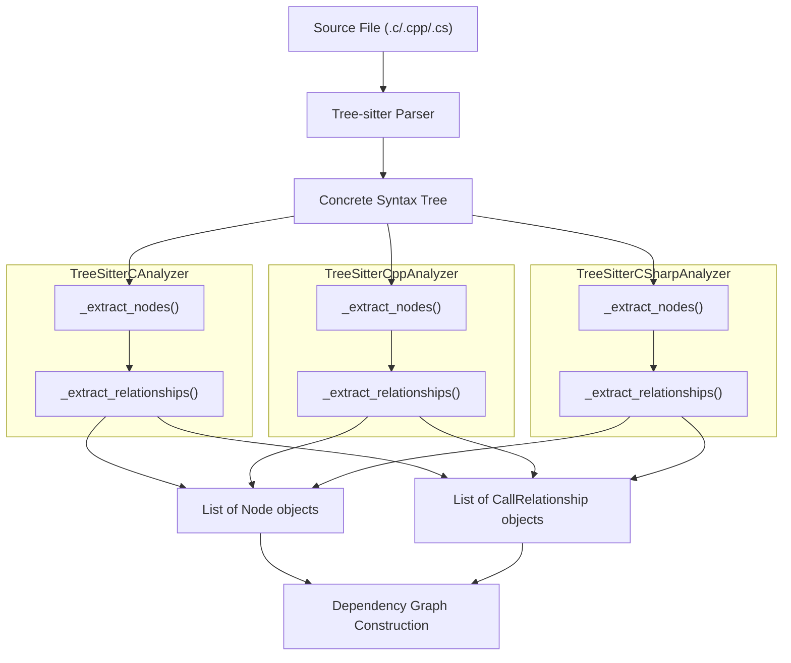
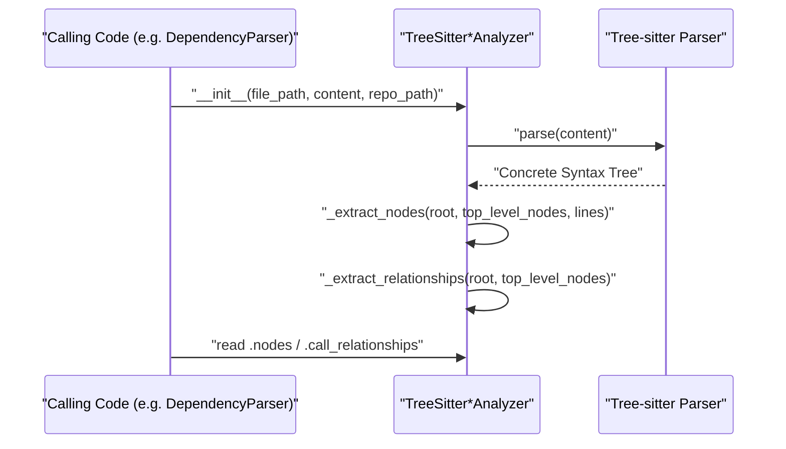
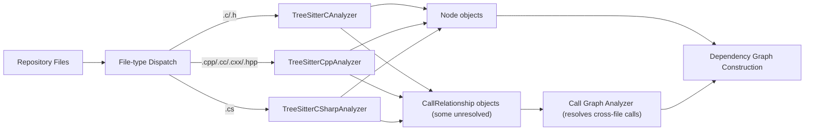

# C Family Analyzers

The C Family Analyzers module provides tree-sitter-based static analysis for the C, C++, and C# programming languages. It is one of several language-specific analyzer modules within the [Language Analyzers](language_analyzers.md) module, responsible for parsing source files written in these languages and extracting structural components (functions, classes, structs, methods, namespaces, and global variables) along with the relationships (calls, inheritance, instantiation, usage) between them.

These extracted `Node` and `CallRelationship` objects are the primary output consumed by the broader [Dependency Analysis](dependency-analysis.md) pipeline to build cross-file and cross-module dependency graphs, which ultimately power call-graph analysis and documentation generation.

## Purpose and Scope

Each of the three analyzers in this module targets a distinct but related language grammar:

| Analyzer | Language | Tree-sitter Grammar | File Extensions |
|---|---|---|---|
| `TreeSitterCAnalyzer` | C | `tree_sitter_c` | `.c`, `.h` |
| `TreeSitterCppAnalyzer` | C++ | `tree_sitter_cpp` | `.cpp`, `.cc`, `.cxx`, `.hpp`, `.h` |
| `TreeSitterCSharpAnalyzer` | C# | `tree_sitter_c_sharp` | `.cs` |

All three analyzers share a common design pattern: they parse a single source file into a tree-sitter concrete syntax tree, recursively walk the tree to identify top-level declarations, construct `Node` objects for each declaration, and then perform a second recursive pass to detect relationships (calls, inheritance, field/parameter type usage, instantiation) that are emitted as `CallRelationship` objects.

## Architecture

## Component Details

### TreeSitterCAnalyzer

Parses C source/header files using the `tree_sitter_c` grammar.

**Node extraction (`_extract_nodes`)** identifies:
- `function_definition` → `"function"` nodes (name taken from the `function_declarator`'s `identifier`)
- `struct_specifier` → `"struct"` nodes (name from `type_identifier`)
- `type_definition` wrapping a `struct_specifier` (i.e. `typedef struct { ... } Name;`) → `"struct"` nodes (name from the trailing `type_identifier`)
- `declaration` at file scope (verified via `_is_global_variable`, which walks up parents checking for an enclosing `function_definition`) → `"variable"` nodes

Only `function` and `struct` node types are appended to the analyzer's public `nodes` list; `variable` nodes are tracked internally in `top_level_nodes` for relationship resolution but not emitted as standalone components.

**Relationship extraction (`_extract_relationships`)** detects:
- **Function calls**: `call_expression` nodes are attributed to their `_find_containing_function`. The callee is recorded by simple name (not resolved to a component ID) with `is_resolved=False`, deferring cross-file resolution to the [Repository and Call Graph Analysis](repository_and_call_graph_analysis.md) module's `CallGraphAnalyzer`. Calls to known C standard library or SDL functions (see `_is_system_function`) are filtered out.
- **Global variable usage**: `identifier` nodes referencing a known global variable within a function body produce a `CallRelationship` with `is_resolved=True` since it is a same-file relationship.

A module-level helper `analyze_c_file(file_path, content, repo_path)` instantiates the analyzer and returns `(nodes, call_relationships)` as a convenience entry point.

### TreeSitterCppAnalyzer

Parses C++ source/header files using the `tree_sitter_cpp` grammar. This analyzer is the most feature-rich of the three, supporting classes, structs, functions, methods, namespaces, and global variables.

**Node extraction (`_extract_nodes`)** identifies:
- `class_specifier` → `"class"` nodes
- `struct_specifier` → `"struct"` nodes
- `function_definition` → `"method"` if a containing class/struct is found via `_find_containing_class_for_method`, otherwise `"function"`. The name is extracted from an `identifier`, `field_identifier`, or the last identifier of a `qualified_identifier`.
- `declaration` at file scope → `"variable"` nodes (filtered via `_is_global_variable`, which also excludes declarations nested in classes/structs)
- `namespace_definition` → `"namespace"` nodes

Method component IDs are qualified with their containing class (`module::Class.method`) via `_get_component_id(name, parent_class)`. Only `class`, `struct`, and `function` types are added to the public `nodes` list — methods and variables are retained in `top_level_nodes` for internal relationship resolution but not directly emitted (methods can still be referenced as call targets/callers through resolution helpers).

**Relationship extraction (`_extract_relationships`)** detects four relationship types:
1. **`calls`**: `call_expression` nodes, resolving the caller via `_find_containing_function_or_method` and using `_get_component_id_for_function` to correctly qualify method callers. If the called function belongs to a known class (via `_find_class_containing_method`), the relationship targets the class; otherwise it targets the plain function. System/standard library calls (`printf`, `cout`, `new`, etc., see `_is_system_function`) are excluded.
2. **`inherits`**: `base_class_clause` nodes link a class to its base `type_identifier`.
3. **`creates`**: `new_expression` nodes link the instantiating function/method to the instantiated class.
4. **`uses`**: `identifier` nodes referencing a known global variable (excluding declaration/definition contexts) link the referencing function/method to that variable.

A heuristic `_class_has_method` performs a textual scan of a class's source code to check for method signatures containing common return-type keywords, used to resolve which class defines a called method.

The module-level entry point `analyze_cpp_file(file_path, content, repo_path)` mirrors the C analyzer's convenience function.

### TreeSitterCSharpAnalyzer

Parses C# source files using the `tree_sitter_c_sharp` grammar.

**Node extraction (`_extract_nodes`)** identifies a broader set of C# top-level declaration kinds, all added directly to the `nodes` list:
- `class_declaration` → `"class"`, `"abstract class"`, or `"static class"` depending on modifiers
- `interface_declaration` → `"interface"`
- `struct_declaration` → `"struct"`
- `enum_declaration` → `"enum"`
- `record_declaration` → `"record"`
- `delegate_declaration` → `"delegate"`

Unlike the C and C++ analyzers, every recognized declaration type is unconditionally appended to `self.nodes` (no filtering for "top-level only" containers vs. members), since C# member declarations like properties/methods/fields are not modeled as standalone `Node` objects — they instead feed into relationship extraction only.

**Relationship extraction (`_extract_relationships`)** detects:
- **Inheritance**: `class_declaration` with a `base_list` produces a `CallRelationship` (`is_resolved=True`) to any base type recognized among other extracted top-level nodes.
- **Property/field/parameter type usage**: `property_declaration`, `field_declaration`, and `method_declaration` (via its `parameter_list`) each produce `CallRelationship` edges from the containing class to referenced non-primitive types, with `is_resolved=False` since the type may live in another file. Primitive and common BCL types (`int`, `string`, `List`, `Task`, `DateTime`, etc.) are excluded via `_is_primitive_type`.

`_find_containing_class` walks up the parent chain, recognizing any of `class_declaration`, `interface_declaration`, `struct_declaration`, `enum_declaration`, `record_declaration`, or `delegate_declaration` as valid containers.

The module-level entry point `analyze_csharp_file(file_path, content, repo_path)` follows the same convenience pattern as the other two analyzers.

## Shared Design Patterns

All three analyzers follow an identical lifecycle, making them interchangeable within the broader analysis pipeline:

Common conventions across the three analyzers:

1. **Component ID construction**: Each analyzer derives a dotted module path from the file's path relative to `repo_path` (stripping language-specific extensions and replacing path separators with `.`), then builds component IDs of the form `module.path::Name` (or `module.path::Class.method` for C++ methods) via a private `_get_component_id` helper.
2. **Two-pass traversal**: Node extraction and relationship extraction are performed as two independent recursive tree walks over the same root CST node — first collecting a `top_level_nodes` dictionary keyed by declaration name, then using that dictionary to resolve relationship targets within the same file.
3. **`Node` and `CallRelationship` models**: All analyzers construct instances of the shared `Node` and `CallRelationship` data models (defined in the Data Models and Utilities sub-module of the dependency analysis pipeline) so that downstream consumers can process results uniformly regardless of source language.
4. **Deferred cross-file resolution**: Relationships that cannot be resolved to a fully-qualified component ID within the current file (e.g., a call to a function defined elsewhere) are emitted with `is_resolved=False` and a simple/unqualified callee name, leaving final resolution to the `CallGraphAnalyzer` in the [Repository and Call Graph Analysis](repository_and_call_graph_analysis.md) module.
5. **System/library call filtering**: Each analyzer maintains a small denylist of well-known standard library functions (C and C++) to avoid polluting the dependency graph with noise from ubiquitous calls like `printf` or `malloc`.
6. **Module-level convenience functions**: Each file exposes an `analyze_<language>_file(file_path, content, repo_path)` function that instantiates the analyzer class and returns the `(nodes, call_relationships)` tuple, providing a simple functional interface for callers that don't need direct access to the analyzer instance.

## Data Flow

## Integration with the Wider System

The C Family Analyzers are invoked by the file-parsing orchestration layer within [Dependency Analysis](dependency-analysis.md), typically through the `DependencyParser` (part of the Dependency Graph Construction sub-module), which dispatches each source file to the appropriate language-specific analyzer based on file extension. The resulting `Node` and `CallRelationship` objects are aggregated with output from sibling analyzer modules — [Java Analyzer](java_analyzer.md), [Web Scripting Analyzers](web_scripting_analyzers.md), and [PHP Analyzer](php_analyzer.md), and [Python Analyzer](python_analyzer.md) — into a unified multi-language dependency graph consumed by `DependencyGraphBuilder` and, ultimately, the `AnalysisService` and `CallGraphAnalyzer` in [Repository and Call Graph Analysis](repository_and_call_graph_analysis.md).

## Limitations and Heuristics

Because these analyzers operate on a single file at a time without full semantic/type resolution, several heuristics introduce known limitations:

- **Name-based resolution only**: Calls and type references are matched by simple identifier name, not by full type checking, so name collisions across files can produce incorrect or missing edges (resolved later at the repository level).
- **Textual method lookup in C++**: `_class_has_method` scans class source text for a substring match on `methodName(` combined with common return-type keywords, which can produce false positives/negatives for unusual formatting or overloaded signatures.
- **Fixed system-function denylists**: The C and C++ analyzers use hardcoded sets of standard library/SDL function names; calls to library functions not in these sets will still be treated as unresolved local relationships.
- **C# member-level relationships only**: Properties, fields, and method parameters are not modeled as `Node` objects in C#; they only contribute type-usage `CallRelationship` edges from their containing class.
