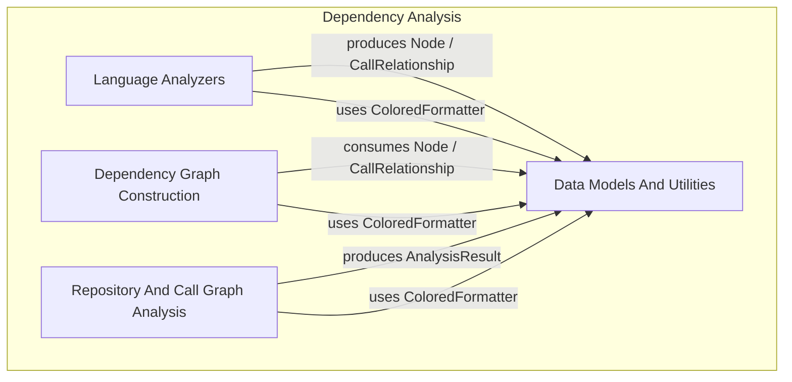
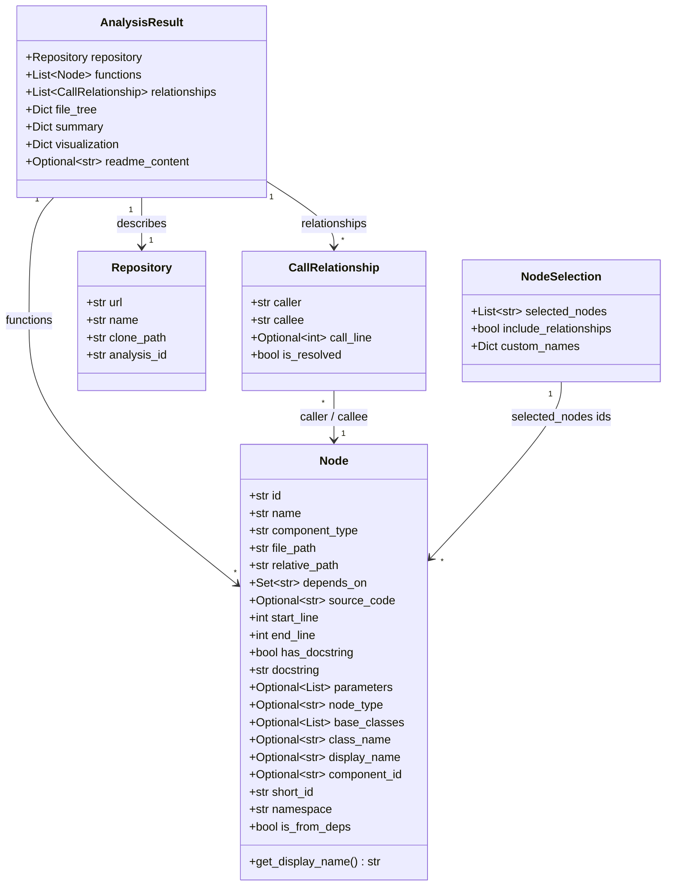
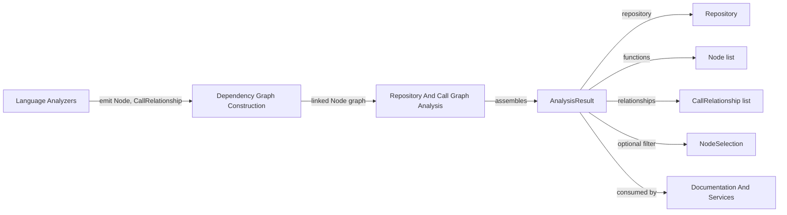
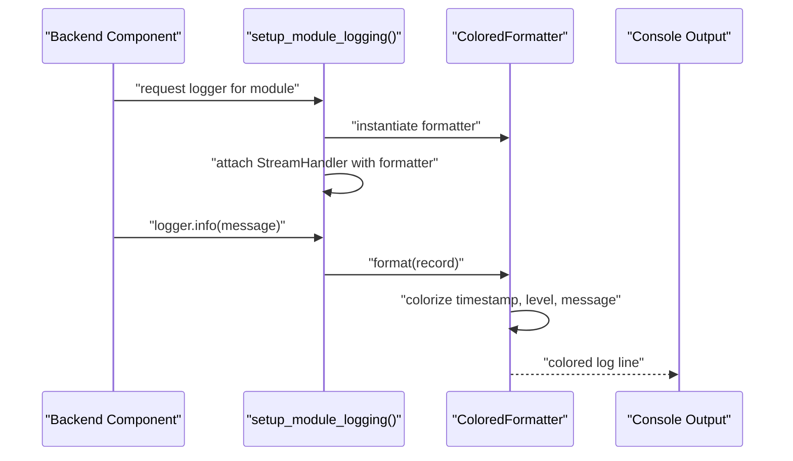

# Data Models And Utilities

## Introduction

The **Data Models And Utilities** module defines the foundational data contracts and shared support utilities used throughout the dependency-analysis pipeline. It contains the Pydantic models that represent source code entities (`Node`), their relationships (`CallRelationship`), the repositories being analyzed (`Repository`), and the aggregated output of an analysis run (`AnalysisResult`, `NodeSelection`). It also provides `ColoredFormatter`, a logging utility that produces human-readable, color-coded console output for all backend components.

This module has no heavy business logic of its own — its purpose is to act as the **common vocabulary** shared by every other component in the dependency-analysis subsystem. Language analyzers produce `Node` and `CallRelationship` instances, the dependency graph builder consumes and links them, the repository/call-graph analysis layer assembles them into an `AnalysisResult`, and the logging utility is used across all of these stages to produce consistent diagnostic output.

Because these models are pure data contracts (built on Pydantic `BaseModel`), they are lightweight, serializable, and easy to validate — making them ideal for passing analysis state between the many analyzer implementations, the graph builder, and the documentation generation pipeline.

## Position in the System

This module is a child of the [Dependency Analysis](dependency-analysis.md) module, which itself is part of Backend Core. It is a sibling of the following modules, all of which depend on the models and utilities defined here:

- [Language Analyzers](language_analyzers.md) — produces `Node` and `CallRelationship` instances for each supported language
- [Dependency Graph Construction](dependency_graph_construction.md) — parses source trees and assembles the dependency graph from these models
- [Repository And Call Graph Analysis](repository_and_call_graph_analysis.md) — orchestrates end-to-end analysis and produces `AnalysisResult` objects

## Core Components

### Node

`Node` (defined in `codewiki/src/be/dependency_analyzer/models/core.py`) is the central data structure representing a single analyzable unit of source code — a function, class, method, or module-level construct. Every language analyzer in the [Language Analyzers](../language_analyzers/language_analyzers.md) module produces instances of this model.

Key fields:

| Field | Type | Purpose |
|---|---|---|
| `id` | `str` | Fully-qualified name in `{namespace}.{original_id}` format, used as the global identifier |
| `name` | `str` | The raw/original identifier name |
| `component_type` | `str` | Category of the node (e.g. function, class, method) |
| `file_path` / `relative_path` | `str` | Absolute and repo-relative source file locations |
| `depends_on` | `Set[str]` | IDs of nodes this node depends on |
| `source_code` | `Optional[str]` | Extracted source text for the node |
| `start_line` / `end_line` | `int` | Source line range |
| `has_docstring` / `docstring` | `bool` / `str` | Docstring presence and content |
| `parameters` | `Optional[List[str]]` | Function/method parameter names |
| `node_type`, `base_classes`, `class_name` | various | Language-specific structural metadata |
| `display_name` | `Optional[str]` | Human-friendly name override |
| `short_id`, `namespace`, `is_from_deps` | `str` / `bool` | FQDN metadata distinguishing main-repository nodes from dependency-sourced nodes |

The `get_display_name()` method returns `display_name` if set, otherwise falls back to `name`, providing a single accessor for presentation layers such as the Documentation And Services module (a sibling under Backend Core).

### CallRelationship

`CallRelationship` models a directed edge between two `Node` instances, capturing a call or usage relationship discovered during static analysis.

| Field | Type | Purpose |
|---|---|---|
| `caller` | `str` | ID of the calling node |
| `callee` | `str` | ID of the called node |
| `call_line` | `Optional[int]` | Line number where the call occurs |
| `is_resolved` | `bool` | Whether the callee was successfully resolved to a known `Node` |

Unresolved relationships (`is_resolved=False`) typically indicate calls to external libraries or symbols outside the analyzed repository/dependency set.

### Repository

`Repository` captures identifying metadata for a codebase being analyzed:

| Field | Type | Purpose |
|---|---|---|
| `url` | `str` | Source URL (e.g. Git remote) |
| `name` | `str` | Repository display name |
| `clone_path` | `str` | Local filesystem path where the repository was cloned |
| `analysis_id` | `str` | Unique identifier correlating this repository to a specific analysis run |

### AnalysisResult

`AnalysisResult` (defined in `codewiki/src/be/dependency_analyzer/models/analysis.py`) is the top-level output object produced once an analysis run completes. It aggregates all discovered `Node`s, `CallRelationship`s, and repository metadata into a single serializable structure.

| Field | Type | Purpose |
|---|---|---|
| `repository` | `Repository` | Metadata of the analyzed repository |
| `functions` | `List[Node]` | All discovered nodes |
| `relationships` | `List[CallRelationship]` | All discovered call relationships |
| `file_tree` | `Dict[str, Any]` | Hierarchical representation of the repository's file structure |
| `summary` | `Dict[str, Any]` | Aggregate statistics about the analysis |
| `visualization` | `Dict[str, Any]` | Optional visualization payload (defaults to empty dict) |
| `readme_content` | `Optional[str]` | Extracted README content, if available |

This model is the primary artifact consumed by the [Repository And Call Graph Analysis](repository_and_call_graph_analysis.md) module's `AnalysisService` and by downstream documentation generation.

### NodeSelection

`NodeSelection` supports partial/filtered export of analysis results — for example, when a user wants to export or visualize only a subset of discovered nodes.

| Field | Type | Purpose |
|---|---|---|
| `selected_nodes` | `List[str]` | IDs of nodes to include in the export |
| `include_relationships` | `bool` | Whether to include relationships between selected nodes (default `True`) |
| `custom_names` | `Dict[str, str]` | Optional display-name overrides keyed by node ID |

### ColoredFormatter

`ColoredFormatter` (defined in `codewiki/src/be/dependency_analyzer/utils/logging_config.py`) is a `logging.Formatter` subclass that produces color-coded console log output, improving readability during analysis runs. It is built on `colorama` for cross-platform terminal color support.

Color scheme by log level:

| Level | Color |
|---|---|
| DEBUG | Blue |
| INFO | Cyan |
| WARNING | Yellow |
| ERROR | Red |
| CRITICAL | Bright Red |

Timestamps are rendered in blue. The formatter is applied application-wide via the module-level helper functions `setup_logging()` (configures the root logger) and `setup_module_logging()` (configures a logger for a specific module, with propagation disabled to avoid duplicate output). These helpers are used by other backend components — including the analyzers in [Language Analyzers](language_analyzers.md) and the orchestration logic in [Repository And Call Graph Analysis](repository_and_call_graph_analysis.md) — to obtain consistent diagnostic logging.

## Data Model Relationships

## Data Flow Through the Pipeline

The diagram below shows how these models flow between the sibling modules of [Dependency Analysis](dependency-analysis.md).

## Logging Setup Flow

## Summary

The Data Models And Utilities module is intentionally minimal and dependency-light: it defines the `Node`, `CallRelationship`, `Repository`, `AnalysisResult`, and `NodeSelection` Pydantic models that serve as the shared data contract across the entire dependency-analysis pipeline, plus the `ColoredFormatter` logging utility that standardizes diagnostic output. Because every other component in [Dependency Analysis](dependency-analysis.md) — from the [Language Analyzers](language_analyzers.md) to [Dependency Graph Construction](dependency_graph_construction.md) to [Repository And Call Graph Analysis](repository_and_call_graph_analysis.md) — depends on these definitions, this module effectively defines the schema that keeps the whole analysis pipeline interoperable.
