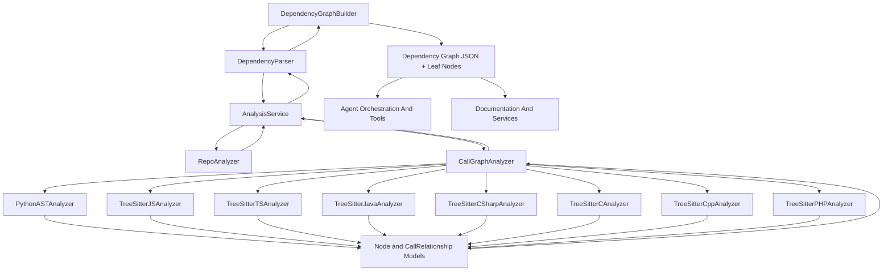

# Dependency Analysis

## Purpose

The Dependency Analysis module is the multi-language code-intelligence engine at the heart of CodeWiki's [Backend Core](../backend-core.md). It is responsible for scanning a target repository (or multiple repositories in multi-path mode), parsing source files across ten programming languages, extracting structural components (classes, functions, methods, interfaces, structs, etc.), and inferring the call/inheritance/usage relationships between them. The output is a fully-qualified, namespaced dependency graph that downstream consumers rely on:

- The [Agent Orchestration And Tools](../agent-orchestration-and-tools/agent-orchestration-and-tools.md) module walks the dependency graph's leaf nodes to drive documentation generation agents.
- The [Documentation And Services](../documentation-and-services/documentation-and-services.md) module consumes the graph and repository metadata to render the final documentation output.

## Architecture Overview

The module is organized into four cooperating layers: a high-level analysis service that orchestrates repository structure discovery and call-graph extraction, a family of language-specific tree-sitter/AST analyzers, a graph-construction layer that turns raw analysis output into a namespaced dependency graph, and a set of shared Pydantic data models plus logging utilities used throughout the pipeline.

### Processing Flow

1. **`DependencyGraphBuilder`** is invoked with a `Config` describing one or more source paths. It builds a `DependencyParser` and requests the parsed component graph.
2. **`DependencyParser`** determines single-path vs. multi-path mode, delegates structure and call-graph analysis to `AnalysisService`, and converts raw function/relationship dictionaries into `Node` objects keyed by fully-qualified domain names (FQDNs) in the `namespace.module.path::ComponentName` format. In multi-path mode it also resolves cross-namespace dependencies.
3. **`AnalysisService`** clones/validates the repository (for GitHub-based flows) or reads a local path, uses `RepoAnalyzer` to build a filtered file tree, and uses `CallGraphAnalyzer` to extract functions/classes and call relationships across all supported languages.
4. **`CallGraphAnalyzer`** dispatches each source file to the appropriate language analyzer (Python, JavaScript, TypeScript, Java, C#, C, C++, PHP), collects `Node` and `CallRelationship` objects, resolves callee references, deduplicates edges, and produces Cytoscape-compatible visualization data.
5. **`DependencyGraphBuilder`** persists the resulting graph to disk, validates graph completeness, computes leaf nodes (the most granular components with no unresolved outgoing dependencies), and filters them down to types relevant for documentation generation (classes, interfaces, structs, or functions for C-style codebases).

## Sub-modules

| Sub-module | Responsibility |
|---|---|
| [Repository And Call Graph Analysis](repository_and_call_graph_analysis.md) | Orchestrates repository structure discovery and multi-language call-graph extraction |
| [Language Analyzers](language_analyzers.md) | Tree-sitter/AST based per-language parsers that extract nodes and relationships |
| [Dependency Graph Construction](dependency_graph_construction.md) | Builds the namespaced, FQDN-based dependency graph and computes leaf nodes |
| [Data Models And Utilities](data_models_and_utilities.md) | Shared Pydantic models (`Node`, `CallRelationship`, `Repository`, `AnalysisResult`, `NodeSelection`) and colored logging support |

The Language Analyzers sub-module is further broken down by language family:

| Language grouping | Documentation |
|---|---|
| C, C++, C# | [C Family Analyzers](c_family_analyzers.md) |
| Java | [Java Analyzer](java_analyzer.md) |
| JavaScript, TypeScript | [Web Scripting Analyzers](web_scripting_analyzers.md) |
| PHP | [PHP Analyzer](php_analyzer.md) |
| Python | [Python Analyzer](python_analyzer.md) |

### Repository And Call Graph Analysis

[Repository And Call Graph Analysis](repository_and_call_graph_analysis.md) contains `AnalysisService`, `RepoAnalyzer`, and `CallGraphAnalyzer`. `RepoAnalyzer` walks the file system, applies include/exclude glob patterns, and builds a (optionally namespace-merged) file tree. `CallGraphAnalyzer` extracts code files from that tree, routes each file to the correct language analyzer, resolves call relationships by name/component-id lookups, deduplicates edges, and produces both an LLM-friendly summary format and Cytoscape visualization data. `AnalysisService` ties these together into full-repository and structure-only analysis workflows, including GitHub cloning/cleanup and README extraction.

### Language Analyzers

[Language Analyzers](language_analyzers.md) contains the ten tree-sitter/AST based analyzers: `PythonASTAnalyzer` (built on the standard `ast` module), and tree-sitter powered analyzers for JavaScript (`TreeSitterJSAnalyzer`), TypeScript (`TreeSitterTSAnalyzer`), Java (`TreeSitterJavaAnalyzer`), C# (`TreeSitterCSharpAnalyzer`), C (`TreeSitterCAnalyzer`), C++ (`TreeSitterCppAnalyzer`), and PHP (`TreeSitterPHPAnalyzer` with its companion `NamespaceResolver`). Each analyzer walks a single file's AST, extracts top-level and nested structural nodes, and infers call/inheritance/usage relationships specific to that language's semantics. Detailed per-language documentation is split into [C Family Analyzers](c_family_analyzers.md), [Java Analyzer](java_analyzer.md), [Web Scripting Analyzers](web_scripting_analyzers.md), [PHP Analyzer](php_analyzer.md), and [Python Analyzer](python_analyzer.md).

### Dependency Graph Construction

[Dependency Graph Construction](dependency_graph_construction.md) contains `DependencyParser` and `DependencyGraphBuilder`. `DependencyParser` converts raw analysis output into FQDN-keyed `Node` components, supports both single-repository and multi-repository (namespaced) parsing modes, and resolves cross-namespace dependency edges. `DependencyGraphBuilder` is the top-level entry point used by the rest of the backend: it drives the parser, persists the dependency graph as JSON, validates graph completeness, and filters leaf nodes down to the types most useful for documentation generation.

### Data Models And Utilities

[Data Models And Utilities](data_models_and_utilities.md) contains the core Pydantic contracts shared across the whole pipeline — `Node`, `CallRelationship`, and `Repository` (structural/graph primitives), `AnalysisResult` and `NodeSelection` (analysis-result envelopes) — along with `ColoredFormatter`, the colored console logging formatter used across the dependency analyzer's logging output.

## Integration Points

- **Configuration**: `DependencyGraphBuilder` is constructed with a `Config` object (see the top-level configuration module) that supplies `repo_path`, `all_source_paths`, `include_patterns`/`exclude_patterns`, and `dependency_graph_dir`.
- **Downstream consumption**: The `components` dictionary and filtered `leaf_nodes` list returned by `DependencyGraphBuilder.build_dependency_graph()` are the primary inputs consumed by the [Agent Orchestration And Tools](../agent-orchestration-and-tools/agent-orchestration-and-tools.md) module to drive per-component documentation agents, and by the [Documentation And Services](../documentation-and-services/documentation-and-services.md) module when assembling final documentation output.
- **Parent module**: This module is one of three sibling sub-modules of [Backend Core](../backend-core.md), alongside Agent Orchestration And Tools and Documentation And Services.
