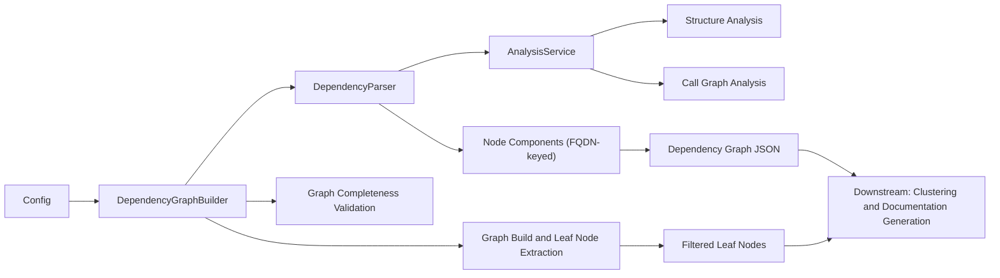
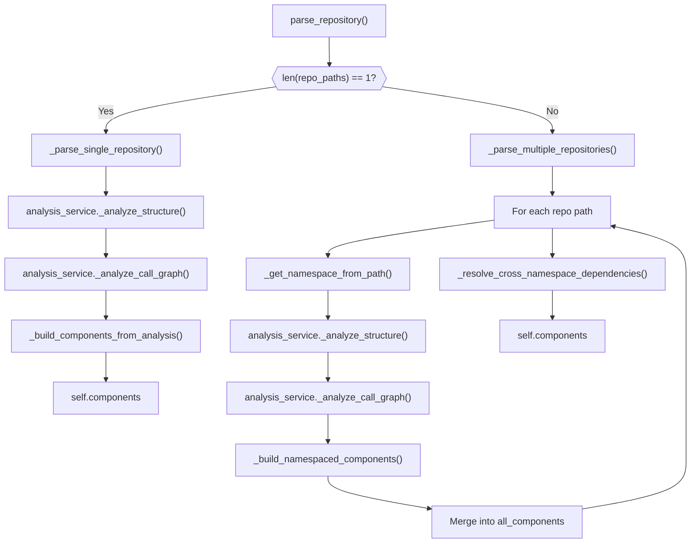
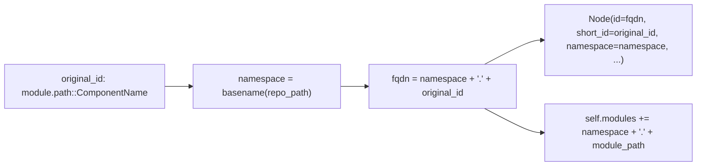
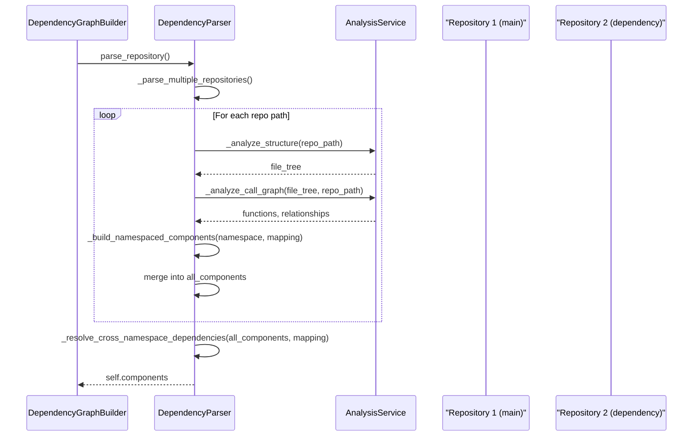
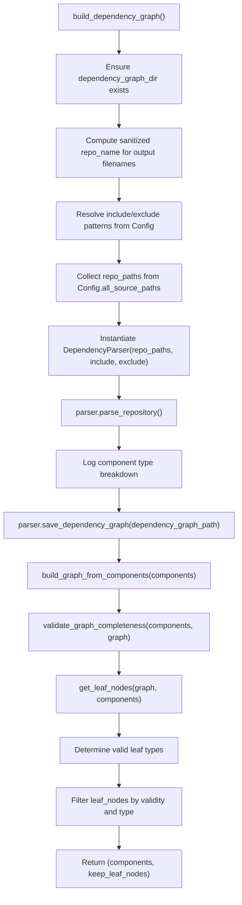
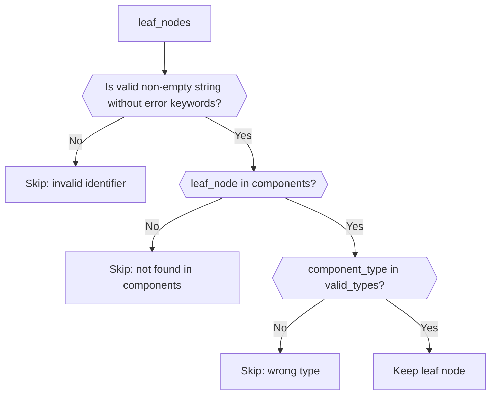
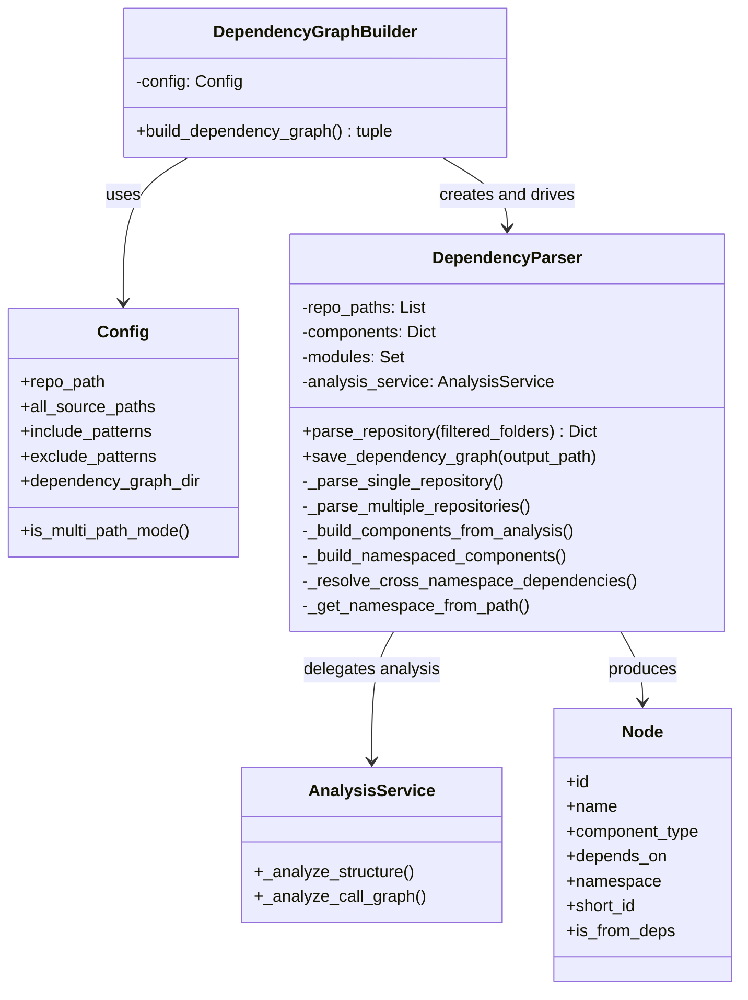

# Dependency Graph Construction

The Dependency Graph Construction module is the stage of the CodeWiki backend pipeline responsible for turning raw, per-file structural and call-graph analysis into a unified, addressable **dependency graph** of code components. It converts the output produced by the [Repository And Call Graph Analysis](repository_and_call_graph_analysis.md) stage into `Node` objects (see [Data Models And Utilities](data_models_and_utilities.md)), assigns each component a globally unique **Fully Qualified Domain Name (FQDN)**, resolves dependency edges (including across multiple repositories), and persists the resulting graph to disk for downstream consumers such as clustering and LLM-based documentation generation.

This module contains two core components:

- **`DependencyParser`** (`codewiki/src/be/dependency_analyzer/ast_parser.py`) — parses one or more repositories, builds namespaced `Node` components, resolves intra- and cross-namespace dependencies, and serializes the graph to JSON.
- **`DependencyGraphBuilder`** (`codewiki/src/be/dependency_analyzer/dependency_graphs_builder.py`) — the higher-level orchestrator that drives `DependencyParser`, validates graph completeness, and filters the graph down to a set of "leaf nodes" suitable for downstream processing.

---

## 1. Role in the Analysis Pipeline

Dependency Graph Construction sits between raw code analysis and higher-level consumers. It depends on analyzer output from [Repository And Call Graph Analysis](repository_and_call_graph_analysis.md) (which in turn depends on language-specific analyzers from [Language Analyzers](language_analyzers.md)), and it produces `Node` graphs typed according to [Data Models And Utilities](data_models_and_utilities.md). Its output feeds the rest of the [Dependency Analysis](dependency-analysis.md) pipeline and ultimately the agent-driven documentation generation stages of Backend Core.



The `Config` object (see the platform's configuration documentation) supplies repository paths, include/exclude patterns, and output directories that parameterize the whole process.

---

## 2. `DependencyParser`

`DependencyParser` is responsible for turning one or more repositories into a `Dict[str, Node]` map of components. It supports two modes:

- **Single-path mode**: analyzes exactly one repository (backward-compatible behavior).
- **Multi-path mode**: analyzes several repositories (e.g., a main repo plus its dependencies) and merges the results while avoiding ID collisions.

### 2.1 Initialization

```python
DependencyParser(
    repo_path: Union[str, List[str]],
    include_patterns: List[str] = None,
    exclude_patterns: List[str] = None,
)
```

- Normalizes `repo_path` into `self.repo_paths` (always a list) and keeps `self.repo_path` as the first path for backward compatibility.
- Creates an internal `AnalysisService` instance (from [Repository And Call Graph Analysis](repository_and_call_graph_analysis.md)) used to perform structural and call-graph analysis.
- Maintains two pieces of running state: `self.components` (the FQDN-keyed `Node` map) and `self.modules` (the set of discovered module paths).

### 2.2 Parsing Entry Point

`parse_repository(filtered_folders=None)` dispatches to either `_parse_single_repository` or `_parse_multiple_repositories` based on how many repository paths were supplied.



### 2.3 Single-Repository Parsing

`_parse_single_repository`:
1. Calls `AnalysisService._analyze_structure()` to enumerate files (respecting custom include/exclude patterns).
2. Calls `AnalysisService._analyze_call_graph()` on the resulting file tree to extract functions/classes and their call relationships.
3. Calls `_build_components_from_analysis()` to convert the raw analysis dictionaries into namespaced `Node` objects and to populate `self.components`.

### 2.4 FQDN Construction

Every component ID is namespaced using the repository's directory name to guarantee global uniqueness, following the canonical format:

```text
{namespace}.{module_path}::{ComponentName}
```

`_get_namespace_from_path()` derives the namespace from the last path segment of the repository (e.g., `openframe-frontend`, `ui-kit`). The FQDN then becomes the `Node.id` and `Node.component_id`, while the original (pre-namespace) identifier is retained as `Node.short_id`. The `Node.namespace` field records which repository/source a component came from, and `Node.is_from_deps` distinguishes the primary repository (`repo_index == 0`) from dependency repositories (`repo_index > 0`).



### 2.5 Multi-Repository Parsing and Namespacing

`_parse_multiple_repositories()` iterates over every repository path, analyzes it independently, and builds a per-repository component map via `_build_namespaced_components()`. Each function/class becomes a `Node` keyed by its FQDN, and a `namespace_mapping` dictionary tracks the relationship between original (non-namespaced) IDs and their namespaced FQDNs so that call relationships extracted within a single repository can be resolved to the correct namespaced dependency IDs.

After all repositories have been processed, `_resolve_cross_namespace_dependencies()` performs a second resolution pass: for every component whose recorded dependency ID isn't found among all namespaced components (i.e., it wasn't resolved during the per-repository pass), it attempts a **name-based match** across all components, preferring cross-namespace matches and logging them for observability. Components and their sorted-by-ID iteration order are used consistently to keep output deterministic across runs.



### 2.6 Persistence

`save_dependency_graph(output_path)` serializes `self.components` to a JSON file:

- Component keys are sorted for deterministic output.
- Each `Node` is converted via `model_dump()`; the `depends_on` set field is converted to a sorted list so the JSON output is stable and diff-friendly (important for reproducible pipeline runs).
- The output directory is created if it does not already exist.

---

## 3. `DependencyGraphBuilder`

`DependencyGraphBuilder` is the orchestration layer used by the rest of the [Dependency Analysis](dependency-analysis.md) pipeline. It wraps `DependencyParser` with configuration-driven path/file management, post-build graph validation, and leaf-node filtering.

### 3.1 Initialization

```python
DependencyGraphBuilder(config: Config)
```

Takes a `Config` instance (see the platform's configuration documentation) that supplies:
- `repo_path` / `all_source_paths` — one or more source directories to analyze.
- `include_patterns` / `exclude_patterns` — custom file filters.
- `dependency_graph_dir` — output directory for the generated JSON artifacts.
- `is_multi_path_mode()` — whether multiple source paths were configured.

### 3.2 `build_dependency_graph()`

This is the single public method of the class and returns a `tuple[Dict[str, Any], List[str]]` — the full component map and a filtered list of "leaf node" component IDs.



Key steps in detail:

1. **Output path preparation** — the repository's base name is sanitized (non-alphanumeric characters replaced with `_`) to build two artifact paths under `config.dependency_graph_dir`:
   - `{repo_name}_dependency_graph.json` — the serialized dependency graph.
   - `{repo_name}_filtered_folders.json` — reserved for folder-filtering metadata (currently not actively populated in the method body, retained for future use).

2. **Parser construction** — a single `DependencyParser` is created, receiving either a single path or a list of paths depending on `config.is_multi_path_mode()`.

3. **Parsing** — `parser.parse_repository(filtered_folders)` is invoked, populating `components` and logging a breakdown of component types (classes, functions, interfaces, etc.) found in the codebase.

4. **Persistence** — `parser.save_dependency_graph()` writes the graph to disk immediately after parsing so that even if later steps fail, a graph snapshot is available.

5. **Graph construction and validation** — `build_graph_from_components()` converts the `Node` map into a traversable graph structure, and `validate_graph_completeness()` performs a post-build sanity check to catch structural issues (e.g., dangling references) before continuing.

6. **Leaf node extraction and filtering** — `get_leaf_nodes()` identifies graph leaves (components with no outgoing dependencies, typically the most "concrete" building blocks). `DependencyGraphBuilder` then filters this list:
   - Determines which component types are actually present in the codebase.
   - Prefers `class`, `interface`, and `struct` as valid leaf types; if none of these are present (e.g., in a purely functional/C-style codebase), it falls back to including `function`.
   - Discards leaf identifiers that look like error strings (containing keywords such as `error`, `exception`, `failed`, `invalid`) or are empty/non-string, which typically indicate upstream parsing failures rather than real components.
   - Discards leaf IDs that don't map to a known component, or whose component type is not in the valid-type set.
   - Logs detailed counts of kept vs. skipped nodes (by reason) for observability.



### 3.3 Class Relationships



---

## 4. Design Notes

- **Determinism**: Both `DependencyParser` and its helper methods sort dictionaries/sets before iteration or serialization (e.g., `sorted(self.components.items())`, `sorted(list(component_dict['depends_on']))`). This ensures that repeated runs against the same codebase produce byte-identical JSON output, which is important for caching and for diffing dependency graphs across commits.
- **Graceful degradation on unresolved dependencies**: When a dependency's target component cannot be located by ID, both the single-path and multi-path resolution paths fall back to a **name-based match** across all known components rather than dropping the edge outright, at the cost of a small risk of false positives in codebases with duplicate names across namespaces.
- **Separation of concerns**: `DependencyParser` focuses purely on turning raw analyzer output into a namespaced `Node` graph, while `DependencyGraphBuilder` focuses on pipeline orchestration (paths, validation, filtering) — keeping the low-level parsing logic reusable outside of the full pipeline context if needed.
- **Extensibility for C-based codebases**: The leaf-node filtering logic in `DependencyGraphBuilder` adapts its notion of a "valid leaf type" based on what component types are actually observed, allowing function-level leaves to be considered meaningful for C-style codebases where classes/interfaces/structs may not exist.

---

## 5. Related Modules

- [Repository And Call Graph Analysis](repository_and_call_graph_analysis.md) — supplies the `AnalysisService` used by `DependencyParser` to obtain file structure and call-graph data.
- [Language Analyzers](language_analyzers.md) — the per-language Tree-sitter/AST analyzers that feed structural and call-graph data into the analysis service.
- [Data Models And Utilities](data_models_and_utilities.md) — defines the `Node`, `CallRelationship`, `Repository`, and other data types produced and consumed by this module.
- [Dependency Analysis](dependency-analysis.md) — the parent module coordinating this stage alongside repository/call-graph analysis and language analyzers.
- Backend Core — the top-level backend module that ties dependency analysis into agent orchestration and documentation generation.
