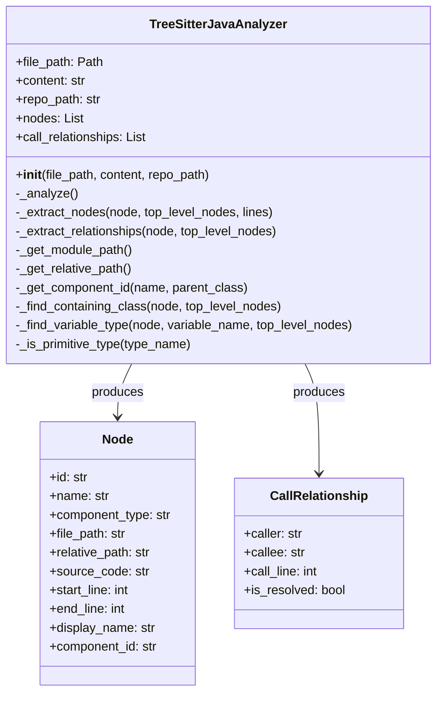
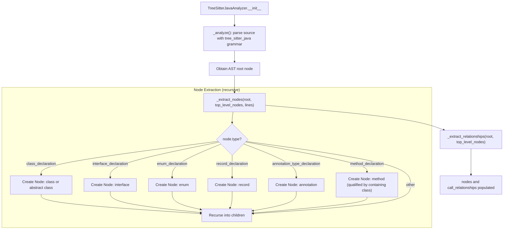
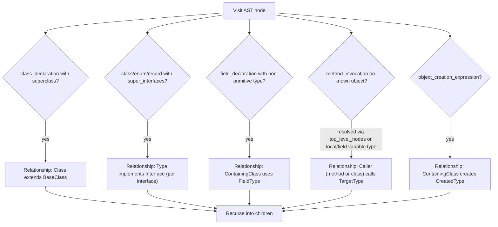
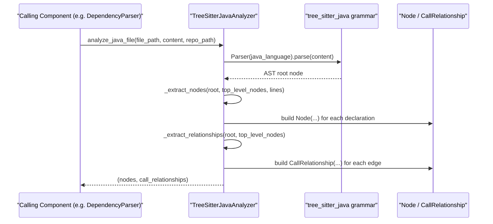

# Java Analyzer

The Java Analyzer module is a specialized static-analysis component that parses Java source files using tree-sitter and converts them into the structural nodes and call relationships consumed by the broader dependency-analysis pipeline. It is one of several language-specific analyzers (alongside the C-family, web-scripting, PHP, and Python analyzers) that plug into the language-agnostic dependency graph construction and clustering machinery.

## Purpose and Scope

The Java Analyzer's single responsibility is to turn a `.java` file's source text into two collections:

1. **Structural nodes** — classes, abstract classes, interfaces, enums, records, annotations, and methods, each represented as a `Node` with a fully-qualified component identifier in the `module.path::ClassName` (or `module.path::ClassName.methodName`) format expected by the rest of the system.
2. **Call relationships** — directed edges (`CallRelationship`) capturing inheritance, interface implementation, field-type usage, method invocation, and object creation, which are later used to build the project-wide dependency graph.

This module does not perform any file I/O, orchestration, or graph assembly itself — it is invoked by higher-level components as a pure parse-and-extract step for a single file's content.

## Core Component

### `TreeSitterJavaAnalyzer`

`TreeSitterJavaAnalyzer` (in `codewiki/src/be/dependency_analyzer/analyzers/java.py`) is the sole core component of this module. It wraps the `tree-sitter-java` grammar to build an AST for a given file and walks that tree twice: once to extract structural nodes, and once to extract relationships between them.

```python
analyzer = TreeSitterJavaAnalyzer(file_path, content, repo_path)
nodes = analyzer.nodes                     # List[Node]
relationships = analyzer.call_relationships  # List[CallRelationship]
```

A convenience function, `analyze_java_file(file_path, content, repo_path)`, instantiates the analyzer and returns `(nodes, call_relationships)` as a tuple, matching the calling convention used by the other language analyzers in the [Language Analyzers](language_analyzers.md) group.

#### Constructor Responsibilities

On construction, `TreeSitterJavaAnalyzer`:
- Stores the file path, source content, and optional repository root (`repo_path`), used to compute module-qualified identifiers.
- Initializes empty `nodes` and `call_relationships` lists.
- Immediately runs `_analyze()`, which parses the source with tree-sitter and populates both lists synchronously.

Because all work happens in `__init__`, callers only need to construct the analyzer (or call `analyze_java_file`) and then read the resulting attributes — there is no separate "run" step.

## Architecture



`Node` and `CallRelationship` are shared data models defined outside this module in the Data Models and Utilities sub-module of the dependency analysis pipeline, used consistently across all language analyzers.

## Analysis Pipeline

The analyzer performs a two-pass recursive walk over the tree-sitter parse tree: a node-extraction pass followed by a relationship-extraction pass.



### Node Extraction (`_extract_nodes`)

For each AST node visited, the analyzer inspects `node.type` and, when it matches one of the recognized Java declaration kinds, builds a `Node`:

| Tree-sitter node type | Component type | Naming |
|---|---|---|
| `class_declaration` | `class` or `abstract class` (if the `abstract` modifier is present) | Class identifier |
| `interface_declaration` | `interface` | Interface identifier |
| `enum_declaration` | `enum` | Enum identifier |
| `record_declaration` | `record` | Record identifier |
| `annotation_type_declaration` | `annotation` | Annotation identifier |
| `method_declaration` | `method` | `ContainingClass.methodName` |

Each `Node` is assigned a `component_id` of the form `module.path::Name` (or `module.path::Class.method` for methods), computed via `_get_component_id`, which in turn derives the dotted module path from the file's location relative to `repo_path` (`_get_module_path`). Discovered top-level declarations are also cached in a `top_level_nodes` dictionary keyed by simple name, which is reused during relationship extraction to resolve types back to component IDs.

### Relationship Extraction (`_extract_relationships`)

A second recursive walk inspects the same tree to detect five categories of relationships, each appended to `call_relationships` as a `CallRelationship(caller, callee, call_line, is_resolved=False)`:



1. **Inheritance** — a `class_declaration` with a `superclass` clause produces an edge from the class to its base class, unless the base type is a recognized built-in/primitive.
2. **Interface implementation** — classes, enums, and records with a `super_interfaces` clause produce one edge per implemented interface.
3. **Field type usage** — each `field_declaration` whose type is not primitive/built-in produces an edge from the containing class to the field's type.
4. **Method invocation** — for `method_invocation` expressions, the analyzer resolves the receiver object's type either directly (if it matches a known top-level type name) or by searching local variable declarations and field declarations (`_find_variable_type` / `_search_variable_declaration`); the caller is the enclosing method if resolvable, otherwise the enclosing class.
5. **Object creation** — `object_creation_expression` nodes produce an edge from the containing class to the instantiated type.

All non-inheritance/implementation relationships filter out common built-in types (`String`, `Object`, `List`, `Map`, primitives, boxed primitives, etc.) via `_is_primitive_type` to avoid polluting the dependency graph with noise from the standard library.

### Helper Methods

- `_get_module_path` / `_get_relative_path` — derive dotted module paths and repo-relative file paths using `repo_path` when available, falling back to the raw file path otherwise.
- `_get_component_id` — builds the `module.path::Name` (or `module.path::Class.member`) identifier convention shared across all language analyzers.
- `_get_identifier_name` / `_get_type_name` — extract simple names from `identifier`, `type_identifier`, `generic_type`, and `superclass` AST nodes.
- `_find_containing_class` / `_find_containing_class_name` / `_find_containing_method` — walk up the AST parent chain to determine the enclosing declaration for a given node, used to attribute relationships to the correct caller.
- `_find_variable_type` / `_search_variable_declaration` — resolve a local variable or field's declared type by scanning the enclosing method body and class body, enabling method-invocation edges to point at concrete types rather than variable names.

## Data Flow



## Integration with the Dependency Analysis Pipeline

The Java Analyzer is invoked by the language-dispatch logic that selects an appropriate analyzer per file extension, as part of the broader Dependency Graph Construction process (notably `DependencyParser`). The `Node` and `CallRelationship` objects it produces are:

- Aggregated across all files and languages by `DependencyGraphBuilder` to construct the full project dependency graph.
- Fed into higher-level analysis performed by the [Repository and Call Graph Analysis](repository_and_call_graph_analysis.md) module (`AnalysisService`, `CallGraphAnalyzer`, `RepoAnalyzer`) for call-graph traversal and repository-wide dependency insight.
- Ultimately consumed by the documentation generation pipeline in the parent `backend-core` module, whose entry points (`DocumentationGenerator`, `AgentOrchestrator`) rely on accurate structural and relationship data to produce module documentation such as this file.

Because relationships produced here are marked `is_resolved=False`, downstream graph-construction logic is responsible for resolving simple type names to fully-qualified component IDs across files — the Java Analyzer only guarantees locally-consistent names and line numbers within the file it parses.

## Relationship to Sibling Language Analyzers

The Java Analyzer follows the same structural contract (`analyze_<language>_file(file_path, content, repo_path) -> (List[Node], List[CallRelationship])`) as its siblings under [Language Analyzers](language_analyzers.md):

- [C Family Analyzers](c_family_analyzers.md) — C, C++, and C# analyzers.
- [Web Scripting Analyzers](web_scripting_analyzers.md) — JavaScript and TypeScript analyzers.
- [PHP Analyzer](php_analyzer.md) — PHP analyzer with namespace resolution.
- [Python Analyzer](python_analyzer.md) — Python AST-based analyzer.

This uniform contract allows the dependency analysis pipeline to treat all languages interchangeably once each analyzer has produced its nodes and relationships, regardless of the underlying grammar or parsing strategy used internally.
