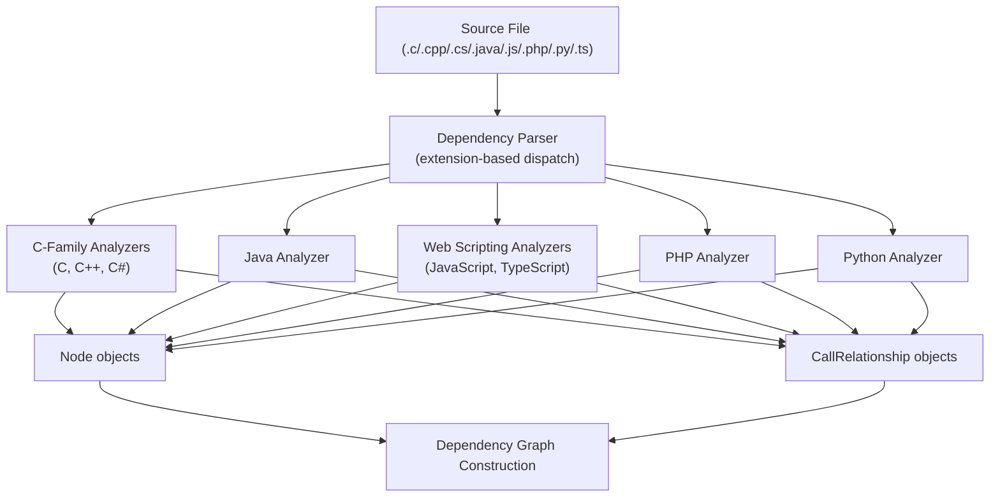
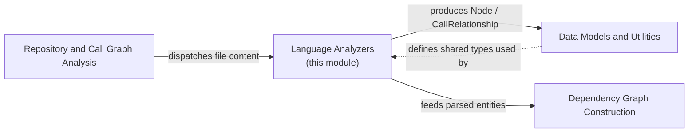

# Language Analyzers

## Purpose

The Language Analyzers module is the polyglot parsing core of CodeWiki's dependency analysis pipeline. It contains one analyzer per supported source language — **C, C++, C#, Java, JavaScript, PHP, Python, and TypeScript** — each responsible for turning raw source code into two structured outputs:

1. **`Node`** objects representing structural code entities (classes, interfaces, functions, methods, structs, enums, variables, etc.)
2. **`CallRelationship`** objects representing dependency edges between those entities (function calls, inheritance, interface implementation, object instantiation, type usage, and more)

These `Node` and `CallRelationship` objects are the common currency of the dependency analysis pipeline: they feed directly into dependency graph construction and downstream call-graph/clustering analysis, regardless of which source language produced them.

Every analyzer in this module normalizes language-specific syntax into the same component identifier convention used across CodeWiki:

```text
<dotted.module.path>::<ComponentName>
<dotted.module.path>::<ClassName>.<memberName>
```

This uniform FQDN-style ID format is what allows the rest of the system (dependency graph building, call-graph analysis, clustering) to treat components from any language identically.

## Architecture Overview

All analyzers share a common structural pattern, even though seven of them are built on [tree-sitter](https://tree-sitter.github.io/tree-sitter/) grammars and one (Python) uses the standard library `ast` module:

- Constructed with `(file_path, content, repo_path=None)`
- Parse the source into an AST (tree-sitter parse tree or Python `ast` tree)
- Walk the tree twice (conceptually): once to extract top-level `Node` entities, once to extract `CallRelationship` edges between the entities found in the first pass
- Expose results via `self.nodes: List[Node]` and `self.call_relationships: List[CallRelationship]`
- Provide a module-level `analyze_<language>_file(file_path, content, repo_path)` convenience function returning `(nodes, call_relationships)`



## Sub-modules

The eight per-language analyzers are grouped into five sub-modules based on shared parsing technology and structural similarity:

| Sub-module | Languages | Parsing Technology |
|---|---|---|
| [C-Family Analyzers](c_family_analyzers.md) | C, C++, C# | tree-sitter |
| [Java Analyzer](java_analyzer.md) | Java | tree-sitter |
| [Web Scripting Analyzers](web_scripting_analyzers.md) | JavaScript, TypeScript | tree-sitter |
| [PHP Analyzer](php_analyzer.md) | PHP | tree-sitter |
| [Python Analyzer](python_analyzer.md) | Python | Python `ast` |

### C-Family Analyzers

`TreeSitterCAnalyzer`, `TreeSitterCppAnalyzer`, and `TreeSitterCSharpAnalyzer` share a family resemblance: all three parse C-like curly-brace syntax and must distinguish global variables from locals, resolve function/method declarators, and infer relationships such as calls, inheritance (C++/C#), and global-variable usage. See [C-Family Analyzers](c_family_analyzers.md) for details.

### Java Analyzer

`TreeSitterJavaAnalyzer` extracts classes, interfaces, enums, records, annotations, and methods, and infers a rich set of relationships including inheritance, interface implementation, field-type usage, method invocation (with local-variable type tracking), and object creation. See [Java Analyzer](java_analyzer.md).

### Web Scripting Analyzers

`TreeSitterJSAnalyzer` and `TreeSitterTSAnalyzer` handle JavaScript and TypeScript respectively. They share near-identical extraction strategies for functions, classes, arrow functions, and exports, while the TypeScript analyzer additionally understands interfaces, type aliases, enums, and type-level relationships (generics, `extends`/`implements` clauses, constructor-parameter types). See [Web Scripting Analyzers](web_scripting_analyzers.md).

### PHP Analyzer

`TreeSitterPHPAnalyzer`, paired with the `NamespaceResolver` helper, extracts classes, interfaces, traits, enums, functions, and methods, and resolves relationships (`use`, `extends`, `implements`, `new`, static calls, constructor property promotion) to fully-qualified namespace paths. See [PHP Analyzer](php_analyzer.md).

### Python Analyzer

`PythonASTAnalyzer` is the only analyzer built on Python's built-in `ast` module rather than tree-sitter. It extracts classes and top-level functions and tracks call relationships, including base-class resolution and call-name filtering against Python builtins. See [Python Analyzer](python_analyzer.md).

## Relationship to the Rest of the Dependency Analyzer

The Language Analyzers module is one of several sibling sub-modules under the dependency analysis layer of the backend core. Related sibling modules (not part of this module) include:

- [Repository and Call Graph Analysis](repository_and_call_graph_analysis.md) — orchestrates repository-wide scanning and cross-file call resolution, invoking these language analyzers per file.
- [Dependency Graph Construction](dependency_graph_construction.md) — consumes the `Node`/`CallRelationship` output of these analyzers (via the AST parser dispatcher) to build the overall dependency graph.
- [Data Models and Utilities](data_models_and_utilities.md) — defines the shared `Node`, `CallRelationship`, `AnalysisResult`, `NodeSelection`, and `Repository` data models that every analyzer in this module produces or references, plus shared logging utilities.

These relationships are illustrated below:



## Common Design Patterns Across Analyzers

Understanding these shared conventions makes it easier to read any individual analyzer's code:

1. **Module path derivation** (`_get_module_path`): converts a file's relative path into a dotted module path by stripping the language-specific extension(s) and replacing path separators with dots.
2. **Component ID generation** (`_get_component_id`): builds the `module.path::Name` or `module.path::Class.member` identifier used as the `Node.id`/`Node.component_id`.
3. **Two-pass traversal**: nodes are extracted first so that a lookup table of "known top-level entities" exists before relationships are extracted, allowing relationship extraction to distinguish resolved (local) references from unresolved (cross-file) ones via the `CallRelationship.is_resolved` flag.
4. **Built-in/primitive filtering**: each analyzer maintains a set of language built-ins (e.g., C system functions, Java/C# primitive types, JavaScript/TypeScript global types) to avoid polluting the dependency graph with noise from standard library usage.
5. **Best-effort/defensive parsing**: most extraction methods are wrapped in `try/except` blocks (or rely on tree-sitter's error-tolerant parsing) so that a malformed or partially-unsupported construct in one file does not abort analysis of the rest of the codebase.

Each sub-module page linked above documents the specific extraction and relationship-inference logic for its language(s) in detail.
