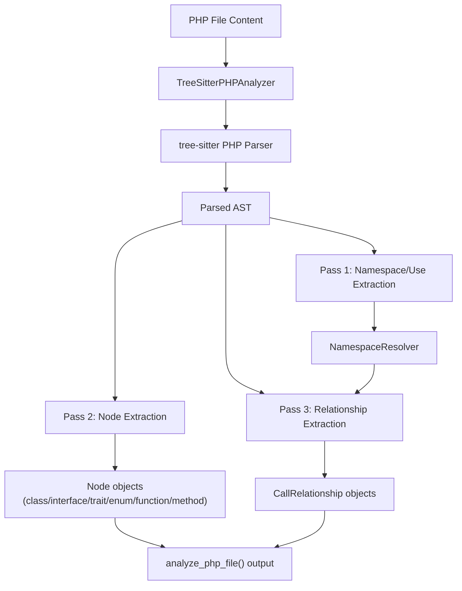
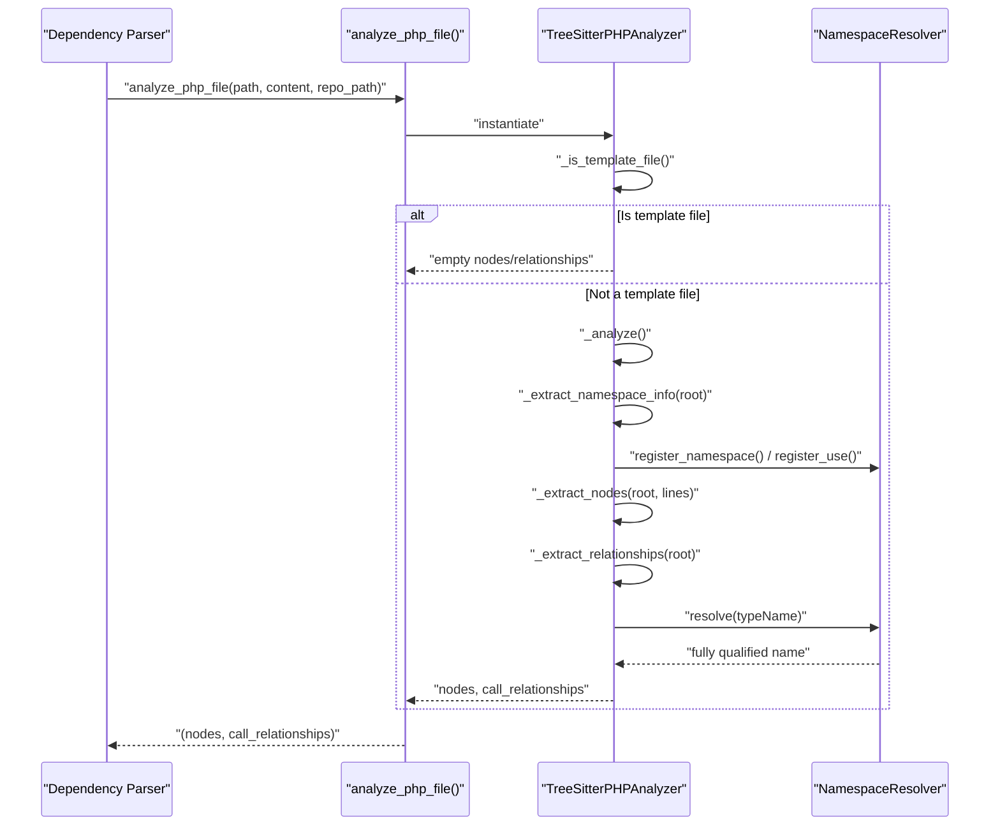
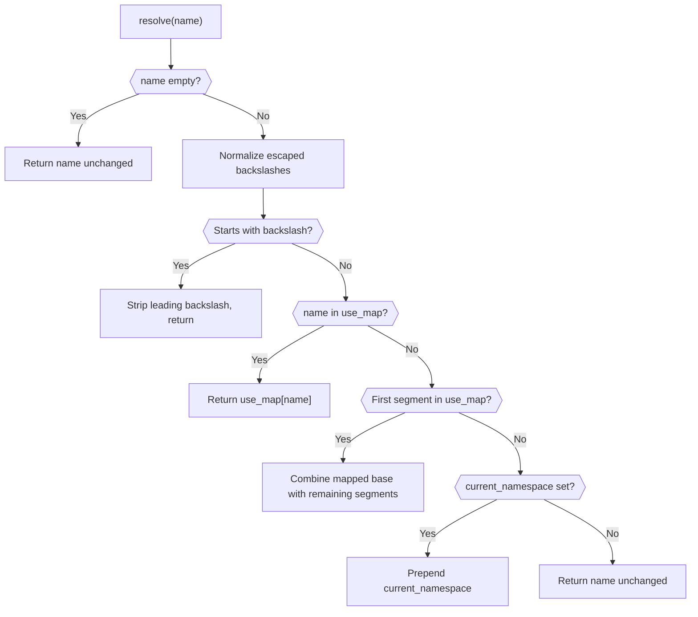

# PHP Analyzer

The PHP Analyzer module provides PHP-specific static analysis for the CodeWiki dependency analysis pipeline. It parses PHP source files using tree-sitter, extracts structural entities (classes, interfaces, traits, enums, functions, and methods), and identifies dependency relationships between them (namespace imports, inheritance, interface implementation, object instantiation, static calls, and constructor property promotion). The module also resolves PHP namespace aliases to fully qualified class names, which is essential for accurately linking dependencies across files in large PHP codebases.

This module is one of several language-specific analyzers used by the broader dependency analysis system. It plugs into the same analysis pipeline as the other [Language Analyzers](language_analyzers.md) (Java, C/C++/C#, JavaScript/TypeScript, Python), producing a common `Node` / `CallRelationship` output format consumed by the [Repository and Call Graph Analysis](repository_and_call_graph_analysis.md) layer.

## Purpose and Scope

The PHP Analyzer exists to answer two questions for every PHP file in a repository:

1. **What is defined here?** — Classes, interfaces, traits, enums, top-level functions, and class methods, each captured as a `Node` with source code, docstrings (PHPDoc), parameters, and base class information.
2. **What does each definition depend on?** — Relationships captured as `CallRelationship` objects pointing from a defining entity (or file) to another entity it references, via `use` imports, `extends`, `implements`, `new` instantiation, `ClassName::staticMethod()` calls, or PHP 8+ constructor property promotion.

Because PHP relies heavily on namespaces and `use` aliasing to reference classes, the module includes a dedicated `NamespaceResolver` responsible for turning short or aliased names into fully-qualified names (FQNs) before they become part of a `CallRelationship`.

## Core Components

### NamespaceResolver

`NamespaceResolver` tracks the current file's namespace declaration and its `use` import aliases, then resolves any referenced name to its fully qualified form.

Responsibilities:
- `register_namespace(ns)` — records the `namespace` declaration for the current file (normalizing escaped backslashes).
- `register_use(fqn, alias=None)` — records a `use Fully\Qualified\Name [as Alias];` statement, defaulting the alias to the last segment of the FQN when none is given.
- `resolve(name)` — resolves a bare, partially-qualified, or aliased name to its fully qualified namespace path:
  - Names already prefixed with `\` are treated as already fully qualified.
  - Names matching an entry in the `use_map` are substituted directly.
  - Names whose first segment matches a `use` alias have that segment replaced, preserving any trailing sub-path.
  - Otherwise, the current namespace is prepended.

This resolver is stateful per analyzed file and is populated during a dedicated "namespace and use statement extraction" pass before nodes and relationships are processed.

### TreeSitterPHPAnalyzer

`TreeSitterPHPAnalyzer` is the primary entry point for analyzing a single PHP file. It wraps the tree-sitter PHP grammar (`tree_sitter_php.language_php()`) and drives a three-pass analysis over the parsed syntax tree:

1. **Namespace/use extraction** (`_extract_namespace_info`) — walks the whole AST first to populate the `NamespaceResolver` with the file's namespace and all `use` declarations, so that later passes can resolve names correctly regardless of declaration order.
2. **Node extraction** (`_extract_nodes`) — walks the AST to build `Node` objects for:
   - `class_declaration` (including detection of `abstract` modifier → `"abstract class"` type)
   - `interface_declaration`
   - `trait_declaration`
   - `enum_declaration`
   - `function_definition` (top-level functions)
   - `method_declaration` (class methods, named `ClassName.methodName` and tagged with `class_name`)
3. **Relationship extraction** (`_extract_relationships`) — walks the AST again to build `CallRelationship` objects for:
   - `use` statement imports (file-level relationship)
   - Class inheritance (`extends`)
   - Interface implementation (`implements`)
   - Object creation (`new SomeClass()`)
   - Static method/property access (`SomeClass::method()`)
   - Constructor property promotion types (PHP 8+ `public function __construct(private SomeType $x)`)

Additional analyzer behaviors:
- **Template file skipping**: Files matching known template patterns (`.blade.php`, `.phtml`, `.twig.php`) or located in template directories (`views`, `templates`, `resources/views`) are skipped entirely via `_is_template_file()`, since these typically mix PHP with markup and are not meaningful analysis targets.
- **Primitive/built-in filtering**: `PHP_PRIMITIVES` is a curated set of PHP scalar types (`string`, `int`, `bool`, etc.) and common built-in classes (`Exception`, `Closure`, `DateTime`, etc.). Any resolved type matching this set (case-insensitively) is excluded from dependency relationships via `_is_primitive()`, preventing noise from language-level types.
- **Recursion guard**: All recursive AST-walking methods accept a `depth` parameter bounded by `MAX_RECURSION_DEPTH` (100), guarding against pathological or deeply nested files causing a `RecursionError`.
- **Component ID generation**: `_get_component_id()` produces IDs in the form `{namespace_or_module_path}::{ClassName}.{memberName}`, using the resolved PHP namespace when available, or a dotted module path derived from the file's relative path otherwise.
- **PHPDoc extraction**: `_get_preceding_docstring()` scans backward from a declaration to locate an immediately preceding `/** ... */` comment block, attaching it to the `Node.docstring` field.

A convenience function, `analyze_php_file(file_path, content, repo_path)`, instantiates the analyzer and returns the resulting `(nodes, call_relationships)` tuple — this is the typical integration point used by callers in the broader analysis pipeline.

## Data Model

The PHP analyzer produces its output using the shared dependency-analysis data models defined in the Data Models and Utilities sub-module of the dependency analysis pipeline:

- **`Node`** — represents a structural code entity (class, interface, trait, enum, function, or method). Key fields populated by the PHP analyzer include `id`, `name`, `component_type`/`node_type`, `file_path`, `relative_path`, `source_code`, `start_line`/`end_line`, `has_docstring`/`docstring`, `parameters`, `base_classes`, `class_name` (for methods), and `display_name`.
- **`CallRelationship`** — represents a directed dependency edge with `caller`, `callee`, `call_line`, and `is_resolved` (always `False` from this analyzer, since resolution against the full repository graph happens in a later pipeline stage).

## Architecture

## Analysis Flow

The following sequence illustrates how a single PHP file is processed:

## Namespace Resolution Logic

Name resolution is central to producing accurate cross-file dependencies in PHP, since a bare class name may refer to an imported alias, a partially-qualified use-group member, or a class in the current namespace.

## Extracted Entity Types

| PHP Construct | `node_type` / `component_type` | Notes |
|---|---|---|
| `class_declaration` | `class` | |
| `abstract class_declaration` | `abstract class` | Detected via `abstract_modifier` / modifier text |
| `interface_declaration` | `interface` | |
| `trait_declaration` | `trait` | |
| `enum_declaration` | `enum` | |
| `function_definition` | `function` | Top-level functions |
| `method_declaration` | `method` | Named `ClassName.methodName`; `class_name` field set to containing class |

## Extracted Relationship Types

| PHP Pattern | AST Node Type | Relationship Meaning |
|---|---|---|
| `use App\Foo;` / `use App\{Foo, Bar};` | `namespace_use_declaration` | File imports a class/namespace |
| `class A extends B` | `base_clause` under `class_declaration` | Inheritance |
| `class A implements I` / `enum E implements I` | `class_interface_clause` | Interface implementation |
| `new SomeClass()` | `object_creation_expression` | Object instantiation |
| `SomeClass::method()` | `scoped_call_expression` | Static call/access |
| `function __construct(private SomeType $x)` | `property_promotion_parameter` | PHP 8+ promoted constructor property type |

All relationships filter out PHP primitives and common built-in types via `_is_primitive()`, and resolve referenced type names through the `NamespaceResolver` before recording the `CallRelationship`, converting PHP's `\` namespace separator to `.` to match the FQN convention used across the dependency graph.

## Integration with the Broader Pipeline

The PHP Analyzer is invoked as part of the multi-language dependency parsing process. It shares its output format (`Node`, `CallRelationship`) with the other analyzers under [Language Analyzers](language_analyzers.md), such as the [C Family Analyzers](c_family_analyzers.md), [Java Analyzer](java_analyzer.md), [Web Scripting Analyzers](web_scripting_analyzers.md), and [Python Analyzer](python_analyzer.md). These outputs are aggregated by the dependency graph construction stage and consumed by the [Repository and Call Graph Analysis](repository_and_call_graph_analysis.md) module to build the full cross-file dependency graph used for downstream documentation generation.

## Limitations

- Relationships produced by this analyzer are always marked `is_resolved=False`; final resolution against the complete repository-wide node set happens in a later pipeline stage, not within the PHP analyzer itself.
- PHP function/method calls that are not `new`, `::`, `extends`, or `implements` (e.g., plain instance method calls like `$obj->method()`) are not currently tracked as relationships.
- Deeply nested ASTs beyond `MAX_RECURSION_DEPTH` (100 levels) will have extraction truncated with a logged warning rather than raising an unhandled error.
- Template files (Blade, phtml, Twig-in-PHP, or files under `views`/`templates`/`resources/views` directories) are intentionally skipped and produce no nodes or relationships.
