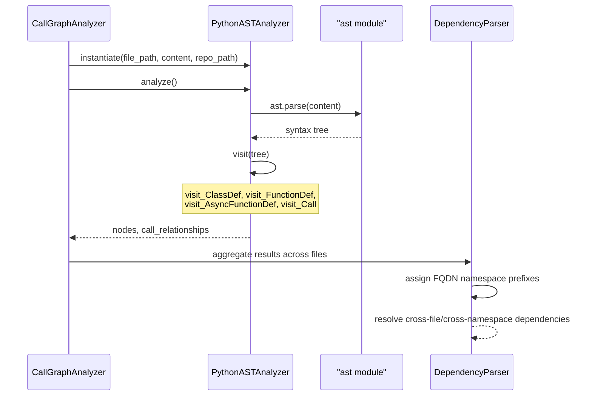
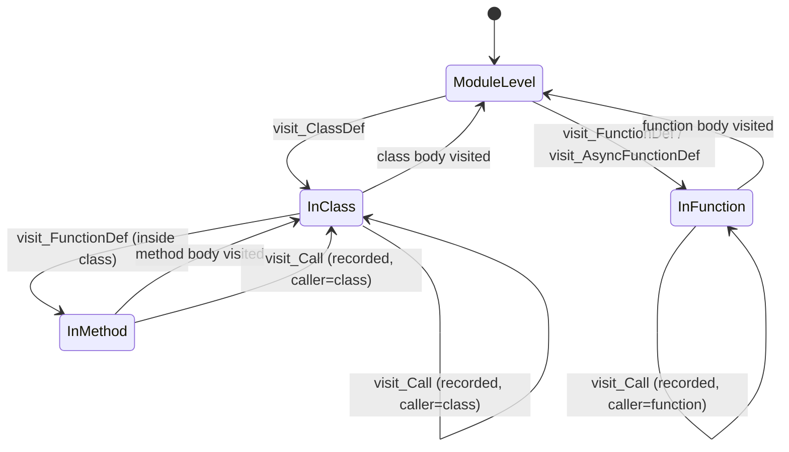

# Python Analyzer

The Python Analyzer module provides the Python-specific implementation of CodeWiki's static source-code analysis pipeline. It walks the Abstract Syntax Tree (AST) of `.py`/`.pyx` source files, extracts top-level classes and functions as reusable dependency-graph nodes, and records the call relationships between them. Its output feeds directly into the language-agnostic components that build the repository-wide dependency graph and, ultimately, the documentation generation pipeline.

This module contains a single core component: `PythonASTAnalyzer`, plus the convenience function `analyze_python_file` that wraps its usage for callers that only need a one-shot extraction.

## Purpose and Role in the System

Within the [Language Analyzers](language_analyzers.md) family, each language has its own analyzer that produces a normalized output of `Node` and `CallRelationship` objects. The Python Analyzer is CodeWiki's native implementation for Python, using Python's built-in `ast` module rather than Tree-sitter (which is used by the other language analyzers such as [C-Family Analyzers](c_family_analyzers.md), [Java Analyzer](java_analyzer.md), [Web Scripting Analyzers](web_scripting_analyzers.md), and [PHP Analyzer](php_analyzer.md)).

The extracted nodes and relationships conform to the shared data model defined in the Data Models and Utilities sub-module of the dependency analysis pipeline (`Node`, `CallRelationship`), and are consumed by the Dependency Graph Construction sub-module (via `DependencyParser`) as well as orchestrated by [Repository and Call Graph Analysis](repository_and_call_graph_analysis.md).


## Component Overview

### `PythonASTAnalyzer`

`PythonASTAnalyzer` is a subclass of `ast.NodeVisitor` that traverses the parsed AST of a single Python file and produces:

- `nodes: List[Node]` — top-level classes and functions found in the file.
- `call_relationships: List[CallRelationship]` — call edges between classes/functions detected during traversal.

It maintains state during traversal (`current_class_name`, `current_function_name`, `top_level_nodes`) so that nested calls and inheritance relationships can be correctly attributed to their enclosing top-level component.

| Attribute | Type | Description |
|---|---|---|
| `file_path` | `str` | Absolute or relative path to the file being analyzed |
| `repo_path` | `Optional[str]` | Repository root, used to compute relative paths and module paths |
| `content` | `str` | Raw source text of the file |
| `lines` | `List[str]` | Source split into lines, used for extracting `source_code` snippets |
| `nodes` | `List[Node]` | Accumulated top-level components |
| `call_relationships` | `List[CallRelationship]` | Accumulated call/inheritance edges |
| `current_class_name` | `Optional[str]` | Class currently being visited (`None` at module level) |
| `current_function_name` | `Optional[str]` | Function currently being visited |
| `top_level_nodes` | `Dict[str, Node]` | Lookup of top-level names to `Node`, used to resolve local calls |

#### Key methods

- **`analyze()`** — entry point. Parses `self.content` into an AST with `ast.parse`, suppressing `SyntaxWarning`s from escape sequences in analyzed code, then calls `self.visit(tree)` to start traversal. Catches `SyntaxError` (logged as a warning, file skipped) and any other exception (logged as an error with traceback).
- **`visit_ClassDef(node)`** — creates a `Node` of `component_type="class"` for every class definition. Extracts base class names via `_extract_base_class_name` and, for any base class also defined at the top level of the same file, appends a resolved `CallRelationship` representing inheritance. Sets `current_class_name` for the duration of visiting the class body so nested methods/calls are attributed correctly.
- **`visit_FunctionDef` / `visit_AsyncFunctionDef`** — both delegate to `_process_function_node`, which only creates a `Node` (`component_type="function"`) when the function is **top-level** (i.e., `current_class_name` is `None`). Methods inside classes are visited (for call-relationship extraction) but are **not** emitted as standalone nodes — the analyzer intentionally reports methods as part of call activity attributed to their enclosing class rather than as separate components.
- **`visit_Call(node)`** — records a `CallRelationship` whenever a call happens inside a top-level function body or anywhere inside a class body. The caller ID is the enclosing class or function's component ID; the callee is resolved to a component ID if it matches a name already discovered in `top_level_nodes` (`is_resolved=True`), otherwise the raw call name is stored unresolved for later cross-file resolution.
- **`_get_call_name(node)`** — extracts a call target's name from `ast.Name` or `ast.Attribute` nodes (e.g., `obj.method()` → `"obj.method"`), filtering out common Python built-ins (`print`, `len`, `isinstance`, exception types, etc.) so they don't pollute the dependency graph.
- **`_get_component_id(name)` / `_get_module_path()` / `_get_relative_path()`** — helpers that compute the file's dotted module path (relative to `repo_path`, with `.py`/`.pyx` stripped and path separators converted to dots) and combine it with a component name to build a `module.path::ComponentName` fully-qualified identifier. This FQDN format is what the rest of the dependency-analysis pipeline expects.
- **`_should_include_function(func)`** — filters out helper/test functions whose name starts with `_test_`.

#### Component ID Format

Every emitted `Node.id` follows the pattern:

```text
<dotted.module.path>::<ComponentName>
```

For example, a class `Foo` defined in `src/be/utils/helpers.py` (with repo root `src/be`) becomes:

```text
utils.helpers::Foo
```

This FQDN convention is consistent across all language analyzers and is what downstream components (`DependencyParser`, `DependencyGraphBuilder`) rely on when merging namespaces and resolving cross-file/cross-namespace dependencies.

### `analyze_python_file`

A thin functional wrapper for single-shot analysis:

```python
def analyze_python_file(
    file_path: str, content: str, repo_path: Optional[str] = None
) -> Tuple[List[Node], List[CallRelationship]]:
    analyzer = PythonASTAnalyzer(file_path, content, repo_path)
    analyzer.analyze()
    return analyzer.nodes, analyzer.call_relationships
```

This is the function typically invoked by the call-graph orchestration layer for each discovered `.py` file.

## Data Model Dependencies

The analyzer produces instances of the shared Pydantic models defined in the Data Models and Utilities sub-module of the dependency analysis pipeline:

- **`Node`** — represents a class or function component, including its FQDN `id`, `component_type`, source location (`start_line`/`end_line`), extracted `docstring`, `parameters` (for functions), and `base_classes` (for classes).
- **`CallRelationship`** — represents a directed edge (`caller` → `callee`) with the source line (`call_line`) and whether the callee was resolved to a known local component (`is_resolved`).

These models are namespace-agnostic at emission time — the analyzer produces relative, per-file identifiers, and it is the responsibility of `DependencyParser` (in the Dependency Graph Construction sub-module) to apply namespace prefixes and merge results across files/repositories into a single fully-qualified dependency graph.

## Processing Flow



### Traversal State Machine



Note: methods nested inside a class are visited for call extraction (calls are attributed to the *class*, not the method), but they never produce a standalone `Node` — only top-level classes and functions are emitted as graph components.

## Key Design Decisions

1. **AST-based, not Tree-sitter-based.** Unlike the other language analyzers in [Language Analyzers](language_analyzers.md), Python analysis uses the standard library `ast` module, since Python ships a mature, precise parser natively — no external grammar dependency is required.
2. **Top-level-only node emission.** Only module-level classes and functions become `Node` components; methods are folded into their owning class's call activity. This keeps the granularity of the dependency graph consistent with the abstraction level used across other language analyzers.
3. **Built-in call filtering.** `_get_call_name` explicitly excludes a curated set of Python built-ins to avoid noisy, meaningless edges (e.g., `print()`, `isinstance()`, `len()`) in the dependency graph.
4. **Inheritance as call relationships.** Base classes are represented as `CallRelationship` edges (`is_resolved=True`) when the base class is also defined in the same file, allowing the dependency graph to visualize class hierarchies alongside method calls.
5. **Resilience.** `analyze()` catches both `SyntaxError` (malformed source, logs a warning and skips the file) and generic exceptions (logs full traceback) so that a single unparsable file does not halt the broader repository-wide analysis performed by [Repository and Call Graph Analysis](repository_and_call_graph_analysis.md).

## Related Modules

- [Language Analyzers](language_analyzers.md) — parent module grouping all language-specific analyzers (Python, PHP, Java, JS/TS, C/C++/C#).
- [C-Family Analyzers](c_family_analyzers.md), [Java Analyzer](java_analyzer.md), [Web Scripting Analyzers](web_scripting_analyzers.md), [PHP Analyzer](php_analyzer.md) — sibling analyzers using Tree-sitter grammars for their respective languages.
- The Data Models and Utilities sub-module of the dependency analysis pipeline defines the `Node` and `CallRelationship` models produced by this analyzer.
- The Dependency Graph Construction sub-module consumes analyzer output via `DependencyParser` to build the namespaced, repository-wide dependency graph.
- [Repository and Call Graph Analysis](repository_and_call_graph_analysis.md) — orchestrates file discovery and dispatches each Python file to `PythonASTAnalyzer` as part of the broader call-graph analysis process.
