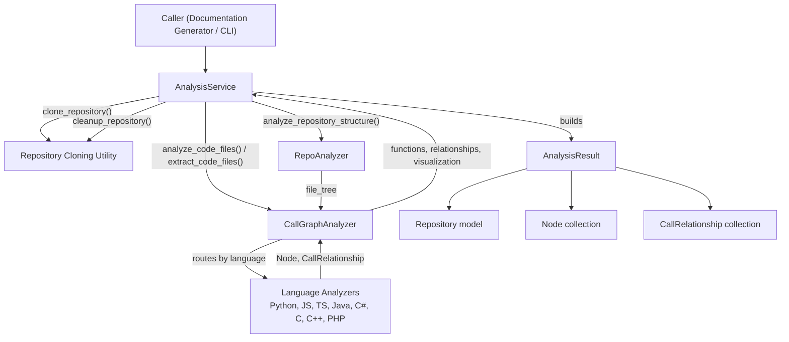
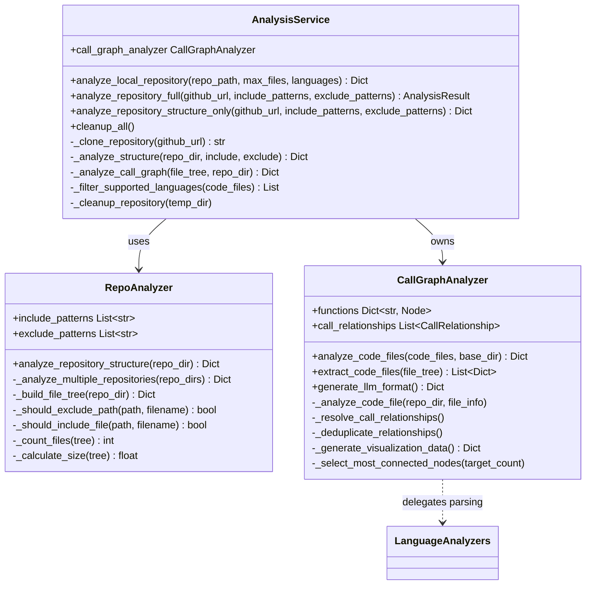
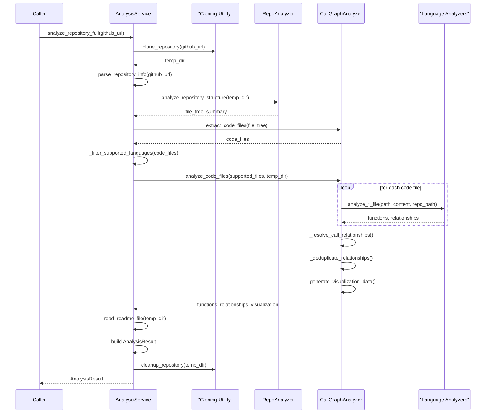
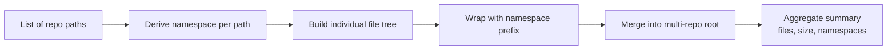
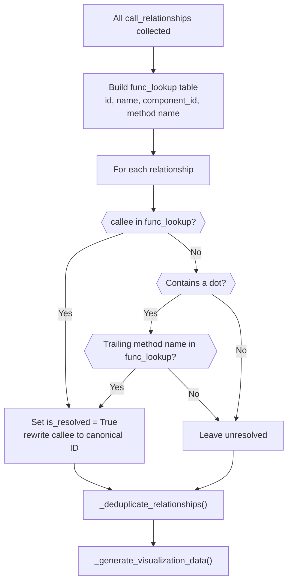
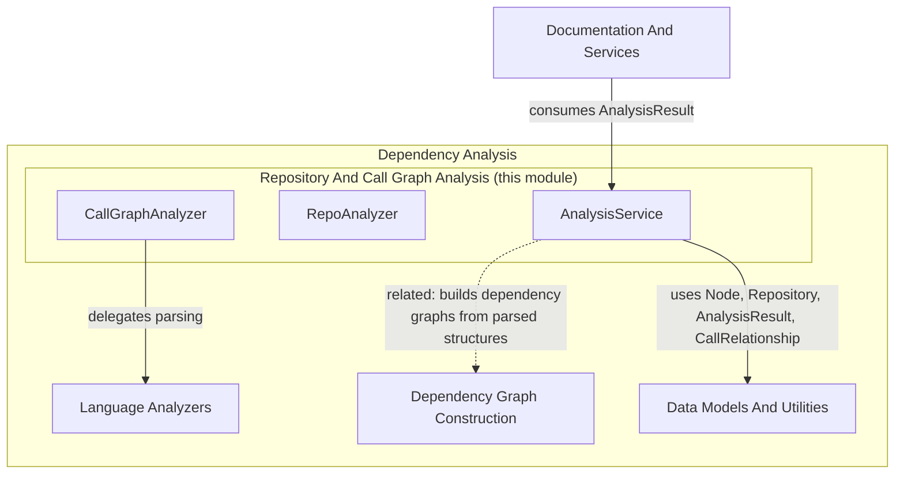

# Repository And Call Graph Analysis

The Repository And Call Graph Analysis module is the orchestration core of CodeWiki's dependency analysis pipeline. It coordinates repository cloning, file-structure discovery, and multi-language call graph construction, producing the structured `AnalysisResult` data that downstream documentation generation relies on. This module sits at the heart of the [Dependency Analysis](dependency-analysis.md) subsystem, delegating language-specific parsing to the [Language Analyzers](language_analyzers.md) module and relying on shared types from [Data Models And Utilities](data_models_and_utilities.md).

## Purpose And Scope

This module answers three core questions for any given repository:

1. **What files exist, and which are relevant?** — handled by `RepoAnalyzer`.
2. **What functions/methods exist, and how do they call each other?** — handled by `CallGraphAnalyzer`.
3. **How do these pieces combine into a complete, cleaned-up analysis result?** — handled by `AnalysisService`.

Together, these three components transform a raw repository (local folder or GitHub URL) into a normalized graph of nodes (functions/methods) and relationships (calls), ready for visualization or LLM-driven documentation generation.

## Core Components

| Component | Responsibility |
|---|---|
| `AnalysisService` | Top-level orchestrator: clones repositories, drives structure and call graph analysis, assembles `AnalysisResult`, manages temp-directory lifecycle |
| `RepoAnalyzer` | Walks a repository's filesystem, builds a filtered file tree, supports single or multi-path (namespaced) repositories |
| `CallGraphAnalyzer` | Routes code files to the appropriate language analyzer, aggregates functions/relationships, resolves call targets, and produces visualization data |

## Architecture Overview

## Component Relationships

## Data Flow: Full Repository Analysis

The primary entry point, `AnalysisService.analyze_repository_full`, drives a multi-stage pipeline from a GitHub URL to a complete `AnalysisResult`.

## AnalysisService

`AnalysisService` is the primary façade for repository analysis and is consumed by higher layers such as the Documentation And Services module (a sibling under Backend Core). It exposes three main operations:

### 1. `analyze_local_repository`

Analyzes a repository already present on disk (no cloning/cleanup involved). It:
- Delegates structure discovery to `RepoAnalyzer.analyze_repository_structure`
- Extracts candidate code files via `CallGraphAnalyzer.extract_code_files`
- Optionally filters by requested `languages`
- Caps the number of files analyzed via `max_files`
- Returns a simplified dictionary of `nodes`, `relationships`, and a `summary`

### 2. `analyze_repository_full`

The complete pipeline for a remote GitHub repository:
1. Clone the repository to a temp directory (tracked in `_temp_directories` for later cleanup)
2. Parse repository metadata (owner, name, URL) from the GitHub URL
3. Analyze the file structure (via `RepoAnalyzer`)
4. Run the call graph analysis (via `CallGraphAnalyzer`)
5. Read the repository's `README` file, if present
6. Assemble a `Repository` model and combine everything into an `AnalysisResult`
7. Clean up the temporary clone directory

If any step fails, the method ensures the temp directory is cleaned up before raising a `RuntimeError`.

### 3. `analyze_repository_structure_only`

A lightweight variant that skips call graph generation entirely — useful when only the file tree and summary statistics are needed (e.g., quick previews).

### Supported Languages

`AnalysisService._get_supported_languages()` and `_filter_supported_languages()` restrict call graph analysis to: `python`, `javascript`, `typescript`, `java`, `csharp`, `c`, `cpp`, `php`, `go`, `rust`. Note that only a subset of these currently have dedicated call-graph routing implemented in `CallGraphAnalyzer` (see below); unmatched languages are counted but skipped.

### Lifecycle Management

`AnalysisService` tracks every temp directory it creates in `_temp_directories`. `cleanup_all()` (also invoked from `__del__`) ensures no cloned repository is left behind, even if a caller forgets to explicitly clean up after an exception.

### Backward-Compatible Functions

Two module-level functions, `analyze_repository` and `analyze_repository_structure_only`, wrap `AnalysisService` for callers that expect the older tuple-based `(result, temp_dir)` return signature. They always return `None` for the second tuple element since cleanup is now handled internally.

## RepoAnalyzer

`RepoAnalyzer` is responsible purely for filesystem traversal and filtering — it has no knowledge of programming languages or call graphs.

### Filtering Model

- **Include patterns**: If explicitly provided, they *replace* the module's `DEFAULT_INCLUDE_PATTERNS`. If omitted, all files are eligible for inclusion (subject to exclude filtering).
- **Exclude patterns**: If provided, they are *merged* with `DEFAULT_IGNORE_PATTERNS` (e.g., `.git`, `node_modules`, build artifacts) rather than replacing them.

### File Tree Construction

`_build_file_tree` recursively walks the directory using `pathlib.Path`, producing a nested dictionary of `type: "file" | "directory"` nodes. Safety checks include:
- Rejecting symlinks outright
- Rejecting paths that resolve outside the base directory (path traversal protection)
- Skipping directories that raise `PermissionError`

### Multi-Repository Support

When given a list of paths instead of a single path, `analyze_repository_structure` calls `_analyze_multiple_repositories`, which:
1. Derives a namespace for each path (its base directory name) via `_get_namespace_from_path`
2. Builds an individual file tree per repository
3. Wraps each tree in a namespace-prefixed directory node (tagging `_namespace` and `_original_path`)
4. Merges all trees under a single `multi-repo` root
5. Aggregates file counts and total size into a combined summary, including the list of `namespaces` and `repositories` count

This enables analyzing related repositories (e.g., a frontend and backend pair) as a single logical unit while preserving traceability back to their original paths.

## CallGraphAnalyzer

`CallGraphAnalyzer` is the multi-language orchestrator that turns a list of code files into a normalized call graph.

### File Extraction

`extract_code_files` recursively walks a `file_tree` (produced by `RepoAnalyzer`) and collects files whose extension appears in the shared `CODE_EXTENSIONS` mapping, attaching a `language` tag to each entry.

### Language Routing

`_analyze_code_file` dispatches each file to a language-specific private method based on `file_info["language"]`:

| Language | Handler | Delegates To |
|---|---|---|
| `python` | `_analyze_python_file` | `analyze_python_file` (Python AST analyzer) |
| `javascript` | `_analyze_javascript_file` | `analyze_javascript_file_treesitter` |
| `typescript` | `_analyze_typescript_file` | `analyze_typescript_file_treesitter` |
| `java` | `_analyze_java_file` | `analyze_java_file` |
| `csharp` | `_analyze_csharp_file` | `analyze_csharp_file` |
| `c` | `_analyze_c_file` | `analyze_c_file` |
| `cpp` | `_analyze_cpp_file` | `analyze_cpp_file` |
| `php` | `_analyze_php_file` | `analyze_php_file` |

Each handler is implemented in the [Language Analyzers](language_analyzers.md) module and returns a tuple of `(functions, relationships)` using the shared `Node` and `CallRelationship` models. Errors from any single file are caught and logged, so one problematic file does not abort the entire analysis run.

### Call Resolution

After all files are analyzed, `_resolve_call_relationships` builds a lookup table (`func_lookup`) that maps function IDs, plain names, component IDs, and trailing method names to their canonical function ID. Each recorded `CallRelationship.callee` is then resolved against this table:
- Exact ID or name match → resolved directly
- Dotted callee (e.g., `ClassName.method`) → falls back to matching just the trailing method name

Relationships that cannot be matched remain `is_resolved = False` and are excluded from the visualization graph (though retained in the raw relationship list) unless explicitly deduplicated by caller/callee pair via `_deduplicate_relationships`.

### Visualization Data

`_generate_visualization_data` produces Cytoscape.js-compatible graph elements:
- **Nodes**: tagged with CSS-friendly classes (`node-method`/`node-function`, plus a `lang-*` class derived from file extension)
- **Edges**: only *resolved* relationships become edges, each carrying the source/target function IDs and the call line number
- **Summary**: total nodes, total edges, and count of unresolved calls

### LLM-Optimized Output

`generate_llm_format` produces a simplified structure — function name, source file, first line of docstring as "purpose", parameters, and a computed `is_recursive` flag — along with a `calls`/`called_by` mapping per function. This trims internal IDs and full paths, making the graph easier for an LLM prompt to consume directly.

### Node Selection For Large Graphs

`_select_most_connected_nodes` provides a degree-centrality-based reduction: when a repository has more functions than a target count, it builds an undirected adjacency graph from resolved relationships, ranks functions by connection count, and retains only the top `target_count` nodes (plus relationships where both endpoints survive). If no relationships exist at all, it falls back to keeping the first `target_count` functions by insertion order.

## How This Module Fits Into The System

- **Upstream consumers**: The Documentation And Services module (a sibling under Backend Core) invokes `AnalysisService` to obtain the structured data needed to drive automated documentation generation.
- **Downstream delegation**: Actual per-language AST parsing is implemented in [Language Analyzers](language_analyzers.md); this module only orchestrates *which* analyzer runs and *how* results are merged.
- **Shared types**: `AnalysisResult`, `NodeSelection`, `CallRelationship`, `Node`, and `Repository` are defined in [Data Models And Utilities](data_models_and_utilities.md) and used throughout this module as the common data contract.
- **Related graph construction**: The [Dependency Graph Construction](dependency_graph_construction.md) module builds higher-level dependency graphs that can complement the function-level call graph produced here.

## Error Handling And Robustness

- Per-file analysis errors are caught and logged individually in `CallGraphAnalyzer._analyze_code_file`, so a single malformed file does not halt the entire batch.
- `AnalysisService.analyze_repository_full` and `analyze_repository_structure_only` guarantee cleanup of the cloned temp directory even on failure, then re-raise as a `RuntimeError` with a descriptive message.
- `RepoAnalyzer._build_file_tree` defensively rejects symlinks and paths that escape the repository root, mitigating path-traversal risks during traversal of untrusted repositories.
- README lookup (`_read_readme_file`) validates path safety via `assert_safe_path` before reading file contents.
