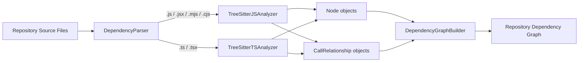
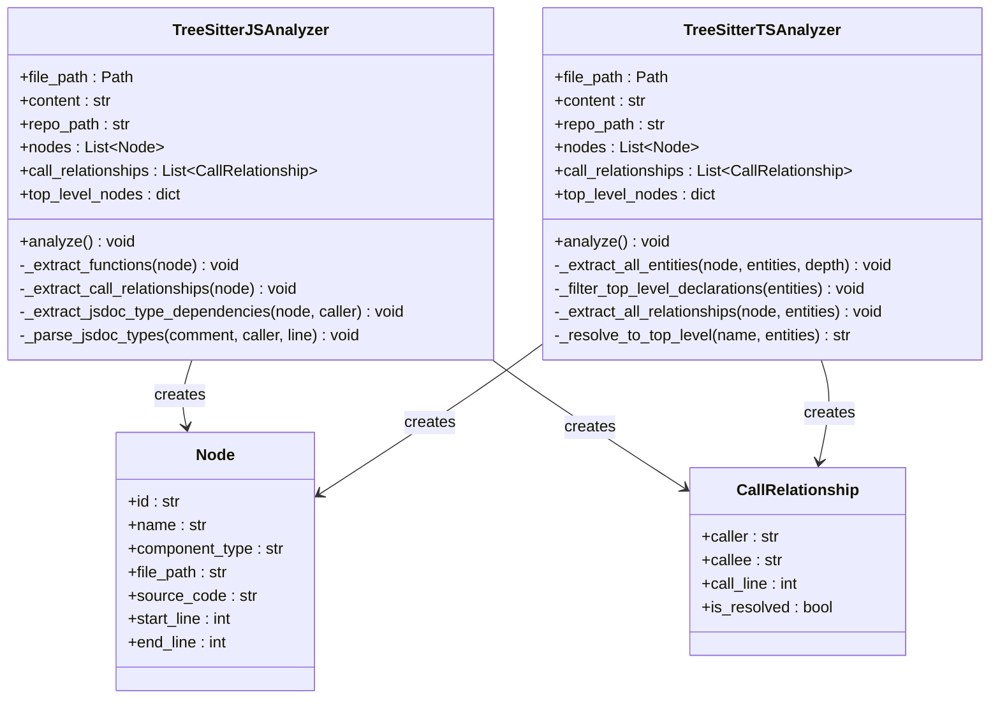
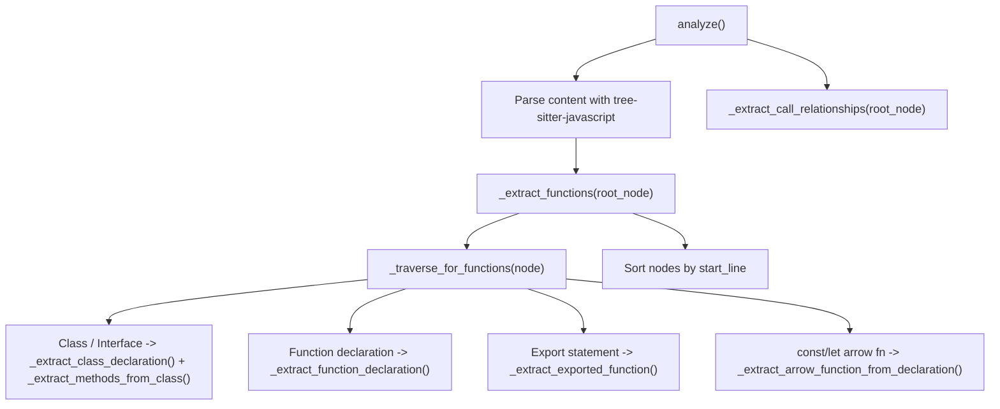
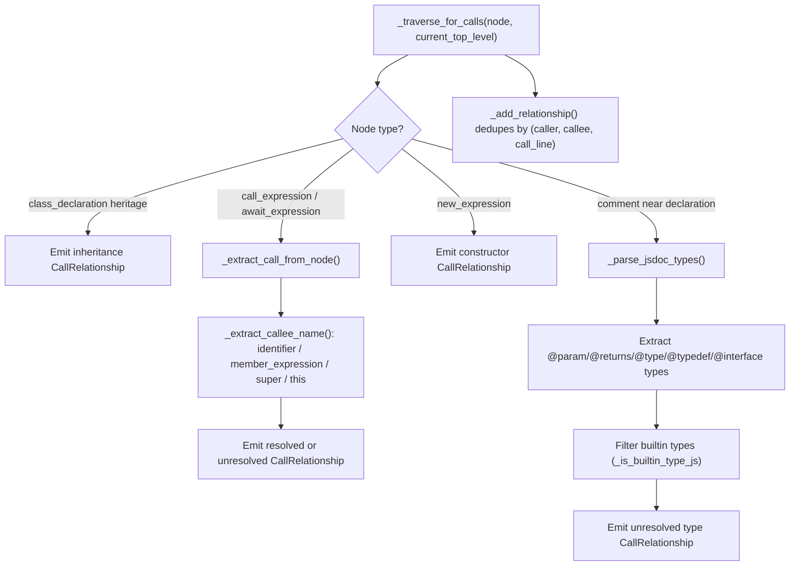
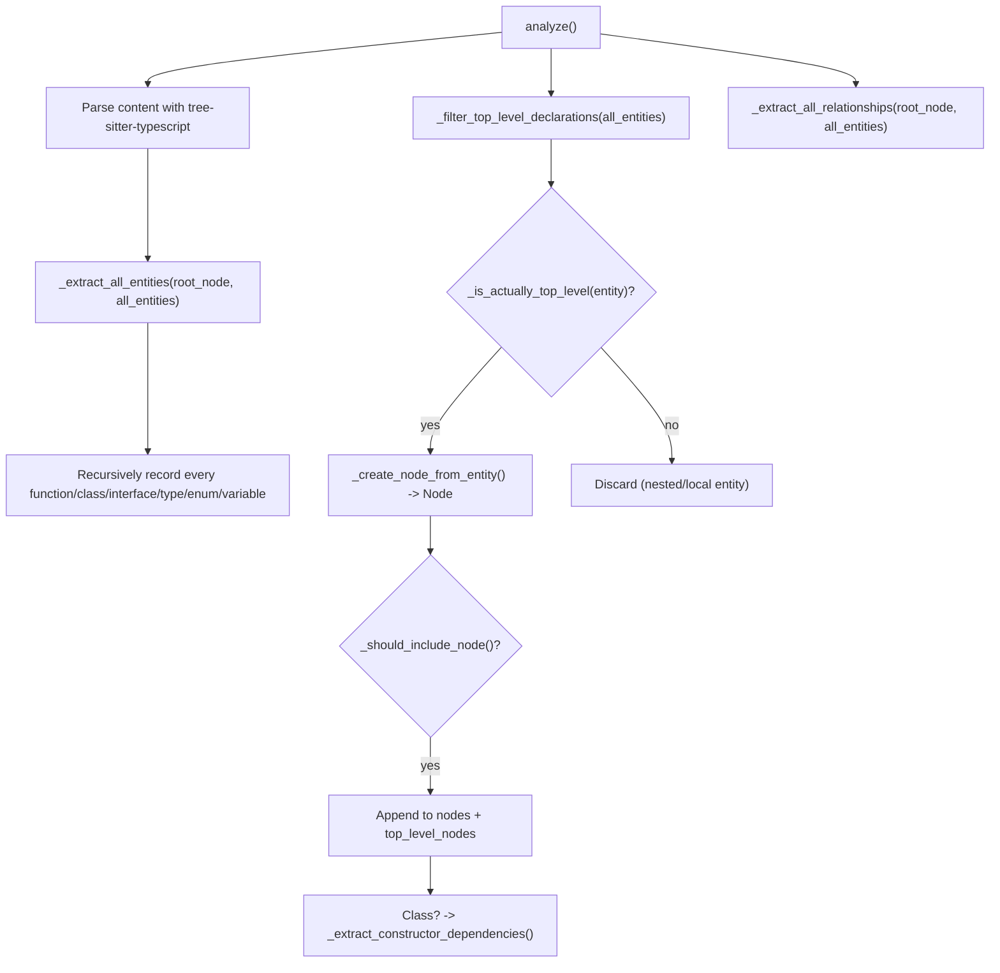
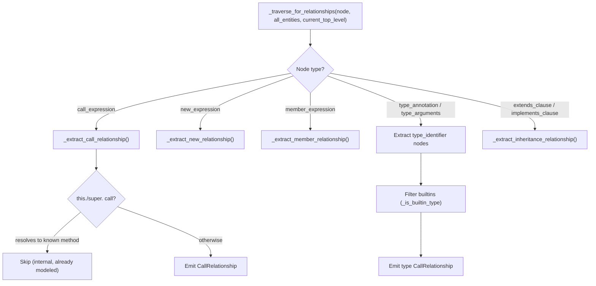
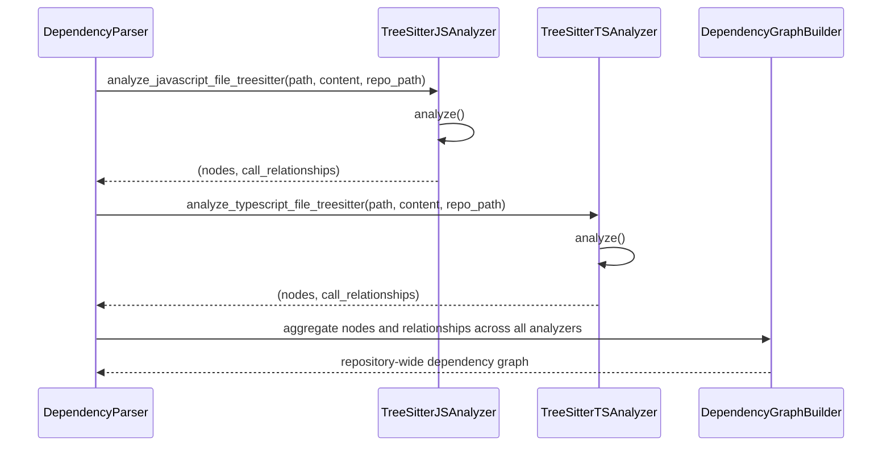

# Web Scripting Analyzers

The Web Scripting Analyzers module provides the language-specific, tree-sitter-based parsing logic used by the dependency analyzer to extract source-code structure and relationships from **JavaScript** and **TypeScript** files. It is one of several per-language analyzer implementations that plug into the broader dependency analysis pipeline, converting raw source text into structured `Node` and `CallRelationship` objects that downstream components use to build a full dependency graph of a repository.

This module contains two closely related analyzers:

- **`TreeSitterJSAnalyzer`** — parses JavaScript (and JSX-style) source using the `tree-sitter-javascript` grammar.
- **`TreeSitterTSAnalyzer`** — parses TypeScript (and TSX) source using the `tree-sitter-typescript` grammar, with richer support for interfaces, type aliases, enums, and generic type resolution.

Both analyzers share the same conceptual pipeline: parse the file into an AST, walk the tree to identify top-level declarations (functions, classes, methods, etc.), convert them into `Node` objects, and then walk the tree a second time to infer `CallRelationship` edges (function calls, instantiations, inheritance, and type references) between those nodes.

## Position in the Dependency Analysis Pipeline

The Web Scripting Analyzers module is a child of the [Language Analyzers](language_analyzers.md) module, which groups together all language-specific tree-sitter analyzers used by the dependency analyzer. It is a sibling of the other per-language analyzer groups:

- [C Family Analyzers](c_family_analyzers.md) (C, C++, C#)
- [Java Analyzer](java_analyzer.md)
- [PHP Analyzer](php_analyzer.md)
- [Python Analyzer](python_analyzer.md)

The `Node` and `CallRelationship` data structures produced by this module are defined in the Data Models and Utilities sub-module of the dependency analysis pipeline, and the resulting nodes/relationships are consumed by the Dependency Graph Construction sub-module (via `DependencyParser` and `DependencyGraphBuilder`) as well as the [Repository and Call Graph Analysis](repository_and_call_graph_analysis.md) module, which resolves and analyzes the aggregated call graph across the whole repository.

## Core Responsibilities

Both analyzers are instantiated per source file and expose the same external contract:

| Aspect | Description |
|---|---|
| Constructor | `__init__(file_path, content, repo_path=None)` — initializes the tree-sitter `Parser`/`Language`, empty node/relationship collections, and a `top_level_nodes` lookup dict. |
| Entry point | `analyze()` — parses the file content into an AST and populates `self.nodes` and `self.call_relationships`. |
| Output | `self.nodes: List[Node]`, `self.call_relationships: List[CallRelationship]` |
| Module-level helper | `analyze_javascript_file_treesitter(...)` / `analyze_typescript_file_treesitter(...)` — convenience functions that construct the analyzer, run `analyze()`, and return `(nodes, call_relationships)`, catching and logging any exceptions so a single malformed file does not abort the whole analysis run. |

For details on the `Node` and `CallRelationship` model fields, see the Data Models and Utilities sub-module of the dependency analysis pipeline.

## TreeSitterJSAnalyzer

`TreeSitterJSAnalyzer` (`codewiki/src/be/dependency_analyzer/analyzers/javascript.py`) implements a **single-pass, statement-driven traversal** strategy: as it walks the AST it tracks the name of the currently enclosing top-level declaration (`current_top_level`) and attaches any calls, instantiations, or type references it finds to that declaration.

### Declaration Extraction

`analyze()` first calls `_extract_functions(root_node)`, which performs a recursive traversal (`_traverse_for_functions`) looking for:

- **Classes / abstract classes / interfaces** (`class_declaration`, `abstract_class_declaration`, `interface_declaration`) → `_extract_class_declaration()`, which also records `class_heritage` (`extends`) as `base_classes`, then recurses into the class body via `_extract_methods_from_class()` to register methods (`method_definition`) and arrow-function class fields (`field_definition`) in `top_level_nodes`.
- **Function declarations** (`function_declaration`, `generator_function_declaration`) → `_extract_function_declaration()`, which detects `async`/generator modifiers to build a human-readable `display_name`.
- **Exported functions** (`export_statement` wrapping a `function_declaration`) → `_extract_exported_function()`, including special handling for `export default function (...)`.
- **Arrow functions/function expressions assigned to `const`/`let`/`var`** (`lexical_declaration`) → `_extract_arrow_function_from_declaration()`.

Only declarations whose `_find_containing_class()` is `None` (i.e., not nested inside a class) are treated as standalone top-level nodes; class members are instead registered through `_extract_methods_from_class()`. All discovered nodes are finally sorted by `start_line`.

### Relationship Extraction

`_extract_call_relationships(root_node)` drives `_traverse_for_calls(node, current_top_level)`, which updates `current_top_level` whenever it enters a new class/function/arrow-function declaration and, at each node, checks for:

- **`class_heritage`** → emits an unresolved inheritance `CallRelationship` from the class to its base class.
- **`call_expression`** and **`await_expression`** wrapping a call → `_extract_call_from_node()` resolves the callee name (`_extract_callee_name()`, which understands plain identifiers, `member_expression` property access, `super`, and `this`) and determines `is_resolved` based on whether the callee is a known top-level node in the same file. Calls through `this.`/`super.` that target an existing method definition are treated as already-known internal method calls and skipped to avoid duplicate/self edges.
- **`new_expression`** → emits a constructor-call relationship.
- **JSDoc comments** attached to a declaration (via `_extract_jsdoc_type_dependencies` / `_parse_jsdoc_types`) → parses `@param`, `@returns`/`@return`, `@type`, `@typedef`, and `@interface` tags with regular expressions, extracts referenced type names (including generics like `Array<Foo>` and unions `Foo|Bar`), and emits unresolved type-dependency relationships — after filtering out JS/JSDoc built-in types via `_is_builtin_type_js()`.

All relationships are deduplicated through `_add_relationship()`, which keys on `(caller, callee, call_line)` using an internal `seen_relationships` set.

## TreeSitterTSAnalyzer

`TreeSitterTSAnalyzer` (`codewiki/src/be/dependency_analyzer/analyzers/typescript.py`) takes a more elaborate **two-pass, entity-map-driven** approach that is better suited to TypeScript's richer type system (interfaces, type aliases, enums, generics, `implements` clauses).

### Pass 1: Entity Collection

`_extract_all_entities(root_node, all_entities, depth)` recursively walks the **entire** AST (not just top-level) and, for every recognized construct, builds a lightweight `dict` entry keyed by entity name and stores it in `all_entities`. Recognized construct types include:

- `function_declaration`, `generator_function_declaration` → `_extract_function_entity()`
- `arrow_function` (when assigned via `variable_declarator`) → `_extract_arrow_function_entity()`
- `method_definition` → `_extract_method_entity()`
- `class_declaration`, `abstract_class_declaration` → `_extract_class_entity()`
- `interface_declaration` → `_extract_interface_entity()`
- `type_alias_declaration` → `_extract_type_alias_entity()`
- `enum_declaration` → `_extract_enum_entity()`
- `variable_declarator`, `lexical_declaration`, `variable_declaration` → variable entity extractors
- `export_statement` → `_extract_export_statement_entity()` (handles exported functions, classes, interfaces, `export const` arrow functions, and `export default someCall(...)`)
- `ambient_declaration` → `_extract_ambient_declaration_entity()` (for `declare module "..."` blocks)

Each entity records its `depth`, the raw AST `node`, and its `parent_context` (via `_get_parent_context()`), which are later used to decide whether the entity is truly top-level.

### Pass 2: Top-Level Filtering

`_filter_top_level_declarations(all_entities)` iterates over every collected entity and calls `_is_actually_top_level()`, which walks up the ancestor chain rejecting entities nested inside a function/method body (`_is_inside_function_body()`) and accepting entities whose ancestor chain reaches `program`, `export_statement`, `ambient_declaration`, or `module`. Entities that pass this check are converted into `Node` objects via `_create_node_from_entity()` and filtered again by `_should_include_node()` (which excludes plain `variable` nodes and names like `constructor`, `__proto__`, `prototype`). Accepted classes/abstract classes also trigger `_extract_constructor_dependencies()`, which inspects constructor parameter type annotations to emit dependency relationships from the class to the types used in its constructor signature.

### Relationship Extraction

`_extract_all_relationships()` drives `_traverse_for_relationships(node, all_entities, current_top_level)`, which re-establishes `current_top_level` whenever it crosses a new top-level boundary (`_is_new_top_level()` / `_get_top_level_name()`) and, using the full `all_entities` map for context, inspects:

- **`call_expression`** → `_extract_call_relationship()`, distinguishing `this.`/`super.` method calls on the current class (skipped if they resolve to a known method of that class) from external/unknown calls.
- **`new_expression`** → `_extract_new_relationship()` for constructor instantiation.
- **`member_expression`** → `_extract_member_relationship()` for property access dependencies.
- **`type_annotation`** and **`type_arguments`** → `_extract_type_relationship()` / `_extract_type_arguments_relationship()`, walking nested `type_identifier` nodes (including generics) and filtering built-in TypeScript primitives via `_is_builtin_type()`.
- **`extends_clause`** and **`implements_clause`** → `_extract_inheritance_relationship()`.

Because `all_entities` retains information about every entity in the file (not just top-level ones), `_resolve_to_top_level()` and the `_is_actually_top_level()` checks inside `_extract_call_relationship()` are used to avoid creating spurious edges to purely local/nested identifiers, only emitting relationships when the target is a genuine top-level node or an external/unknown symbol.

## Comparison: JS vs. TS Analyzer Strategies

| Aspect | TreeSitterJSAnalyzer | TreeSitterTSAnalyzer |
|---|---|---|
| Grammar | `tree_sitter_javascript` | `tree_sitter_typescript` (`language_typescript()`) |
| Declaration discovery | Single recursive traversal restricted to statement-level constructs | Two-pass: collect *all* entities at any depth, then filter to genuine top-level ones |
| Type system support | JSDoc comment parsing (`@param`, `@returns`, `@type`, `@typedef`, `@interface`) | Native TypeScript constructs: interfaces, type aliases, enums, type annotations, generics, `implements` |
| Method/class handling | Methods and arrow-function class fields registered separately via `_extract_methods_from_class()` | Methods captured generically as entities during the entity pass; constructor parameter types drive extra dependency edges |
| Relationship resolution | Local check against `top_level_nodes` within the same traversal | Resolution against the full `all_entities` map plus `top_level_nodes`, enabling smarter local-vs-external distinction |
| Constructor dependency inference | Not modeled explicitly | `_extract_constructor_dependencies()` walks constructor parameter `type_annotation`s |
| Output types | `Node`, `CallRelationship` | `Node`, `CallRelationship` |

## Component and Module Path Resolution

Both analyzers compute a stable component identifier for every extracted `Node`/relationship endpoint using the same convention:

1. `_get_module_path()` — converts the file's path (relative to `repo_path`, if provided) into a dotted module path, stripping known JS/TS extensions (`.js`, `.ts`, `.jsx`, `.tsx`, `.mjs`, `.cjs`) and replacing path separators with `.`.
2. `_get_relative_path()` — the file path relative to the repository root, stored on the `Node` for display/navigation purposes.
3. `_get_component_id(name, ...)` — builds the final identifier as `"{module_path}::{name}"`, or `"{module_path}::{ClassName}.{method_name}"` for class methods (JS analyzer only; the TS analyzer keys entities by name for entity-map lookups and constructs the same `module_path::name` form for `Node.id`).

This identifier scheme ensures that nodes produced by these analyzers are consistent with those produced by other language analyzers, allowing the Dependency Graph Construction sub-module to merge and resolve cross-file relationships uniformly.

## Error Handling and Resilience

Both analyzers are defensive by design:

- Parser initialization failures (e.g., missing/incompatible tree-sitter grammar bindings) are caught in `__init__`, leaving `self.parser = None`; `analyze()` then logs a warning/debug message and returns early with empty `nodes`/`call_relationships` rather than raising.
- Individual extraction methods (`_extract_class_declaration`, `_extract_function_declaration`, `_parse_jsdoc_types`, etc.) wrap their logic in `try/except` blocks and return `None` or silently skip on failure, so a single malformed construct does not abort analysis of the rest of the file.
- The module-level `analyze_javascript_file_treesitter()` / `analyze_typescript_file_treesitter()` functions add a final safety net, catching any unhandled exception, logging it, and returning empty lists so that a single problematic file does not halt a repository-wide analysis run orchestrated by higher-level components such as `DependencyParser` or `AnalysisService` (see [Repository and Call Graph Analysis](repository_and_call_graph_analysis.md)).

## Usage in the Analysis Pipeline

`DependencyParser` (part of the Dependency Graph Construction sub-module) dispatches files to the appropriate analyzer based on file extension, collects the returned `Node`/`CallRelationship` lists from every file across the repository, and hands them to `DependencyGraphBuilder` to construct the final graph. Relationship resolution across files (turning unresolved `is_resolved=False` edges into concrete cross-node references) is handled by later stages such as `CallGraphAnalyzer`, documented in [Repository and Call Graph Analysis](repository_and_call_graph_analysis.md).
