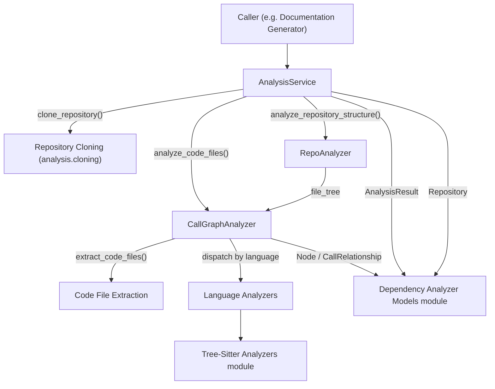
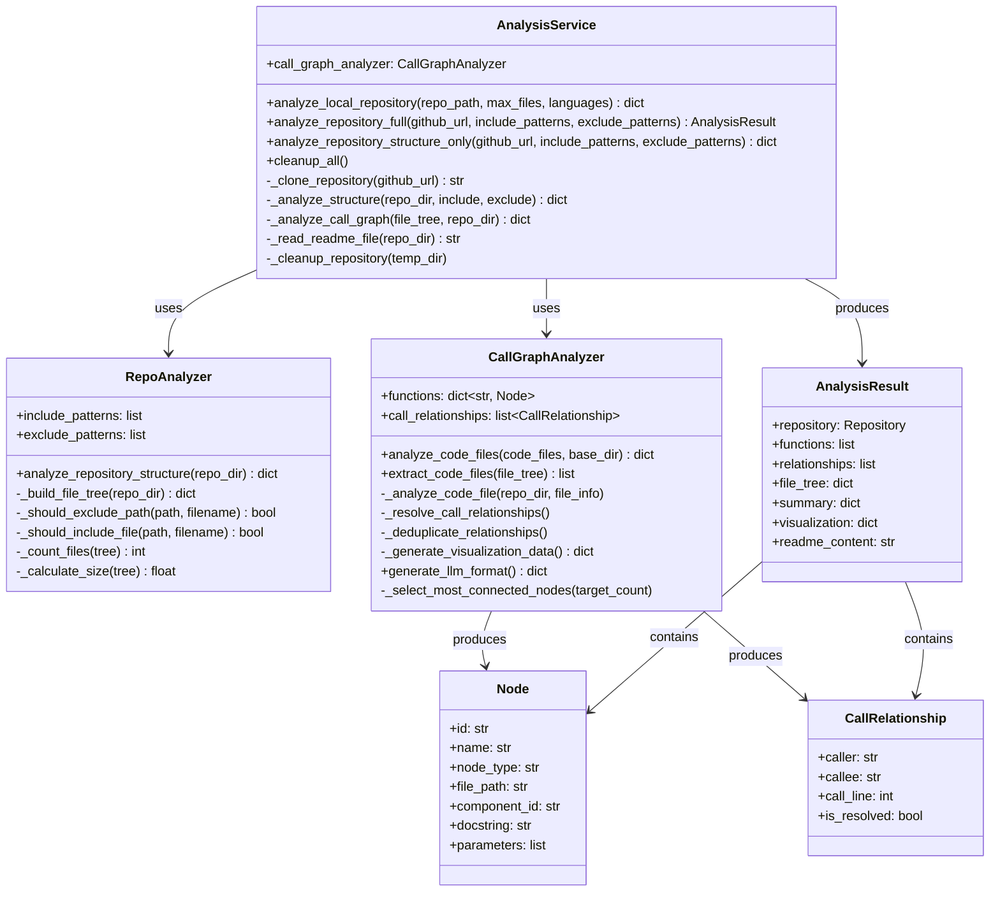
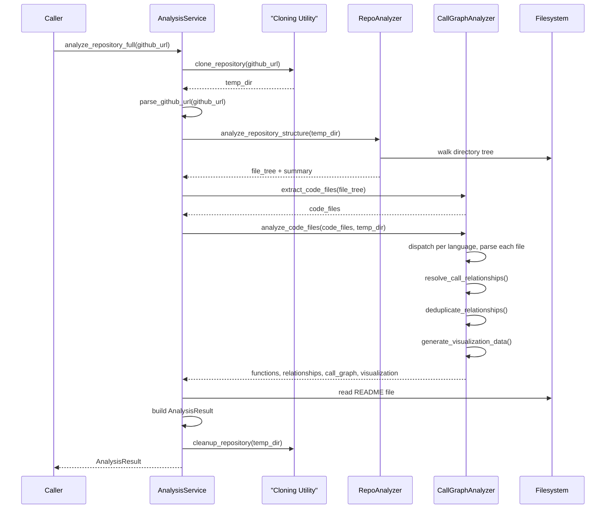
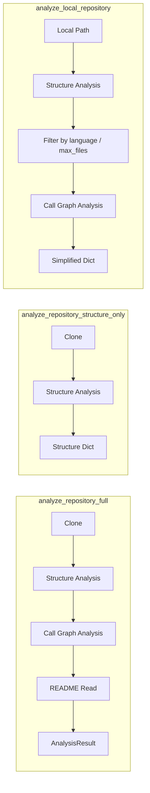
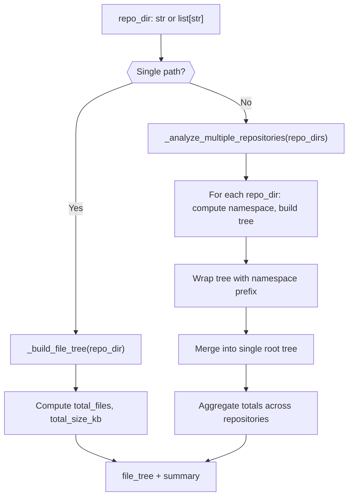
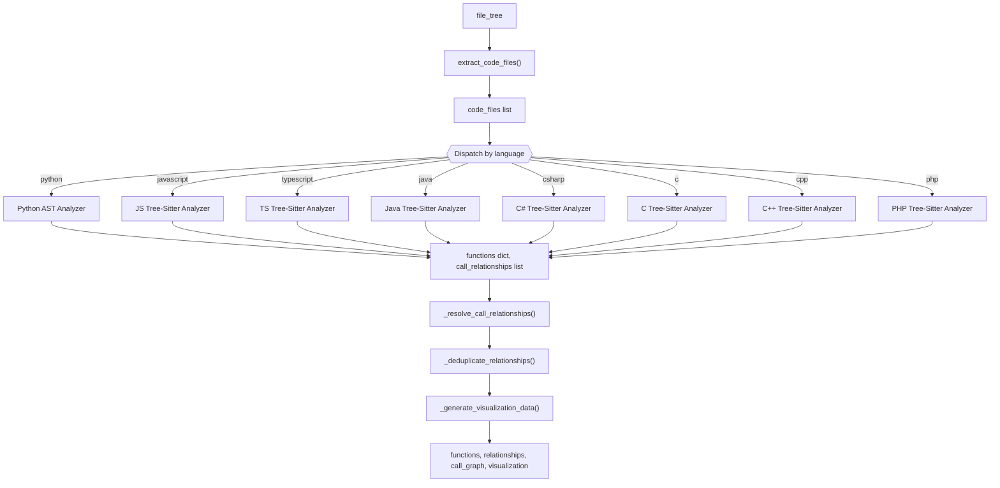
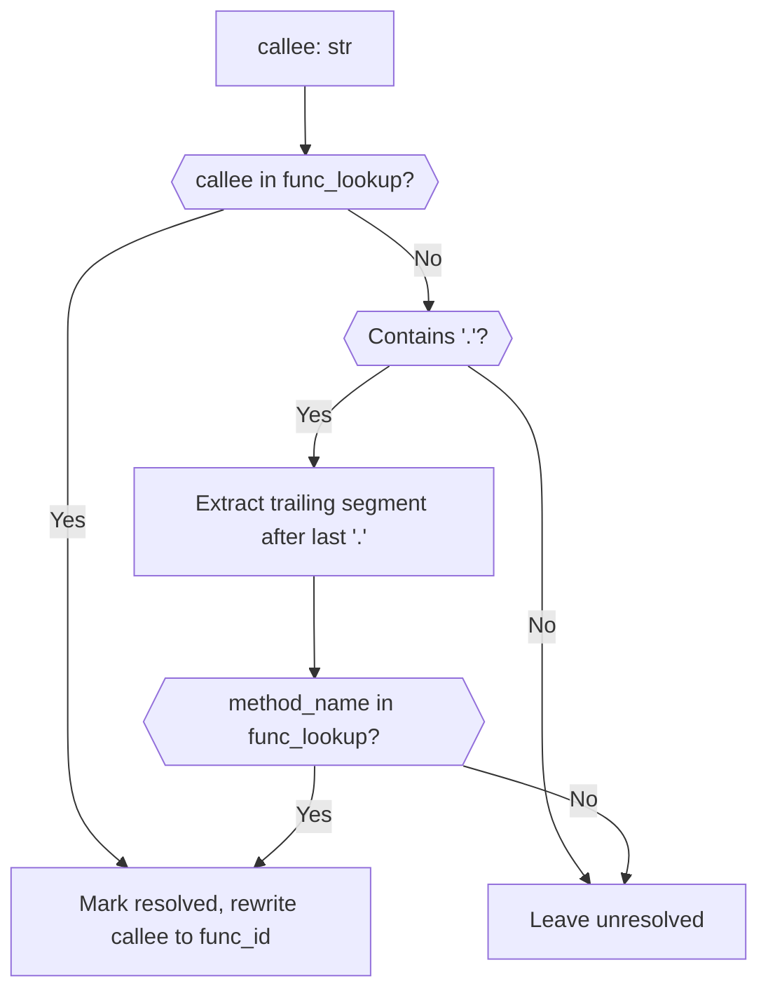

# Analysis Pipeline

The Analysis Pipeline module is the orchestration layer responsible for turning a raw repository (either a cloned GitHub repository or a local folder) into a structured, language-aware call graph. It coordinates repository structure discovery, multi-language source parsing, and call-relationship resolution, producing the `AnalysisResult` data that downstream documentation and visualization components consume.

This module sits inside the dependency analyzer subsystem of the backend and provides the primary entry point for "what does this codebase look like and how do its functions call each other?"

## Purpose and Scope

The Analysis Pipeline answers three questions for any supported repository:

1. **What files exist?** — via structure analysis and pattern-based filtering.
2. **What functions/methods/classes exist in each file?** — via per-language AST parsing.
3. **How do those functions call each other?** — via cross-file/cross-language call relationship resolution.

The pipeline does **not** implement language-specific parsing logic itself; it delegates that to the [Tree-Sitter Analyzers](../tree-sitter-analyzers/tree-sitter-analyzers.md) module. It also does not define the data model shapes it operates on — those come from [Dependency Analyzer Models](../dependency-analyzer-models/dependency-analyzer-models.md). Instead, this module focuses purely on **orchestration**: cloning, filtering, dispatching, aggregating, and cleaning up.

## Core Components

| Component | Responsibility |
|---|---|
| `AnalysisService` | Top-level façade that orchestrates the full analysis workflow: clone → structure analysis → call graph analysis → README extraction → result assembly → cleanup |
| `RepoAnalyzer` | Builds a filtered file tree for a repository (or multiple repositories), applying include/exclude glob patterns and computing summary statistics |
| `CallGraphAnalyzer` | Central multi-language orchestrator that extracts code files from a file tree, dispatches each file to the correct language analyzer, aggregates functions/relationships, resolves call targets, deduplicates edges, and generates visualization data |

## Architecture

`AnalysisService` is the public API of this module. It composes a `RepoAnalyzer` (created per-call, since include/exclude patterns can vary) and a long-lived `CallGraphAnalyzer` instance. `CallGraphAnalyzer` never parses source code itself — it lazily imports the language-specific analyzer function (e.g. `analyze_python_file`, `analyze_javascript_file_treesitter`) from the [Tree-Sitter Analyzers](../tree-sitter-analyzers/tree-sitter-analyzers.md) module at call time, keeping this module decoupled from heavy per-language parser dependencies.

## Component Relationships

`AnalysisResult`, `Node`, `CallRelationship`, and `Repository` are defined in the [Dependency Analyzer Models](../dependency-analyzer-models/dependency-analyzer-models.md) module and are reused here as the canonical output contract.

## Workflow: Full Repository Analysis

`analyze_repository_full` is the primary entry point used when a complete call graph (functions + relationships + visualization) is required for a GitHub repository. It is a sequential pipeline with cleanup guaranteed on both success and failure paths.

If any step raises an exception, `AnalysisService` still cleans up the temporary clone directory before re-raising a `RuntimeError`, preventing orphaned checkouts from accumulating on disk.

## Workflow: Structure-Only and Local Analysis

Two lighter-weight workflows exist alongside the full analysis path:

- **`analyze_repository_structure_only`** clones a GitHub repository and runs only `RepoAnalyzer`, skipping call graph generation entirely. This is used when only the file tree and summary statistics are needed (e.g. for quick previews).
- **`analyze_local_repository`** skips cloning altogether and operates directly on a local folder path, optionally filtering by `languages` and capping the number of files via `max_files`. It returns a simplified dict (`nodes`, `relationships`, `summary`) rather than a full `AnalysisResult`.

## Repository Structure Analysis (`RepoAnalyzer`)

`RepoAnalyzer` walks a repository directory recursively and builds a nested `file_tree` dictionary, applying two categories of patterns:

- **Include patterns**: if explicitly provided, they *replace* the defaults and restrict results to matching files only.
- **Exclude patterns**: if provided, they are *merged* with a built-in default ignore list (e.g. `.git`, `node_modules`).

It defends against unsafe filesystem traversal by rejecting symlinks and any resolved path that escapes the repository root.

`RepoAnalyzer` also supports **multi-repository analysis**: when given a list of paths instead of a single path, it builds a namespaced, merged tree — each repository's subtree is wrapped with a namespace derived from its folder name, and summary statistics (`total_files`, `total_size_kb`, `repositories`, `namespaces`) are aggregated across all inputs.

Path filtering combines glob matching (`fnmatch`) on both the full relative path and the bare filename, along with segment-level and prefix checks, so patterns like `node_modules`, `*.test.js`, or `build/` are all honored.

## Call Graph Analysis (`CallGraphAnalyzer`)

`CallGraphAnalyzer` is the multi-language orchestrator. Its responsibilities, in order:

1. **Extraction** — `extract_code_files` walks the file tree and filters files by known code extensions (mapped to language names via a shared extension table).
2. **Dispatch** — `_analyze_code_file` routes each file to a private per-language method (`_analyze_python_file`, `_analyze_javascript_file`, `_analyze_typescript_file`, `_analyze_java_file`, `_analyze_csharp_file`, `_analyze_c_file`, `_analyze_cpp_file`, `_analyze_php_file`). Each of these lazily imports the corresponding analyzer function from the [Tree-Sitter Analyzers](../tree-sitter-analyzers/tree-sitter-analyzers.md) module and normalizes the returned functions into the shared `Node` map keyed by function ID.
3. **Resolution** — `_resolve_call_relationships` builds a lookup table from function ID, bare name, `component_id`, and trailing method name, then attempts to match every call relationship's `callee` string against it, marking matches as `is_resolved`.
4. **Deduplication** — `_deduplicate_relationships` removes duplicate `(caller, callee)` edges, keeping only the first occurrence.
5. **Visualization** — `_generate_visualization_data` emits Cytoscape.js-compatible `elements` (nodes classified by type/language, edges limited to resolved relationships) plus a summary of node/edge counts.

Each per-language method (e.g. `_analyze_python_file`) follows the same normalization pattern: on success, returned `functions`/`relationships` are merged into `self.functions` (keyed by `func.id` or a synthesized `path:name` fallback) and appended to `self.call_relationships`; on failure, the exception is logged and analysis continues for remaining files, ensuring a single malformed file cannot abort the whole run.

`_filter_supported_languages` (in `AnalysisService`) additionally narrows the extracted code files to a fixed set of supported languages (`python`, `javascript`, `typescript`, `java`, `csharp`, `c`, `cpp`, `php`, `go`, `rust`) before invoking the call graph analyzer, and reports how many files were skipped as unsupported.

## Call Relationship Resolution Logic

Resolving a raw `callee` string (as extracted from source, e.g. a bare function name, a dotted method reference, or a fully-qualified component ID) into an actual function node is the most delicate part of the pipeline, since different language analyzers may extract call targets in different formats.

The lookup table (`func_lookup`) is populated with multiple keys per function — its ID, bare name, `component_id`, and the last dotted segment of `component_id` — to maximize the chance of matching call sites extracted with varying levels of qualification across languages.

## Cleanup and Resource Management

`AnalysisService` tracks every temporary clone directory it creates in `_temp_directories`. Both `analyze_repository_full` and `analyze_repository_structure_only` clean up their temp directory in the `except` branch as well as on the success path, and `cleanup_all()` (also invoked from `__del__`) provides a final safety net to remove any directories that were never explicitly cleaned up — guarding against disk space leaks from crashed or aborted analysis runs.

## Backward-Compatible Function API

Two module-level functions, `analyze_repository` and `analyze_repository_structure_only`, wrap `AnalysisService` for callers that expect the older tuple-returning function signature (`(result, temp_dir)`), returning `None` in place of `temp_dir` since cleanup is now handled internally by the service.

## Relationship to Other Modules

- **[Dependency Analyzer Models](../dependency-analyzer-models/dependency-analyzer-models.md)** — supplies the `AnalysisResult`, `Node`, `CallRelationship`, and `Repository` data structures produced by this pipeline.
- **[Tree-Sitter Analyzers](../tree-sitter-analyzers/tree-sitter-analyzers.md)** — supplies the actual per-language parsing functions (`analyze_python_file`, `analyze_javascript_file_treesitter`, etc.) that `CallGraphAnalyzer` dispatches to.
- **[Graph Construction](../graph_construction/graph_construction.md)** — a sibling module handling AST parsing and dependency graph assembly (`DependencyParser`, `DependencyGraphBuilder`); the Analysis Pipeline focuses on repository-level orchestration and call graph resolution, while graph construction focuses on assembling the broader dependency graph from parsed nodes.
- **[Dependency Analyzer Core](../dependency-analyzer-core.md)** — the parent module that groups the Analysis Pipeline together with Graph Construction as the two core analysis capabilities of the dependency analyzer subsystem.
- **[Documentation Generator](../../documentation-generator/documentation-generator.md)** — a consumer of `AnalysisResult` data produced by this pipeline, using it as input for generating documentation content.
