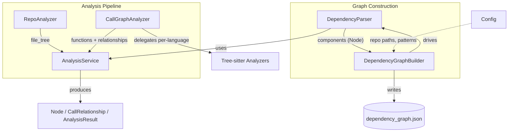
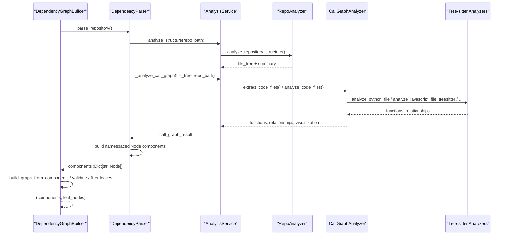

# Dependency Analyzer Core

## Overview

The Dependency Analyzer Core module is the central orchestration engine of the CodeWiki backend's static analysis pipeline. It coordinates the full lifecycle of turning a raw source repository into a structured, queryable **dependency graph** of code components (functions, classes, methods, interfaces, etc.) connected by call/usage relationships.

This module answers three fundamental questions for any supported repository:

1. **What files exist and which are relevant?** — repository structure discovery and filtering.
2. **What code components exist, and who calls whom?** — multi-language AST/call-graph extraction.
3. **How do these components form a navigable, deduplicated dependency graph?** — component construction, namespacing, and graph persistence.

The resulting dependency graph is the primary input consumed by downstream stages of the CodeWiki backend, including documentation generation and LLM-driven summarization (see the [Documentation Generator](../documentation-generator/documentation-generator.md) module in `backend-core`).

## Position in the System

Dependency Analyzer Core lives inside the `backend-core` module, alongside several closely related sibling modules:

- [Tree-sitter Analyzers](../tree-sitter-analyzers/tree-sitter-analyzers.md) — language-specific parsers (Python, JavaScript, TypeScript, Java, C#, C, C++, PHP) invoked by this module's call graph orchestrator.
- [Dependency Analyzer Models](../dependency-analyzer-models/dependency-analyzer-models.md) — the shared `Node`, `CallRelationship`, `Repository`, `AnalysisResult`, and `NodeSelection` data models produced and consumed by this module.
- [Logging Config](../logging-config/logging-config.md) — shared logging formatting utilities used across the analysis pipeline.
- [Documentation Generator](../documentation-generator/documentation-generator.md) — consumes the dependency graph produced here to generate documentation.
- [Agent Tools Core](../agent-tools-core/agent-tools-core.md) — provides file-editing and repository interaction tools used by the broader backend agent workflow.
- [LLM Services](../llm-services/llm-services.md) — provides model routing/fallback used elsewhere in `backend-core`.

For the full picture of how these modules interrelate, see the parent [Backend Core](../backend-core.md) documentation.

## Architecture

The module is organized into two cooperating sub-systems:

1. **Analysis Pipeline** — discovers repository structure and extracts functions/classes and their call relationships for a single repository path.
2. **Graph Construction** — wraps the analysis pipeline to build fully-qualified, namespaced `Node` components (supporting both single-repository and multi-repository/dependency scenarios), resolves cross-namespace edges, validates graph completeness, and persists the final dependency graph to disk.

### High-Level Data Flow

## Sub-modules

### Analysis Pipeline

Handles repository cloning support, file-tree discovery with include/exclude filtering, and multi-language call graph extraction by delegating to per-language analyzers. Composed of `AnalysisService`, `RepoAnalyzer`, and `CallGraphAnalyzer`.

See [Analysis Pipeline](analysis_pipeline.md) for full details.

### Graph Construction

Turns raw analysis results into fully-qualified, namespaced `Node` components, resolves single- and multi-repository (dependency-aware) call relationships, and drives graph validation, leaf-node filtering, and persistence to JSON. Composed of `DependencyParser` and `DependencyGraphBuilder`.

See [Graph Construction](graph_construction.md) for full details.

## Key Concepts

### Fully-Qualified Domain Names (FQDNs)

Every extracted code component is assigned a unique identifier of the form `namespace.module.path::ComponentName`. The `namespace` prefix is derived from the source repository's directory name and prevents ID collisions when analyzing multiple repositories together (e.g., a primary repo plus its dependencies). See [Graph Construction](graph_construction.md) for details on how `DependencyParser` builds and resolves these identifiers.

### Multi-Language Support

The pipeline supports Python, JavaScript, TypeScript, Java, C#, C, C++, PHP, Go, and Rust. Python uses a native AST analyzer; all other languages are handled via tree-sitter based analyzers described in [Tree-sitter Analyzers](../tree-sitter-analyzers/tree-sitter-analyzers.md).

### Single-Path vs. Multi-Path Analysis

`DependencyGraphBuilder` and `DependencyParser` both support analyzing either a single repository or multiple repository paths simultaneously (for example, a main repository plus one or more external dependency sources). In multi-path mode, each source directory is assigned its own namespace, and cross-namespace dependency edges are resolved after all components have been extracted. See [Graph Construction](graph_construction.md).

## Summary

| Component | Responsibility |
|---|---|
| `AnalysisService` | Top-level orchestration: repository cloning, structure + call-graph analysis, README extraction, cleanup |
| `RepoAnalyzer` | Builds filtered file trees for one or more repository paths |
| `CallGraphAnalyzer` | Routes files to per-language analyzers, resolves and deduplicates call relationships, builds visualization data |
| `DependencyParser` | Converts analysis results into namespaced `Node` components; resolves cross-namespace dependencies |
| `DependencyGraphBuilder` | Drives parsing end-to-end, validates graph completeness, filters leaf nodes, persists the dependency graph |

For details on each area, see [Analysis Pipeline](analysis_pipeline.md) and [Graph Construction](graph_construction.md).
