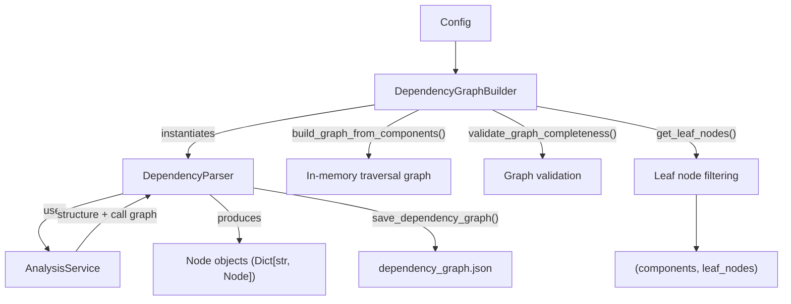
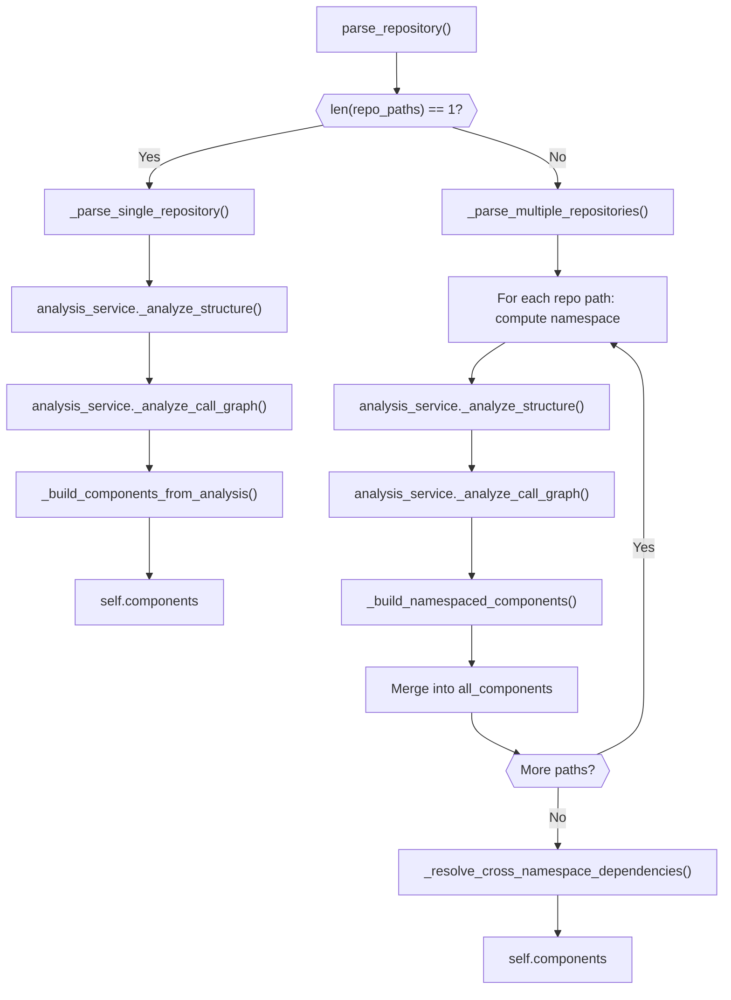
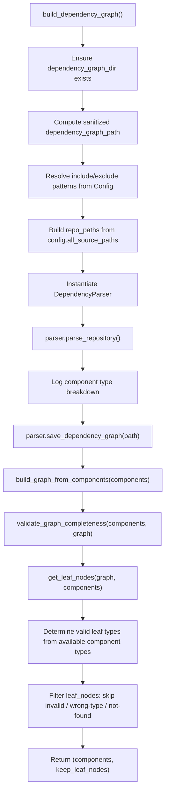
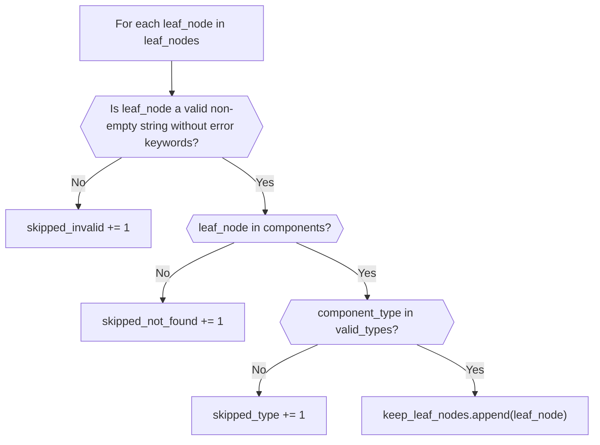
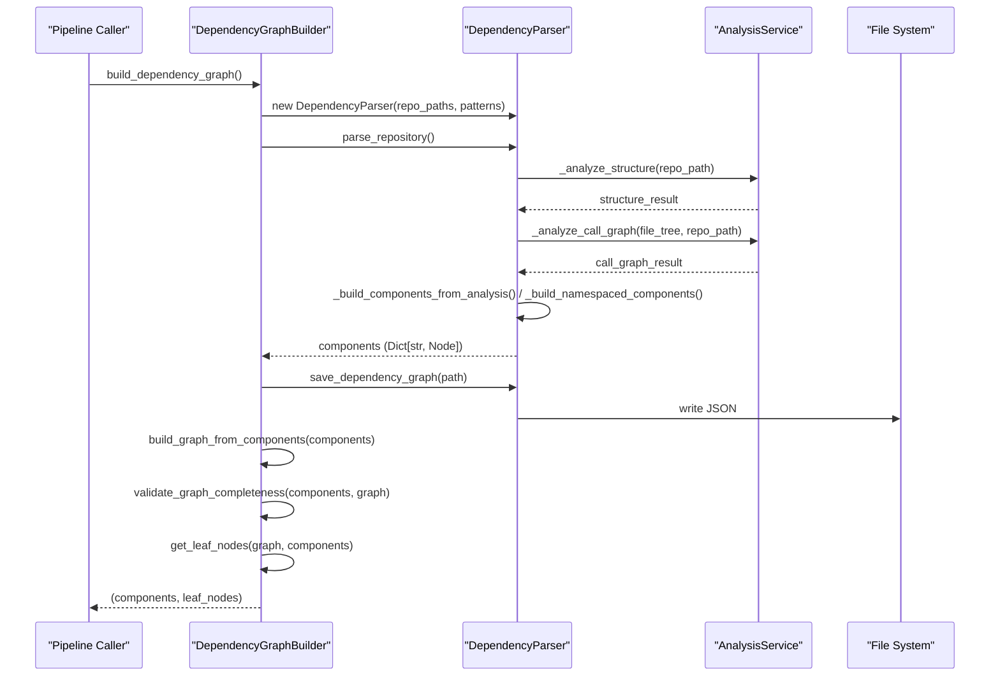

# Graph Construction

The Graph Construction module is the stage-two engine of CodeWiki's dependency analysis pipeline. It transforms raw structural and call-graph data produced by the [Analysis Pipeline](../analysis_pipeline/analysis_pipeline.md) into a fully-resolved, persistable dependency graph made of typed `Node` objects. It is responsible for assigning fully-qualified domain names (FQDNs) to every code component, namespacing components when multiple repositories are analyzed together, resolving both intra- and cross-namespace dependency edges, and filtering the resulting graph down to a set of "leaf" components suitable for downstream clustering and documentation generation.

This module contains two core components:

- **`DependencyParser`** — converts raw analysis output (functions, classes, relationships) into namespaced `Node` objects and resolves dependency edges between them, supporting both single-repository and multi-repository ("multi-path") modes.
- **`DependencyGraphBuilder`** — orchestrates the end-to-end graph-building workflow: invoking the parser, persisting the graph to disk, building an in-memory traversal graph, validating its completeness, and filtering leaf nodes for downstream consumption.

## Purpose and Scope

The Graph Construction module sits between raw source analysis and the higher-level clustering/documentation stages of CodeWiki. Its responsibilities are strictly bounded to:

1. **Component identity assignment** — converting analyzer-produced identifiers into canonical FQDNs of the form `{namespace}.{module.path}::{ComponentName}`.
2. **Namespace management** — when analyzing multiple source directories (multi-path mode), prefixing components by their originating repository/directory to avoid ID collisions.
3. **Dependency edge resolution** — mapping raw caller/callee identifiers extracted by language analyzers into resolved FQDN-to-FQDN edges, including matching across namespace boundaries by component name when a direct ID match is unavailable.
4. **Graph persistence** — serializing the final component graph to a deterministic (sorted) JSON representation on disk.
5. **Leaf node filtering** — identifying and validating the "leaf" components (typically classes, interfaces, structs, or functions for C-style codebases) that anchor the hierarchical documentation generation process.

It does **not** perform language-specific parsing itself (that responsibility belongs to the [Tree-Sitter Analyzers](../../tree-sitter-analyzers/tree-sitter-analyzers.md)) nor does it run the structural/call-graph analysis (handled by `AnalysisService` in the [Analysis Pipeline](../analysis_pipeline/analysis_pipeline.md)). It also delegates the `Node` data model itself to [Dependency Analyzer Models](../../dependency-analyzer-models/dependency-analyzer-models.md).

## Architecture



`DependencyGraphBuilder` is constructed with a [Config](../../../config-core.md) instance that supplies the repository path(s), output directories, and include/exclude filter patterns. It then instantiates a `DependencyParser` scoped to either a single repository path (`str`) or a list of paths (multi-path mode), delegating all structural/call-graph analysis to `AnalysisService` from the [Analysis Pipeline](../analysis_pipeline/analysis_pipeline.md).

## Core Components

### DependencyParser

`DependencyParser` is the component-extraction engine. It wraps an `AnalysisService` instance and converts its raw output into the canonical `Node` representation used throughout the rest of CodeWiki.

**Initialization** accepts either a single repository path or a list of paths, along with optional `include_patterns` / `exclude_patterns` file filters:

```python
parser = DependencyParser(
    repo_path=["/path/to/main-repo", "/path/to/dependency-repo"],
    include_patterns=["*.py", "*.ts"],
    exclude_patterns=["*Tests*"]
)
components = parser.parse_repository()
```

**Key responsibilities:**

| Method | Purpose |
|---|---|
| `parse_repository()` | Entry point; dispatches to single- or multi-path parsing based on how many repo paths were configured. |
| `_parse_single_repository()` | Backward-compatible path: analyzes structure and call graph for one repository, then builds components via `_build_components_from_analysis()`. |
| `_parse_multiple_repositories()` | Analyzes each configured path independently, namespaces its components, merges all namespaces together, then resolves cross-namespace dependencies. |
| `_build_namespaced_components()` | First pass creates `Node` objects with FQDN keys (`{namespace}.{original_id}`); second pass wires up `depends_on` edges within the same namespace. |
| `_resolve_cross_namespace_dependencies()` | For any dependency edge that didn't resolve within its own namespace, attempts a name-based match against components in *other* namespaces. |
| `_build_components_from_analysis()` | Single-path equivalent of namespaced component construction; also tracks legacy `file_path:name` IDs for backward-compatible dependency resolution. |
| `save_dependency_graph()` | Serializes all components (sorted by ID, with `depends_on` sets converted to sorted lists) to a JSON file for deterministic, diffable output. |

#### FQDN Construction

Every component is identified by a Fully Qualified Domain Name in the form:

```text
{namespace}.{module.path}::{ComponentName}
```

- `namespace` is derived from the last path segment of the source directory being analyzed (e.g., `openframe-frontend`, `ui-kit`), computed by `_get_namespace_from_path()`.
- `module.path::ComponentName` is the raw identifier produced by the language-specific analyzer (see [Tree-Sitter Analyzers](../../tree-sitter-analyzers/tree-sitter-analyzers.md)).
- In single-path mode, `is_from_deps` is always `False`. In multi-path mode, the first configured path (`repo_index == 0`) is treated as the primary repository, while subsequent paths are marked `is_from_deps=True`.

Each `Node` also retains `short_id` (the original, un-namespaced identifier) purely for display purposes, alongside the `namespace` string itself — see the [Dependency Analyzer Models](../../dependency-analyzer-models/dependency-analyzer-models.md) documentation for the full `Node` schema.

#### Single-Path vs. Multi-Path Parsing



In multi-path mode, each configured source directory is analyzed independently by `AnalysisService`, then merged into a single component dictionary keyed by namespaced FQDN. A `namespace_mapping` dict (original ID → FQDN) is built incrementally as each repository is processed, enabling within-namespace dependency resolution during `_build_namespaced_components()`.

#### Cross-Namespace Dependency Resolution

After all repositories are parsed and merged, `_resolve_cross_namespace_dependencies()` performs a second reconciliation pass. For every component's `depends_on` set:

1. If the dependency ID already matches an entry in `all_components`, it is kept as-is.
2. Otherwise, the parser extracts the trailing component name (`dep_id.split(".")[-1]`) and searches all components for a name match belonging to a *different* namespace, logging the resolution as a cross-namespace dependency.
3. If no match is found at all, the original (unresolved) dependency ID is preserved rather than dropped, ensuring no data loss even when resolution fails.

This name-based fallback allows dependency edges to survive even when different analyzers or namespaces produce slightly different identifier formats for the same logical target.

### DependencyGraphBuilder

`DependencyGraphBuilder` is the orchestration layer that wraps `DependencyParser` with graph persistence, traversal-graph construction, validation, and leaf-node filtering. It is the primary entry point used by the rest of the backend pipeline to obtain a ready-to-cluster dependency graph.

```python
builder = DependencyGraphBuilder(config)
components, leaf_nodes = builder.build_dependency_graph()
```

**Workflow performed by `build_dependency_graph()`:**



**Key behaviors:**

- **Source path resolution**: Uses `config.all_source_paths` (primary `repo_path` plus any `additional_source_paths`) to decide whether to invoke single-path or multi-path parsing on `DependencyParser`. See [Config](../../../config-core.md) for how these paths are validated and exposed.
- **Deterministic output naming**: The dependency graph JSON file is named `{sanitized_repo_name}_dependency_graph.json`, where the repository's base directory name is sanitized to alphanumeric characters and underscores.
- **Graph traversal preparation**: After parsing, `build_graph_from_components()` and `get_leaf_nodes()` (internal graph/topology utilities) convert the flat `Node` dictionary into a traversable graph structure and extract nodes with no outgoing dependencies as candidate "leaves."
- **Post-build validation**: `validate_graph_completeness()` is invoked immediately after graph construction to catch structural inconsistencies before leaf filtering proceeds.
- **Leaf node type filtering**: Leaf nodes are only retained if their `component_type` is one of `class`, `interface`, or `struct` — unless *none* of the parsed components have those types (e.g., a purely procedural/C-style codebase), in which case `function` is also accepted. Nodes that are empty, contain error-like keywords (`error`, `exception`, `failed`, `invalid`), or are absent from the parsed `components` dictionary are skipped and logged with a specific reason.

#### Leaf Node Filtering Logic



The resulting `keep_leaf_nodes` list, together with the full `components` dictionary, is returned to the caller and forms the input for the clustering and documentation-generation stages that follow in the broader backend pipeline.

## Data Model

Both `DependencyParser` and `DependencyGraphBuilder` operate on the `Node` model defined in [Dependency Analyzer Models](../../dependency-analyzer-models/dependency-analyzer-models.md). The fields most relevant to graph construction are:

| Field | Description |
|---|---|
| `id` | Primary key; the FQDN (`{namespace}.{original_id}`). |
| `short_id` | Original, un-namespaced identifier from the language analyzer. |
| `namespace` | Source directory namespace (e.g., repository directory name). |
| `is_from_deps` | `True` if the component came from a non-primary (dependency) source path in multi-path mode. |
| `component_type` | Classifies the node (`class`, `interface`, `struct`, `function`, `method`, etc.); drives leaf-node filtering. |
| `depends_on` | Set of FQDNs this component depends on; populated and reconciled by `DependencyParser`. |

## Component Interactions



## Relationship to the Broader Pipeline

- **Upstream**: Relies on `AnalysisService` from the [Analysis Pipeline](../analysis_pipeline/analysis_pipeline.md) for structural file-tree scanning and call-graph extraction, which in turn delegates language-specific parsing to the [Tree-Sitter Analyzers](../../tree-sitter-analyzers/tree-sitter-analyzers.md).
- **Configuration**: Reads repository paths, filter patterns, and output directories from the [Config](../../../config-core.md) object.
- **Data Model**: Produces and manipulates `Node` instances defined in [Dependency Analyzer Models](../../dependency-analyzer-models/dependency-analyzer-models.md).
- **Downstream**: The `(components, leaf_nodes)` tuple returned by `DependencyGraphBuilder.build_dependency_graph()` feeds into the clustering and documentation-generation stages that consume the persisted dependency graph and the filtered leaf set for hierarchical documentation planning.

For the broader dependency-analysis subsystem this module belongs to, see the [Dependency Analyzer Core](../dependency-analyzer-core.md) overview.
