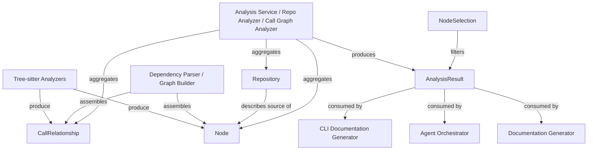
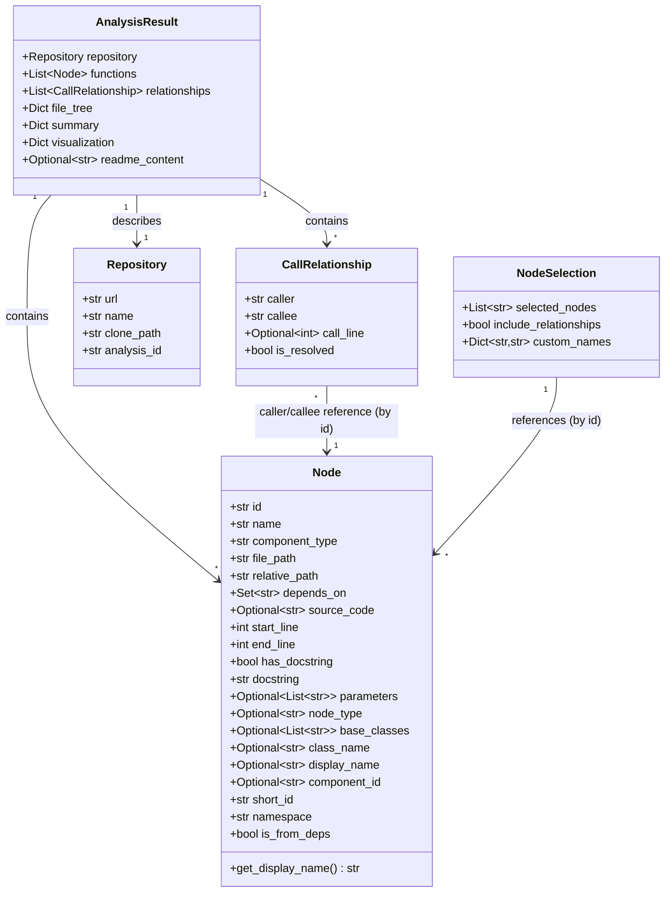

# Dependency Analyzer Models

## Introduction

The Dependency Analyzer Models module defines the core Pydantic data contracts used throughout the dependency analysis pipeline of the backend. It contains no business logic of its own — instead, it establishes the shared vocabulary (data shapes) that every other backend component relies on to represent source code entities, their relationships, the repositories being analyzed, and the final analysis output.

Because these models are pure data definitions with no external side effects, this module acts as the **foundation layer** of the backend dependency-analysis subsystem. Every producer (parsers, analyzers, graph builders) and every consumer (documentation generator, agent orchestrator, CLI) of analysis data depends on these types either directly or transitively.

The module is composed of two files:

- `models/core.py` — the fundamental building blocks: `Node`, `CallRelationship`, `Repository`
- `models/analysis.py` — the higher-level, aggregate result types: `AnalysisResult`, `NodeSelection`

Given its small size and purely declarative nature, this module is documented as a single cohesive unit rather than split into further sub-modules.

## Purpose in the Overall System

The dependency-analysis pipeline works roughly as follows:

1. Language-specific tree-sitter/AST analyzers parse source files and extract code entities and call edges.
2. The `DependencyParser` and `DependencyGraphBuilder` (part of the Dependency Analyzer Core module) assemble these extracted entities into `Node` and `CallRelationship` instances.
3. The `AnalysisService`, `RepoAnalyzer`, and `CallGraphAnalyzer` (also part of Dependency Analyzer Core) orchestrate the end-to-end analysis of a repository, producing an `AnalysisResult`.
4. Downstream consumers — the Documentation Generator, the Agent Orchestrator, and the CLI — read the `AnalysisResult` (and its nested `Node`/`CallRelationship`/`Repository` data) to generate documentation, drive AI agents, or render reports.

This module's models are therefore the "wire format" passed between all of those stages.

## Core Components

### `Node`

`Node` (defined in `models/core.py`) is the canonical representation of a single source-code entity discovered during analysis — a function, class, method, or other addressable code unit.

Key fields:

- `id`: Fully-qualified domain name (FQDN) in the format `{namespace}.{original_id}`, used as the unique identifier across the entire system.
- `name`, `display_name`, `class_name`: Human-readable naming information; `get_display_name()` falls back to `name` when `display_name` is not set.
- `component_type`, `node_type`: Classify the kind of entity (e.g., function, class, method).
- `file_path`, `relative_path`: Location of the entity within the analyzed repository.
- `depends_on`: A `Set[str]` of other node IDs this node depends on — the backbone of the dependency graph.
- `source_code`, `start_line`, `end_line`: Raw source snippet and its location for documentation/reference purposes.
- `has_docstring`, `docstring`: Extracted documentation comments.
- `parameters`, `base_classes`: Signature and inheritance metadata (when applicable).
- `component_id`: Optional external identifier correlating a node with a documentation component.
- FQDN metadata: `short_id` (original ID without namespace), `namespace` (e.g., `main`, `deps`, `ui-kit`), and `is_from_deps` (whether the node originates from a dependency rather than the main repository).

`Node` is intentionally permissive — most fields beyond `id`, `name`, `component_type`, `file_path`, and `relative_path` are optional or default-valued, allowing different language analyzers (Python, Java, C/C++/C#, JavaScript/TypeScript, PHP) to populate only the metadata that is available for their language.

### `CallRelationship`

`CallRelationship` models a directed edge between two `Node` instances, representing a call or reference from one code entity to another.

Fields:

- `caller`: ID of the node initiating the call.
- `callee`: ID of the node being called.
- `call_line`: Optional line number where the call occurs, useful for navigation and documentation cross-referencing.
- `is_resolved`: Whether the callee could be definitively resolved to a known `Node` (as opposed to remaining an unresolved/external reference).

Collections of `CallRelationship` objects, combined with `Node.depends_on` sets, form the call graph that the Call Graph Analyzer and Dependency Graph Builder operate on.

### `Repository`

`Repository` captures metadata about the source repository under analysis:

- `url`: Origin location of the repository (e.g., a Git remote URL).
- `name`: Human-readable repository name.
- `clone_path`: Local filesystem path where the repository was cloned/checked out for analysis.
- `analysis_id`: Identifier correlating this repository record with a specific analysis run.

This model is embedded directly inside `AnalysisResult` to associate analysis output with its source.

### `AnalysisResult`

`AnalysisResult` (defined in `models/analysis.py`) is the top-level aggregate produced at the end of a full repository analysis. It bundles together everything downstream consumers need:

- `repository`: The `Repository` that was analyzed.
- `functions`: A `List[Node]` of all extracted code entities.
- `relationships`: A `List[CallRelationship]` describing the call graph.
- `file_tree`: A `Dict[str, Any]` representing the hierarchical file/directory structure of the repository.
- `summary`: A `Dict[str, Any]` with aggregate statistics or high-level findings.
- `visualization`: An optional `Dict[str, Any]` holding precomputed visualization data (defaults to an empty dict).
- `readme_content`: An optional string containing the repository's README content, when available.

This model is the primary data structure passed from the analysis pipeline (Analysis Service, Repo Analyzer, Call Graph Analyzer) to consumers such as the Documentation Generator and the Agent Orchestrator.

### `NodeSelection`

`NodeSelection` supports partial/filtered exports of an analysis result — for example, when a user wants documentation generated for only a subset of discovered nodes.

Fields:

- `selected_nodes`: A `List[str]` of node IDs to include (defaults to an empty list).
- `include_relationships`: Whether relationships between selected nodes should also be included (defaults to `True`).
- `custom_names`: A `Dict[str, str]` mapping node IDs to user-supplied display names, allowing renaming without mutating the underlying `Node` data.

## Data Model Relationships

## Usage Across the System

These models form the shared contract consumed by several other backend modules:

- The tree-sitter language analyzers and the AST/graph construction components (`DependencyParser`, `DependencyGraphBuilder`) construct `Node` and `CallRelationship` instances as they walk source files.
- The analysis pipeline components (`AnalysisService`, `RepoAnalyzer`, `CallGraphAnalyzer`) assemble these into a single `Repository`-scoped `AnalysisResult`.
- The Documentation Generator consumes `AnalysisResult` to produce human-readable documentation, optionally filtering via `NodeSelection` for partial exports.
- The Agent Orchestrator and its tooling read `Node` and `CallRelationship` data to answer questions about code structure and to drive AI-assisted documentation generation.
- The CLI's documentation generation adapter ultimately surfaces `AnalysisResult` data to end users.

Because these are plain Pydantic `BaseModel` classes, they also provide built-in serialization/validation, making it straightforward to persist analysis results as JSON, pass them between processes, or validate data received from external sources.

## Design Notes

- **FQDN-based identity**: The `id` field on `Node` always follows the `{namespace}.{original_id}` convention, ensuring uniqueness even when analyzing a main repository alongside its dependencies. The `namespace` and `is_from_deps` fields make it possible to distinguish first-party code from vendored/dependency code without losing the original identifier (`short_id`).
- **Permissive defaults**: Nearly every field beyond the minimal identity fields on `Node` has a sensible default (empty set, `None`, empty string), which allows the model to accommodate the varying levels of metadata different language analyzers can extract.
- **Separation of raw graph data from aggregate results**: `Node`/`CallRelationship`/`Repository` represent the atomic units of the dependency graph, while `AnalysisResult` represents the fully-assembled output of a completed analysis run. `NodeSelection` sits alongside `AnalysisResult` as a lightweight filter/view specification rather than a graph primitive.
