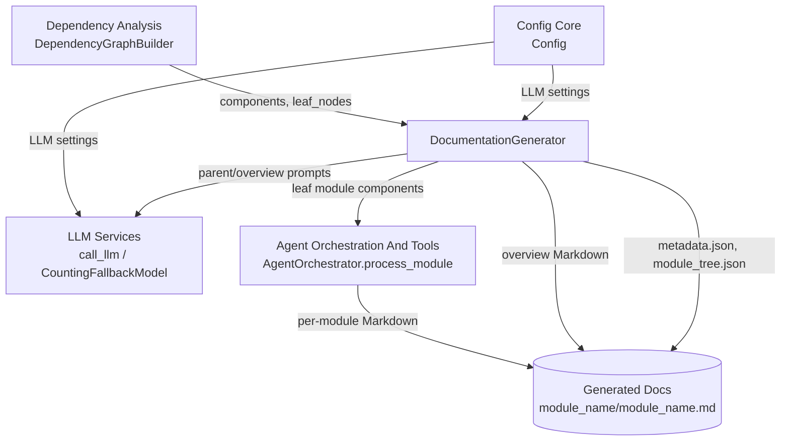
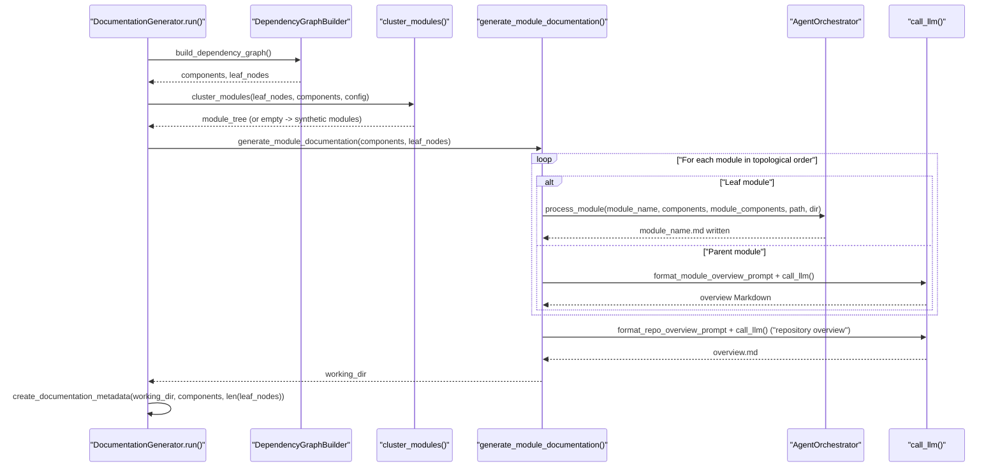
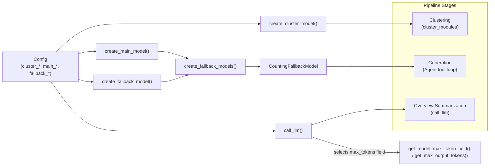

# Documentation And Services

## Overview

The Documentation And Services module is the final-stage orchestration layer of CodeWiki's backend documentation pipeline. It takes the dependency graph and module clustering produced upstream and turns them into human-readable Markdown documentation, while providing a resilient LLM invocation layer that all documentation-generation calls depend on.

Two components make up this module:

- **`DocumentationGenerator`** (`codewiki/src/be/documentation_generator.py`) - the top-level orchestrator that walks the clustered module tree in dependency order (leaf modules first, parent/overview modules last), invokes the agent-based generation pipeline for leaf modules, and synthesizes higher-level overview documents by combining child documentation.
- **`CountingFallbackModel`** (`codewiki/src/be/llm_services.py`) - a thin wrapper around Pydantic AI's `FallbackModel` that transparently chains a main model with a fallback model and tracks request volume for observability, plus a set of factory functions (`create_main_model`, `create_fallback_model`, `create_cluster_model`, `call_llm`, `create_openai_client`) that build correctly configured LLM clients from a `Config` object.

Together these components form the "last mile" of CodeWiki: they consume the artifacts of dependency analysis and module clustering and produce the final `.md` files, `module_tree.json`, and `metadata.json` that make up a generated documentation site.

## Position in the System

Documentation And Services is a child module of `backend-core`, alongside two sibling modules it depends on directly:

- **Agent Orchestration And Tools** - `DocumentationGenerator` delegates the actual per-module content generation to `AgentOrchestrator.process_module(...)`, which uses the agentic tool loop (edit tools, file map, dependency injection via `CodeWikiDeps`) to produce Markdown for leaf modules.
- **Dependency Analysis** - `DocumentationGenerator` consumes the `DependencyGraphBuilder` output (`components`, `leaf_nodes`) to know what code exists and how it is organized before any documentation is written.

It also relies on the top-level **Config Core** module (`codewiki.src.config::Config`) for all LLM provider settings (base URLs, API keys, model names, token limits) used both by `DocumentationGenerator`'s direct `call_llm` calls and by the LLM client factories in `llm_services.py`.

## Core Components

### DocumentationGenerator

`DocumentationGenerator` is the orchestrator that drives the entire documentation build for a repository. It is constructed with a `Config` object (and optionally a `commit_id`) and internally owns:

- a `DependencyGraphBuilder` (from the Dependency Analysis sub-module) used to build the code component graph, and
- an `AgentOrchestrator` (from the Agent Orchestration And Tools sub-module) used to generate content for leaf modules.

**Responsibilities:**

1. **Dependency graph construction** - `run()` calls `self.graph_builder.build_dependency_graph()` to obtain the full set of code `components` and the list of `leaf_nodes` (components not depended upon by others, i.e. natural documentation entry points).
2. **Module clustering / synthetic fallback** - `run()` loads or computes the first-pass module tree (`cluster_modules`), and if clustering produced an empty tree while leaf nodes exist, it builds "synthetic modules" grouped by top-level directory. This patch (`SYNTHETIC_MODULE_PATCH`) exists specifically to avoid the extremely large single-prompt fallback that would otherwise overflow LLM context limits on large repositories.
3. **Topological processing order** - `get_processing_order()` performs a post-order traversal of the module tree so that all leaf/child modules are documented before their parent, since parent overviews are built by summarizing already-generated child documentation.
4. **Leaf module generation** - for each leaf module (`is_leaf_module()` returns true), `generate_module_documentation()` computes a nested output directory (`_get_nested_working_dir()`, always `module_path/module_name.md`) and delegates to `AgentOrchestrator.process_module(...)` to write the module's Markdown file using the agentic tool loop.
5. **Parent/overview generation** - for non-leaf modules and the root repository summary, `generate_parent_module_docs()` builds a JSON representation of the module tree with each direct child's already-generated documentation embedded (`build_overview_structure()`), formats it into a prompt (`format_module_overview_prompt` / `format_repo_overview_prompt`), and calls `call_llm()` directly (bypassing the agent tool loop, since overview generation is pure summarization).
6. **Metadata generation** - `create_documentation_metadata()` walks the output directory tree to record every generated Markdown file, model settings, and statistics into `metadata.json`.

**Key design details:**

- **Idempotency / caching:** Both leaf and parent generation check for the existence of the target `.md` file before regenerating, and the first-pass module tree (`FIRST_MODULE_TREE_FILENAME`) is cached to disk so re-runs skip re-clustering.
- **Hierarchical output layout:** Every module - including top-level ones - gets its own subdirectory named after itself, containing a `module_name.md` file. This is enforced by `_get_nested_working_dir()`, which always appends the full `module_path` to the base docs directory.
- **Graceful degradation:** Failures while generating an individual module are logged (with full traceback) and processing continues with the next module, rather than aborting the whole run.
- **Small-repository fast path:** If the module tree ends up empty even after the synthetic-module patch (very small repositories), `run()`/`generate_module_documentation()` falls back to generating the entire repository in a single `AgentOrchestrator.process_module` call, then renames the resulting file to `overview.md`.

### LLM Services and CountingFallbackModel

`llm_services.py` centralizes all LLM client construction and invocation logic used across the documentation pipeline. Its factory functions read per-stage settings (`main_*`, `fallback_*`, `cluster_*`) from the `Config` object supplied by Config Core, so each pipeline stage (clustering, generation, fallback) can use a different provider, base URL, model, token limit, and temperature.

**Key elements:**

- **`create_main_model(config)` / `create_fallback_model(config)` / `create_cluster_model(config)`** - build `OpenAIModel` instances (Pydantic AI) configured with the correct `base_url`, `api_key`, `max_tokens`, and `temperature` for their respective pipeline stage. Each raises a descriptive `ValueError` if required configuration (base URL or API key) is missing, pointing the operator to the correct CLI flag or config field.
- **`CountingFallbackModel`** - subclasses Pydantic AI's `FallbackModel` and overrides `request()` to call `increment_request_counter()` before delegating to the parent implementation. This provides low-overhead observability (a log line every 100 requests) into how many LLM calls a documentation run makes, and how often the fallback model is engaged, without changing the external `FallbackModel` interface.
- **`create_fallback_models(config)`** - combines `create_main_model` and `create_fallback_model` into a single `CountingFallbackModel` chain, used wherever Pydantic AI's agent framework (i.e. `AgentOrchestrator`) needs a model.
- **`create_openai_client(config, model=None)`** - builds a raw `OpenAI` SDK client (not a Pydantic AI wrapper) with the correct `base_url`/`api_key`/headers for whichever model name is passed in, by matching it against `config.cluster_model`, `config.fallback_model`, or treating it as the main model otherwise.
- **`call_llm(prompt, config, model=None, temperature=0.0)`** - the direct, synchronous LLM invocation function used by `DocumentationGenerator.generate_parent_module_docs()` for overview/summarization prompts (as opposed to the full agentic tool loop used for leaf modules). It automatically selects the correct `max_tokens` field name (`max_tokens` vs. `max_completion_tokens` for reasoning models like o3), respects whether a model supports a custom `temperature`, and wraps both SDK errors (`OpenAIError`) and unexpected exceptions in a `RuntimeError` with rich diagnostic context (stage, model, base URL, token settings).
- **Token/field configuration helpers** - `get_max_output_tokens()` and `get_model_max_token_field(stage)` read `MAX_OUTPUT_TOKENS` and per-stage `CODEWIKI_*_MAX_TOKEN_FIELD` environment variables, allowing operators to tune token budgets and reasoning-model compatibility without code changes.
- **Request counting** - a module-level `_request_counter` dict tracks call counts per module (`reset_request_counter()` / `increment_request_counter()`), enabling progress visibility during long documentation runs across many modules.

## How This Module Fits the End-to-End Pipeline

1. Dependency Analysis produces a `Repository` graph of `Node`s and `CallRelationship`s, and reduces it to `components` + `leaf_nodes`.
2. `cluster_modules` (used internally by `DocumentationGenerator.run()`) groups leaf nodes into a hierarchical module tree.
3. `DocumentationGenerator` walks that tree bottom-up:
   - Leaf modules are documented by delegating to `AgentOrchestrator` (Agent Orchestration And Tools), which performs the actual code-reading/tool-calling loop backed by a `CountingFallbackModel` LLM chain.
   - Parent modules and the repository root are documented by directly summarizing already-generated child Markdown via `call_llm()`.
4. The result is a hierarchical set of Markdown files (`module_name/module_name.md` for every module, plus `overview.md` at the root) together with `module_tree.json`, `first_module_tree.json`, and `metadata.json` describing the generation run.

This module therefore acts as the glue between raw dependency/graph data and the two ways documentation content actually gets written: the agentic per-module generation loop and the direct-prompt overview summarization loop, both of which are backed by the resilient LLM client infrastructure defined here.
