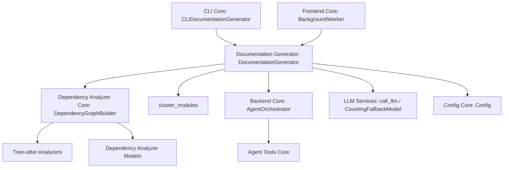
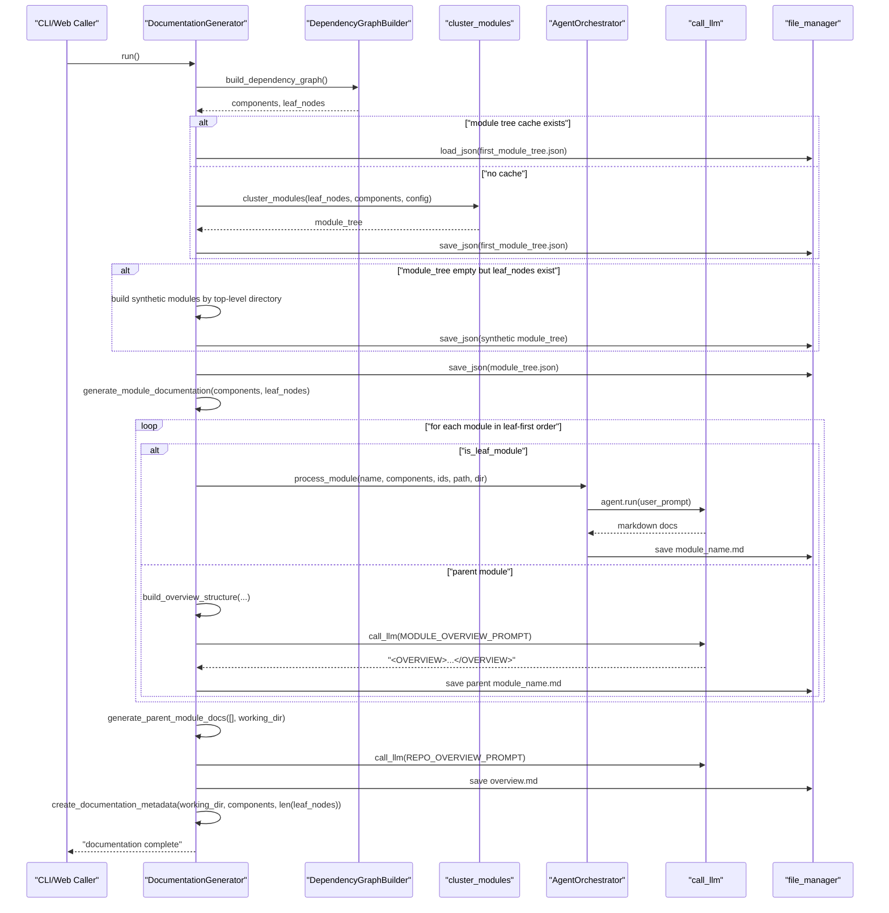
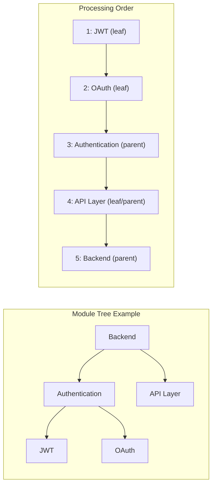

# Documentation Generator

The Documentation Generator module contains the `DocumentationGenerator` class — the top-level orchestrator that drives the entire end-to-end documentation generation pipeline for a target repository. It coordinates dependency graph construction, module clustering, hierarchical (dynamic-programming style) documentation generation via AI agents, and final metadata assembly.

This module is the primary entry point invoked by both the [CLI Core](../../cli-core.md) (`CLIDocumentationGenerator`) and the [Frontend Core](../../frontend-core.md) (`BackgroundWorker`) layers whenever a documentation job needs to be executed against a cloned or provided repository.

## Purpose and Responsibilities

`DocumentationGenerator` ties together several backend subsystems to transform raw source code into a hierarchical set of Markdown documentation files:

- **Dependency graph construction**: Delegates to `DependencyGraphBuilder` (see [Dependency Analyzer Core](../dependency-analyzer-core/dependency-analyzer-core.md)) to parse the repository and produce a component graph plus a filtered list of "leaf nodes" (classes, interfaces, structs, or functions worth documenting).
- **Module clustering**: Groups leaf-level components into a hierarchical module tree using `cluster_modules`, with a **synthetic module fallback** that prevents context-overflow failures when clustering yields no groups.
- **Documentation generation ordering**: Computes a topological "leaf-modules-first" processing order so that child module documentation is always available before its parent module summary is generated.
- **Agent-driven content generation**: Delegates the actual LLM-backed documentation writing to `AgentOrchestrator` (see [Backend Core](../../backend-core.md)) for leaf modules, and to its own `generate_parent_module_docs` routine (using `REPO_OVERVIEW_PROMPT` / `MODULE_OVERVIEW_PROMPT`) for parent/overview modules.
- **Hierarchical file layout**: Computes nested working directories (`module_path` → `docs_dir/A/B/C/C.md`) so that every module's documentation lives in its own directory alongside its children.
- **Metadata generation**: After generation completes, writes a `metadata.json` describing generation statistics and the list of all generated Markdown files.

## Position in the System



- **Upstream callers**: [CLI Core](../../cli-core.md) and [Frontend Core](../../frontend-core.md) both construct a `Config` (see [Config Core](../../../config-core.md)) and instantiate `DocumentationGenerator(config, commit_id)` before calling `run()`.
- **Downstream collaborators**:
  - `DependencyGraphBuilder` from [Dependency Analyzer Core](../dependency-analyzer-core/dependency-analyzer-core.md) parses the repository via `DependencyParser` and the [Tree-sitter Analyzers](../tree-sitter-analyzers/tree-sitter-analyzers.md).
  - `AgentOrchestrator` (in [Backend Core](../../backend-core.md)) creates and runs `pydantic-ai` agents backed by `CountingFallbackModel` from [LLM Services](../llm-services/llm-services.md), using tools defined in [Agent Tools Core](../agent-tools-core/agent-tools-core.md).
  - `Node`, `AnalysisResult` and related types from [Dependency Analyzer Models](../dependency-analyzer-models/dependency-analyzer-models.md) represent the parsed components passed throughout the pipeline.

## Core Component

### `DocumentationGenerator`

```python
class DocumentationGenerator:
    def __init__(self, config: Config, commit_id: str = None):
        self.config = config
        self.commit_id = commit_id
        self.graph_builder = DependencyGraphBuilder(config)
        self.agent_orchestrator = AgentOrchestrator(config)
```

On construction, `DocumentationGenerator` immediately wires up its two main collaborators:

| Attribute | Type | Role |
|---|---|---|
| `config` | `Config` | Repository path, model configuration, output directories, agent instructions |
| `commit_id` | `str \| None` | Optional git commit SHA recorded in generation metadata |
| `graph_builder` | `DependencyGraphBuilder` | Parses the repository and produces components + leaf nodes |
| `agent_orchestrator` | `AgentOrchestrator` | Runs LLM agents to write documentation for leaf modules |

#### Public / Key Methods

| Method | Purpose |
|---|---|
| `run()` | Entry point — runs the complete pipeline: graph build → clustering (with synthetic fallback) → module documentation generation → metadata creation |
| `generate_module_documentation(components, leaf_nodes)` | Iterates the module tree in leaf-first order, invoking either the agent orchestrator (leaf modules) or `generate_parent_module_docs` (parent modules), and finally the repository overview |
| `generate_parent_module_docs(module_path, working_dir)` | Builds a summarized child-doc structure and calls the LLM (`REPO_OVERVIEW_PROMPT` / `MODULE_OVERVIEW_PROMPT`) to synthesize a parent/overview document |
| `get_processing_order(module_tree, parent_path)` | Computes a topological (post-order/leaf-first) traversal of the module tree |
| `is_leaf_module(module_info)` | Determines whether a module has no children (i.e., should be documented directly from components) |
| `build_overview_structure(module_tree, module_path, working_dir)` | Produces a JSON-serializable subtree with one level of children's already-generated docs embedded, marking the current target module |
| `_get_nested_working_dir(base_dir, module_path)` | Computes the hierarchical output directory for a given module path (e.g. `docs_dir/Backend/Auth/JWT/`) |
| `create_documentation_metadata(working_dir, components, num_leaf_nodes)` | Walks the output directory for generated `.md` files and writes `metadata.json` |

## End-to-End Generation Flow



### 1. Dependency Graph Construction

`run()` first delegates to `self.graph_builder.build_dependency_graph()`, returning:
- `components`: a dict mapping component IDs to parsed `Node` objects (see [Dependency Analyzer Models](../dependency-analyzer-models/dependency-analyzer-models.md))
- `leaf_nodes`: a filtered list of component IDs that are candidates for direct documentation (classes/interfaces/structs, or functions for C-style codebases)

### 2. Module Clustering (with Synthetic Fallback)

If a cached `first_module_tree.json` exists, it is reused. Otherwise `cluster_modules(leaf_nodes, components, config)` groups leaf nodes into a semantic module hierarchy.

A **synthetic module patch** guards against an important failure mode: if clustering returns an empty tree despite having leaf nodes (which would otherwise trigger an expensive "whole repository in one pass" fallback that can exceed LLM context limits), `DocumentationGenerator` instead groups leaf nodes by their top-level source directory and constructs flat synthetic modules directly. This synthetic tree is persisted back to the cache file so subsequent runs skip re-clustering.

### 3. Leaf-First Processing Order

`get_processing_order` performs a recursive collection over the module tree: for any module with children, it recurses into the children **first** and appends the parent path afterward. This guarantees a true dynamic-programming order — every child module's Markdown file already exists on disk by the time its parent module is processed, since `build_overview_structure` reads children's generated docs directly from `working_dir/child_name/child_name.md`.



### 4. Per-Module Documentation Generation

For each module in the processing order, `generate_module_documentation`:
1. Resolves `module_info` by walking the module tree along `module_path`.
2. Skips modules already processed (idempotency across retries).
3. Computes the nested working directory via `_get_nested_working_dir` (e.g. `docs_dir/Backend/Authentication/JWT/`) and ensures it exists.
4. **Leaf modules** — delegates to `self.agent_orchestrator.process_module(...)`, which builds a `pydantic-ai` agent (simple or "complex" with sub-module tools) and runs it against the module's component list. See [Backend Core](../../backend-core.md) for orchestrator internals.
5. **Parent modules** — delegates to `self.generate_parent_module_docs(...)`, which synthesizes an overview from already-generated child documentation.
6. Errors for any single module are logged with a full traceback but do **not** halt the overall run — processing continues with the next module (graceful degradation).

After all modules are processed, a final call to `generate_parent_module_docs([], working_dir)` produces the top-level repository `overview.md`.

### 5. Parent / Overview Document Synthesis

`generate_parent_module_docs`:
1. Loads the canonical `module_tree.json` from the **base** docs directory (not the nested `working_dir`, since `module_tree.json` is always written at the top level).
2. Returns early if `overview.md` or the module's own `<module_name>.md` already exists (idempotent caching).
3. Calls `build_overview_structure` to construct a subtree containing the target module marked with `is_target_for_overview_generation` and each direct child's already-generated Markdown embedded under a `docs` key.
4. Serializes this structure to JSON and formats it into `MODULE_OVERVIEW_PROMPT` (for non-root modules) or `REPO_OVERVIEW_PROMPT` (for the repository root, when `module_path` is empty).
5. Invokes `call_llm(prompt, self.config)` (see [LLM Services](../llm-services/llm-services.md)), extracts the content between `<OVERVIEW>` / `</OVERVIEW>` tags (falling back to the raw response if tags are missing), and writes it to disk via `file_manager.save_text`.

### 6. Small-Repository Fast Path

If clustering (including the synthetic fallback) still yields **zero** modules, `run()` falls back to treating the entire repository as a single module: it calls `agent_orchestrator.process_module` directly with all `leaf_nodes`, then renames the resulting `<repo_name>.md` to `overview.md`.

### 7. Metadata Generation

Once all documentation is written, `create_documentation_metadata` walks the output directory tree, records every generated `.md` file (relative path), and writes a `metadata.json` capturing:
- Generation timestamp, model used, generator version, repo path, and commit ID
- Component/leaf-node/max-depth statistics
- The full list of generated files

## Directory Layout Convention

`DocumentationGenerator` enforces a strict hierarchical output convention via `_get_nested_working_dir`: every module — leaf or parent, at any depth — gets its own subdirectory named after itself, containing a same-named Markdown file:

```text
docs_dir/
├── overview.md                          # repository-level overview
├── module_tree.json                     # final clustered/processed module tree
├── first_module_tree.json               # initial clustering result (cache)
├── metadata.json                        # generation metadata
├── Backend/
│   ├── Backend.md                       # parent module overview
│   ├── Authentication/
│   │   ├── Authentication.md
│   │   ├── JWT/
│   │   │   └── JWT.md                   # leaf module docs
│   │   └── OAuth/
│   │       └── OAuth.md
│   └── API/
│       └── API.md
```

This matches the same hierarchical linking convention used across all generated module documentation in this system.

## Error Handling and Resilience

- **Per-module isolation**: Exceptions raised while processing an individual module in `generate_module_documentation` are caught, logged with a traceback, and the loop continues — a single failing module does not abort the entire documentation run.
- **Idempotent caching**: Both `process_module` (in `AgentOrchestrator`) and `generate_parent_module_docs` check for existing output files before invoking the LLM, allowing interrupted runs to be resumed cheaply.
- **Context-overflow prevention**: The synthetic module fallback in `run()` avoids the case where an empty clustering result would force the entire repository through a single oversized LLM call.
- **Tag-tolerant parsing**: `generate_parent_module_docs` gracefully handles LLM responses that omit the expected `<OVERVIEW>` wrapper tags by falling back to the full raw response instead of failing.

## Related Modules

- [Backend Core](../../backend-core.md) — parent module; hosts `AgentOrchestrator`, agent tools, and the dependency analysis subsystem this module depends on
- [Dependency Analyzer Core](../dependency-analyzer-core/dependency-analyzer-core.md) — provides `DependencyGraphBuilder` used to parse the repository
- [Tree-sitter Analyzers](../tree-sitter-analyzers/tree-sitter-analyzers.md) — language-specific parsers invoked during dependency graph construction
- [Dependency Analyzer Models](../dependency-analyzer-models/dependency-analyzer-models.md) — `Node` and related data models flowing through this pipeline
- [Agent Tools Core](../agent-tools-core/agent-tools-core.md) — tools (`EditTool`, `Filemap`, `CodeWikiDeps`) used by agents during leaf-module generation
- [LLM Services](../llm-services/llm-services.md) — `CountingFallbackModel` and `call_llm`, used both directly (for parent/overview synthesis) and indirectly (via `AgentOrchestrator`) for leaf modules
- [Config Core](../../../config-core.md) — the `Config` object supplied to `DocumentationGenerator` on construction
- [CLI Core](../../../cli-core.md) — command-line entry point that constructs `Config` and invokes `DocumentationGenerator.run()`
- [Frontend Core](../../../frontend-core.md) — web application entry point (`BackgroundWorker`) that runs the same generation pipeline for submitted repositories
