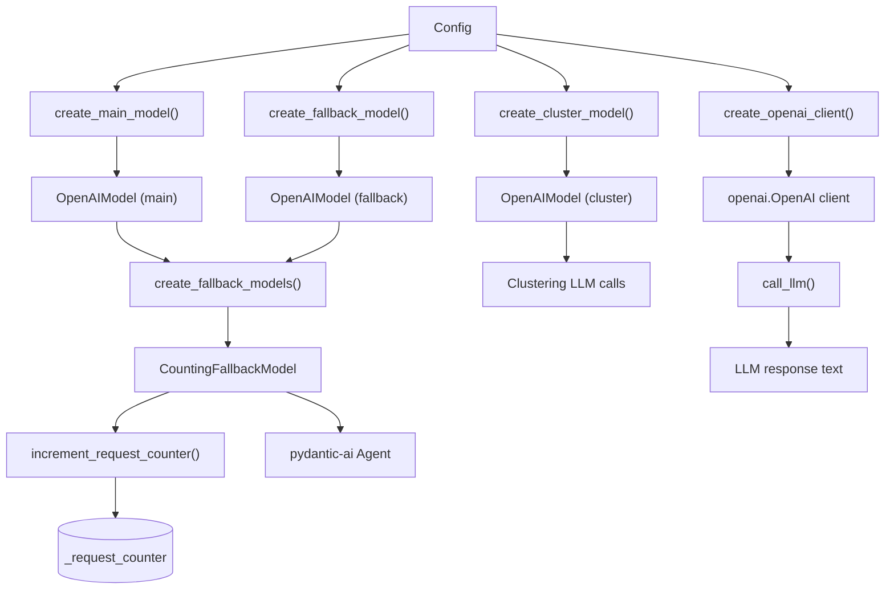
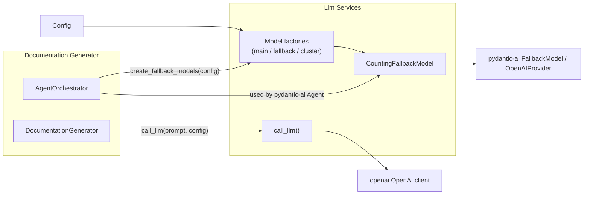
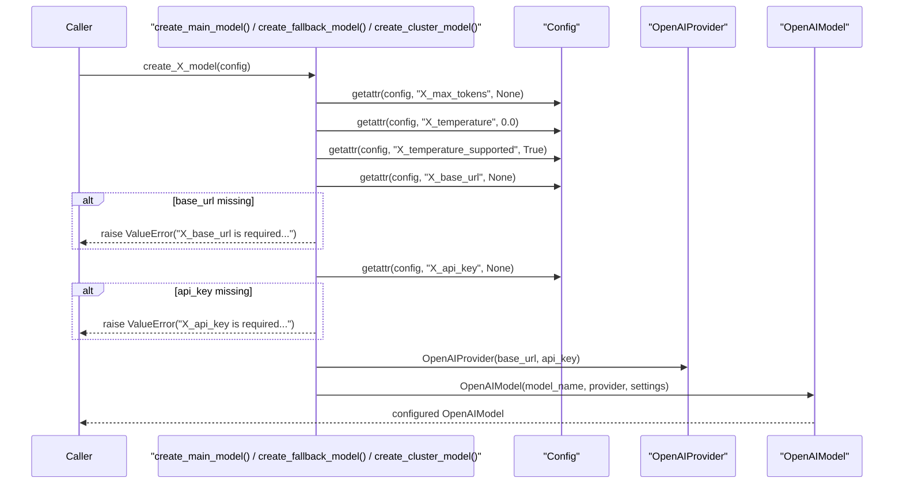
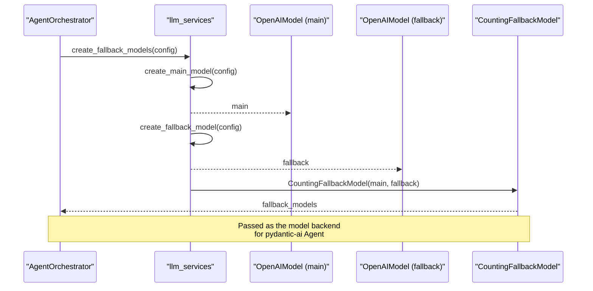
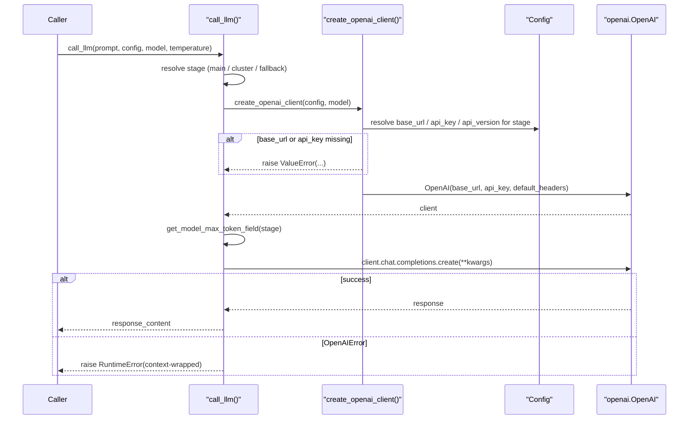

# Llm Services

The Llm Services module is the central factory and runtime layer for all Large Language Model (LLM) interactions in CodeWiki's backend. It builds configured `pydantic-ai` model instances (main, fallback, and cluster models) from a [Config](../../config-core.md) object, wraps them with automatic failover and request-counting behavior, and exposes a low-level synchronous `call_llm()` helper for direct OpenAI-compatible API calls. Every LLM-driven component in the backend — the [Documentation Generator](../documentation-generator/documentation-generator.md) and the agent orchestration layer that powers it — depends on this module to obtain ready-to-use model clients without needing to know provider-specific details (base URLs, API keys, temperature support, or token-limit parameter naming).

## Purpose and Scope

CodeWiki supports multiple LLM providers (OpenAI, Anthropic, and OpenAI-compatible endpoints) across three distinct operational stages:

- **Main/generation** — the primary model used to write module documentation.
- **Fallback** — a secondary model automatically invoked if the main model fails.
- **Cluster** — a (usually cheaper/faster) model used for the module-clustering stage of documentation generation.

Because each stage can use a different provider with different base URLs, API keys, temperature support, and token-limit parameter names (`max_tokens` vs. `max_completion_tokens` for reasoning models like o3/o3-mini), the Llm Services module centralizes this provider-resolution logic in one place so the rest of the backend can remain provider-agnostic.

## Core Responsibilities

1. **Model factory functions** — build `pydantic-ai` `OpenAIModel` instances per stage (`create_main_model`, `create_fallback_model`, `create_cluster_model`), each validating that the required `base_url` and `api_key` are present in [Config](../../config-core.md) and raising descriptive `ValueError`s otherwise.
2. **Fallback chain assembly** — `create_fallback_models()` combines the main and fallback models into a single `CountingFallbackModel`, the core component of this module, which `pydantic-ai`'s `Agent` uses transparently: if the main model errors, the fallback model is tried automatically.
3. **Request counting/telemetry** — a module-level counter (`_request_counter`) tracks how many LLM requests have been made for the current module being documented, logging progress every 100 requests via `increment_request_counter()` / `reset_request_counter()`.
4. **Direct/synchronous LLM calls** — `call_llm()` provides a simpler, non-agentic path for callers (such as the parent-module overview generation flow in [Documentation Generator](../documentation-generator/documentation-generator.md)) that just need a single prompt/response round-trip using the raw `openai` Python SDK client built by `create_openai_client()`.
5. **Token-limit and temperature normalization** — `get_max_output_tokens()` and `get_model_max_token_field()` resolve environment-variable overrides (`MAX_OUTPUT_TOKENS`, `CODEWIKI_*_MAX_TOKEN_FIELD`) so reasoning models that require `max_completion_tokens` instead of `max_tokens` work without code changes.

## Core Component

### CountingFallbackModel

`CountingFallbackModel` extends `pydantic-ai`'s `FallbackModel` and overrides `request()` to call `increment_request_counter()` before delegating to the parent implementation. This gives CodeWiki visibility into LLM usage volume per module without modifying `pydantic-ai` internals or scattering counting logic throughout the agent code. It is the object returned by `create_fallback_models()` and passed directly to `pydantic-ai.Agent` by the [Agent Orchestrator](../documentation-generator/documentation-generator.md) (part of `AgentOrchestrator.create_agent`), meaning **every** agent-driven LLM call in CodeWiki flows through this wrapper.

```python
class CountingFallbackModel(FallbackModel):
    """FallbackModel wrapper that counts and logs requests every 100 calls."""

    async def request(self, *args, **kwargs):
        """Wrap request to count calls."""
        increment_request_counter()
        return await super().request(*args, **kwargs)
```

## Architecture



## How the Module Fits Into the Backend



*[Documentation Generator](../documentation-generator/documentation-generator.md) owns the `AgentOrchestrator`, which calls `create_fallback_models(config)` once per module to build the agent's LLM backend, and calls `call_llm()` directly when generating parent-module overview documentation (bypassing the agent framework for simpler prompt/response interactions).*

## Model Creation Flow

Each `create_*_model()` function follows the same validation-and-build pattern, differing only in which per-provider config fields it reads (`main_*`, `fallback_*`, or `cluster_*`):



## Fallback Chain Construction



At runtime, when `pydantic-ai`'s `Agent.run()` invokes `CountingFallbackModel.request()`:

1. `increment_request_counter()` runs first, bumping the module-scoped counter and logging a progress line every 100 requests.
2. The call is delegated to `FallbackModel.request()` (the parent class), which attempts the **main** model first and automatically retries with the **fallback** model if the main model raises an error.

## Direct LLM Invocation (`call_llm`)

For flows that do not need the full `pydantic-ai` agent/tool-calling machinery — such as generating a parent-module overview from already-generated child documentation — the module exposes a synchronous `call_llm()` helper built directly on the `openai` SDK.



Key behaviors of `call_llm()`:

- **Stage detection** — determines whether `model` matches `config.cluster_model`, `config.fallback_model`, or defaults to main/generation, so it can select the correct `base_url`, `api_key`, `api_version`, `max_tokens` value, temperature support flag, and token-field name for that specific provider.
- **Dynamic token-field naming** — uses `get_model_max_token_field(stage)` to decide whether to send `max_tokens` or `max_completion_tokens` in the request payload, accommodating reasoning models (o3, o3-mini) that reject the standard `max_tokens` parameter.
- **Conditional temperature** — only includes `temperature` in the request if the resolved `*_temperature_supported` config flag is `True`, since some reasoning models reject custom temperature values entirely.
- **Rich error context** — wraps both `OpenAIError` and generic exceptions in a `RuntimeError` that includes the stage, model, base URL, temperature, and max-token settings to aid debugging misconfigured providers.
- **Structured logging** — emits detailed, tree-formatted log lines (stage, model, base URL, prompt length/preview, temperature, token settings) both before the request and after a successful response, easing observability during large documentation runs.

## Environment-Driven Configuration Helpers

Two helper functions decouple token-limit behavior from hardcoded values, reading overrides from environment variables at call time:

| Function | Environment Variable(s) | Purpose |
|---|---|---|
| `get_max_output_tokens()` | `MAX_OUTPUT_TOKENS` | Returns the default max output tokens (16384) unless overridden; used as a fallback when a stage-specific `*_max_tokens` field is not set on [Config](../../config-core.md). |
| `get_model_max_token_field(stage)` | `CODEWIKI_CLUSTER_MAX_TOKEN_FIELD`, `CODEWIKI_GENERATION_MAX_TOKEN_FIELD`, `CODEWIKI_FALLBACK_MAX_TOKEN_FIELD` | Returns `max_tokens` (default) or `max_completion_tokens` for the given stage, letting operators switch reasoning-model support without code changes. |

## Relationship to Configuration

All factory functions and `call_llm()` read their provider settings exclusively from the [Config](../../config-core.md) object — specifically its per-provider fields (`main_base_url`, `main_api_key`, `main_temperature`, `cluster_base_url`, `cluster_api_key`, `fallback_base_url`, `fallback_api_key`, etc.). This module performs no environment-variable parsing of its own for credentials; all credential/URL resolution responsibility lives in `Config.from_args()`, `Config.from_cli()`, and `Config.from_web_job()`. Llm Services only reads the resulting per-provider attributes via `getattr()`, defaulting gracefully where sensible (e.g., temperature defaults to `0.0`, token limits default to `get_max_output_tokens()`).

## Error Handling Philosophy

Every factory function fails fast with a descriptive `ValueError` when required configuration (`base_url`, `api_key`) is missing, naming the exact CLI flag or config-file field the caller should set:

```python
raise ValueError(
    "main_base_url is required in configuration for main/generation model.\n"
    f"Model: {config.main_model}\n"
    "Please set via CLI: --main-base-url <url>\n"
    "Or in config file: main_base_url = '<url>'"
)
```

This "actionable error message" pattern is applied consistently across `create_main_model`, `create_fallback_model`, `create_cluster_model`, and `create_openai_client`, minimizing debugging time when a user misconfigures a provider for one of the three stages.

## Summary

The Llm Services module is a thin but critical abstraction layer that:

- Converts a single [Config](../../config-core.md) object into fully-configured, provider-agnostic `pydantic-ai` models for three distinct LLM stages (main, fallback, cluster).
- Provides `CountingFallbackModel` as the automatic-failover, telemetry-instrumented model backend used by every `pydantic-ai` `Agent` created by the [Documentation Generator](../documentation-generator/documentation-generator.md)'s agent orchestration layer.
- Offers a simpler synchronous `call_llm()` path for non-agentic prompt/response use cases, with the same provider-resolution and error-handling guarantees.
- Normalizes cross-provider quirks (reasoning-model token-field naming, optional temperature support) so callers never need provider-specific branching logic.
