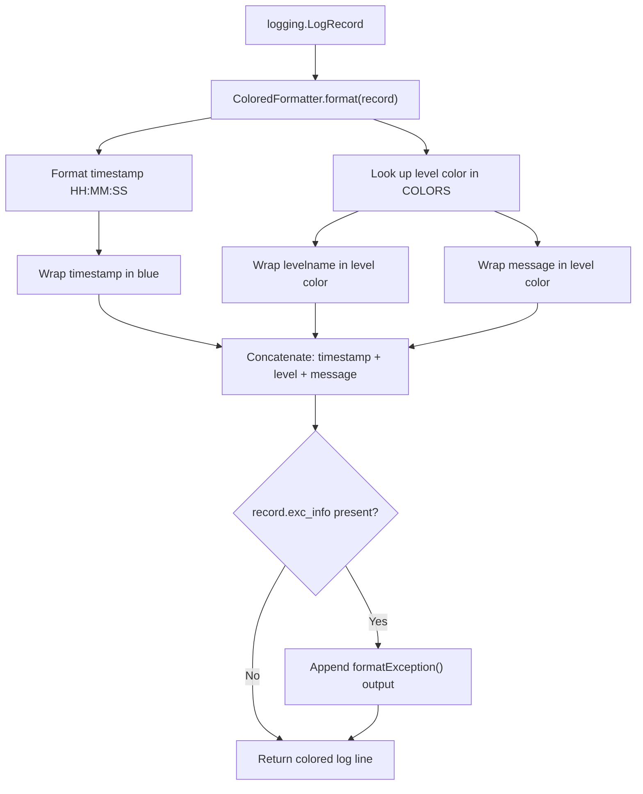
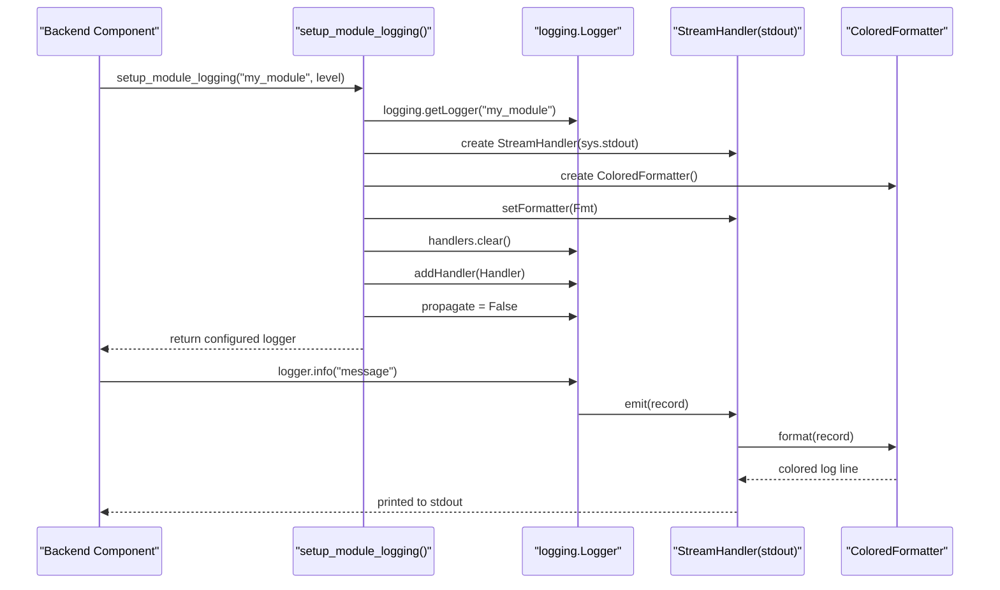
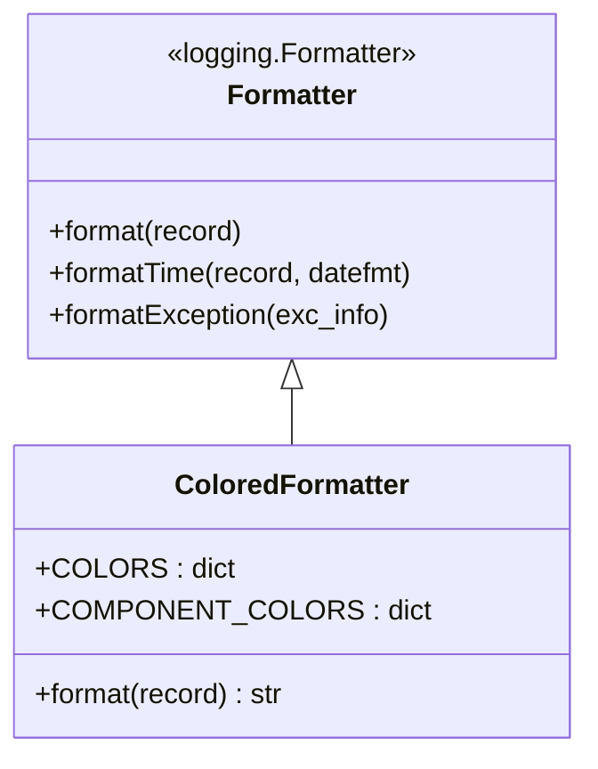
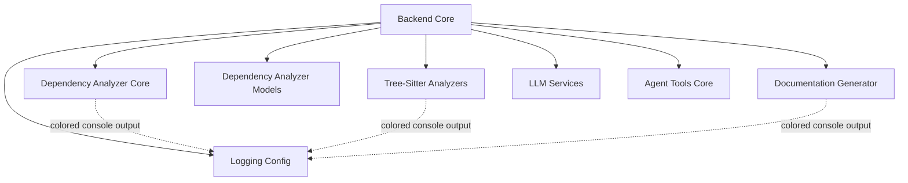

# Logging Config

The Logging Config module provides a colorized console logging formatter and helper functions used across the CodeWiki backend to produce readable, severity-differentiated log output. It centers on the `ColoredFormatter` class, a custom subclass of Python's standard `logging.Formatter` that decorates log records with ANSI colors based on log level, and two convenience setup functions (`setup_logging` and `setup_module_logging`) that wire the formatter into console handlers for the root logger or a specific named logger.

This module is a small, focused utility that other backend components depend on for consistent, human-friendly terminal logging during dependency analysis, documentation generation, and related long-running backend operations.

## Purpose and Scope

Backend processes such as repository analysis, call graph construction, and documentation generation emit a large volume of log messages while processing potentially large codebases. Plain, uncolored log output makes it difficult to visually scan for warnings and errors in a busy terminal. The Logging Config module solves this by:

- Coloring log messages according to severity (DEBUG, INFO, WARNING, ERROR, CRITICAL)
- Coloring timestamps and other structural elements distinctly from the message body
- Providing simple, one-call setup functions so any part of the backend can enable colored logging without repeating formatter/handler boilerplate
- Ensuring cross-platform compatibility (including Windows terminals) via the `colorama` library

## Core Component

### ColoredFormatter

`ColoredFormatter` extends `logging.Formatter` and overrides the `format(record)` method to inject ANSI color codes into the rendered log line.

**Color scheme:**

| Log Level / Element | Color |
|---|---|
| DEBUG | Blue |
| INFO | Cyan |
| WARNING | Yellow |
| ERROR | Red |
| CRITICAL | Red + Bright |
| Timestamp | Blue |
| Reset | Style reset (no color) |

Two internal class-level dictionaries drive this behavior:

- `COLORS`: maps `record.levelname` (e.g. `"INFO"`, `"ERROR"`) to a `colorama.Fore` color code
- `COMPONENT_COLORS`: maps structural elements (`timestamp`, `module`, `reset`) to their respective colors

The `format()` method builds the final log line by:
1. Looking up the color for the record's level (falling back to no color if the level is unrecognized)
2. Formatting the timestamp (`HH:MM:SS`) and wrapping it in the timestamp color
3. Formatting the level name (left-padded to 8 characters) in the level's color
4. Formatting the message text in the same color as the level, for visual consistency
5. Concatenating timestamp, level, and message into a single colored line
6. Appending formatted exception traceback text (uncolored) if the record carries exception info



## Setup Functions

Alongside `ColoredFormatter`, the module exposes two helper functions that configure logging handlers using the formatter.

### setup_logging(level=logging.INFO)

Configures the **root logger** for the entire application:
1. Creates a `logging.StreamHandler` writing to `sys.stdout`
2. Attaches a `ColoredFormatter` instance to the handler
3. Clears any existing handlers on the root logger (to avoid duplicate output when called more than once)
4. Sets the root logger's level and attaches the new handler

This is intended to be called once, early in a process's lifecycle (e.g., at the start of a CLI or backend service run), to enable colored output application-wide.

### setup_module_logging(module_name, level=logging.INFO)

Configures a **named logger** for a specific module rather than the root logger:
1. Retrieves (or creates) a logger via `logging.getLogger(module_name)`
2. Creates a `StreamHandler` to `stdout` with a `ColoredFormatter`
3. Clears existing handlers on that logger
4. Sets `logger.propagate = False` to prevent messages from bubbling up to the root logger (which would otherwise cause duplicate log lines)
5. Returns the configured logger for direct use

This allows individual backend components — for example an analyzer or the analysis service — to have isolated, independently configured colored logging without interfering with (or being interfered by) the root logger's configuration.



## Class Structure



## Integration with the Backend

The Logging Config module is a leaf utility within the broader backend codebase. It is imported wherever colored console output is desired, most notably by components that perform long-running, verbose operations such as dependency graph analysis and repository scanning. Because it only depends on the Python standard library `logging` module and `colorama`, it can be adopted independently by any backend component without introducing coupling to other subsystems.

Within the backend hierarchy, this module sits alongside sibling utility and domain modules such as [Dependency Analyzer Core](dependency-analyzer-core/dependency-analyzer-core.md), [Tree-Sitter Analyzers](tree-sitter-analyzers/tree-sitter-analyzers.md), [Dependency Analyzer Models](dependency-analyzer-models/dependency-analyzer-models.md), [Documentation Generator](documentation-generator/documentation-generator.md), and [LLM Services](llm-services/llm-services.md), all of which are children of the top-level backend module.

Note that the CLI package maintains its own separate logging utility (`CLILogger`) for command-line output; the Logging Config module described here is specific to the backend's internal logging needs and is not shared code with the CLI's logging utilities.



## Usage Pattern

Typical usage within a backend component follows one of two patterns:

**Application-wide setup** (once, at process start):

```python
from codewiki.src.be.dependency_analyzer.utils.logging_config import setup_logging
import logging

setup_logging(level=logging.INFO)
```

**Per-module isolated setup:**

```python
from codewiki.src.be.dependency_analyzer.utils.logging_config import setup_module_logging
import logging

logger = setup_module_logging(__name__, level=logging.DEBUG)
logger.debug("Starting analysis...")
```

Both patterns rely on the same underlying `ColoredFormatter` to ensure consistent color-coded output regardless of which setup function is used.

## Relationship to the Parent Module

This module is part of the backend codebase and is documented as a child of [Backend Core](../backend-core.md). It has no further child modules of its own, as its single component (`ColoredFormatter`) and the accompanying setup functions form a complete, self-contained unit of functionality.
