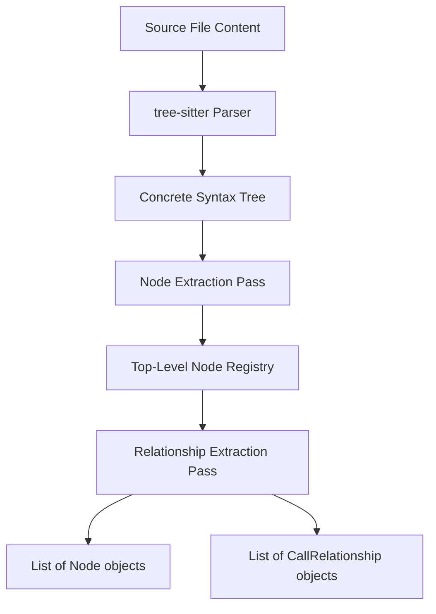
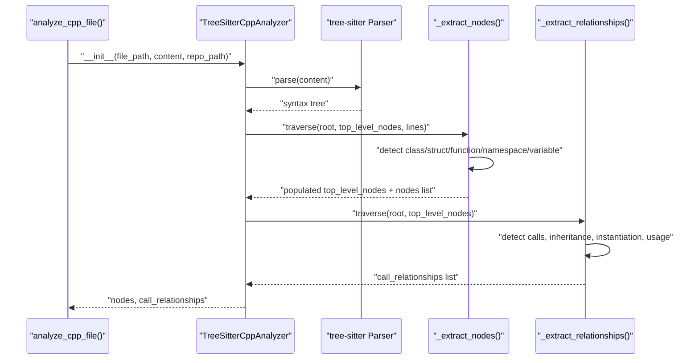
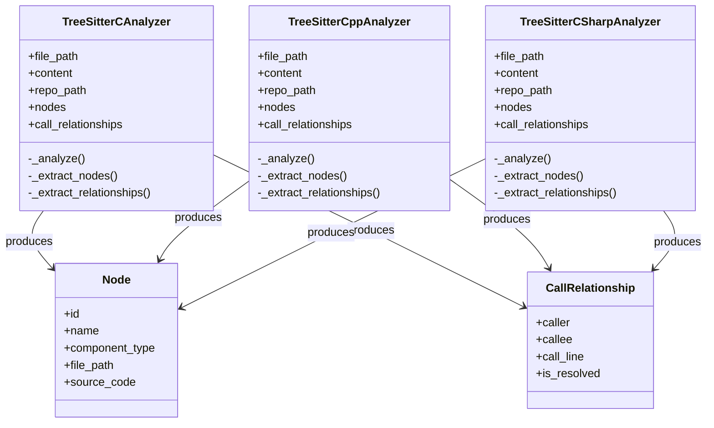
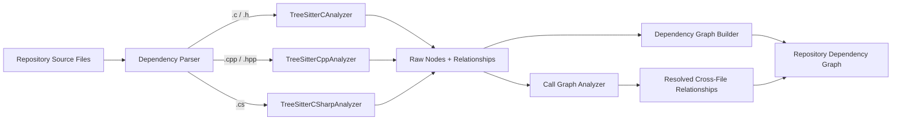

# C Family Analyzers

## Introduction

The C Family Analyzers module provides static-analysis front-ends for three closely related C-style languages: **C**, **C++**, and **C#**. Each analyzer parses a single source file with a language-specific [tree-sitter](https://tree-sitter.github.io/tree-sitter/) grammar, walks the resulting concrete syntax tree, and produces two normalized outputs:

- **Nodes** — structural components such as functions, classes, structs, methods, namespaces, and global variables
- **Call Relationships** — edges describing how those components interact (calls, inheritance, instantiation, field/property usage)

These outputs conform to the shared `Node` and `CallRelationship` data models used across the entire dependency-analysis pipeline, allowing the C-family analyzers to be interchangeable with analyzers for other languages such as Java, Python, PHP, and JavaScript/TypeScript.

The module is a leaf-level component in the analyzer layer: it has no knowledge of cross-file resolution, graph construction, or clustering — that responsibility belongs to higher-level orchestration components described later in this document.

## Purpose and Scope

| Analyzer | Component | Source Extensions | Grammar Package |
|---|---|---|---|
| C | `TreeSitterCAnalyzer` | `.c`, `.h` | `tree_sitter_c` |
| C++ | `TreeSitterCppAnalyzer` | `.cpp`, `.cc`, `.cxx`, `.hpp`, `.h` | `tree_sitter_cpp` |
| C# | `TreeSitterCSharpAnalyzer` | `.cs` | `tree_sitter_c_sharp` |

Each analyzer is instantiated per-file with the file path, raw source content, and (optionally) the repository root path. Construction is eager: the constructor immediately runs the full analysis pipeline (`_analyze()`), after which the caller reads the populated `nodes` and `call_relationships` lists.

```python
analyzer = TreeSitterCAnalyzer(file_path, content, repo_path)
functions_and_structs = analyzer.nodes
relationships = analyzer.call_relationships
```

Each analyzer file also exposes a thin module-level convenience function (`analyze_c_file`, `analyze_cpp_file`, `analyze_csharp_file`) that wraps this construction pattern and returns a `(nodes, call_relationships)` tuple — this is the entry point used by upstream orchestration.

## Architecture

All three analyzers share an identical structural pattern despite differences in the underlying grammars: a two-pass traversal (node extraction, then relationship extraction) built on top of tree-sitter's parse tree.



### Common Construction Flow

1. **Language binding** — Each analyzer loads its grammar via the corresponding `tree_sitter_*` package and wraps it in a `Language`/`Parser` pair.
2. **Parsing** — The raw UTF-8 file content is parsed once into a `tree_sitter` syntax tree.
3. **Node extraction (`_extract_nodes`)** — A recursive depth-first traversal identifies structurally significant syntax node types (e.g. `function_definition`, `class_specifier`, `struct_specifier`) and converts them into a shared `Node` model, while also registering them in a local `top_level_nodes` dictionary keyed by name (or qualified name for C++ methods).
4. **Relationship extraction (`_extract_relationships`)** — A second recursive traversal inspects call expressions, inheritance clauses, instantiation expressions, and identifier usages, cross-referencing them against `top_level_nodes` to emit `CallRelationship` edges.

### Component ID Convention

Every analyzer derives a fully-qualified component identifier from the file's path relative to the repository root, converting path separators to dots and stripping the language-specific file extension:

```text
path/to/file.cpp  ->  path.to.file
component_id       =  "path.to.file::FunctionName"
```

For C++ methods, the identifier additionally embeds the containing class using dot notation: `path.to.file::ClassName.methodName`. This mirrors the identifier scheme used by the other language analyzers so that identifiers remain comparable across the whole codebase graph.

## Component Details

### TreeSitterCAnalyzer

Parses C source using the `tree_sitter_c` grammar. It recognizes:

- **Functions** (`function_definition`) — extracted via the `function_declarator` → `identifier` chain
- **Structs** (`struct_specifier`, and `typedef struct { ... } Name;` via `type_definition`)
- **Global variables** (`declaration` nodes not nested inside a function body)

Relationship extraction covers two cases:
- **Function calls** (`call_expression`) — the callee is recorded by its *simple name only* (`is_resolved=False`), deferring cross-file resolution to the call-graph analyzer described below. A hardcoded set of common C-standard-library and SDL functions (`printf`, `malloc`, `SDL_Init`, etc.) is filtered out to avoid noise.
- **Global variable usage** — identifiers inside a function body that match a known global variable are recorded as resolved, same-file relationships (`is_resolved=True`).

Only `function` and `struct` node types are appended to the public `nodes` list; global `variable` nodes are tracked internally (in `top_level_nodes`) purely to support usage-relationship detection.

### TreeSitterCppAnalyzer

Parses C++ using the `tree_sitter_cpp` grammar. It extends the C model with object-oriented and namespace constructs:

- **Classes and structs** (`class_specifier`, `struct_specifier`)
- **Functions and methods** (`function_definition`) — distinguished by walking up the parent chain to detect an enclosing `class_specifier`/`struct_specifier`; methods are keyed in `top_level_nodes` by `ClassName.methodName`
- **Namespaces** (`namespace_definition`)
- **Global variables** (`declaration` nodes outside any function/class/struct body)

Relationship extraction is the richest of the three analyzers, detecting:

| Relationship Type | Triggering Syntax | Notes |
|---|---|---|
| `calls` | `call_expression` | Resolves plain function calls and, for method calls via `field_expression`, attempts to locate the owning class through `_find_class_containing_method` |
| `inherits` | `base_class_clause` | Extracts base `type_identifier` names |
| `creates` | `new_expression` | Detects object instantiation (`new ClassName(...)`) |
| `uses` | bare `identifier` | Detects references to global variables from within functions/methods |

A hardcoded system-function filter (`printf`, `cout`, `new`, `delete`, etc.) suppresses standard-library noise, mirroring the C analyzer.

### TreeSitterCSharpAnalyzer

Parses C# using the `tree_sitter_c_sharp` grammar. Its node vocabulary is the broadest of the three, reflecting C#'s richer type-declaration surface:

- **Classes** — further classified as `class`, `abstract class`, or `static class` based on detected `modifier` nodes
- **Interfaces** (`interface_declaration`)
- **Structs** (`struct_declaration`)
- **Enums** (`enum_declaration`)
- **Records** (`record_declaration`)
- **Delegates** (`delegate_declaration`)

Unlike the C and C++ analyzers, the C# analyzer does **not** attempt call-expression resolution. Instead, it focuses on **type-usage relationships** that reflect C#'s declarative, strongly-typed structure:

| Relationship Type | Triggering Syntax | Notes |
|---|---|---|
| inheritance/implementation | `class_declaration` → `base_list` | Emits a resolved relationship (`is_resolved=True`) only when the base name matches another top-level node in the same file |
| property type usage | `property_declaration` | Emits an unresolved relationship (`is_resolved=False`) when the property type is non-primitive |
| field type usage | `field_declaration` | Same pattern as properties |
| parameter type usage | `method_declaration` → `parameter_list` | Emits an unresolved relationship per non-primitive parameter type |

A `_is_primitive_type` allow-list (C# built-ins like `int`, `string`, `List`, `Dictionary`, `Task`, `DateTime`, etc.) prevents common framework types from polluting the relationship graph.

## Data Model

All three analyzers populate the shared `Node` and `CallRelationship` structures defined in the dependency-analyzer models layer. Key fields populated by every C-family analyzer include:

- `Node`: `id`, `name`, `component_type`/`node_type`, `file_path`, `relative_path`, `source_code`, `start_line`, `end_line`, `display_name`, `component_id`, and (for C++ methods) `class_name`
- `CallRelationship`: `caller`, `callee`, `call_line`, `is_resolved`, and optionally `relationship_type` (C++ only: `calls`, `inherits`, `creates`, `uses`)

Notably, the three analyzers differ in how aggressively they resolve `is_resolved`:
- The **C** analyzer defers function-call resolution entirely (`is_resolved=False`), but resolves same-file variable usage.
- The **C++** analyzer resolves relationships whenever a callee/base-class name matches a `top_level_nodes` entry in the same file.
- The **C#** analyzer resolves inheritance within the same file but leaves type-usage relationships unresolved, since types may be declared elsewhere.

For full schema definitions, see the dependency analyzer models.

## Process Flow: Node and Relationship Extraction

The following sequence illustrates the two-pass traversal shared by all three analyzers, using the C++ analyzer as a representative example:



## Component Relationships



## Integration with the Dependency Analysis Pipeline

The C Family Analyzers do not run in isolation. They are invoked per-file by the language-dispatching parser, and their raw (sometimes unresolved) output is later consolidated by the call-graph resolution stage:



- The **Dependency Parser** (`DependencyParser`) selects the appropriate analyzer based on file extension and orchestrates per-file invocation across the whole repository.
- The **Call Graph Analyzer** (`CallGraphAnalyzer`) consumes the unresolved `callee` names emitted by these analyzers (particularly from the C and C++ analyzers) and resolves them into fully-qualified cross-file identifiers.
- The **Dependency Graph Builder** (`DependencyGraphBuilder`) assembles the final `Node`/`CallRelationship` collections from all language analyzers — including this module — into the unified repository dependency graph.

These orchestration components live in the backend's dependency analyzer core, which handles graph construction and the analysis pipeline for details on how per-file analyzer output is consolidated and resolved.

The shared `Node`, `CallRelationship`, and related schema types used by all three analyzers are defined in the dependency analyzer models.

## Relationship to Other Language Analyzers

The C Family Analyzers module is one of several sibling analyzer groups under [Tree Sitter Analyzers](tree-sitter-analyzers.md), each following the same node/relationship extraction contract but tailored to a different language's grammar and idioms:

- [Java Analyzer](java_analyzer.md)
- [JavaScript/TypeScript Analyzers](javascript_typescript_analyzers.md)
- [PHP Analyzer](php_analyzer.md)
- [Python Analyzer](python_analyzer.md)

Because all analyzers emit the same `Node`/`CallRelationship` shapes, the downstream graph-construction and call-resolution logic remains language-agnostic — new language support can be added by implementing a new analyzer following this same pattern without modifying the orchestration layer.

## Design Notes and Limitations

- **Per-file, single-pass scope**: Each analyzer only sees one file at a time and has no visibility into other files in the repository. Cross-file symbol resolution (e.g. resolving a C function call to its definition in another translation unit) is intentionally deferred to the call-graph resolution stage.
- **Heuristic-based class/method matching**: The C++ analyzer's `_class_has_method` and `_find_class_containing_method` use lightweight source-text heuristics (substring matching on method signatures) rather than full semantic type resolution, since tree-sitter provides only syntactic — not semantic — information.
- **Standard-library filtering is hardcoded**: Both the C and C++ analyzers maintain fixed allow-lists of common standard-library/system function names to exclude from the relationship graph. This is a pragmatic simplification rather than a complete standard-library model.
- **C# favors type usage over call resolution**: Unlike C and C++, the C# analyzer does not attempt to trace method call expressions; it instead surfaces structural type dependencies (inheritance, field/property/parameter types), which are typically more informative for understanding C# codebases dominated by object-oriented composition.
