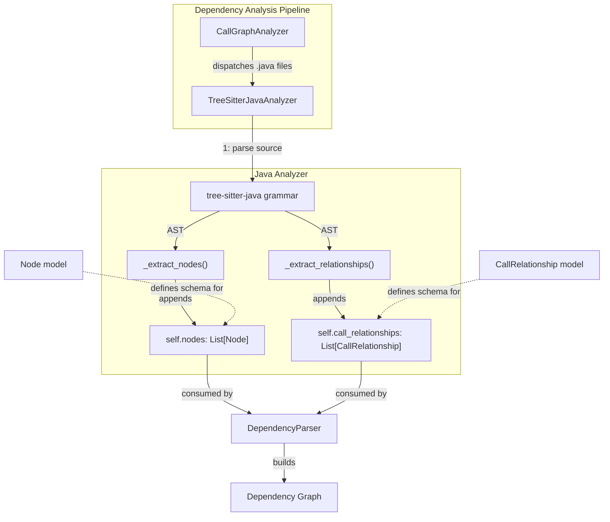
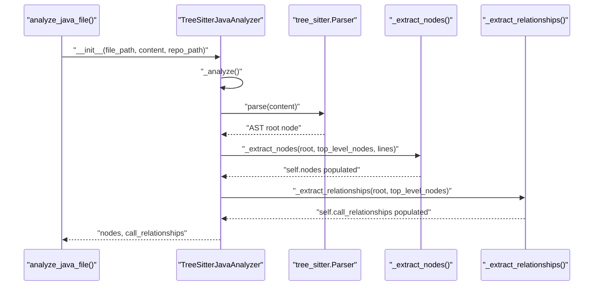
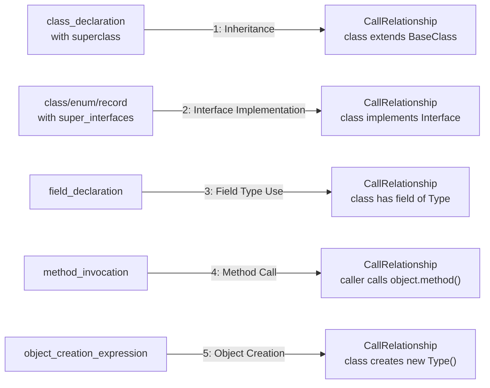

# Java Analyzer

The Java Analyzer module is a language-specific static analysis component within CodeWiki's dependency analysis pipeline. It uses [tree-sitter](https://tree-sitter.github.io/tree-sitter/) to parse Java source files into an Abstract Syntax Tree (AST) and extracts both **structural components** (classes, interfaces, enums, records, annotations, and methods) and **relationships** between them (inheritance, interface implementation, field type usage, method invocations, and object instantiation). The resulting `Node` and `CallRelationship` objects feed into the broader dependency graph that CodeWiki uses to power documentation generation and repository visualization.

This module is one of several language-specific analyzers registered under the [Tree Sitter Analyzers](tree-sitter-analyzers.md) module, sitting alongside analyzers for C/C++/C#, JavaScript/TypeScript, PHP, and Python.

## Purpose and Scope

The sole responsibility of the Java Analyzer is to convert raw Java source text into a set of normalized, language-agnostic data structures that downstream components (such as the dependency analyzer core and its graph construction pipeline) can consume without needing to know anything about Java syntax.

Specifically, the analyzer:

1. Parses a single `.java` file's source text using the `tree-sitter-java` grammar.
2. Walks the resulting AST to identify top-level and nested structural declarations.
3. Assigns each declaration a fully-qualified component ID in the `module.path::ClassName` (or `module.path::ClassName.methodName`) format expected by the rest of the system.
4. Walks the AST a second time to detect relationships between declarations (inheritance, interface implementation, field types, method calls, and object creation).
5. Exposes the extracted `Node` and `CallRelationship` lists for consumption by the parsing pipeline.

## Core Component

### TreeSitterJavaAnalyzer

`TreeSitterJavaAnalyzer` (defined in `codewiki/src/be/dependency_analyzer/analyzers/java.py`) is the single class that implements the entire analysis workflow for one Java file. It is instantiated with the file's path, its content, and (optionally) the repository root path used to compute relative/module paths.

```python
class TreeSitterJavaAnalyzer:
    def __init__(self, file_path: str, content: str, repo_path: str = None):
        ...
        self._analyze()
```

On construction, the analyzer immediately runs its full pipeline (`_analyze()`), populating two public attributes:

- `self.nodes: List[Node]` — the structural components discovered in the file.
- `self.call_relationships: List[CallRelationship]` — the relationships discovered between those components (and to external/unresolved types).

A module-level convenience function is also provided:

```python
def analyze_java_file(file_path: str, content: str, repo_path: str = None) -> Tuple[List[Node], List[CallRelationship]]:
    analyzer = TreeSitterJavaAnalyzer(file_path, content, repo_path)
    return analyzer.nodes, analyzer.call_relationships
```

This function is the primary entry point that callers in the dependency analysis pipeline are expected to use, mirroring the calling convention of the other tree-sitter based analyzers (C, C++, C#, JavaScript, TypeScript, PHP).

## Architecture Overview

The diagram below shows how `TreeSitterJavaAnalyzer` fits into the surrounding analysis pipeline and which data models it depends on.



- **CallGraphAnalyzer**, part of the dependency analyzer's analysis pipeline (which lives under the dependency analyzer core), dispatches individual source files to the appropriate language analyzer based on file extension. For `.java` files, it invokes `TreeSitterJavaAnalyzer`/`analyze_java_file`.
- **DependencyParser**, part of the dependency analyzer core's graph construction stage, aggregates the `Node` and `CallRelationship` objects produced by all analyzers (Java and otherwise) into a unified, namespaced dependency graph.
- **Node** and **CallRelationship** are shared Pydantic models defined in the dependency analyzer models. The Java Analyzer produces instances of these models but does not define them itself.

## Internal Processing Flow

`_analyze()` performs two independent, full-tree traversals over the same parsed AST: one for structural nodes, and one for relationships. This two-pass design ensures that all top-level declarations are known (via `top_level_nodes`) before relationships that reference them (e.g., method calls, field types) are resolved.



### Pass 1: Structural Node Extraction (`_extract_nodes`)

This recursive method walks every node in the AST looking for the following Java declaration types:

| AST Node Type | Resulting `component_type` |
|---|---|
| `class_declaration` (with `abstract` modifier) | `abstract class` |
| `class_declaration` (without `abstract` modifier) | `class` |
| `interface_declaration` | `interface` |
| `enum_declaration` | `enum` |
| `record_declaration` | `record` |
| `annotation_type_declaration` | `annotation` |
| `method_declaration` | `method` |

For each match, the analyzer builds a fully-qualified `component_id` via `_get_component_id()`, which combines the file's module path (derived from its path relative to the repository root, with `/` replaced by `.`) and the declaration name using the `module.path::Name` convention (or `module.path::ClassName.methodName` for methods, where the containing class is resolved via `_find_containing_class_name`).

A `Node` instance is constructed with the extracted source snippet, line ranges, and a human-readable `display_name` (e.g., `"class UserService"`), then appended to `self.nodes` and registered in the `top_level_nodes` dictionary for use during relationship extraction.

### Pass 2: Relationship Extraction (`_extract_relationships`)

This second recursive traversal identifies five categories of relationships, each producing one or more `CallRelationship` entries:



1. **Inheritance** — For `class_declaration` nodes with a `superclass` child, a relationship is created from the class to its base class (unless the base class is a Java primitive/built-in type).
2. **Interface Implementation** — For classes, enums, or records with a `super_interfaces` clause, a relationship is created to each implemented interface.
3. **Field Type Use** — For each `field_declaration`, if the containing class is resolvable and the field's type is a non-primitive type, a relationship is recorded from the class to the field's type.
4. **Method Calls** — For each `method_invocation`, the analyzer attempts to resolve the invoked object's declared type: first by checking if the object name matches a known top-level declaration, then by searching local variable declarations (`_search_variable_declaration`) and field declarations (`_find_variable_type`) within the enclosing method/class. If a type is resolved, a relationship is recorded from the calling method (or containing class, if outside a method) to the resolved type.
5. **Object Creation** — For each `object_creation_expression`, a relationship is recorded from the containing class to the instantiated type.

All relationships are created with `is_resolved=False`, since the Java Analyzer only performs local, per-file resolution — full cross-file/cross-module resolution is handled later by the dependency analyzer core when building the complete dependency graph.

### Type Filtering

`_is_primitive_type()` filters out Java primitives (`int`, `boolean`, `char`, etc.), their boxed equivalents (`Integer`, `Boolean`, `Character`, etc.), and common JDK built-ins (`String`, `Object`, `List`, `Set`, `Map`, `Collection`, `Optional`, `void`, `Void`) so that relationships are only recorded for application-relevant types, keeping the dependency graph focused on meaningful code relationships rather than noise from standard library usage.

## Data Model Reference

The Java Analyzer produces instances of two shared Pydantic models defined outside this module:

- **`Node`** — represents a structural component (class, interface, method, etc.) with fields such as `id`, `name`, `component_type`, `file_path`, `source_code`, `start_line`/`end_line`, and `display_name`. The `id` and `component_id` fields hold the same value: the analyzer's locally-computed `module.path::Name` identifier, which is later re-namespaced by the `DependencyParser` into a full FQDN.
- **`CallRelationship`** — represents a directed edge between a `caller` and `callee` component ID, with an optional `call_line` and an `is_resolved` flag.

For full field definitions and usage across other analyzers, see the dependency analyzer models module.

## Component ID Convention

A key contract that `TreeSitterJavaAnalyzer` must honor is the component ID format expected by the rest of the system: `module.path::ClassName` (and `module.path::ClassName.methodName` for methods). This is implemented via two helper methods:

- `_get_module_path()` — converts the file's path (relative to `repo_path`, if provided) into a dotted module path, stripping the `.java` extension and replacing path separators with dots.
- `_get_component_id(name, parent_class=None)` — combines the module path with the declaration name (optionally qualified by a parent class name) using the `::` separator.

This convention ensures that IDs produced by the Java Analyzer are structurally consistent with those produced by the other analyzers under [Tree Sitter Analyzers](tree-sitter-analyzers.md) (C/C++/C#, JavaScript/TypeScript, PHP, Python), allowing the Dependency Parser to merge components from multiple languages and repositories into a single, namespaced dependency graph.

## Integration Points

| Consumer | Relationship |
|---|---|
| Analysis Pipeline (`CallGraphAnalyzer`) | Invokes `analyze_java_file()` for each `.java` file discovered during repository structure analysis. |
| Graph Construction (`DependencyParser`) | Consumes the raw `Node`/`CallRelationship` dictionaries (converted to `functions`/`relationships` lists) to build namespaced components and resolve dependencies, including cross-namespace resolution for multi-repository analysis. |
| Dependency Analyzer Models | Supplies the `Node` and `CallRelationship` schemas that this analyzer instantiates. |

## Related Analyzers

The Java Analyzer is one of several sibling language analyzers grouped under [Tree Sitter Analyzers](tree-sitter-analyzers.md):

- [C Family Analyzers](c_family_analyzers.md) — C, C++, and C# analysis
- [JavaScript/TypeScript Analyzers](javascript_typescript_analyzers.md)
- [PHP Analyzer](php_analyzer.md)
- [Python Analyzer](python_analyzer.md)

All of these analyzers follow the same general contract — accept a file path and content, return `Node` and `CallRelationship` lists — even though each implements language-specific AST traversal logic suited to its grammar.
