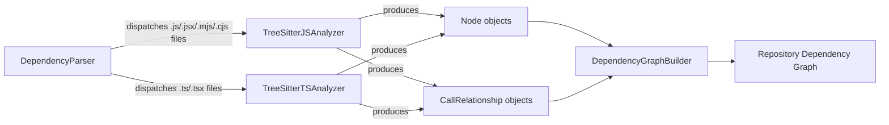
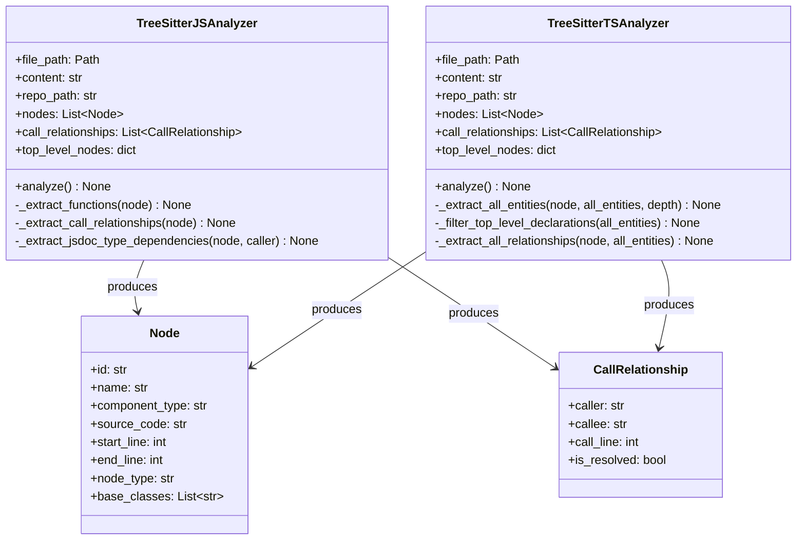
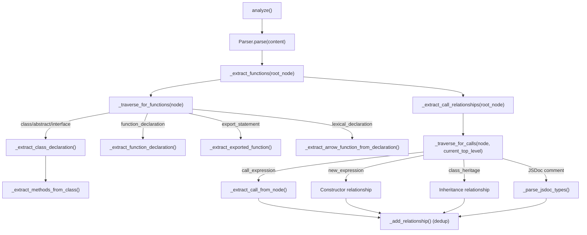
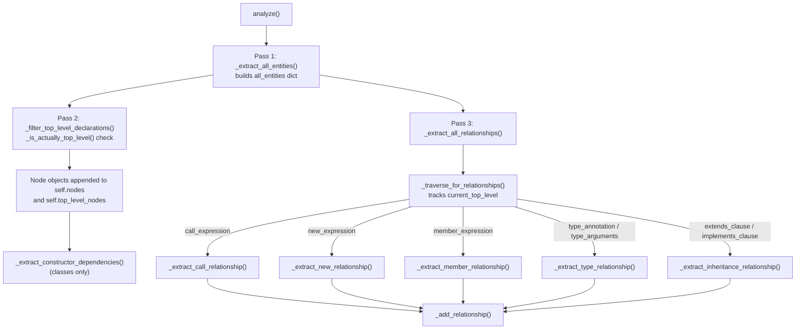
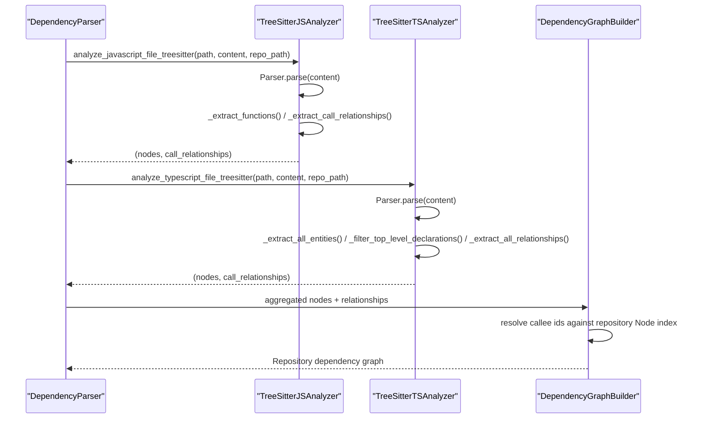

# JavaScript & TypeScript Analyzers

The JavaScript & TypeScript Analyzers module implements the tree-sitter based source-code analyzers responsible for parsing JavaScript and TypeScript files and extracting the structural entities (functions, classes, interfaces, methods, type aliases, enums, etc.) and the relationships between them (calls, inheritance, type usage) that feed the dependency graph built by the backend analysis pipeline.

It provides two closely related analyzer implementations:

- `TreeSitterJSAnalyzer` — parses plain JavaScript (and JSX/mixed) source using the `tree_sitter_javascript` grammar.
- `TreeSitterTSAnalyzer` — parses TypeScript (and its embedded JavaScript constructs) using the `tree_sitter_typescript` grammar, adding support for TypeScript-only constructs such as interfaces, type aliases, enums, and type annotations.

Both analyzers produce the same output contract — a list of `Node` objects and a list of `CallRelationship` objects — defined in the dependency analyzer models, so that downstream components can treat all language analyzers uniformly.

## Role in the Analysis Pipeline

This module is one of several language-specific analyzer implementations grouped under the [Tree Sitter Analyzers](tree-sitter-analyzers.md) parent module, alongside the [C Family Analyzers](c_family_analyzers.md), [Java Analyzer](java_analyzer.md), [PHP Analyzer](php_analyzer.md), and [Python Analyzer](python_analyzer.md).

The analyzers in this module are invoked by the `DependencyParser` in the dependency analyzer core's graph construction stage, which dispatches source files to the appropriate analyzer based on file extension. The resulting `Node` and `CallRelationship` objects are then consumed by the `DependencyGraphBuilder` to assemble the full repository dependency graph, and by the analysis pipeline (`AnalysisService`, `RepoAnalyzer`, `CallGraphAnalyzer`) for higher-level repository analysis.

## Component Overview

| Component | File | Responsibility |
|---|---|---|
| `TreeSitterJSAnalyzer` | `codewiki/src/be/dependency_analyzer/analyzers/javascript.py` | Parses JavaScript source with tree-sitter, extracts functions/classes/methods and call/inheritance/JSDoc-type relationships |
| `analyze_javascript_file_treesitter` | same file | Module-level convenience function that instantiates `TreeSitterJSAnalyzer`, runs `analyze()`, and returns `(nodes, relationships)` |
| `TreeSitterTSAnalyzer` | `codewiki/src/be/dependency_analyzer/analyzers/typescript.py` | Parses TypeScript source with tree-sitter, extracts a broader set of entities (interfaces, type aliases, enums, exports) and relationships (calls, `new`, member access, type annotations, inheritance) |
| `analyze_typescript_file_treesitter` | same file | Module-level convenience function that instantiates `TreeSitterTSAnalyzer`, runs `analyze()`, and returns `(nodes, relationships)` |

Both classes share the same overall shape: they accept `file_path`, `content`, and an optional `repo_path`, build a `tree_sitter.Parser` bound to the relevant `Language`, walk the resulting AST, and accumulate `Node` and `CallRelationship` instances (as defined in the dependency analyzer models).

## TreeSitterJSAnalyzer

`TreeSitterJSAnalyzer` initializes a tree-sitter `Parser` bound to the `tree_sitter_javascript` grammar. If grammar/language initialization fails, the parser is left `None` and `analyze()` becomes a no-op (logged as a warning), which keeps the pipeline resilient to environment issues.

### Extraction flow

1. **`analyze()`** parses the source into an AST and calls `_extract_functions()` followed by `_extract_call_relationships()`.
2. **`_extract_functions()` / `_traverse_for_functions()`** walk the AST recursively, recognizing:
   - `class_declaration`, `abstract_class_declaration`, `interface_declaration` → extracted via `_extract_class_declaration()`, with their `class_body` scanned for `method_definition` and arrow-function `field_definition` members via `_extract_methods_from_class()`.
   - `function_declaration` / `generator_function_declaration` (only when not nested in a class) → `_extract_function_declaration()`.
   - `export_statement` → `_extract_exported_function()` (handles `export function` and `export default function`).
   - `lexical_declaration` (`const`/`let`) → `_extract_arrow_function_from_declaration()` for arrow functions and function expressions assigned to a variable.
3. **`_extract_call_relationships()` / `_traverse_for_calls()`** re-walks the tree tracking the "current top-level" entity (the enclosing function or class), and records:
   - `call_expression` and `await_expression`-wrapped calls → resolved via `_extract_call_from_node()`, checking `this.`/`super.` member calls against known methods to avoid duplicate self-references.
   - `new_expression` → constructor instantiation relationships.
   - Class `class_heritage` (`extends`) → inheritance `CallRelationship` entries.
   - JSDoc comments (`@param {Type}`, `@returns {Type}`, `@type {Type}`, `@typedef`, `@interface`) → parsed by `_parse_jsdoc_types()` / `_extract_base_types_from_jsdoc()` into type-dependency relationships, filtered against a built-in type list via `_is_builtin_type_js()`.

All relationships are de-duplicated through `_add_relationship()`, which tracks a `(caller, callee, call_line)` key in `seen_relationships`.

### Component identity

Component IDs are built by `_get_component_id()` as `<module_path>::<name>` for top-level entities and `<module_path>::<ClassName>.<method_name>` for methods, where `_get_module_path()` derives a dotted module path from the file's path relative to `repo_path`, stripping `.js`/`.ts`/`.jsx`/`.tsx`/`.mjs`/`.cjs` extensions. Note that internally, call/inheritance relationships built during traversal use a distinct dotted convention (`<module_path>.<name>`) rather than the `::` component-id separator; graph construction downstream reconciles these against the canonical `Node.id` values.

## TreeSitterTSAnalyzer

`TreeSitterTSAnalyzer` follows a two-pass design that is more elaborate than the JS analyzer, reflecting TypeScript's richer set of top-level declaration forms.

### Pass 1 — Entity collection (`_extract_all_entities`)

A single recursive traversal builds a flat `all_entities` dictionary keyed by entity name, capturing one of the following node types at any depth:
`function_declaration`, `generator_function_declaration`, `arrow_function`, `method_definition`, `class_declaration`, `abstract_class_declaration`, `interface_declaration`, `type_alias_declaration`, `enum_declaration`, `variable_declarator`, `export_statement`, `lexical_declaration`, `variable_declaration`, `ambient_declaration`.

Each captured entity dict stores `name`, `type`/`subtype`, `code_snippet`, `display_name`, line range, and (for functions) `parameters`, plus bookkeeping fields `depth`, `node` (the raw tree-sitter node), and `parent_context` (via `_get_parent_context()`).

### Pass 2 — Top-level filtering (`_filter_top_level_declarations`)

For every collected entity, `_is_actually_top_level()` walks up the parent chain to decide whether the entity is genuinely a module-level declaration (directly under `program`, `export_statement`, `ambient_declaration`, `module`, or a `statement_block` that is itself inside a `module`/`ambient_declaration`) versus nested inside a function body (checked via `_is_inside_function_body()`). Only entities classified as top-level are converted into `Node` objects (via `_create_node_from_entity()`) and filtered further by `_should_include_node()`, which excludes bare `variable` entities and reserved names (`constructor`, `__proto__`, `prototype`).

For class/abstract-class entities, `_extract_constructor_dependencies()` additionally inspects the constructor's `formal_parameters` for TypeScript type annotations and records a dependency relationship per typed parameter via `_extract_parameter_dependencies()`.

### Pass 3 — Relationship extraction (`_extract_all_relationships`)

A third traversal (`_traverse_for_relationships`) tracks the current enclosing top-level entity (updated whenever a "new top-level" node type is encountered per `_is_new_top_level()`/`_get_top_level_name()`) and, for each descendant node, extracts:

| Node type | Handler | Relationship captured |
|---|---|---|
| `call_expression` | `_extract_call_relationship()` | Function/method calls, filtering `this.`/`super.` calls to nested methods of the same class |
| `new_expression` | `_extract_new_relationship()` | Constructor instantiation |
| `member_expression` | `_extract_member_relationship()` | Property/member access |
| `type_annotation` | `_extract_type_relationship()` | Parameter/return type usage, filtered by `_is_builtin_type()` |
| `type_arguments` | `_extract_type_arguments_relationship()` | Generic type parameters |
| `extends_clause` / `implements_clause` | `_extract_inheritance_relationship()` | Class/interface inheritance and interface implementation |

All relationships are appended via `_add_relationship()`, which builds `caller`/`callee` ids as `<module_path>.<name>` and marks them `is_resolved=False` (resolution against the full repository graph happens downstream in the dependency analyzer core's graph construction stage).

## JS vs TS Analyzer: Key Differences

| Aspect | `TreeSitterJSAnalyzer` | `TreeSitterTSAnalyzer` |
|---|---|---|
| Grammar | `tree_sitter_javascript` | `tree_sitter_typescript` (`language_typescript()`) |
| Traversal design | Two combined traversals (functions, then calls) inline while walking | Three explicit passes: entity collection, top-level filtering, relationship extraction |
| TypeScript-only entities | Not supported | `interface_declaration`, `type_alias_declaration`, `enum_declaration`, `ambient_declaration` |
| Type-dependency source | JSDoc comments (`@param`, `@returns`, `@type`, `@typedef`, `@interface`) parsed with regex | Native TS syntax: `type_annotation`, `type_arguments`, `extends_clause`/`implements_clause` |
| Constructor parameter typing | Not applicable (no static types) | `_extract_constructor_dependencies()` reads `type_annotation` on constructor parameters |
| Variable/export handling | Arrow functions from `const`/`let` handled inline in traversal | Dedicated entity extractors: `_extract_lexical_declaration_entity()`, `_extract_variable_declaration_entity()`, `_extract_export_statement_entity()` |
| Built-in type filtering | `_is_builtin_type_js()` (broad DOM + JS globals list) | `_is_builtin_type()` (primitive TS types only) + `_is_builtin_function()` (currently empty) |

## Data Flow: From Source File to Dependency Graph

## Integration Points

- **Input contract**: Both analyzers are constructed with `(file_path, content, repo_path)` and expose `analyze()` plus `nodes: List[Node]` and `call_relationships: List[CallRelationship]`, matching the shared interface used across all analyzers in [Tree Sitter Analyzers](tree-sitter-analyzers.md) (see also [C Family Analyzers](c_family_analyzers.md), [Java Analyzer](java_analyzer.md), [PHP Analyzer](php_analyzer.md), [Python Analyzer](python_analyzer.md)).
- **Output models**: `Node` and `CallRelationship` are defined in the dependency analyzer models.
- **Consumers**: The `DependencyParser` and `DependencyGraphBuilder` in the dependency analyzer core's graph construction stage invoke these analyzers per-file and merge their output into the overall repository graph; the analysis pipeline then operates on the resulting graph for call-graph and repository-level analysis.
- **Module-level entry points**: `analyze_javascript_file_treesitter()` and `analyze_typescript_file_treesitter()` are the primary functions called by upstream dispatch logic; both wrap analyzer instantiation and `analyze()` in a try/except that returns empty lists on failure, ensuring a single malformed file does not abort the overall analysis run.
